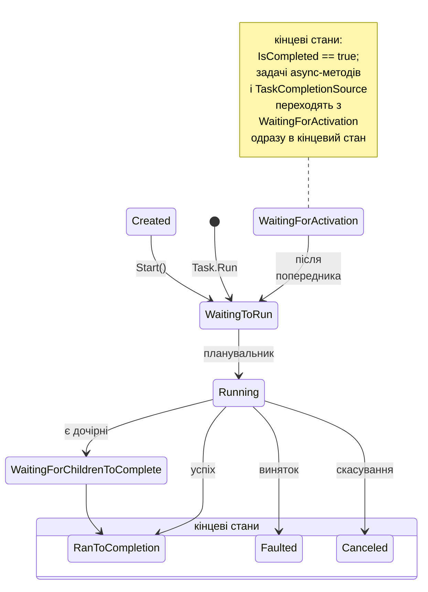
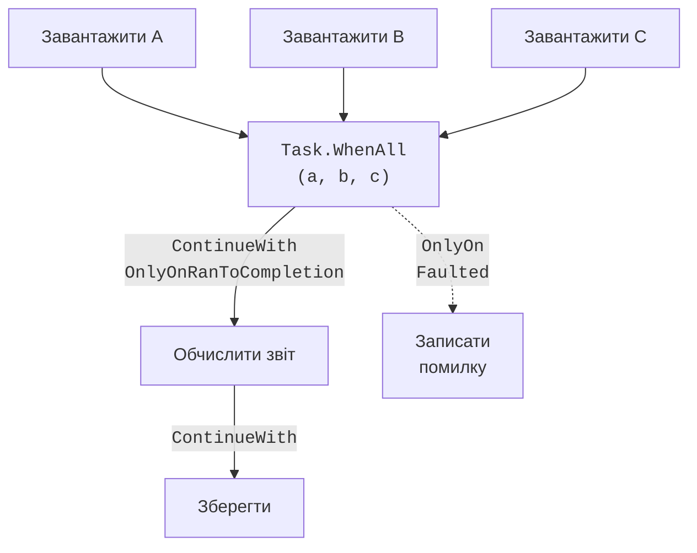

# Задачі, стани та продовження

## Від потоків до задач

У темі 2 паралельні обчислення запускалися в об’єктах `Thread` і в пулі потоків. Потік – це ресурс операційної системи: він має власний стек (типово 1 МБ), а його створення та перемикання коштують часу. Крім того, у `Thread` немає зручного способу повернути результат, передати виняток викликальникові чи дочекатися кількох робіт одночасно.

**Бібліотека паралельних задач** (*Task Parallel Library*, TPL) з простору імен `System.Threading.Tasks` пропонує вищий рівень абстракції – **задачу** (*task*). Задача описує асинхронну операцію, яка колись завершиться: успішно (з результатом), з винятком або скасуванням. Задача не є потоком: обчислювальна задача виконується на потоці пулу, а задача вводу-виводу взагалі може не займати потоку, доки чекає на диск чи мережу. Опис бібліотеки: <https://learn.microsoft.com/dotnet/standard/parallel-programming/task-parallel-library-tpl>.

- `Task` – операція без результату (аналог `void`);
- `Task<TResult>` – операція з результатом, доступним через `await` або властивість `Result`.

Найпростіший спосіб запустити обчислення в пулі потоків – метод `Task.Run`:

```cs
Task<long> sumTask = Task.Run(() =>
{
    long sum = 0;
    for (int i = 1; i <= 100_000_000; i++) sum += i % 7;
    return sum;                   // результат задачі
});
Console.WriteLine("Головний потік не чекає…");
long sum = await sumTask;         // очікування без блокування
Console.WriteLine(sum);
```

### `Task.Factory.StartNew` і параметри створення

`Task.Run(action)` – скорочення виклику `Task.Factory.StartNew` зі стандартними параметрами. Метод `StartNew` потрібен, коли задачу треба налаштувати **параметрами створення** (`TaskCreationOptions`):

- `LongRunning` – підказка планувальнику, що задача працюватиме довго (секунди й більше) і зазвичай блокуватиме потік; стандартний планувальник створює для неї окремий потік, щоб не займати потік пулу надовго;
- `AttachedToParent` – дочірня задача, на завершення якої чекає батьківська;
- `DenyChildAttach` – заборона приєднувати дочірні задачі (так створює задачі `Task.Run`);
- `RunContinuationsAsynchronously` – продовження задачі завжди виконуються асинхронно.

::: tip Увага
`StartNew` не розуміє асинхронних лямбд. Виклик `Task.Factory.StartNew(async () => { await Task.Delay(500); })` повертає `Task<Task>`: зовнішня задача завершується одразу після першого `await`, коли внутрішня ще в стані `WaitingForActivation`. Для асинхронних лямбд використовують `Task.Run` (він «розгортає» внутрішню задачу) або метод `Unwrap()`. `LongRunning` для асинхронного коду також не має сенсу: після першого `await` виконання однаково продовжиться в пулі.
:::

### Планувальник задач

Задачу на потік розподіляє **планувальник задач** (*task scheduler*), об’єкт класу `TaskScheduler`. Стандартний планувальник `TaskScheduler.Default` ставить задачі в пул потоків. Пул має глобальну чергу і локальні черги робочих потоків: задача, створена всередині іншої задачі, потрапляє в локальну чергу поточного потоку (порядок LIFO, краща локальність кешу), а вільні потоки **викрадають роботу** (*work stealing*) з кінця чужих черг. Власні планувальники трапляються рідко (наприклад, обмеження паралелізму `ConcurrentExclusiveSchedulerPair`); у застосунках з інтерфейсом користувача `TaskScheduler.FromCurrentSynchronizationContext()` виконує задачу в потоці інтерфейсу.

## Стани задачі та очікування

Поточний стан задачі повертає властивість `Status` типу `TaskStatus` (рис. 5.1). Задача, створена конструктором `new Task(...)`, перебуває в стані `Created`, доки не буде викликано `Start()`. Задачі від `Task.Run` одразу стають у чергу (`WaitingToRun`), а потім виконуються (`Running`). Продовження та задачі `async`-методів чекають у стані `WaitingForActivation`. Кінцевих станів три:

- `RanToCompletion` – успішне завершення, `IsCompletedSuccessfully == true`;
- `Faulted` – завершення з необробленим винятком, `IsFaulted == true`, виняток у властивості `Exception`;
- `Canceled` – скасування через `OperationCanceledException` з токеном задачі, `IsCanceled == true`.



Рис. 5.1. Життєвий цикл задачі {.caption}

### Блокувальне та асинхронне очікування

Дочекатися задачі можна двома способами (табл. 5.1). **Блокувальні** методи `Wait()`, `Result`, `Task.WaitAll`, `Task.WaitAny` зупиняють поточний потік до завершення задач. **Асинхронні** комбінатори `Task.WhenAll`, `Task.WhenAny` і `Task.WhenEach` самі повертають задачу, яку очікують оператором `await`, не займаючи потоку.

Таблиця 5.1. Очікування задач {.caption}

| **Блокувальний виклик** | **Асинхронний аналог** | **Результат і винятки** |
| --- | --- | --- |
| `task.Wait()` | `await task` | `Wait` кидає `AggregateException`, `await` – перший внутрішній виняток |
| `task.Result` | `await task` | значення `TResult`; винятки як вище |
| `Task.WaitAll(tasks)` | `await Task.WhenAll(tasks)` | масив результатів у порядку задач; чекає завершення всіх, навіть після помилки |
| `Task.WaitAny(tasks)` | `await Task.WhenAny(tasks)` | індекс або сама задача, яка завершилася першою (зокрема з помилкою) |
| – | `await foreach (var t in Task.WhenEach(tasks))` | задачі в порядку завершення (.NET 9 і новіші) |

::: tip Пастка
`Wait()` і `Result` блокують потік. У консольній програмі це лише марнує потік пулу, а в застосунку з контекстом синхронізації (WinForms, WPF, старий ASP.NET) може спричинити **взаємоблокування**: потік інтерфейсу чекає на задачу, а задача чекає на потік інтерфейсу, щоб виконати своє продовження. Правило: якщо метод може бути асинхронним, у ньому використовують `await`, а не `Result`.
:::

`Task.WhenAny` зручно поєднувати з таймаутом або вибором найшвидшого джерела: після завершення першої задачі інші продовжують працювати, тому їх слід скасувати або принаймні дочекатися й перевірити на винятки. `Task.WhenEach` дає змогу обробляти результати в порядку готовності: `await foreach (Task<int> t in Task.WhenEach(tasks))` повертає задачі в тому порядку, у якому вони завершуються, і читання `t.Result` усередині циклу вже не блокує потік.

## Продовження та граф задач

**Продовження** (*continuation*) – задача, яка запускається після завершення іншої задачі (**попередника**, *antecedent*). Продовження створює метод `ContinueWith`: делегат отримує завершеного попередника і може прочитати його `Result`, `Exception` чи `Status`. Докладніше: <https://learn.microsoft.com/dotnet/standard/parallel-programming/chaining-tasks-by-using-continuation-tasks>.

```cs
Task<int> load = Task.Run(() => LoadRecords("orders.csv"));
Task<string> report = load.ContinueWith(
    t => $"записів: {t.Result}",
    TaskContinuationOptions.OnlyOnRanToCompletion);
```

Параметри `TaskContinuationOptions` визначають, **за якого** результату попередника запускати продовження:

- `OnlyOnRanToCompletion`, `OnlyOnFaulted`, `OnlyOnCanceled` – лише для певного кінцевого стану; якщо умова не виконується, продовження переходить у стан `Canceled`;
- `NotOnFaulted`, `NotOnCanceled`, `NotOnRanToCompletion` – протилежні умови;
- `ExecuteSynchronously` – виконати коротке продовження в тому самому потоці, що завершив попередника;
- `AttachedToParent`, `LongRunning` – як у параметрах створення.

З продовжень будують **граф задач** (*task graph*): кілька незалежних задач виконуються паралельно, `Task.WhenAll` чекає на всі, далі йде обробка результатів, а окрема гілка обробляє помилки (рис. 5.2).



Рис. 5.2. Граф задач із продовженнями {.caption}

::: tip Порада
У новому коді ланцюжки продовжень зазвичай записують через `await`: `int n = await load; string text = $"записів: {n}";`. Код читається послідовно, винятки обробляються звичайним `try`/`catch`, а продовження виконується в правильному контексті. `ContinueWith` залишається корисним для явних графів задач та умовних гілок. Якщо його використовують, варто явно передавати `TaskScheduler.Default`: без цього продовження візьме **поточний** планувальник, який у бібліотечному коді може виявитися планувальником потоку інтерфейсу.
:::

### Вкладені та дочірні задачі

Задача, створена всередині іншої задачі, за замовчуванням **вкладена** (*nested*): батьківська задача не чекає на неї. Задача з параметром `AttachedToParent` стає **дочірньою**: батьківська переходить у стан `WaitingForChildrenToComplete`, завершується після всіх дочірніх і збирає їхні винятки. До задач `Task.Run` (`DenyChildAttach`) приєднатися неможливо; у новому коді замість дочірніх задач збирають задачі в масив і очікують `Task.WhenAll`.
