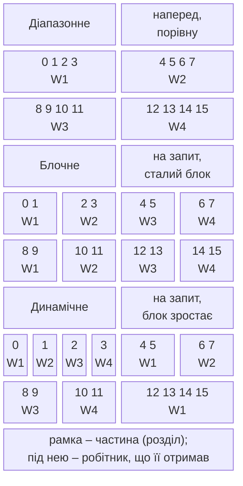

# Parallel.Invoke і розбиття даних

## Parallel.Invoke, Parallel.ForAsync і Parallel.ForEachAsync

Метод `Parallel.Invoke` виконує кілька **різних** дій, можливо паралельно, і чекає завершення всіх. Це найпростіший спосіб паралелізму задач, коли дій небагато і їхня кількість відома заздалегідь, наприклад дві половини масиву в сортуванні злиттям:

```cs
double min = 0, max = 0, average = 0;
Parallel.Invoke(
    () => min = data.Min(),
    () => max = data.Max(),
    () => average = data.Average());
```

Кожна дія пише у власну змінну, тому гонитви немає. Винятки дій також збираються в `AggregateException`.

Методи `Parallel.For` і `Parallel.ForEach` призначені для обчислень: потік пулу зайнятий увесь час виконання тіла. Якщо тіло здебільшого **чекає** (мережа, диск, `Task.Delay`), блокувати потоки пулу невигідно. Для асинхронних тіл є методи `Parallel.ForEachAsync` (з .NET 6) і `Parallel.ForAsync` (з .NET 8). Тіло – асинхронний делегат, що отримує елемент і маркер скасування та повертає `ValueTask`:

```cs
string[] files = ["a.txt", "b.txt", "c.txt", "d.txt"];
ParallelOptions options = new() { MaxDegreeOfParallelism = 2 };

await Parallel.ForEachAsync(files, options, async (file, token) =>
{
    await Task.Delay(200, token);       // імітація введення-виведення
    Console.WriteLine($"{file} оброблено");
});
```

Одночасно обробляються не більше двох файлів, тому чотири файли по 200 мс обробляються приблизно за 400 мс (у нашому запуску – 405 мс), а порядок рядків виведення щоразу інший. Без `ParallelOptions` метод `ForEachAsync` виконує не більше `Environment.ProcessorCount` операцій одночасно. Для введення-виведення межу зазвичай задають явно: вона залежить від можливостей сервера чи диска, а не від кількості ядер.

## Розбиття даних

Щоб кілька потоків обробляли одну колекцію, її потрібно поділити на **розділи** (*partitions*). Цим займається **розбивач** (*partitioner*). TPL і PLINQ мають стандартні розбивачі, а для особливих випадків дозволяють передати власний <https://learn.microsoft.com/dotnet/standard/parallel-programming/custom-partitioners-for-plinq-and-tpl>. Основні стратегії показано на рис. 6.3.



Рис. 6.3. Способи розбиття даних {.caption}

- **Діапазонне розбиття** (*range partitioning*). Для масивів і `IList<T>`, довжина яких відома, кожен потік наперед отримує свій діапазон індексів. Синхронізація потрібна лише під час створення діапазонів. Недолік: якщо один діапазон «важчий» (центральні рядки фракталу), його потік працює довше, а інші не можуть йому допомогти.
- **Блочне розбиття** (*chunk partitioning*). Потоки беруть елементи блоками на запит, доки елементи не закінчаться. Це природне **балансування навантаження** (*load balancing*): вільний потік бере наступний блок. Кожне отримання блоку потребує синхронізації, тому занадто малі блоки збільшують накладні витрати.
- **Динамічне розбиття**. Розмір блоків і кількість розділів змінюються під час роботи: блоки зростають (1, 2, 4, …), а нові розділи створюються, коли цикл додає нову задачу. Так працює стандартний розбивач `Parallel.ForEach` для `IEnumerable<T>`, довжина якого невідома.

За документацією, PLINQ для масивів і `IList<T>` типово використовує діапазонне розбиття без балансування, а для інших `IEnumerable<T>` – блочне. Увімкнути балансування для масиву можна так: `Partitioner.Create(array, loadBalance: true)`.

### Дрібні тіла циклу: Partitioner.Create(from, to)

Виклик делегата на кожній ітерації коштує приблизно як виклик віртуального методу. Якщо тіло циклу – одне додавання, цей виклик займає більше часу, ніж сама робота. Тоді використовують **діапазонний розбивач** `Partitioner.Create(fromInclusive, toExclusive, rangeSize)`: він створює послідовність кортежів `Tuple<int, int>` з межами діапазонів, а тіло `Parallel.ForEach` проходить свій діапазон звичайним циклом `for`. Делегат викликається один раз на діапазон, а не на елемент:

```cs
var ranges = Partitioner.Create(0, data.Length, 1 << 20);
Parallel.ForEach(ranges, range =>
{
    long local = 0;
    for (int i = range.Item1; i < range.Item2; i++)
    {
        local += (long)data[i] * data[i];
    }
    Interlocked.Add(ref sum, local);
});
```

Програма, яка обчислює суму квадратів 50 мільйонів чисел від 0 до 999 різними способами, дала результати, наведені в табл. 6.2 (медіана п’яти запусків після прогрівання).

Таблиця 6.2. Сума квадратів 50 мільйонів чисел на i9-11900KF {.caption}

| **Спосіб** | **Час, мс** | **Результат** |
| --- | --- | --- |
| послідовний цикл `for` | 30,9 | правильний |
| `Parallel.For`, спільна змінна `sum +=` | 582,2 | неправильний, щоразу інший |
| `Parallel.For` з `lock` на кожній ітерації | 5802,5 | правильний |
| `Parallel.For` з локальним станом | 19,8 | правильний |
| `Partitioner.Create` з діапазонами по $2^{20}$ елементів | 5,0 | правильний |

Гонитва не лише псує результат, а й сповільнює цикл майже в 19 разів через постійні конфлікти в кеші процесора. Блокування виправляє результат, але 50 мільйонів захоплень роблять цикл у 190 разів повільнішим. Локальний стан прибирає синхронізацію, проте виклик делегата на кожне множення все ще дорогий, і лише діапазонний розбивач дає прискорення 6 разів.

Без параметра `rangeSize` розмір діапазону обирає бібліотека: у поточній реалізації на ПК з 16 логічними процесорами масив з 1 000 000 елементів ділиться на 49 діапазонів по 20 833 елементи (приблизно $n / (3 p)$). Розмір діапазону – це **зернистість** (*granularity*) задачі: занадто малі діапазони збільшують накладні витрати, занадто великі погіршують балансування.

Власний розбивач створюють, коли структура даних дозволяє ділити її краще за стандартний (дерево, файл із записами) або коли елементи мають різну «вагу». Клас успадковують від `Partitioner<TSource>` (або `OrderablePartitioner<TSource>`, якщо потрібен порядок) і перевизначають `GetPartitions`, а для `Parallel.ForEach` – також `SupportsDynamicPartitions` і `GetDynamicPartitions`. Розбивач має перелічити всі елементи рівно один раз, без пропусків і повторів.
