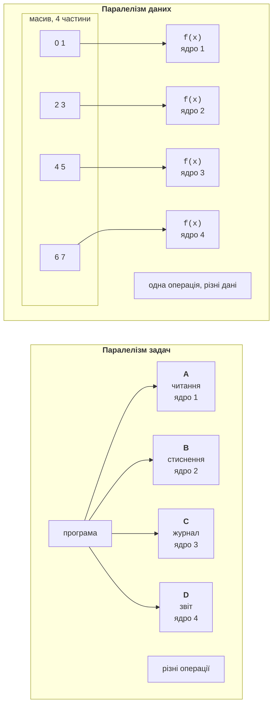

# Паралельні цикли класу Parallel

## Паралелізм даних і паралелізм задач

У темі 5 програма ділилася на **задачі** (*tasks*) – окремі операції, які можуть виконуватися одночасно. Такий підхід називають **паралелізмом задач** (*task parallelism*): різні ядра виконують різну роботу, наприклад одне завантажує файл, друге стискає дані, третє пише журнал.

**Паралелізм даних** (*data parallelism*) – це виконання **однієї й тієї самої операції** над різними частинами великого набору даних (рис. 6.1). Масив, колекцію, зображення чи матрицю ділять на частини, і кожне ядро обробляє свою частину. Саме так працюють фільтри зображень, обчислення над векторами та матрицями, пошук у великих масивах, статистика журналів. Такий паралелізм добре масштабується: що більше даних, то більше роботи для кожного ядра й тим менша частка накладних витрат.



Рис. 6.1. Паралелізм даних і паралелізм задач {.caption}

Цикл можна виконати паралельно лише тоді, коли його **ітерації незалежні**. Для ітерацій $i$ і $j$ це означає (умови Бернстайна): ітерація $i$ не записує даних, які читає або записує ітерація $j$, і навпаки. Читати спільні дані одночасно можна, записувати – ні.

```cs
// Незалежні ітерації: кожна пише лише у свій елемент.
for (int i = 0; i < n; i++) c[i] = a[i] + b[i];

// Залежні ітерації: i-та читає результат (i-1)-ї.
for (int i = 1; i < n; i++) a[i] = a[i - 1] + b[i];

// Залежність через спільну змінну: гонитва (тема 3).
for (int i = 0; i < n; i++) sum += a[i];
```

Перший цикл розпаралелюється без змін. Другий має **залежність, що переноситься між ітераціями** (*loop-carried dependency*): його треба змінити алгоритмічно, наприклад замінити префіксною сумою (розділ «Паралельна редукція та префіксна сума»). Третій цикл розпаралелюють через **редукцію**: кожен потік накопичує власну часткову суму, а наприкінці часткові суми об’єднують.

Процес поділу задачі на частини, які можна обробляти незалежно, називають **декомпозицією даних** (*data decomposition*). Від неї залежить і правильність, і швидкодія: частини мають бути достатньо великими, щоб робота переважала накладні витрати, і приблизно однаковими за обсягом обчислень, щоб жодне ядро не простоювало.

## Паралельні цикли Parallel.For і Parallel.ForEach

Клас `System.Threading.Tasks.Parallel` бібліотеки TPL містить паралельні аналоги циклів <https://learn.microsoft.com/dotnet/api/system.threading.tasks.parallel>. Метод `Parallel.For` замінює цикл `for`, а `Parallel.ForEach` – цикл `foreach`. Тіло циклу передається делегатом, а бібліотека сама розподіляє ітерації між потоками пулу, використовуючи також потік, що викликав метод. Метод повертає керування лише після завершення всіх ітерацій.

```cs
Parallel.For(0, input.Length, i =>      // for (int i = 0; …)
{
    output[i] = Math.Sqrt(Math.Abs(input[i]));
});
Parallel.ForEach(files, path => Compress(path));  // foreach
```

Порядок виконання ітерацій не визначений: ітерація 1000 може завершитися раніше за ітерацію 0. Тому тіло не повинно залежати від порядку, а результати пишуть в елемент з індексом ітерації (масив `output`) або накопичують способами з підрозділу «Локальний стан потоку». Під час роботи паралельного циклу завантажуються всі логічні процесори (рис. 6.2).

::: info Знімок екрана
Task Manager → Performance → CPU, graph «Logical processors», while the Mandelbrot example runs; all 16 graphs near 100 %
:::

Рис. 6.2. Завантаження логічних процесорів під час `Parallel.For` {.caption}

### Параметри циклу: ParallelOptions

Перевантаження з параметром `ParallelOptions` дозволяють налаштувати цикл:

- `MaxDegreeOfParallelism` – найбільша кількість одночасно виконуваних ітерацій; значення `-1` (типове) означає «без обмеження», планувальник сам визначає кількість потоків;
- `CancellationToken` – маркер скасування (тема 5): після запиту скасування нові ітерації не запускаються, а метод генерує `OperationCanceledException`;
- `TaskScheduler` – планувальник задач (типово стандартний пул потоків).

```cs
using CancellationTokenSource cts = new(TimeSpan.FromSeconds(5));
ParallelOptions options = new()
{
    MaxDegreeOfParallelism = Environment.ProcessorCount / 2,
    CancellationToken = cts.Token     // через 5 с – виняток
};
Parallel.For(0, images.Length, options, i => Blur(images[i]));
```

Обмеження `MaxDegreeOfParallelism` використовують, щоб залишити ядра іншим програмам, щоб не перевантажити диск чи сервер і щоб виміряти час для різної кількості потоків $p$ під час аналізу масштабованості.

### Дострокове завершення: Break і Stop

Оператор `break` у тілі делегата використати не можна. Замість нього перевантаження з параметром `ParallelLoopState` надають два методи:

- `Stop()` – завершити цикл якомога швидше; нові ітерації не запускаються. Підходить для пошуку **будь-якого** елемента, що задовольняє умову;
- `Break()` – не запускати ітерації з **більшими** індексами, але виконати всі ітерації з меншими індексами. Підходить для пошуку **першого** елемента, як у послідовному циклі.

Ітерації, що вже виконуються, не перериваються. Довгі ітерації перевіряють властивість `ShouldExitCurrentIteration`, а після `Break` також `LowestBreakIteration`. Метод повертає структуру `ParallelLoopResult`: `IsCompleted` дорівнює `false`, якщо цикл завершено достроково, а `LowestBreakIteration` – найменший індекс, на якому викликано `Break` (`null` після `Stop`).

```cs
ParallelLoopResult result = Parallel.For(0, values.Length,
    (i, state) =>
    {
        if (values[i] < 0) state.Break();
    });
if (!result.IsCompleted)
{
    Console.WriteLine(
        $"Перше від’ємне: індекс {result.LowestBreakIteration}");
}
```

Для масиву з 1 000 000 елементів, у якому від’ємні значення стоять на позиціях 97 330, 194 661, …, цей код завжди виводить індекс 97 330. З методом `Stop()` знайдений індекс залежить від того, яка ітерація першою натрапила на від’ємне значення (у нашому запуску – 194 661). Викликати `Break` і `Stop` в одному циклі не можна: це спричиняє `InvalidOperationException`.

### Винятки в паралельних циклах

Якщо тіло циклу генерує виняток, нові ітерації не запускаються, але вже запущені завершуються, і кожна з них теж може згенерувати виняток. Після завершення метод збирає всі винятки в один `AggregateException`, а перелік міститься у властивості `InnerExceptions`. Наприклад, цикл `Parallel.For(0, 100, …)`, тіло якого генерує `InvalidOperationException` для `i % 30 == 7`, у запуску на 16 логічних процесорах згенерував `AggregateException` з чотирма внутрішніми винятками (для $i = 7 , 37 , 67 , 97$): ці ітерації почали виконуватися одночасно на різних потоках. На іншому ПК кількість може бути іншою.

### Локальний стан потоку

Найчастіша задача паралельного циклу – обчислити суму, кількість, мінімум чи гістограму. Спільна змінна `sum += …` без синхронізації дає **гонитву** (*race condition*, тема 3) і неправильний результат. Блокування `lock` на кожній ітерації дає правильний результат, але потоки весь час чекають одне одного, і паралельний цикл стає в десятки разів повільнішим за послідовний (табл. 6.2).

Правильний підхід – **локальний стан потоку** (*thread-local state*). Перевантаження `Parallel.For<TLocal>` і `Parallel.ForEach<TSource, TLocal>` приймають три делегати (табл. 6.1):

Таблиця 6.1. Делегати циклу з локальним станом {.caption}

| **Параметр** | **Призначення** |
| --- | --- |
| `localInit` | створює початкове значення локального стану для кожної частини роботи (кожної задачі циклу): `() => 0L` |
| `body` | тіло ітерації: отримує індекс (або елемент), `ParallelLoopState` і поточний локальний стан, повертає новий стан: `(i, state, local) => local + a[i]` |
| `localFinally` | викликається один раз для кожного локального стану після завершення його частини; тут часткові результати об’єднують: `local => Interlocked.Add(ref sum, local)` |

```cs
long sum = 0;
Parallel.For(0, data.Length,
    localInit: () => 0L,
    body: (i, state, local) => local + (long)data[i] * data[i],
    localFinally: local => Interlocked.Add(ref sum, local));
```

Тіло не звертається до спільних змінних, тому блокування не потрібне. Синхронізація потрібна лише в `localFinally`, який викликається кілька разів за весь цикл; для складного стану (масив гістограми, словник) у `localFinally` використовують `lock`. Локальних станів зазвичай стільки, скільки задач створив цикл, а не стільки, скільки ітерацій. Кількість задач не гарантована, тому операція об’єднання має давати однаковий результат за будь-якого поділу на частини.
