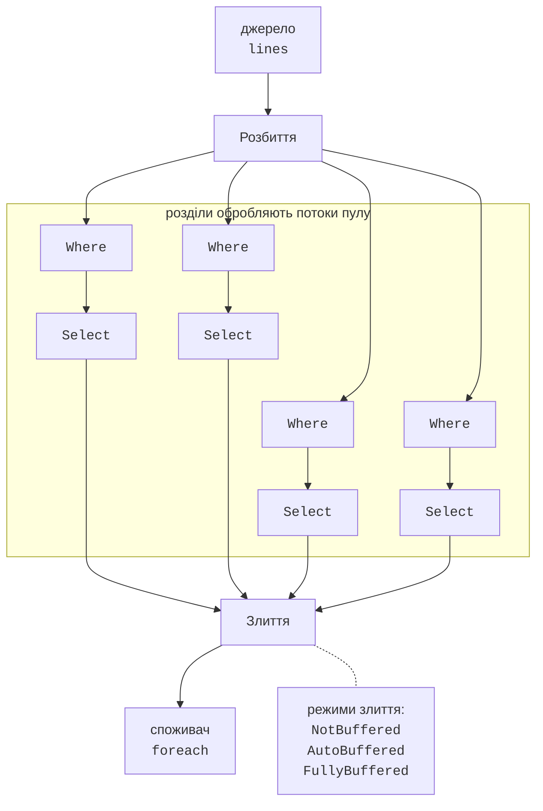

# PLINQ та агрегація

## PLINQ: паралельні запити

**PLINQ** (*Parallel LINQ*) – паралельна реалізація LINQ to Objects <https://learn.microsoft.com/dotnet/standard/parallel-programming/introduction-to-plinq>. Щоб запит виконувався паралельно, до джерела застосовують метод `AsParallel()`. Він повертає `ParallelQuery<T>`, і далі викликаються методи класу `ParallelEnumerable` з тими самими назвами: `Where`, `Select`, `GroupBy`, `Sum`, `Aggregate` тощо.

```cs
int[] numbers = Enumerable.Range(1, 10_000_000).ToArray();
long count = numbers.AsParallel()
    .Where(n => IsPrime(n))
    .LongCount();
```

Виконання запиту PLINQ показано на рис. 6.4: джерело розбивається на розділи, кожен розділ обробляє свій потік, а результати **зливаються** (*merge*) для споживача: циклу `foreach`, `ToList()` чи агрегатної операції.



Рис. 6.4. Виконання запиту PLINQ {.caption}

Поведінку запиту налаштовують методами, які записують після `AsParallel()` (табл. 6.3).

Таблиця 6.3. Методи налаштування запиту PLINQ {.caption}

| **Метод** | **Призначення** |
| --- | --- |
| `WithDegreeOfParallelism(p)` | найбільша кількість потоків запиту, від 1 до 512 |
| `WithExecutionMode(ForceParallelism)` | виконувати паралельно, навіть якщо PLINQ оцінить запит як невигідний для розпаралелювання |
| `WithMergeOptions(…)` | режим злиття результатів: `NotBuffered`, `AutoBuffered`, `FullyBuffered` |
| `WithCancellation(token)` | скасування запиту маркером; генерується `OperationCanceledException` |
| `AsOrdered()` / `AsUnordered()` | зберігати порядок елементів джерела / відмовитися від нього далі в запиті |
| `ForAll(action)` | виконати дію для кожного результату паралельно, без злиття |
| `AsSequential()` | решту запиту виконати послідовно |

### Порядок результатів

Типово PLINQ **не зберігає порядок** джерела: результати надходять у тому порядку, у якому їх обробили розділи. Метод `AsOrdered()` зберігає порядок, але для цього PLINQ відстежує індекси елементів і впорядковує результати під час злиття, тому запит виконується повільніше. Після операцій, яким порядок більше не потрібен (наприклад, перед `GroupBy` або `Sum`), викликають `AsUnordered()`. Оператор `OrderBy` задає новий порядок незалежно від `AsOrdered`.

Наприклад, для масиву $1 , 2 , … , 8$ і методу, який обробляє менші числа довше (затримка `Thread.Sleep((9 - n) * 20)`), запит `numbers.AsParallel().Select(SlowSquare)` з `WithMergeOptions(ParallelMergeOptions.NotBuffered)` у нашому запуску повернув квадрати в порядку завершення обробки, тобто у зворотному: `64 49 36 25 16 9 4 1`. Той самий запит з `AsOrdered()` повернув `1 4 9 16 25 36 49 64`.

### Режими злиття

Коли результати споживає один потік, PLINQ зливає їх одним із режимів:

- `NotBuffered` – кожен результат передається споживачеві одразу після обчислення; перший результат з’являється найшвидше, але загальний час може бути більшим;
- `AutoBuffered` (типовий для більшості запитів) – результати передаються порціями;
- `FullyBuffered` – весь результат обчислюється до передачі першого елемента; загальний час часто найменший.

Режим – лише підказка: оператори `OrderBy` і `Reverse` завжди буферизують усі результати, а `ForAll(item => bag.Add(item))` ніколи не буферизує, бо виконує дію в потоках розділів без злиття (колекція-приймач має бути потокобезпечною, наприклад `ConcurrentBag<T>`).

### Коли PLINQ повільніший за LINQ

PLINQ має накладні витрати: розбиття, запуск задач, злиття, а для `AsOrdered` – ще й упорядкування. Запит стає повільнішим за послідовний, якщо:

- джерело мале або операції дешеві: 10 000 запитів `Where(x => x % 3 == 0).Sum()` до масиву зі 100 елементів у нашому вимірі тривали 62 мс у LINQ і 126 мс у PLINQ;
- основну роботу виконує оператор, який погано розпаралелюється, наприклад `GroupBy` з мільйонами дрібних елементів (приклад «Аналіз тексту»);
- делегати звертаються до спільного ресурсу з блокуванням (`lock`, `Console.WriteLine`) або виділяють багато пам’яті;
- потрібен порядок (`AsOrdered`, `Take`, `Skip`) і велика частина роботи йде на впорядкування.

Висновок завжди роблять за вимірюваннями в конфігурації *Release*.

## Агрегація: асоціативність і комутативність

Агрегатні операції PLINQ (`Sum`, `Min`, `Max`, `Average`, `Count`, `Aggregate`) обчислюються за схемою **редукції**: кожен розділ накопичує свій частковий результат, а потім часткові результати об’єднуються. Найзагальніше перевантаження `Aggregate` має чотири делегати:

```cs
var (count, total) = orders.AsParallel().Aggregate(
    seedFactory: () => (Count: 0, Total: 0m),          // для розділу
    updateAccumulatorFunc: (acc, order) =>             // у розділі
        (acc.Count + 1, acc.Total + order.Amount),
    combineAccumulatorsFunc: (a, b) =>                 // розділи
        (a.Count + b.Count, a.Total + b.Total),
    resultSelector: acc => acc);                       // результат
```

`seedFactory` створює окремий акумулятор для кожного розділу, тому `update` змінює його без блокувань. `combine` об’єднує акумулятори розділів, а `resultSelector` перетворює остаточний акумулятор на результат (наприклад, суму й кількість на середнє).

Результат паралельної агрегації не залежить від поділу на розділи, лише якщо операція об’єднання:

- **асоціативна** (*associative*): $(a \oplus b) \oplus c = a \oplus (b \oplus c)$, тобто розставлення дужок (дерево об’єднання) не впливає на результат. Додавання, множення, мінімум, максимум, об’єднання множин – асоціативні; віднімання й ділення – ні;
- **комутативна** (*commutative*): $a \oplus b = b \oplus a$. Ця вимога потрібна, коли порядок розділів під час об’єднання не гарантований, як у `Aggregate` без `AsOrdered`. Конкатенація рядків асоціативна, але не комутативна.

Для неасоціативної операції PLINQ не повідомляє про помилку, а просто повертає неправильний результат:

```cs
int[] numbers = Enumerable.Range(1, 1000).ToArray();
int sequential = numbers.Aggregate((a, x) => a - x);   // -500 498
int parallel = numbers.AsParallel()
    .Aggregate((a, x) => a - x);                       //  481 376
```

Значення `481 376` отримане на ПК з 16 логічними процесорами; на іншому ПК воно інше, але так само неправильне.

Винятки, згенеровані делегатами запиту, PLINQ збирає в `AggregateException`, як і паралельні цикли. Запит `numbers.AsParallel().Select(x => 100 / (x % 500)).ToArray()` для чисел 1…1000 згенерував `AggregateException` з двома `DivideByZeroException` (для 500 і 1000). Запит, скасований через `WithCancellation`, генерує `OperationCanceledException`.
