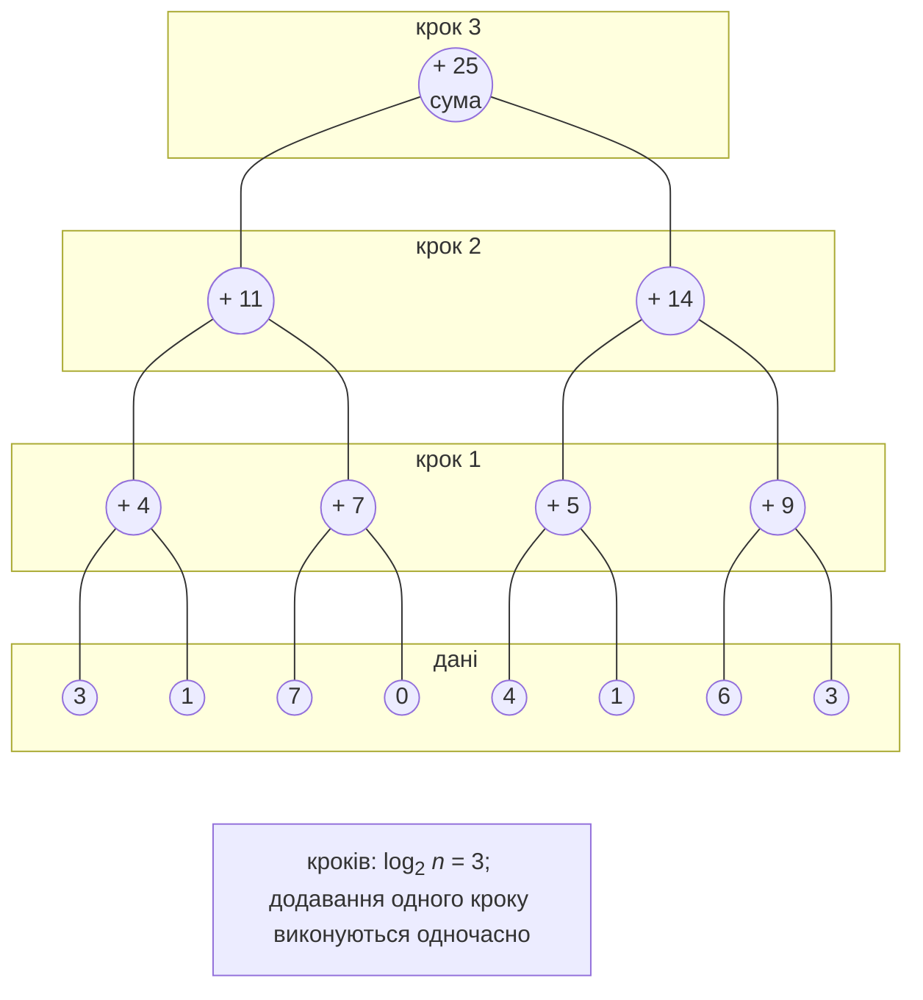
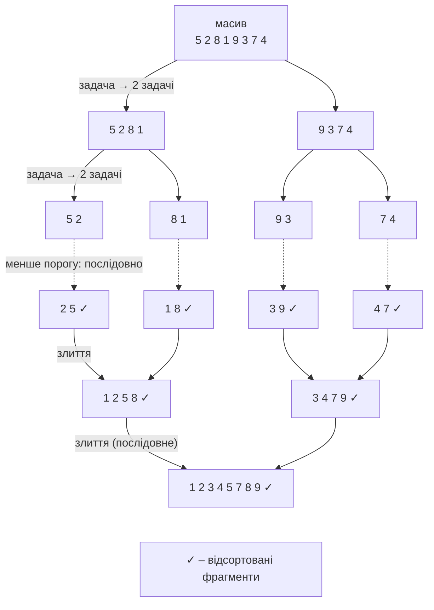

# Редукція, сортування та продуктивність

## Паралельна редукція та префіксна сума

**Редукція** (*reduction*) – згортання набору даних в одне значення асоціативною операцією $\oplus$: сума, добуток, мінімум, максимум. Послідовний цикл виконує $n - 1$ операцій за $n - 1$ кроків. Паралельна редукція об’єднує значення попарно за схемою **дерева редукції** (рис. 6.5): на першому кроці одночасно обчислюються суми сусідніх пар, на другому – суми пар цих сум і так далі.

Рис. 6.5. Дерево паралельної редукції {.caption}

Загальна **робота** (*work*, кількість операцій) залишається $n - 1$, а **глибина** (*span*, кількість кроків за необмеженої кількості процесорів) дорівнює $\log_{2} n$: для мільйона елементів – 20 кроків. На звичайному процесорі з $p$ ядрами на нижніх рівнях дерева операцій значно більше, ніж ядер, тому дані спочатку ділять на $p$ частин (редукція в кожній частині послідовна), а дерево будують лише з часткових результатів. Саме так працюють `localInit`/`localFinally` і `Aggregate`.

**Префіксна сума** (*prefix sum, scan*) обчислює всі проміжні результати: для $x = (3 , 1 , 7 , 0 , 4 , 1 , 6 , 3)$ **включна** префіксна сума – $(3 , 4 , 11 , 11 , 15 , 16 , 22 , 25)$, а **виключна** (сума елементів **до** поточного) – $(0 , 3 , 4 , 11 , 11 , 15 , 16 , 22)$. Послідовний цикл `s[i] = s[i - 1] + x[i]` має залежність між ітераціями, проте задачу можна розпаралелити **алгоритмом Блеллока** (*Blelloch scan*) для масиву довжиною $n = 2^{k}$. Він має дві фази, кожна з $\log_{2} n$ рівнів; операції одного рівня незалежні:

1. **Підйом** (*up-sweep*) – це дерево редукції, побудоване на місці: на рівні з кроком $s = 2 , 4 , … , n$ для кожної пари виконується `a[i + s - 1] += a[i + s/2 - 1]`. Після підйому останній елемент містить суму всього масиву.
2. **Спуск** (*down-sweep*): останній елемент замінюють нейтральним елементом (0), далі на рівнях з кроком $s = n , … , 4 , 2$ для кожної пари лівий елемент отримує значення правого (батька), а правий – суму батька і старого значення лівого.

Після спуску масив містить виключну префіксну суму. Робота алгоритму – близько $2 n$ операцій, глибина – $2 \log_{2} n$. На графічних процесорах (тема 11) з тисячами ядер це дає велике прискорення. На 8-ядерному процесорі для простого додавання 64-бітних чисел алгоритм Блеллока повільніший за послідовний цикл: операцій удвічі більше, кожен рівень заново проходить пам’ять, а робота на одну операцію мізерна (лабораторна робота, приклад 1). Префіксні суми використовують для підрахунку позицій під час паралельного фільтрування, у радикс-сортуванні, для обчислення накопичених показників.

## Паралельні алгоритми сортування

Сортування – класичний приклад, у якому паралельність поєднує паралелізм даних і задач.

### Сортування злиттям

**Сортування злиттям** (*merge sort*) ділить масив навпіл, сортує половини й зливає їх. Половини незалежні, тому їх сортують паралельно, наприклад через `Parallel.Invoke` (рис. 6.6). Дві важливі деталі:

- **поріг** (*cutoff*): фрагменти, менші за поріг (тисячі–десятки тисяч елементів), сортують послідовно, бо створення задач для малих фрагментів дорожче за саму роботу;
- **обмеження глибини**: нові задачі створюють лише на верхніх $\log_{2} p$ рівнях рекурсії, далі рекурсія послідовна.

Рис. 6.6. Паралельне сортування злиттям {.caption}

Останнє злиття виконується одним потоком і переглядає весь масив, тому за законом Амдала (тема 1) прискорення обмежене: у прикладі «Паралельне сортування злиттям» на 16 логічних процесорах воно становить лише 4–6. Для більшого прискорення зливають також паралельно: середній елемент однієї половини шукають бінарним пошуком у другій, і дві частини зливають незалежно.

**Швидке сортування** (*quicksort*) розпаралелюють так само: розділення опорним елементом послідовне, а дві частини сортуються паралельно задачами з тим самим порогом і обмеженням глибини. Частини можуть бути дуже нерівними, тому масштабованість гірша.

### Парно-непарне сортування перестановками

**Парно-непарне сортування перестановками** (*odd–even transposition sort*) – паралельна версія сортування бульбашкою. Масив з $n$ елементів сортується за $n$ фаз. У парній фазі порівнюються й за потреби переставляються пари $(0 , 1) , (2 , 3) , …$, у непарній – пари $(1 , 2) , (3 , 4) , …$ Пари однієї фази не перетинаються, тому всі порівняння фази виконуються паралельно. Алгоритм виконує $O (n^{2})$ порівнянь і придатний лише для невеликих масивів або апаратних реалізацій. **Сортувальні мережі** (*sorting networks*), наприклад мережа парно-непарного злиття Бетчера з глибиною $O (\log^{2} n)$, виконують фіксовану послідовність порівнянь, яка не залежить від даних; їх реалізують апаратно, на GPU і в SIMD-коді (тема 7).

### Sample sort

**Sample sort** масштабується найкраще на великій кількості процесорів і в кластерах (тема 12): з масиву вибирають і сортують випадкову вибірку; з неї беруть $p - 1$ **роздільників** (*splitters*), які задають $p$ кошиків; кожен елемент паралельно відносять до свого кошика бінарним пошуком; кошики сортують паралельно й записують один за одним. Якість вибірки визначає балансування: якщо кошики нерівні, один потік працює довше за інші.

## Інші шаблони паралелізму даних

- **Паралельний пошук.** `Parallel.For` зі `Stop()` знаходить будь-який елемент, з `Break()` – перший; у PLINQ – `Any`, `First` (з `AsOrdered`). Якщо шуканий елемент на початку, послідовний пошук може виявитися швидшим.
- **Гістограма.** Локальна гістограма для кожного розділу (`localInit`) і злиття в `localFinally`; спільний масив із `Interlocked.Increment` на кожному елементі працює повільно: потоки постійно змагаються за ті самі лічильники й кеш-рядки (тема 4).
- **Фільтр зображення.** Рядки обробляються незалежно, результат пишуть у новий масив (не на місці): фільтр читає сусідні пікселі, які інший потік міг уже змінити.
- **Метод Монте-Карло.** Екземпляр `Random` не є потокобезпечним: одночасні виклики з кількох потоків можуть зіпсувати його стан, і він почне повертати нулі. `Random.Shared` потокобезпечний, але результат не відтворюється. Для відтворюваних результатів задачу ділять на фіксовану кількість блоків, і блок `k` створює власний `new Random(seed + k)`: результат не залежить від кількості потоків (лабораторна робота, приклад 2).
- **Вкладені цикли.** Зазвичай розпаралелюють **зовнішній** цикл: робота на ітерацію більша, а накладні витрати менші.

## Аналіз продуктивності

Для паралельної програми вимірюють час $T_{p}$ для кількох значень кількості потоків $p$ і обчислюють **прискорення** $S_{p} = T_{1} / T_{p}$ та **ефективність** $E_{p} = S_{p} / p$ (тема 1). Правила вимірювання ті самі: конфігурація *Release*, прогрівання, медіана кількох запусків, перевірка результату з послідовною версією. Час $T_{1}$ беруть для найкращої **послідовної** версії або для паралельної з $p = 1$ – це треба вказати у звіті.

**Сильна масштабованість** (*strong scaling*): розмір задачі сталий, а $p$ зростає; ідеально $S_{p} = p$. **Слабка масштабованість** (*weak scaling*): розмір задачі зростає пропорційно $p$ (наприклад, $10^{6} \cdot p$ елементів); ідеально час не змінюється. Таблиця результатів має стовпці $n$, $p$, час, $S$, $E$, а для побудови графіка програма записує її у файл CSV (рис. 6.7).

::: info Знімок екрана
Windows Terminal: `dotnet run -c Release -- 1,2,4,8,16` in the merge sort project; the aligned table n, p, time, S, E and the line with `speedup.csv`
:::

Рис. 6.7. Таблиця прискорення та ефективності сортування злиттям {.caption}

Файл CSV відкривають в Excel (*Data → From Text/CSV*) або LibreOffice Calc (роздільник – кома, десятковий роздільник – крапка) і будують точкову діаграму $S (p)$ з лінією ідеального прискорення $S = p$. Типові причини, чому прискорення менше за ідеальне:

- **послідовна частина** (закон Амдала): зчитування даних, останнє злиття, виведення;
- **накладні витрати** на задачі й розбиття, якщо робота на ітерацію мала (зернистість);
- **обмеження пам’яті**: коли обчислення впираються в пропускну здатність пам’яті, а не в ядра, прискорення може припинитися вже на кількох потоках;
- **SMT/Hyper-Threading**: на i9-11900KF 16 логічних процесорів, але лише 8 фізичних ядер, тому перехід від 8 до 16 потоків дає значно менший приріст;
- **збирання сміття**: код, що виділяє багато об’єктів (рядки, кортежі), чекає на збирач сміття. Серверний режим збирача (`<ServerGarbageCollection>true</ServerGarbageCollection>` у файлі проєкту) у прикладі «Аналіз тексту» пришвидшив варіант з `GroupBy` майже вдвічі;
- **хибне розділення кешу** (тема 4) та **нерівномірне навантаження** розділів.

Щоб побачити, де потоки простоюють, використовують профілювальник. У JetBrains Rider режим *Timeline* профілювальника dotTrace показує роботу кожного потоку на часовій шкалі <https://www.jetbrains.com/help/rider/Profiling_Applications.html>: оберіть *Run → Switch Profiling Configuration → Timeline*, потім *Run → Profile …* (рис. 6.8). Суцільні смуги робочих потоків означають обчислення, проміжки – очікування чи блокування.

::: info Знімок екрана
Rider: Run → Switch Profiling Configuration → Timeline; profile the merge sort example with program argument `16`; Get Snapshot; thread lanes of .NET ThreadPool workers, filter by method `ParallelMergeSort.Sort`
:::

Рис. 6.8. Робота потоків паралельного сортування в dotTrace (Timeline) {.caption}
