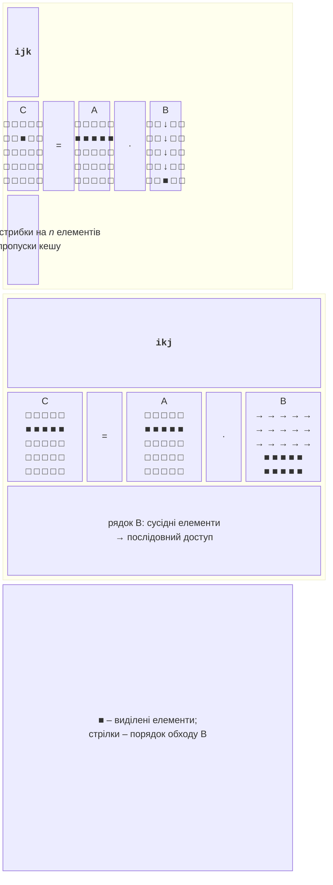
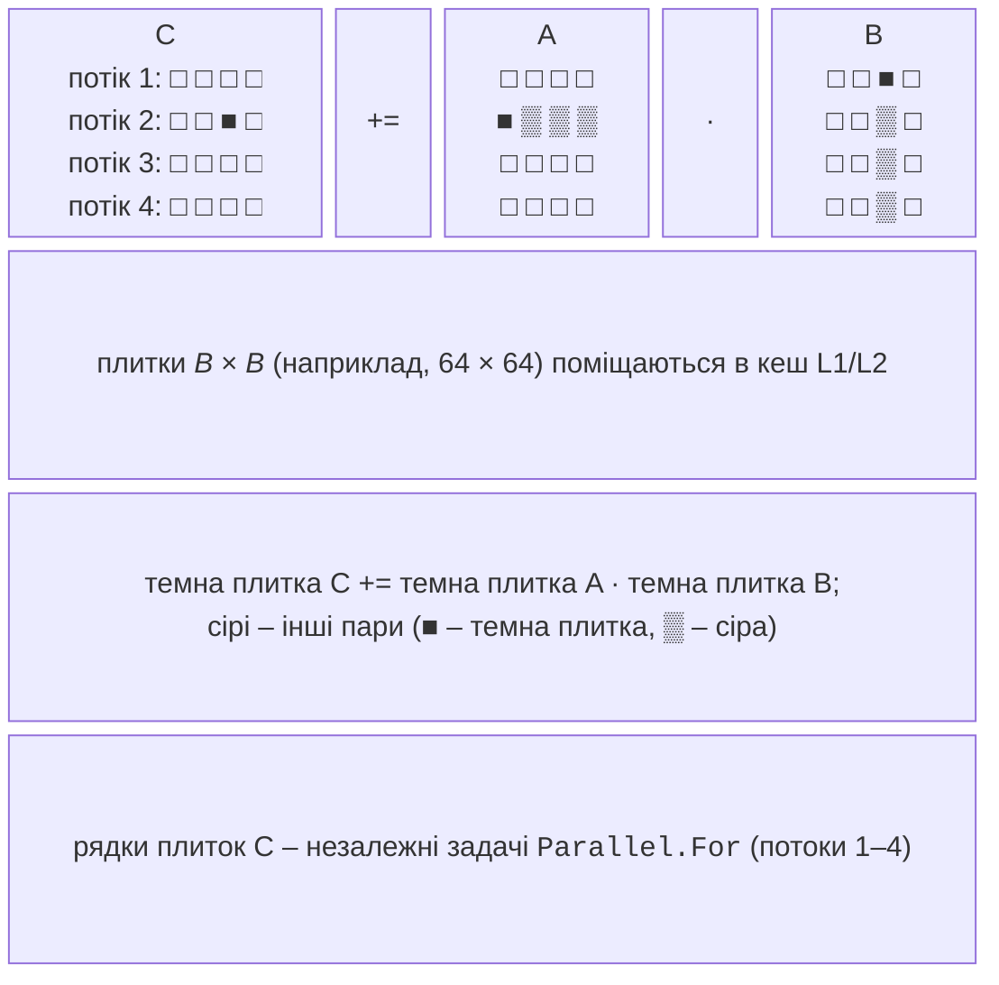

# Лінійна алгебра та продуктивність

## Рівні BLAS і множення матриць

**BLAS** (*Basic Linear Algebra Subprograms*) – стандартний набір підпрограм лінійної алгебри <https://www.netlib.org/blas/>, на який спираються бібліотеки LAPACK, NumPy, MATLAB і фреймворки машинного навчання. Оптимізовані реалізації (Intel oneMKL, OpenBLAS) написані з інтринсиками для кожного процесора. Підпрограми поділено на три рівні за складністю (табл. 7.5).

Таблиця 7.5. Рівні BLAS {.caption}

| **Рівень** | **Приклади** | **Операція** | **Складність** |
| --- | --- | --- | --- |
| 1: вектор–вектор | `dot`, `axpy`, `nrm2` | $x \cdot y$, $y \leftarrow \alpha x + y$ | $O (n)$ |
| 2: матриця–вектор | `gemv` | $y \leftarrow \alpha A x + \beta y$ | $O (n^{2})$ |
| 3: матриця–матриця | `gemm` | $C \leftarrow \alpha A B + \beta C$ | $O (n^{3})$ |

Операції рівня 1 обмежені пропускною здатністю пам’яті: на кожне число припадає одна-дві арифметичні операції. Операції рівня 3 виконують $n^{3}$ множень над $n^{2}$ даними, тому при правильній роботі з кешем вони добре векторизуються і масштабуються на ядра.

### Порядок циклів

Добуток $C = A B$ матриць $n \times n$ обчислюють за формулою $c_{i j} = \sum_{k} a_{i k} b_{k j}$. Матриці в пам’яті зберігаються **за рядками** (*row-major*): елемент $(i , j)$ лежить у масиві за індексом `i * n + j`. Три вкладені цикли можна переставити шістьма способами, і результат не зміниться, але швидкодія – так (рис. 7.5).



Рис. 7.5. Порядок циклів і доступ до пам’яті {.caption}

- **ijk** (як у формулі): найвнутрішніший цикл за `k` проходить рядок `A` послідовно, а матрицю `B` – **по стовпцю**, стрибками на $n$ елементів. Стовпець розкиданий по всій матриці, яка для $n = 2048$ займає 32 МБ і не поміщається навіть у кеш L3 (16 МБ), тому майже кожне звертання до `B` – **промах кешу** (*cache miss*).
- **ikj**: цикл за `j` найвнутрішніший, і всі три матриці проходяться **по рядках**, послідовно. Внутрішній цикл `c[i*n + j] += aik * b[k*n + j]` має вигляд операції `axpy` і легко векторизується.

У прикладі «Множення матриць» для $n = 2048$ послідовний порядок ijk виконувався 48,5 с, а ikj – 7,2 с: лише перестановка циклів прискорила програму в 6,8 раза (табл. 7.6). Для $n = 1024$ різниця менша (1,1–1,8 раза в різних запусках), бо матриця `B` займає 8 МБ і поміщається в кеш L3.

### Блочне множення матриць

Порядок ikj проходить рядки послідовно, але для великих $n$ рядок `B` (для $n = 2048$ – 16 КБ) займає третину кешу L1 (48 КБ), а вся матриця `B` не поміщається в кеш. **Блочне множення** (*blocked, tiled multiplication*) ділить матриці на **плитки** (*tiles*) розміром $B \times B$ і множить плитками (рис. 7.6): три зовнішні цикли перебирають плитки, три внутрішні – елементи всередині плиток. Плитка, що поміщається в кеш L1 або L2, обробляється без промахів.



Рис. 7.6. Блочне множення матриць {.caption}

Три плитки `double` розміром $64 \times 64$ займають $3 \cdot 64^{2} \cdot 8 \approx 98$ КБ – це кеш L2 (512 КБ на ядро в i9-11900KF). Розмір плитки підбирають вимірюванням. Для $n = 1024$ плитки 16, 32, 64, 128 і 256 дали у варіанті «блочне + SIMD» 436, 251, 218, 335 і 285 мс, а в 16 потоках – 65, 46, 43, 67 і 110 мс: найкращі плитки 32–64. Замалі плитки збільшують накладні витрати циклів, завеликі не поміщаються в кеш. Блочне множення поєднується з рештою технік:

- **SIMD**: внутрішній цикл за `j` (операція `axpy` над рядком плитки) векторизують `Vector256`;
- **потоки**: рядки плиток матриці `C` незалежні, тому зовнішній цикл виконують через `Parallel.For`; кожен потік пише лише у свої рядки `C`, синхронізація не потрібна.

Продуктивність обчислень вимірюють у **FLOPS** (*floating-point operations per second*) – кількості операцій з рухомою комою за секунду; **GFLOPS** – у мільярдах. Множення матриць $n \times n$ виконує приблизно $n^{3}$ множень і $n^{3}$ додавань, тому $$\text{GFLOPS} = \frac{2 n^{3}}{t \cdot 10^{9}} ,$$ де $t$ – час у секундах. Результати для $n = 2048$ наведено в табл. 7.6.

Таблиця 7.6. Множення матриць $2048 \times 2048$ на i9-11900KF {.caption}

| **Спосіб** | **Час, мс** | **GFLOPS** | **$S$** |
| --- | --- | --- | --- |
| ijk | 48 506,6 | 0,35 | 1,0 |
| ikj | 7153,7 | 2,40 | 6,8 |
| блочне, плитки 64 | 4715,3 | 3,64 | 10,3 |
| блочне + SIMD (`Vector256`) | 2276,8 | 7,55 | 21,3 |
| блочне + SIMD + `Parallel.For` | 461,1 | 37,26 | 105,2 |

Прискорення в 105 разів складається з трьох множників: кеш (у 10 разів), SIMD (удвічі) і 16 потоків (у 4,9 раза). Оптимізовані бібліотеки BLAS досягають ще більшого: вони пишуть ядро операції інтринсиками з кількома рівнями плиток для L1, L2 і L3.

## Паралельні методи розв’язання СЛАР

Систему лінійних алгебраїчних рівнянь (СЛАР) $A x = b$ з $n$ невідомими розв’язують **прямими** методами (точний результат за скінченну кількість кроків, наприклад метод Гаусса) або **ітераційними** (послідовність наближень, наприклад методи Якобі й Гаусса–Зейделя).

### Метод Гаусса

**Прямий хід** методу Гаусса для кожного стовпця $k = 0 , … , n - 2$ вибирає **головний елемент** (найбільший за модулем у стовпці, рядки переставляються) і виключає невідоме $x_{k}$ з рядків нижче: від рядка $i$ віднімається рядок $k$, помножений на $f = a_{i k} / a_{k k}$. **Зворотний хід** обчислює $x_{n - 1} , … , x_{0}$. Складність прямого ходу – $O (n^{3})$.

На кроці $k$ рядки $i = k + 1 , … , n - 1$ змінюються незалежно: кожен читає лише рядок $k$ і пише лише себе. Тому виключення рядків виконують через `Parallel.For`, а оновлення рядка – векторно (операція `axpy`):

```cs
// a – розширена матриця n × (n + 1), w = n + 1.
Parallel.For(k + 1, n, i =>
{
    double f = a[i * w + k] / a[k * w + k];
    ReadOnlySpan<double> rowK = a.AsSpan(k * w + k, w - k);
    Span<double> rowI = a.AsSpan(i * w + k, w - k);
    // rowI = rowK · (-f) + rowI – векторно
    TensorPrimitives.MultiplyAdd(rowK, -f, rowI, rowI);
});
```

Вибір головного елемента й перестановка рядків залишаються послідовними, а кроки $k$ – залежними, тому прискорення обмежене законом Амдала. На останніх кроках рядків і стовпців мало, і `Parallel.For` коштує більше за роботу: для $n - k$ менше кількох сотень виключення виконують послідовно. Для системи з 300 рівнянь цей код дав похибку $5 {,} 44 \cdot 10^{- 13}$ порівняно з точним розв’язком.

### Метод Якобі

Метод Якобі обчислює нове наближення лише зі старого: $$x_{i}^{(t + 1)} = \frac{1}{a_{i i}} (b_{i} - \sum_{j \ne i} a_{i j} x_{j}^{(t)}) .$$ Усі $n$ рівнянь ітерації незалежні – ідеальний паралелізм даних: сума для рядка – скалярний добуток (SIMD), рядки – `Parallel.For`. Ітерації повторюють, доки $\max_{i} | x_{i}^{(t + 1)} - x_{i}^{(t)} |$ не стане меншим за задану точність. Метод гарантовано збігається для матриць з **діагональною перевагою**: $| a_{i i} | \gt \sum_{j \ne i} | a_{i j} |$ для кожного рядка. Реалізацію з вимірюваннями наведено в лабораторній роботі (приклад 2).

### Червоно-чорний метод Гаусса–Зейделя

Метод **Гаусса–Зейделя** використовує нові значення $x_{j}$ одразу після їх обчислення, тому збігається приблизно вдвічі швидше за Якобі, але залежність між рівняннями робить його послідовним. Для задач на сітці (рівняння теплопровідності, Лапласа) з п’ятиточковим шаблоном вузол $(i , j)$ залежить лише від чотирьох сусідів. Якщо розфарбувати сітку як шахову дошку (**червоно-чорне впорядкування**, *red-black ordering*), сусіди кожного вузла мають інший колір. Ітерація складається з двох півкроків: спочатку паралельно оновлюються всі «червоні» вузли ($(i + j)$ парне), потім усі «чорні». Кожен півкрок – `Parallel.For` за рядками `i`, а в рядку цикл за `j` починається з `1 + (i + color + 1) % 2` і йде з кроком 2, оновлюючи `u[i*n + j]` середнім чотирьох сусідів.

Червоний вузол читає лише чорних сусідів, які на цьому півкроці не змінюються, тому гонитви немає. Для сітки $256 \times 256$ з точністю $10^{- 6}$ червоно-чорна версія знадобила 57 480 ітерацій, звичайний Гаусс–Зейдель – 57 417, і обидві дали однаковий розв’язок: зміна порядку обходу майже не вплинула на збіжність. Для прискорення збіжності застосовують метод послідовної верхньої релаксації (SOR) з тим самим розфарбуванням.

## Вимірювання та аналіз продуктивності

Векторизований код вимірюють так само, як паралельний (тема 1): конфігурація *Release*, прогрівання, медіана запусків. Окремі особливості SIMD:

- **рівні JIT**: метод з циклом спочатку компілюється без оптимізацій; перш ніж вимірювати, метод викликають десятки разів і дають JIT час на оптимізовану перекомпіляцію (Tier 1);
- **малі та великі дані**: для масивів з кількох елементів векторний код може бути повільнішим за скалярний через підготовку й хвіст; для великих масивів час обмежує пам’ять;
- **вирівнювання**: випадкове розташування масиву в пам’яті змінює час між запусками.

### BenchmarkDotNet і дизасемблер

Для порівняння способів найзручніший BenchmarkDotNet (тема 4). Атрибут `[DisassemblyDiagnoser]` додатково зберігає машинний код кожного методу <https://benchmarkdotnet.org/articles/features/disassembler.html>:

Методи порівняння позначають атрибутом `[Benchmark]` (один – з `Baseline = true`), а клас – атрибутом `[DisassemblyDiagnoser(maxDepth: 1)]`. Для суми мільйона `float` на i9-11900KF BenchmarkDotNet 0.15.8 показав: скалярний цикл – 870 мкс, `Vector<T>` – 112 мкс, `Vector256` – 112 мкс, `TensorPrimitives.Sum` – 58 мкс (відношення 0,07, тобто в 15 разів швидше) (рис. 7.7). У стовпці *Code Size* видно розмір машинного коду: 32 байти для скалярного циклу і 903 байти для `TensorPrimitives`, який має окремі шляхи для різних ширин і довжин.

::: info Знімок екрана
Windows Terminal: `dotnet run -c Release` of the SumBenchmarks project; summary table with Scalar, VectorT, Vector256Sum, Tensor; columns Mean, Ratio, Code Size; N = 1000000
:::

Рис. 7.7. Порівняння скалярної та векторної суми в BenchmarkDotNet {.caption}

Машинний код записується у файл `BenchmarkDotNet.Artifacts/results/SumBenchmarks-asm.md` (рис. 7.8). У скалярному методі цикл містить інструкцію `vaddss` (додавання одного `float`, суфікс `ss` – *scalar single*), а у векторному – `vaddps ymm6, ymm6, [r8]` (8 чисел у регістрі YMM, суфікс `ps` – *packed single*). Так перевіряють, чи справді JIT згенерував векторні інструкції, а також чи залишилися перевірки меж масиву (`cmp` і перехід на `CORINFO_HELP_RNGCHKFAIL`).

::: info Знімок екрана
Rider: open `BenchmarkDotNet.Artifacts/results/SumBenchmarks-asm.md`, Markdown preview; the Scalar method with `vaddss` and the Vector256Sum method with `vaddps ymm6,ymm6,[...]`
:::

Рис. 7.8. Асемблерний код векторного циклу {.caption}

Для загального аналізу обмежень використовують **модель Roofline** (*Roofline model*): графік продуктивності (GFLOPS) залежно від **арифметичної інтенсивності** (операцій на байт переміщених даних). Похила частина «даху» – межа пропускної здатності пам’яті, горизонтальна – межа обчислювальної потужності; для C, C++ і Fortran його будує Intel Advisor <https://www.intel.com/content/www/us/en/developer/articles/guide/intel-advisor-roofline.html>.

### Похибки float і double

Векторизація змінює порядок операцій з дійсними числами, тому результат може відрізнятися від скалярного. У прикладі «Сума елементів масиву» сума мільйона випадкових `float` дорівнює 499 848,3 у скалярному циклі, 499 854,9 у векторних і 499 855,1 у `TensorPrimitives`, а точне значення (у `double`) – 499 854,3. Тип `float` зберігає лише 6–7 значущих цифр, і похибка накопичується з мільйонів округлень. Тому для сум великої кількості чисел використовують `double`, а векторні й скалярні результати порівнюють з відносним допуском, а не оператором `==`. Тип `float` обирають для графіки, сигналів і нейромереж: він дає вдвічі ширші вектори.
