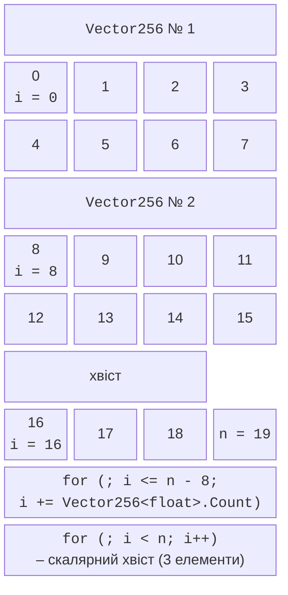

# Пам’ять, хвіст і TensorPrimitives

## Робота з пам’яттю та обробка хвоста

Векторний цикл обробляє масив блоками по `Count` елементів. Довжина масиву рідко кратна `Count`, тому залишок – **хвіст** (*tail, remainder*) – обробляють окремо (рис. 7.4).



Рис. 7.4. Векторний цикл з обробкою хвоста {.caption}

```cs
int i = 0;
for (; i <= x.Length - Vector256<float>.Count; i += 8)
{
    // блок x[i..i+8] – векторно
}
for (; i < x.Length; i++)
{
    // хвіст – скалярно
}
```

Умова `i <= x.Length - Count` гарантує, що блок не виходить за межі масиву. Помилки з хвостом – найчастіші в SIMD-коді: забутий хвіст дає неправильний результат для «некруглих» довжин, а завантаження за межами масиву через небезпечні методи читає чужу пам’ять. Тому тести завжди мають масиви довжиною 0, 1, `Count - 1`, `Count`, `Count + 1` і велику «некруглу» довжину.

Для **ідемпотентних** операцій (пошук, мінімум, копіювання) хвіст можна обробити без скалярного циклу: ще раз обробити останній повний вектор `x[n - Count .. n]`, який перекривається з уже обробленими елементами. Для суми так робити не можна: елементи перекриття врахувалися б двічі.

### Завантаження без копіювання

Найпростіше створити вектор з частини масиву методом `Vector256.Create(span.Slice(i))`. Швидший спосіб, яким користуються бібліотеки .NET, – отримати керовану **посилання** на перший елемент і завантажувати вектори за зміщенням:

```cs
ref float start = ref MemoryMarshal.GetReference(span);
Vector256<float> v = Vector256.LoadUnsafe(ref start, (nuint)i);
(v * 2).StoreUnsafe(ref start, (nuint)i);   // запис на місце
```

`MemoryMarshal.GetReference` (або `GetArrayDataReference` для масиву) повертає посилання навіть для порожнього масиву, а `LoadUnsafe` і `StoreUnsafe` **не перевіряють межі**: вихід за межі не генерує винятку, а псує пам’ять. Зміщення мають тип `nuint`; вираз `span.Length - Count` для масиву, коротшого за вектор, стає від’ємним, тому довжину перевіряють до циклу.

Метод `MemoryMarshal.Cast<TFrom, TTo>` <https://learn.microsoft.com/dotnet/api/system.runtime.interopservices.memorymarshal> переінтерпретує проміжок без копіювання. Так векторизують типи, яких вектори не підтримують: `char` читають як `ushort`, `bool` – як `byte`, масив `int` – як байти:

### Вирівнювання пам’яті

Вектор **вирівняний** (*aligned*), якщо його адреса кратна ширині регістра (32 байти для AVX, 64 – для AVX-512). Старі процесори завантажували вирівняні дані помітно швидше, а на сучасних різниця невелика, проте вирівнювання робить вимірювання стабільнішими. Збирач сміття може переміщувати масиви, тому вирівняну пам’ять виділяють поза керованою купою методом `NativeMemory.AlignedAlloc` <https://learn.microsoft.com/dotnet/api/system.runtime.interopservices.nativememory.alignedalloc> і обов’язково звільняють `NativeMemory.AlignedFree` (потрібен параметр проєкту `<AllowUnsafeBlocks>true</AllowUnsafeBlocks>`): у блоці `unsafe` виклик `float* p = (float*)NativeMemory.AlignedAlloc(count * sizeof(float), 64)` повертає адресу, кратну 64, з якої можна завантажувати `Vector512.LoadAligned(p)`.

`LoadAligned` не перевіряє вирівнювання: для адреси `p + 1` програма на i9-11900KF аварійно завершилася з `AccessViolationException`. Тому його використовують лише з пам’яттю, вирівнювання якої гарантоване, а в решті випадків – `LoadUnsafe`.

## Бібліотека TensorPrimitives

Для типових обчислень над масивами не потрібно писати векторні цикли самостійно. Клас `System.Numerics.Tensors.TensorPrimitives` <https://learn.microsoft.com/dotnet/api/system.numerics.tensors.tensorprimitives> містить сотні векторизованих методів над проміжками `ReadOnlySpan<T>` і `Span<T>`. Усередині вони вибирають ширину вектора за можливостями процесора, обробляють хвіст і короткі масиви без циклів. Клас розташований у пакеті NuGet `System.Numerics.Tensors` (у вересні 2026 року – версія 10.0.12), який додають командою `dotnet add package System.Numerics.Tensors` або у вікні *NuGet* в Rider.

Таблиця 7.3. Деякі методи TensorPrimitives {.caption}

| **Метод** | **Результат** |
| --- | --- |
| `Add(x, y, destination)` | поелементна сума; також `Subtract`, `Multiply`, `Divide` |
| `MultiplyAdd(x, y, addend, destination)` | $x \cdot y + \text{addend}$ поелементно; `y` може бути числом |
| `Sum(x)`, `Dot(x, y)`, `Norm(x)` | сума, скалярний добуток, евклідова норма |
| `Max(x)`, `Min(x)`, `IndexOfMax(x)` | найбільше, найменше значення та індекс найбільшого |
| `CosineSimilarity(x, y)` | косинус кута між векторами: $\frac{x \cdot y}{\vert x \vert \vert y \vert}$; також поелементні `Sqrt`, `Abs`, `Exp`, `Log` |

```cs
float[] a = [1, 2, 3, 4], b = [4, 3, 2, 1];
float[] r = new float[4];
TensorPrimitives.Add(a, b, r);                         // 5 5 5 5
float dot = TensorPrimitives.Dot(a, b);                // 20
float cos = TensorPrimitives.CosineSimilarity(a, b);   // 0,6666666
TensorPrimitives.MultiplyAdd(a, b, 1f, r);             // 5 7 7 5
```

Методи узагальнені: працюють з `float`, `double`, цілими типами. Проміжок `destination` може збігатися з вхідним (обчислення на місці), але не може частково перекриватися з ним. Для штучного інтелекту клас має також `SoftMax`, `Sigmoid` та інші функції. `TensorPrimitives` – перший вибір для рівня 1 BLAS (розділ «Рівні BLAS»): за вимірюваннями в прикладі «Сума та скалярний добуток» і в BenchmarkDotNet він не повільніший за власний векторний цикл.

## SIMD і багатопотоковість

Векторизація і потоки множать прискорення: масив ділять на $p$ частин (тема 6), а кожну частину обробляють векторним циклом або методом `TensorPrimitives`. Частини мають бути великими (сотні тисяч елементів), щоб робота переважала накладні витрати, і кратними ширині вектора, щоб хвіст був лише в останній частині:

Проте множення прискорень спрацьовує не завжди. Векторний код обробляє дані так швидко, що вузьким місцем стає **пропускна здатність пам’яті** (*memory bandwidth*) – скільки гігабайтів за секунду можна передати між оперативною пам’яттю та процесором. Двоканальна пам’ять DDR4-3600 комп’ютера, на якому виконувалися вимірювання, теоретично передає до 57,6 ГБ/с. Для суми великого масиву кілька потоків швидко вичерпують цю межу, а для малих даних, що поміщаються в кеш, прискорення майже лінійне (табл. 7.4).

Таблиця 7.4. Сума `TensorPrimitives.Sum` у $p$ потоках на i9-11900KF {.caption}

| **$p$** | **800 МБ, мс** | **$S$** | **64 КБ × 64 000, мс** | **$S$** |
| --- | --- | --- | --- | --- |
| 1 | 31,5 | 1,0 | 54,1 | 1,0 |
| 2 | 19,9 | 1,6 | 27,6 | 2,0 |
| 4 | 18,8 | 1,7 | 13,9 | 3,9 |
| 8 | 18,1 | 1,7 | 7,2 | 7,5 |
| 16 | 18,2 | 1,7 | 7,0 | 7,7 |

У першому стовпці сума 200 мільйонів `float` (800 МБ) виконується з швидкістю 25 ГБ/с в одному потоці й досягає 44 ГБ/с у двох–чотирьох потоках: далі потоки чекають на пам’ять, і прискорення зупиняється на 1,7. У другому стовпці ту саму кількість операцій виконано над масивом 64 КБ, що поміщається в кеш L2, і прискорення досягає 7,5 на 8 фізичних ядрах. Висновок: для векторизованого коду потоки дають виграш лише тоді, коли обчислення переважає переміщення даних, тобто дані лежать у кеші або операція на елемент дорога. Саме це забезпечує блочне множення матриць.
