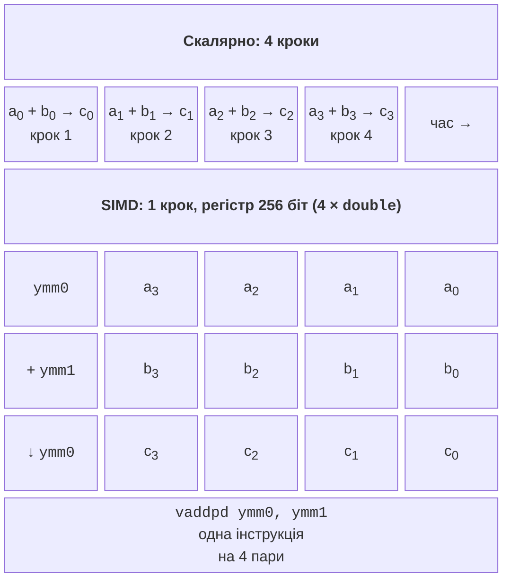
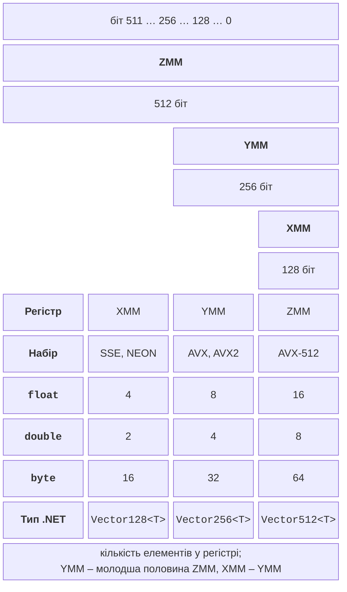

# SIMD і типи System.Numerics

## SIMD у сучасних процесорах

У темі 1 розглядалася класифікація Флінна. Клас **SIMD** (*Single Instruction, Multiple Data*) – одна команда обробляє одразу кілька елементів даних. Сучасні процесори мають для цього спеціальні широкі **векторні регістри** та інструкції, які виконують одну операцію над усіма елементами регістра (рис. 7.1). Звичайний **скалярний** (*scalar*) код додає два масиви по одній парі чисел, а векторна інструкція `vaddpd` додає чотири пари `double` за один такт. Перетворення скалярного коду на векторний називають **векторизацією** (*vectorization*).

Рис. 7.1. Скалярне та векторне додавання {.caption}

Векторизація – це паралелізм **усередині одного ядра**. Вона не потребує потоків, синхронізації і не має накладних витрат на створення задач, тому добре поєднується з паралелізмом даних (тема 6): потоки ділять дані між ядрами, а кожне ядро обробляє свою частину векторними інструкціями. Ідеальне прискорення від SIMD дорівнює кількості елементів у регістрі (4, 8, 16), а разом з 8 ядрами – у десятки разів.

### Регістри та набори інструкцій

Процесори x86-64 мають три покоління векторних регістрів (рис. 7.2): 128-бітні **XMM**, 256-бітні **YMM** і 512-бітні **ZMM**. Молодша половина регістра YMM – це регістр XMM з тим самим номером, а молодша половина ZMM – регістр YMM.

Рис. 7.2. Ширина регістрів SIMD {.caption}

Інструкції, що працюють з цими регістрами, об’єднані в **набори інструкцій** (*instruction set extensions*), які з’являлися поступово (табл. 7.1). Програма може використати набір, лише якщо його підтримує процесор, на якому вона виконується.

Таблиця 7.1. Основні набори інструкцій SIMD {.caption}

| **Набір** | **Регістри** | **Що додає** |
| --- | --- | --- |
| SSE–SSE4.2 (1999–2008) | XMM, 128 | операції над 4 `float` / 2 `double`, цілі числа, порівняння, пошук у рядках |
| AVX (2011) | YMM, 256 | дійсні числа у 256-бітних регістрах |
| AVX2, FMA (2013) | YMM, 256 | цілі числа в YMM; FMA – злите множення з додаванням $a \cdot b + c$ однією інструкцією |
| AVX-512 (2016) | ZMM, 512 | 512-бітні регістри, **маски** (*opmask*) для умовної обробки; підмножини F, BW, DQ, VL та інші |
| AVX10.1, AVX10.2 | XMM–ZMM | єдиний набір, що об’єднує можливості AVX-512 і має однаково підтримуватися всіма ядрами нових процесорів Intel |
| Arm NEON (`AdvSimd`) | 128 | стандартний SIMD 64-бітних процесорів Arm |
| Arm SVE, SVE2 | 128–2048 | **масштабовані** вектори: ширину визначає процесор |

AVX-512 підтримують серверні процесори Intel Xeon, процесори AMD, починаючи з Zen 4, та деякі настільні процесори Intel, зокрема Core i9-11900KF лабораторних комп’ютерів (11-те покоління). Настільні процесори Intel з гібридними P- та E-ядрами (починаючи з 12-го покоління) AVX-512 не мають, бо E-ядра його не підтримують. Цю проблему розв’язує **AVX10** – об’єднаний набір, у якому всі ядра процесора мають однакові можливості. AVX10.1 підтримують серверні Intel Xeon 6 з P-ядрами, а AVX10.2 Intel заявляє для наступного покоління Xeon (кодова назва Diamond Rapids). У .NET 10 для них уже є класи `Avx10v1` та `Avx10v2`. Процесори Arm (смартфони, Apple M, сервери AWS Graviton) мають 128-бітний NEON, а новіші – SVE/SVE2.

Підтримувані розширення в Linux показує файл `/proc/cpuinfo` (рядок `flags`) або команда `lscpu` (рис. 7.3), у Windows – утиліти виробника процесора. Надійніше перевіряти можливості з програми, як у прикладі «Можливості процесора».

::: info Знімок екрана
Ubuntu terminal: `lscpu | grep -o -E 'avx2|avx512[a-z]*|fma|sse4_2' | sort -u`, then `dotnet run -c Release` of the example «Можливості процесора»; flags list and the table of IsHardwareAccelerated / IsSupported
:::

Рис. 7.3. Підтримувані розширення SIMD {.caption}

### Автовекторизація та її межі

Компілятори C++ (тема 9) з ключем `-O3` виконують **автовекторизацію** (*auto-vectorization*): самі перетворюють прості цикли на векторні. JIT-компілятор .NET 10 (RyuJIT) циклів автоматично не векторизує. Для циклу `for (…) sum += x[i];` над `float[]` він прибрав перевірки меж масиву, але згенерував скалярну інструкцію `vaddss` для одного числа (перевірено дизасемблером BenchmarkDotNet, розділ «Вимірювання та аналіз продуктивності»).

Векторизувати суму `float` автоматично не можуть і компілятори C++ без спеціальних ключів: векторна сума додає числа в іншому порядку, а для дійсних чисел $(a + b) + c \ne a + (b + c)$ через округлення. Автовекторизації також заважають залежності між ітераціями (тема 6), виклики методів, умовні переходи в тілі циклу та можливе перекриття масивів.

Тому в .NET векторизацію пишуть явно за допомогою векторних типів, а для типових операцій використовують уже векторизовані методи бібліотеки: `Span<T>.IndexOf`, `MemoryExtensions.Count`, `SequenceEqual`, `Enumerable.Min`/`Max` для масивів чисел, методи `TensorPrimitives`. Документація .NET описує три рівні таких засобів <https://learn.microsoft.com/dotnet/standard/simd>: типи `System.Numerics`, апаратно-незалежні вектори `System.Runtime.Intrinsics` і платформні інтринсики.

## Тип Vector&lt;T&gt; і типи System.Numerics

Тип `System.Numerics.Vector<T>` – вектор **змінної ширини** <https://learn.microsoft.com/dotnet/api/system.numerics.vector-1>. Кількість елементів `Vector<T>.Count` визначається під час запуску програми процесором і не змінюється до її завершення. Елементи – примітивні числові типи: `byte`, `short`, `int`, `long`, `float`, `double` та інші. Статичний клас `System.Numerics.Vector` містить операції:

- `Vector.IsHardwareAccelerated` – чи прискорюються операції апаратно; якщо ні, вони виконуються програмно (правильно, але повільно);
- оператори `+`, `-`, `*`, `/`, `&`, `|`, `^` поелементно;
- `Vector.Dot`, `Vector.Sum`, `Vector.Min`, `Vector.Max`, `Vector.Abs`, `Vector.SquareRoot`;
- порівняння `Vector.GreaterThan`, `Vector.Equals` (повертають маски) та `Vector.ConditionalSelect`;
- створення: `new Vector<T>(value)` (усі елементи однакові), `new Vector<T>(span)` (перші `Count` елементів), `Vector<T>.Zero`, `Vector<T>.One`, `Vector<T>.Indices` (0, 1, 2, …).

Значення `Vector<T>.Count` залежить від ПК: на i9-11900KF `Vector<float>.Count` дорівнює 8, хоча процесор підтримує AVX-512. Типово .NET обмежує `Vector<T>` 256 бітами: 512-бітні регістри вигідні не для всіх задач, а для коротких масивів вектор з 16 елементів рідше заповнюється. Змінна середовища `DOTNET_MaxVectorTBitWidth=512` перед запуском програми збільшує `Vector<float>.Count` до 16 (перевірено на i9-11900KF).

Код на `Vector<T>` переносний (4 елементи з SSE чи NEON, 8 – з AVX2), але ширина невідома під час написання коду.

Для графіки й геометрії простір імен `System.Numerics` має типи фіксованої форми з апаратним прискоренням: `Vector2`, `Vector3`, `Vector4` (2–4 числа `float`), `Matrix3x2`, `Matrix4x4`, `Plane`, `Quaternion`. Вони зручні, коли дані природно є точками чи перетвореннями: `Vector3.Transform(p, matrix)` перетворює точку, `Vector3.Normalize(p)` дає вектор довжини 1 (лабораторна робота, приклад 3).
