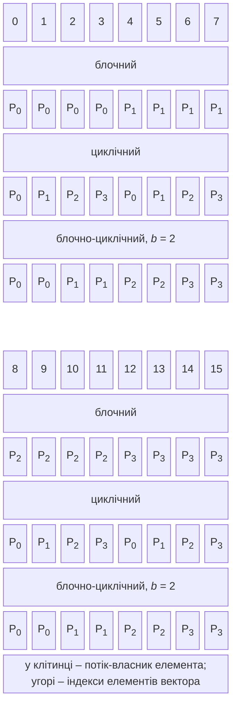
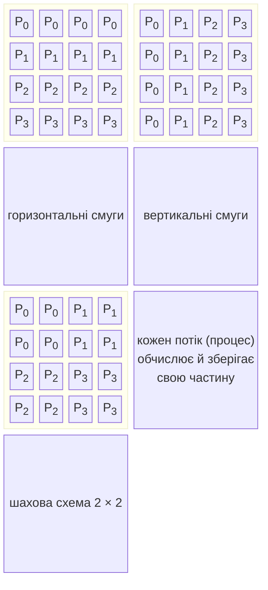
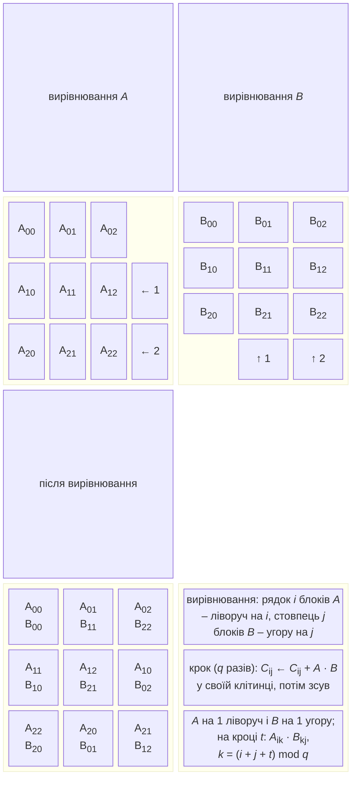
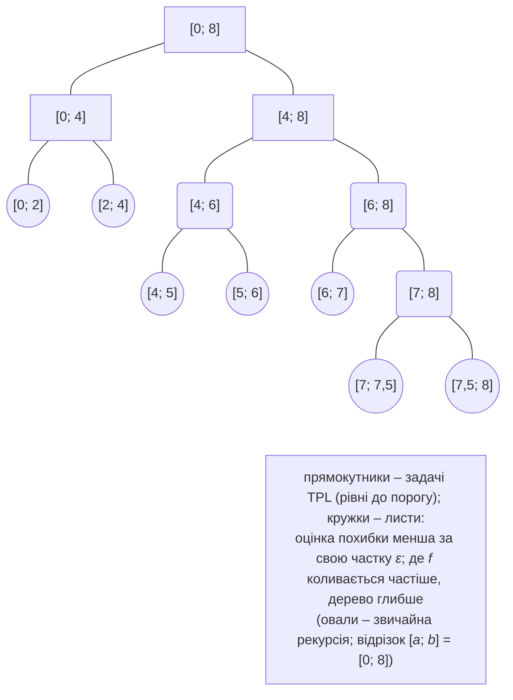

# Декомпозиція даних та інтегрування

## Декомпозиція векторів

Вектор з $n$ елементів розподіляють між $p$ потоками (процесами) трьома основними способами (рис. 8.7). Нумерація потоків $t = 0 , … , p - 1$.



Рис. 8.7. Розподіли вектора між потоками {.caption}

- **Блочний** (*block*): потік $t$ отримує суцільний діапазон індексів $[ t n / p ; (t + 1) n / p )$ (ціле ділення). Власник елемента $i$ обчислюється приблизно як $\lfloor i p / n \rfloor$. Доступ до пам’яті послідовний, кожен потік працює зі своїми кеш-рядками. Це типовий розподіл `Parallel.For` з діапазонами та програм MPI.
- **Циклічний** (*cyclic*): потік $t$ отримує елементи $t , t + p , t + 2 p , …$, тобто власник – $i \bmod p$. Добре вирівнює навантаження, коли «вага» елементів плавно змінюється вздовж вектора (наприклад, робота з рядком трикутної матриці), але сусідні елементи належать різним потокам: на спільній пам’яті кожен потік читає всі кеш-рядки, а у векторному коді SIMD неможливий.
- **Блочно-циклічний** (*block-cyclic*) з розміром блоку $b$: блоки по $b$ елементів роздаються по колу, власник – $\lfloor i / b \rfloor \bmod p$. Поєднує переваги обох: доступ послідовний у межах блоку, а навантаження вирівнюється по всьому вектору. Так розподіляють матриці бібліотеки ScaLAPACK.

Для **скалярного добутку** $x \cdot y = \sum_{i} x_{i} y_{i}$ кожен потік обчислює часткову суму своїх елементів, а потім часткові суми додаються (**редукція**, тема 6). **Евклідова норма** $| | x | | = \sqrt{x \cdot x}$ обчислюється тим самим кодом, а максимум модулів – такою самою редукцією з операцією `Math.Max`. У прикладі «Скалярний добуток і розподіли вектора» (вектори по 20 мільйонів `double`) блочний і блочно-циклічний розподіли дали прискорення 2,5 вже на 4 потоках, після чого воно зупинилося: 320 МБ даних читаються зі швидкістю приблизно 45 ГБ/с, і межею стає пропускна здатність пам’яті, як у темі 7. Циклічний розподіл на 8 і 16 потоках виявився **повільнішим** за послідовний цикл: кожен потік використовує лише одне з восьми чисел `double` кожного кеш-рядка, тому пам’яті та кешу доводиться передавати в $p$ разів більше даних.

### Недетермінованість сум з рухомою комою

Додавання чисел з рухомою комою не асоціативне: $(a + b) + c$ і $a + (b + c)$ можуть відрізнятися в останніх розрядах (тема 7). Паралельна сума змінює порядок додавань, тому результат залежить від кількості потоків і способу розподілу. Це не помилка, а властивість арифметики, проте вона має два наслідки:

- результат, що залежить від $p$, але **однаковий між запусками** (фіксований розподіл і додавання часткових сум у порядку номерів потоків), відтворюваний: його можна налагоджувати й порівнювати;
- результат, що залежить від **порядку завершення потоків** (часткові суми додаються під `lock` у `localFinally`, `Interlocked`-додавання дійсних чисел через `CompareExchange`), змінюється від запуску до запуску навіть на тому самому комп’ютері.

У прикладі «Скалярний добуток і розподіли вектора» блочний розподіл на 4 потоках щоразу дає −111,15502539965507, а `Parallel.For` з локальними сумами та `lock` за п’ять запусків дав п’ять різних значень, що відрізняються в 13-й значущій цифрі. Для відтворюваних результатів:

- ділять дані на **фіксовану** кількість частин, яка не залежить від кількості потоків (у методі спряжених градієнтів лабораторної роботи – 64 частини), і додають часткові суми в порядку номерів частин: тоді результат однаковий для будь-якого $p$;
- рекурсивну суму ділять навпіл за індексами (як у функції `Sum` вище), а не за порядком виконання: дерево додавань залежить лише від даних;
- порівнюють паралельний і послідовний результати з відносним допуском, а не оператором `==`;
- для дуже довгих сум використовують компенсоване додавання Кехена (*Kahan summation*), яке зменшує похибку округлення.

## Декомпозиція матриць

Матрицю $n \times n$ зберігають за рядками (тема 7) і розподіляють трьома основними способами (рис. 8.8):

- **горизонтальні смуги** (*row-wise*): потік отримує $n / p$ суміжних рядків;
- **вертикальні смуги** (*column-wise*): потік отримує $n / p$ суміжних стовпців;
- **шахова схема** (*checkerboard, 2D block*): $p = r \times c$ потоків утворюють решітку, і потік $(i , j)$ отримує блок з $n / r$ рядків і $n / c$ стовпців.



Рис. 8.8. Схеми декомпозиції матриці {.caption}

### Множення матриці на вектор

Для $y = A x$ три схеми дають різні обсяги обчислень і обмінів (табл. 8.4).

Таблиця 8.4. Множення матриці на вектор за трьома схемами {.caption}

| **Схема** | **Обчислення потоку** | **Обміни (у розподіленій пам’яті)** |
| --- | --- | --- |
| горизонтальні смуги | $n / p$ скалярних добутків довжини $n$: $y_{i}$ для своїх рядків | кожен процес потребує **весь** вектор $x$: збирання всіх частин (*all-gather*), $n$ чисел на процес |
| вертикальні смуги | частковий вектор $z^{(t)}$ довжини $n$ зі своїх стовпців і своєї частини $x$ | редукція часткових векторів: $y = \sum_{t} z^{(t)}$, $n$ чисел від кожного процесу |
| шахова $\sqrt{p} \times \sqrt{p}$ | частковий вектор довжини $n / \sqrt{p}$ зі свого блоку | розсилка частини $x$ уздовж стовпця решітки й редукція вздовж рядка: по $n / \sqrt{p}$ чисел |

Обсяг обчислень однаковий: $n^{2} / p$ множень і додавань на потік. Обміни на один процес для смуг пропорційні $n$ і не зменшуються з ростом $p$, а для шахової схеми – лише $n / \sqrt{p}$. Тому на кластері з багатьма процесами шахова схема масштабується краще. На спільній пам’яті «обміни» дешеві: смугам рядків не потрібна редукція, а вертикальним смугам і шаховій схемі – додатковий прохід по часткових векторах і ще один паралельний цикл.

Приклад «Множення матриці на вектор» вимірює всі три схеми для двох розмірів матриці. Для матриці $8000 \times 8000$ (488 МБ) усі схеми впираються в пам’ять: прискорення 4,3–4,6 на 8 потоках і не більше 4,8 на 16, що збігається з прогнозом, який враховує пропускну здатність (розділ «Аналітичне прогнозування продуктивності»). Для матриці $1000 \times 1000$ (8 МБ у кеші L3) один добуток триває менше за мілісекунду, і прискорення обмежують накладні витрати запуску паралельного циклу: 2,8–3,7 замість прогнозованих 10–14.

### Множення матриць

Добуток $C = A B$ матриць $n \times n$ виконує $2 n^{3}$ операцій над $3 n^{2}$ числами, тому в ньому обчислення переважають обміни, і воно добре масштабується навіть на кластерах. Послідовні оптимізації (порядок циклів, плитки, SIMD) розглянуто в темі 7; тут – розподіл між процесорами. Нехай $p = q^{2}$ процесорів, а матриці поділено на $q \times q$ блоків розміром $n / q \times n / q$.

**Стрічковий алгоритм** (*striped algorithm*). Процес $t$ має горизонтальну смугу $A$ і $C$, а також смугу $B$. На спільній пам’яті кожен потік просто читає всю матрицю $B$. На розподіленій пам’яті смуги $B$ рухаються по кільцю процесів: за $p$ кроків кожен процес множить свою смугу $A$ на кожну смугу $B$ і передає смугу $B$ сусідові. Кожен процес пересилає $n^{2}$ чисел (усі смуги $B$) за $p$ повідомлень.

**Алгоритм Фокса** (*Fox’s algorithm*, 1987). Процеси утворюють решітку $q \times q$, процес $(i , j)$ має блоки $A_{i j}$, $B_{i j}$ і обчислює $C_{i j} = \sum_{k} A_{i k} B_{k j}$. На кроці $t = 0 , … , q - 1$:

1. процес $(i , k)$, де $k = (i + t) \bmod q$, **розсилає** свій блок $A_{i k}$ уздовж рядка $i$ решітки;
2. кожен процес рядка множить отриманий блок на свій поточний блок $B$ і додає до $C_{i j}$;
3. блоки $B$ **циклічно зсуваються** на одну позицію вгору в межах стовпця.

**Алгоритм Кеннона** (*Cannon’s algorithm*, 1969) замінює розсилку циклічними зсувами (рис. 8.9). Спочатку виконується **вирівнювання** (*skew*): рядок $i$ блоків $A$ зсувається ліворуч на $i$ позицій, стовпець $j$ блоків $B$ – угору на $j$ позицій. Після вирівнювання процес $(i , j)$ має $A_{i , (i + j) \bmod q}$ і $B_{(i + j) \bmod q , j}$ – пару блоків з однаковим внутрішнім індексом. Далі $q$ разів повторюються: множення своїх блоків із додаванням до $C_{i j}$ і зсув $A$ на один блок ліворуч, а $B$ – на один угору. Кожен процес обмінюється лише з чотирма сусідами решітки, а пам’ять на процес – лише три блоки.



Рис. 8.9. Алгоритм Кеннона на решітці $3 \times 3$ {.caption}

Таблиця 8.5. Обчислення й обміни алгоритмів множення матриць {.caption}

| **Алгоритм** | **Обчислення** | **Обміни на процес** | **Пам’ять** |
| --- | --- | --- | --- |
| стрічковий | $2 n^{3} / p$ | $p$ повідомлень, $n^{2}$ чисел | $3 n^{2} / p$ |
| Фокса | $2 n^{3} / p$ | $q$ розсилок і $q$ зсувів, $\approx 2 n^{2} / \sqrt{p}$ чисел | $4 n^{2} / p$ |
| Кеннона | $2 n^{3} / p$ | $2 q$ зсувів (крім вирівнювання), $2 n^{2} / \sqrt{p}$ чисел | $3 n^{2} / p$ |

Обсяг обмінів алгоритмів Фокса й Кеннона в $\sqrt{p} / 2$ раза менший, ніж у стрічкового (табл. 8.5), тому саме на них ґрунтуються бібліотеки розподіленої лінійної алгебри (ScaLAPACK, алгоритм SUMMA). У лабораторній роботі (приклад 1) усі три схеми реалізовано на спільній пам’яті: алгоритм Кеннона використовує окремі потоки, «повідомлення» – копіювання блоку сусіда, а кінець кроку – `Barrier`. На спільній пам’яті переваги в обмінах немає, і смуги виявилися найшвидшими: усі потоки читають ту саму матрицю $B$ зі спільного кешу L3. Реалізація Кеннона на MPI з декартовою топологією – одне з завдань теми 12.

## Паралельне чисельне інтегрування

Визначений інтеграл $I = \int_{a}^{b} f (x) d x$ наближено обчислюють **квадратурними формулами** на сітці $x_{i} = a + i h$, $h = (b - a) / n$:

- **прямокутників** (середніх точок): $I \approx h \sum_{i = 0}^{n - 1} f (x_{i} + h / 2)$, похибка $O (h^{2})$;
- **трапецій**: $I \approx h (f (a) / 2 + \sum_{i = 1}^{n - 1} f (x_{i}) + f (b) / 2)$, похибка $O (h^{2})$;
- **Сімпсона** ($n$ парне): $I \approx h / 3 (f (a) + 4 \sum_{\text{непарні}} f (x_{i}) + 2 \sum_{\text{парні}} f (x_{i}) + f (b))$, похибка $O (h^{4})$.

Кожна формула – зважена сума значень $f$, тобто паралелізм даних із редукцією: вузли ділять між потоками, кожен потік обчислює часткову суму, часткові суми додаються. На кластері кожен процес отримує свій відрізок $[ a_{t} ; b_{t} ]$ і обчислює на ньому інтеграл, а процес 0 збирає суму (`MPI_Reduce`, тема 12) – обмін лише одним числом.

**Правило Рунге** (*Runge’s rule*) оцінює похибку без точного значення. Якщо формула має порядок $k$ (для Сімпсона $k = 4$), а $I_{n}$ і $I_{2 n}$ – результати з кроком $h$ і $h / 2$, то $$I - I_{2 n} \approx \frac{I_{2 n} - I_{n}}{2^{k} - 1} .$$ Обчислення повторюють, подвоюючи $n$, доки ця оцінка не стане меншою за задану точність; додавання оцінки до $I_{2 n}$ дає ще точніше значення (екстраполяція Річардсона). Паралельна складена формула Сімпсона:

```cs
static double Simpson(Func<double, double> f, double a, double b,
    int n)                               // n – парне
{
    double h = (b - a) / n;
    double sum = 0;
    object gate = new();
    var ranges = Partitioner.Create(1, n, 100_000);
    Parallel.ForEach(ranges, () => 0.0, (range, _, local) =>
    {
        for (int i = range.Item1; i < range.Item2; i++)
            local += (i % 2 == 1 ? 4 : 2) * f(a + i * h);
        return local;
    }, local => { lock (gate) sum += local; });
    return h / 3 * (f(a) + sum + f(b));
}

double i1 = Simpson(Math.Sin, 0, Math.PI, 100);
double i2 = Simpson(Math.Sin, 0, Math.PI, 200);
double runge = (i2 - i1) / 15;           // оцінка I − I(2n)
Console.WriteLine($"I(n) = {i1:F12}, I(2n) = {i2:F12}");
Console.WriteLine($"Рунге: {runge:E2}, справжня похибка " +
    $"{2 - i2:E2}");
Console.WriteLine($"Уточнене значення: {i2 + runge:F12}");
```

Для $\int_{0}^{\pi} \sin x d x = 2$ оцінка Рунге майже точно збігається зі справжньою похибкою, а уточнене значення правильне до 12 знаків:

```
I(n) = 2,000000010825, I(2n) = 2,000000000676
Рунге: -6,77E-010, справжня похибка -6,76E-010
Уточнене значення: 2,000000000000
```

### Адаптивне інтегрування

Рівномірна сітка витрачає однаково багато обчислень і там, де функція майже стала, і там, де вона швидко змінюється. **Адаптивне інтегрування** (*adaptive quadrature*) ділить відрізок навпіл лише там, де оцінка похибки велика (рис. 8.10). Для формули Сімпсона на відрізку $[ a ; b ]$ з серединою $m$ порівнюють $S (a , b)$ із сумою $S (a , m) + S (m , b)$: якщо різниця менша за $15 \epsilon$ (правило Рунге з $2^{4} - 1 = 15$), відрізок прийнято, інакше кожна половина обробляється так само з точністю $\epsilon / 2$.



Рис. 8.10. Адаптивне інтегрування: розбиття й дерево рекурсії {.caption}

Адаптивний алгоритм – рекурсія «розділяй і володарюй», у якій обсяг роботи в різних частинах наперед **невідомий**. Статичний розподіл відрізка на $p$ рівних частин дає дисбаланс: у прикладі «Адаптивне інтегрування» для функції $2 x \cos x^{2}$ на $[ 0 ; 200 ]$, коливання якої частішають праворуч, найлегша з 16 частин обчислюється 0,4 мс, а найважча – 33 мс. Природне рішення – **динамічне балансування задачами**: обидві половини відрізка стають задачами `Parallel.Invoke`, а вільні потоки пулу забирають їх крадіжкою роботи. Щоб задачі не були надто дрібними, вводять **поріг**: до певної глибини рекурсії створюються задачі, глибше – звичайна послідовна рекурсія. За порогу $2^{8}$ (510 задач) прискорення 7,3, за $2^{4}$ (30 задач) задач замало для балансування (4,3), а за $2^{16}$ (130 тисяч задач) накладні витрати зменшують його до 5,3.

### Кратні інтеграли та метод Монте-Карло

**Кратний інтеграл** $\iint_{D} f (x , y) d x d y$ по прямокутнику обчислюють двовимірною сіткою: зовнішній цикл за рядками сітки – `Parallel.For`, внутрішній – звичайна сума за формулою в одному напрямку, як двовимірна декомпозиція. Кількість вузлів зростає як $n^{d}$ для розмірності $d$, тому для $d \gt 3$ сітки стають непрактичними («прокляття розмірності»).

**Метод Монте-Карло** оцінює інтеграл середнім значенням функції у випадкових точках: $I \approx V \cdot \frac{1}{N} \sum f (\xi_{k})$, де $V$ – об’єм області. Похибка зменшується як $1 / \sqrt{N}$ незалежно від розмірності, а всі точки незалежні, тому метод ідеально паралельний. Потрібен окремий генератор на кожен блок точок, бо `Random` не потокобезпечний, а для відтворюваності блоки фіксовані (тема 6). Наприклад, об’єм кулі радіуса 1 як частка 64 мільйонів випадкових точок куба $[ - 1 ; 1 ]^{3}$, що потрапили в кулю:

```cs
const int Blocks = 64, PerBlock = 1_000_000;
long[] hits = new long[Blocks];
Parallel.For(0, Blocks, k =>
{
    Random random = new(2026 + k);       // свій генератор на блок
    long inside = 0;
    for (int i = 0; i < PerBlock; i++)
    {
        double x = random.NextDouble() * 2 - 1;
        double y = random.NextDouble() * 2 - 1;
        double z = random.NextDouble() * 2 - 1;
        if (x * x + y * y + z * z <= 1) inside++;
    }
    hits[k] = inside;
});
double share = (double)hits.Sum() / ((long)Blocks * PerBlock);
double volume = 8 * share;
double sigma = 8 * Math.Sqrt(share * (1 - share)
    / ((long)Blocks * PerBlock));
Console.WriteLine($"V = {volume:F5} ± {1.96 * sigma:F5} " +
    $"(точно {4 * Math.PI / 3:F5})");
```

Результат містить 95-відсотковий довірчий інтервал $\pm 1 {,} 96 \sigma$, де $\sigma$ – стандартне відхилення оцінки частки:

```
V = 4,18884 ± 0,00098 (точно 4,18879)
```
