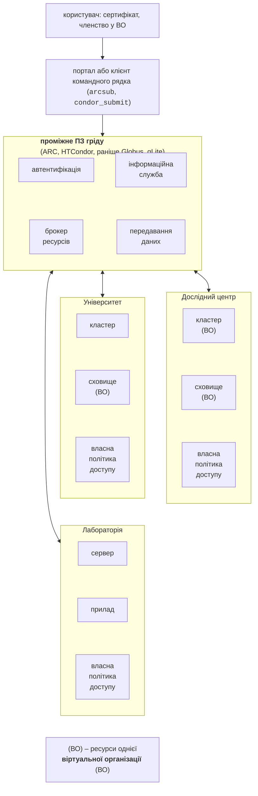
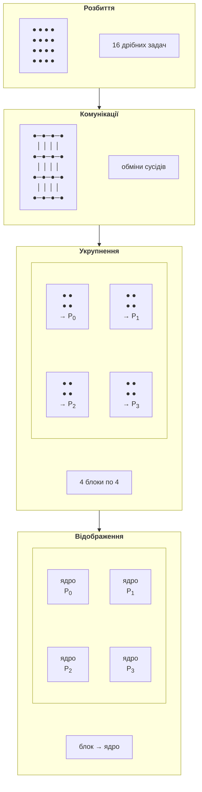

# Грід-системи та методологія Фостера

## Грід-системи

Коли обчислень так багато, що не вистачає одного кластера, об’єднують ресурси багатьох організацій. **Грід** (*grid*, від англ. *power grid* – електромережа) передбачає, що обчислювальні ресурси можна «вмикати в розетку» так само, як електроенергію, не знаючи, на якій електростанції її вироблено. Термін популяризували Ян Фостер (*Ian Foster*) і Карл Кессельман (*Carl Kesselman*) у книзі «The Grid: Blueprint for a New Computing Infrastructure» (1998). У статті «The Anatomy of the Grid» (Фостер, Кессельман, Тек, 2001) грід визначено як **скоординоване спільне використання ресурсів і розв’язання задач у динамічних, багатоінституційних віртуальних організаціях**. Фостер (2002) запропонував три ознаки гріду:

1. координує ресурси, які **не підлягають централізованому керуванню**: вони належать різним організаціям з різними правилами доступу;
2. використовує **стандартні відкриті протоколи** й інтерфейси загального призначення (автентифікація, пошук ресурсів, запуск завдань, передавання даних);
3. забезпечує **нетривіальну якість обслуговування**: пропускну здатність, доступність, безпеку, яких не дає жоден ресурс окремо.

### Віртуальні організації та проміжне ПЗ

**Віртуальна організація** (ВО, *virtual organization*) – група людей і установ, які за спільними правилами використовують частину ресурсів різних організацій для спільної мети (наприклад, експеримент на прискорювачі чи кліматичне моделювання). Одна установа може надавати ресурси кільком ВО, а ВО – об’єднувати ресурси багатьох установ (рис. 8.4).

Рис. 8.4. Архітектура грід-системи {.caption}

Між користувачем і ресурсами працює **проміжне програмне забезпечення гріду** (*grid middleware*):

- **автентифікація й авторизація**: користувач має цифровий сертифікат X.509 і членство у ВО; одного входу достатньо для доступу до ресурсів усіх організацій (*single sign-on*), а кожна організація зберігає власну політику доступу;
- **інформаційна служба**: які ресурси є, скільки вільних ядер, яке програмне забезпечення встановлено;
- **брокер ресурсів** (планувальник гріду): вибирає, на якому кластері виконати завдання, і передає його локальному планувальнику (Slurm, HTCondor – тема 13);
- **передавання й реплікація даних**: вхідні файли копіюються до обчислювального ресурсу, результати – у сховище.

Найвідоміші реалізації:

- **Globus Toolkit** – історично перший набір протоколів гріду (GRAM для запуску завдань, GridFTP для передавання даних, GSI для безпеки). Підтримку відкритої версії припинено в січні 2018 року <https://www.globus.org/blog/support-open-source-globus-toolkit-ends-january-2018>; спільнота продовжує її як Grid Community Toolkit <https://gridcf.org/>;
- **ARC** (*Advanced Resource Connector*) спільноти NorduGrid – відкрите проміжне ПЗ з обчислювальним елементом ARC-CE, який сам завантажує вхідні дані й вивантажує результати; у вересні 2026 року поточна версія – ARC 7.2.0, ліцензія Apache 2.0 <https://www.nordugrid.org/arc/>;
- **HTCondor** (Центр високопродуктивних обчислень Вісконсинського університету в Медісоні) – система **високопропускних обчислень** (*high-throughput computing, HTC*), мета якої – виконати якомога більше незалежних завдань за тривалий час, а не прискорити одне завдання. Машини оголошують свої характеристики, а завдання – вимоги у форматі **ClassAds**, і HTCondor добирає пари «завдання – машина», як оголошення в газеті <https://htcondor.org/htcondor/overview/>;
- **gLite** – проміжне ПЗ європейських проєктів EGEE, на якому свого часу працювала EGI; його компоненти поступово замінено.

### Грід-інфраструктури

**EGI** (*European Grid Infrastructure*) – федерація постачальників обчислювальних ресурсів і сховищ для досліджень, яку координує некомерційна організація EGI Foundation в Амстердамі <https://www.egi.eu/>. За даними сайту EGI у вересні 2026 року, інфраструктура об’єднує майже 300 центрів обробки даних, переважно в Європі, 580 ПБ онлайн-сховищ і обслуговує 163 тисячі користувачів; крім грід-обчислень, EGI надає хмарні ресурси й сервіси обробки даних.

**WLCG** (*Worldwide LHC Computing Grid*) – найбільший науковий грід, створений для обробки даних Великого адронного колайдера ЦЕРН <https://wlcg.web.cern.ch/>. За даними ЦЕРН, він об’єднує близько 1,4 мільйона ядер і 1,5 ексабайта сховищ у понад 170 центрах 42 країн і виконує понад 2 мільйони завдань на добу <https://home.cern/science/computing/grid>. Центри WLCG утворюють рівні (*tiers*): Tier 0 у ЦЕРН записує й первинно обробляє дані, великі національні центри Tier 1 зберігають копії та повторно обробляють їх, а університетські центри Tier 2 виконують моделювання й аналіз. WLCG працює на ресурсах EGI, американської OSG та інших національних грідів.

**Добровільні обчислення** (*volunteer computing*) використовують вільний час персональних комп’ютерів звичайних людей. Платформа **BOINC** (*Berkeley Open Infrastructure for Network Computing*) Каліфорнійського університету в Берклі <https://boinc.berkeley.edu/> обслуговує близько 30 наукових проєктів: пошук гравітаційних хвиль і пульсарів (Einstein@Home), дослідження білків і хвороб, клімату. Клієнт BOINC (для Windows у вересні 2026 року – версія 8.2.11) завантажує з сервера проєкту **робочі одиниці** (*work units*), обчислює їх у фоновому режимі з низьким пріоритетом і повертає результати (рис. 8.5). Комп’ютери добровольців ненадійні й неконтрольовані, тому сервер надсилає кожну робочу одиницю кільком клієнтам і приймає результат, лише коли кілька з них збігаються (**кворум**, *quorum*); повільні або зниклі клієнти отримують дедлайн, після якого робота передається іншим.

::: info Знімок екрана
BOINC Manager 8.2: View → Advanced View, tab Tasks: several tasks of an attached project (e.g. Einstein@Home) with progress, elapsed and remaining time; tab Projects optional (only if the author installs BOINC)
:::

Рис. 8.5. Клієнт добровільних обчислень BOINC {.caption}

**Український національний грід** (УНГ) створено за Державною цільовою науково-технічною програмою впровадження і застосування грід-технологій на 2009–2013 роки (постанова Кабінету Міністрів України від 23 вересня 2009 р. № 1020). За описом на сайті Базового координаційного центру, УНГ об’єднує 24 ресурсні центри наукових установ, з них 16 – установи НАН України; Базовий координаційний грід-центр працює при Інституті теоретичної фізики ім. М. М. Боголюбова НАН України і представляє УНГ у міжнародних грід-співтовариствах; ресурси доступні через проміжне ПЗ ARC і gLite <http://ung.bitp.kiev.ua/ua/>. Українські грід-сайти брали участь, зокрема, в обробці даних експериментів Великого адронного колайдера.

### Кластер, грід і хмара

Грід, кластер і хмара вирішують схожі задачі, але різними способами (табл. 8.3).

Таблиця 8.3. Порівняння кластера, гріду та хмари {.caption}

| **Ознака** | **Кластер** | **Грід** | **Хмара** |
| --- | --- | --- | --- |
| власник | одна організація | багато організацій, ВО | постачальник послуг |
| керування | централізоване (Slurm) | децентралізоване, політики кожної організації | централізоване постачальником |
| вузли | однорідні, швидка мережа (InfiniBand, 10–100 Гбіт/с) | різнорідні, мережа Інтернет | віртуальні машини й контейнери |
| доступ | обліковий запис, черга | сертифікат X.509, членство у ВО | обліковий запис, оплата за використання |
| типові задачі | тісно зв’язані паралельні програми (MPI) | велика кількість незалежних завдань і даних (HTC) | вебсервіси, еластичне масштабування, також HPC |
| у курсі | тема 13 | ця тема | тема 17 |

Головний висновок для проєктування алгоритмів: між вузлами гріду немає швидкої мережі, тому в гріді виконують **крупнозернисті** незалежні завдання (параметричні розрахунки, обробку окремих файлів даних), а тісно зв’язані алгоритми (метод Якобі з обмінами гало, множення матриць Кеннона) запускають у межах одного кластера. Сучасні інфраструктури (EGI, WLCG) поступово поєднують грід і хмару: той самий користувач запускає пакетні завдання й віртуальні машини.

## Методологія Фостера PCAM

Паралельний алгоритм рідко вдається написати одразу. Ян Фостер у книзі «Designing and Building Parallel Programs» (1995, повний текст доступний на сайті Аргоннської національної лабораторії <https://www.mcs.anl.gov/~itf/dbpp/>) запропонував методологію з чотирьох етапів, за першими літерами названу **PCAM** (рис. 8.6). Перші два етапи виявляють **увесь** паралелізм задачі незалежно від комп’ютера, останні два пристосовують алгоритм до конкретної кількості ядер чи вузлів.

Рис. 8.6. Методологія Фостера PCAM {.caption}

1. **Розбиття** (*partitioning*). Задачу ділять на якомога дрібніші **примітивні задачі**. **Декомпозиція даних** (*domain decomposition*) спочатку ділить дані (елементи вектора, вузли сітки, рядки матриці), а потім пов’язує з кожною частиною обчислення над нею. **Функціональна декомпозиція** (*functional decomposition*) ділить обчислення на різні функції (етапи конвеєра, моделі атмосфери й океану). Добре розбиття має задач на порядок більше, ніж процесорів, і задачі приблизно однакового розміру.
2. **Комунікації** (*communication*). Визначають, які дані потрібні кожній задачі від інших. Обміни бувають **локальні** (з кількома сусідами, як у методі Якобі) і **глобальні** (з усіма, як редукція суми); **структуровані** (регулярна решітка) і **неструктуровані** (довільний граф); **статичні** (партнери відомі наперед) і **динамічні**; **синхронні** й **асинхронні**.
3. **Укрупнення** (*agglomeration*). Примітивні задачі об’єднують у більші, щоб зменшити обміни й накладні витрати. Для сітки вигідно групувати вузли в квадратні блоки: обчислення пропорційні **площі** блоку, а обміни – його **периметру** (ефект «поверхня – об’єм», *surface-to-volume effect*). Мета – знайти зернистість, за якої обміни малі порівняно з обчисленнями, але задач ще вистачає для всіх процесорів.
4. **Відображення** (*mapping*). Укрупнені задачі призначають процесорам так, щоб навантаження було рівномірним, а задачі, що часто обмінюються, були поруч.

На кожному етапі Фостер радить перевіряти контрольні питання: чи задач більше за процесори, чи однакові вони за розміром, чи масштабується кількість задач з розміром задачі (а не з кількістю процесорів), чи не зосереджено обміни в одній задачі, чи можна обчислення й обміни виконувати одночасно.

### Статичне й динамічне балансування навантаження

**Статичне** відображення (*static mapping*) вирішує, хто що обчислює, **до** початку роботи: блочний або циклічний розподіл індексів, фіксовані смуги матриці. Воно не потребує синхронізації під час роботи, але ефективне лише тоді, коли час кожної задачі відомий і однаковий. **Динамічне** балансування (*dynamic load balancing*) роздає роботу під час виконання:

- **спільна черга** («мішок задач», *bag of tasks*) або спільний лічильник: вільний потік бере наступну задачу; просто, але черга стає вузьким місцем, якщо задачі дрібні;
- **«майстер – робітник»** (*master–worker*): окремий процес роздає задачі й збирає результати (MPI, тема 12; RabbitMQ, тема 15);
- **крадіжка роботи** (*work stealing*): кожен потік має власну чергу, а вільний потік «краде» задачі з кінця черги іншого. Так працює пул потоків .NET (тема 2), планувальник TPL і `Parallel.For`: під час роботи діапазони ітерацій діляться, і вільні потоки забирають частини чужих діапазонів.

Нерівномірність навантаження вимірюють відношенням найбільшого часу потоку до середнього. Якщо один потік працює 33 мс, а середній – 10 мс, прискорення не може перевищити $p \cdot 10 / 33$, скільки б ядер не було (приклад «Адаптивне інтегрування»).

### Приклад: PCAM для інтегрування й множення матриці на вектор

**Інтеграл** $\int_{a}^{b} f (x) d x$ за складеною формулою. Розбиття: примітивна задача – обчислення $f$ в одному вузлі сітки. Комунікації: глобальна редукція суми (тема 6). Укрупнення: вузли об’єднують у відрізки по кілька тисяч, щоб виклик задачі коштував менше за її роботу. Відображення: якщо $f$ обчислюється однаково швидко, достатньо статичного блочного розподілу відрізків; якщо ні (особливості, частіші коливання) або якщо сітка адаптивна – потрібне динамічне балансування.

**Добуток $y = A x$** матриці $n \times n$. Розбиття: примітивна задача – добуток $a_{i j} x_{j}$ (усього $n^{2}$). Комунікації: задачі рядка $i$ підсумовують свої добутки (редукція за рядком), а задачі стовпця $j$ потребують однакового $x_{j}$ (розсилка). Укрупнення: групування за рядками, стовпцями або блоками дає три схеми наступного розділу. Відображення: блоки однакового розміру – статичне, по одному на потік.
