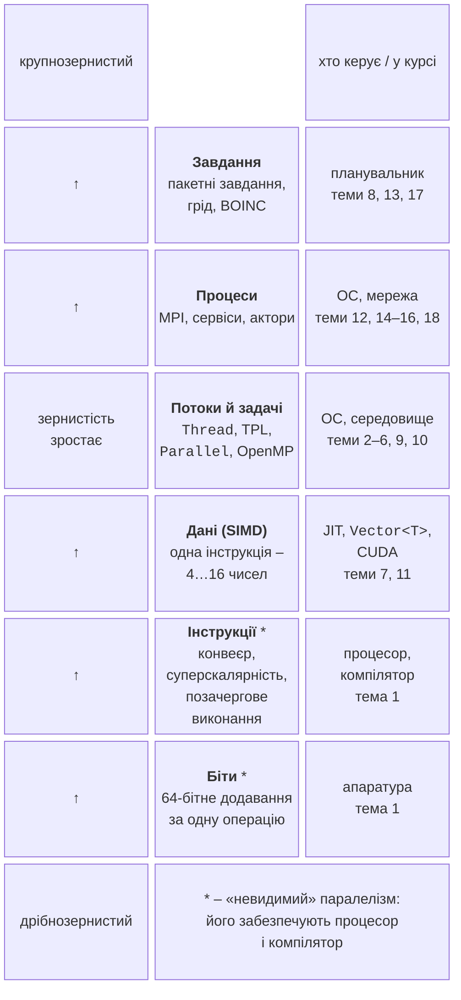
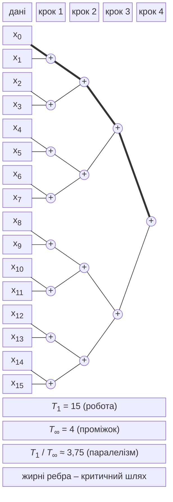
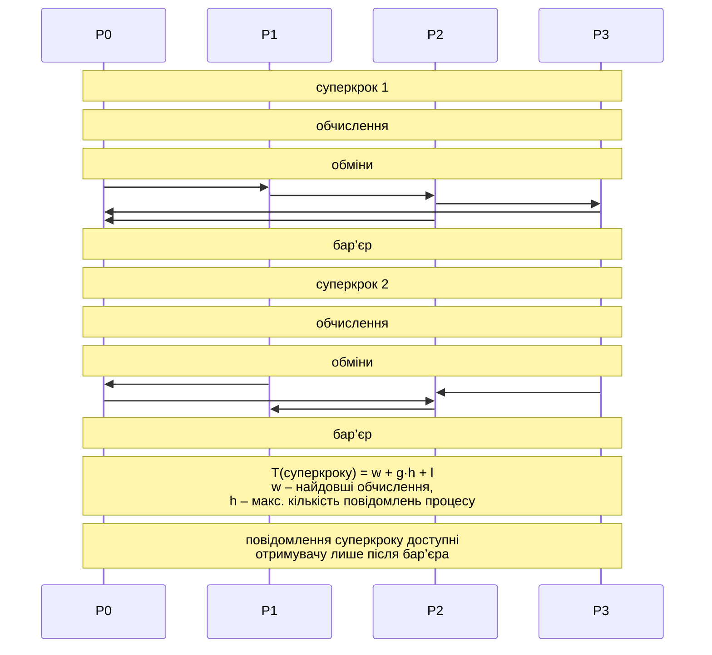

# Рівні та моделі паралелізму

## Рівні паралелізму

Паралелізм існує на кількох **рівнях** (*levels of parallelism*) – від окремих бітів усередині процесора до тисяч незалежних завдань на різних комп’ютерах (рис. 8.1). Рівні відрізняються тим, **хто** виявляє паралелізм (апаратура, компілятор, програміст, планувальник) і наскільки великі незалежні частини роботи.



Рис. 8.1. Рівні паралелізму {.caption}

- **Паралелізм на рівні бітів** (*bit-level parallelism*). Арифметико-логічний пристрій обробляє всі біти слова одночасно: 64-бітний процесор додає два 64-бітні числа за одну операцію, а 8-бітному знадобилося б вісім операцій з перенесенням. Збільшення розрядності (8 → 16 → 32 → 64 біти) було першим джерелом прискорення, зараз цей рівень вичерпано.
- **Паралелізм на рівні інструкцій** (*instruction-level parallelism, ILP*). **Конвеєр** (*pipeline*) ділить виконання інструкції на етапи (вибірка, декодування, виконання, запис), і різні інструкції одночасно перебувають на різних етапах. **Суперскалярний** (*superscalar*) процесор запускає кілька незалежних інструкцій за такт на кількох виконавчих пристроях. **Позачергове виконання** (*out-of-order execution*) змінює порядок інструкцій, щоб не чекати на повільні операції (читання з пам’яті), якщо наступні від них не залежать. Програміст цього рівня не бачить, але може йому допомогти: цикл суми з одним накопичувачем `sum += x[i]` утворює ланцюжок залежних додавань, а чотири незалежні накопичувачі дають процесору чотири ланцюжки, які виконуються одночасно.
- **Паралелізм даних** (*data parallelism*) на рівні SIMD: одна векторна інструкція обробляє 4–16 чисел (тема 7); у GPU той самий принцип розширено до тисяч потоків (тема 11).
- **Потоки й задачі** (*threads and tasks*): частини однієї програми виконуються на різних ядрах зі спільною пам’яттю (теми 2–6, 9, 10).
- **Процеси** (*processes*): окремі програми з власною пам’яттю взаємодіють повідомленнями на одному чи багатьох комп’ютерах (MPI, віддалені виклики, брокери повідомлень, актори – теми 12, 14–16, 18).
- **Завдання** (*jobs*): повністю незалежні запуски програм (параметричні розрахунки, обробка файлів) на кластері під керуванням планувальника (тема 13), у гріді або в хмарі (тема 17).

Нижні рівні (біти й інструкції) **неявні**: їх забезпечують процесор і компілятор. Верхні рівні **явні**: паралелізм має виразити програміст або користувач. Реальні програми поєднують кілька рівнів: у темі 7 множення матриць отримало прискорення від кешу, SIMD і потоків одночасно, а гібридна програма MPI + OpenMP (тема 12) додає ще й рівень процесів.

### Зернистість

**Зернистість** (*granularity*) визначалася в темі 1 як співвідношення обсягу обчислень у паралельній частині та обсягу взаємодії між частинами. Її оцінюють величиною $$G = \frac{T_{\text{обч}}}{T_{\text{взаємодії}}} ,$$ де $T_{\text{обч}}$ – час обчислень частини, а $T_{\text{взаємодії}}$ – час обмінів, синхронізації та створення частини. Розрізняють:

- **дрібнозернистий** паралелізм (*fine-grained*): частини з кількох–сотень операцій, взаємодія після кожної (інструкції, SIMD, потоки GPU); ефективний лише тоді, коли взаємодія майже безкоштовна, тобто апаратна;
- **середньозернистий** (*medium-grained*): частини з тисяч–мільйонів операцій (ітерації паралельного циклу, задачі TPL, блоки матриць); типовий рівень потоків на спільній пам’яті;
- **крупнозернистий** (*coarse-grained*): частини, що виконуються секунди–години й рідко обмінюються даними (процеси MPI, завдання кластера, грід).

Що дорожча взаємодія на певному рівні, то крупнішими мають бути частини. Створення задачі TPL коштує мікросекунди, тому задача має виконуватися хоча б десятки мікросекунд; повідомлення між вузлами кластера коштує десятки мікросекунд (модель α–β, тема 12), тому процес має обчислювати мілісекунди між обмінами; завдання гріду чекає в черзі хвилини, тому воно має тривати години. Приклад «Адаптивне інтегрування» наприкінці лекції показує, як змінюється час задачі з укрупненням частин.

## Моделі паралельних обчислень

**Модель паралельних обчислень** (*model of parallel computation*) – спрощений опис паралельного комп’ютера, у якому можна аналізувати алгоритми, не прив’язуючись до конкретного процесора. Класифікація Флінна (тема 1) описує архітектури; моделі цього розділу описують **вартість** алгоритму: скільки операцій, кроків і обмінів він потребує.

### Граф залежностей і критичний шлях

Будь-яке обчислення можна подати **графом залежностей** (*dependency graph*) – орієнтованим ациклічним графом (*directed acyclic graph, DAG*). Вершини – операції, а ребро $u \to v$ означає, що операція $v$ використовує результат $u$ і не може початися раніше. Операції без шляху між ними незалежні й можуть виконуватися одночасно. На рис. 8.2 показано граф суми 16 чисел деревом попарних додавань (так працює паралельна редукція з теми 6).



Рис. 8.2. Граф залежностей суми 16 чисел: робота й проміжок {.caption}

**Критичний шлях** (*critical path*) – найдовший шлях у графі від вхідних даних до результату. Навіть необмежена кількість процесорів не виконає обчислення швидше за довжину критичного шляху, бо операції на ньому залежать одна від одної. Для дерева суми критичний шлях має $\log_{2} 16 = 4$ додавання, тоді як послідовний цикл `sum += x[i]` – це ланцюжок з 15 залежних додавань: його критичний шлях дорівнює всій роботі. Та сама сума, записана по-різному, має різний граф і різний паралелізм.

### Модель PRAM

**PRAM** (*Parallel Random Access Machine*) – ідеалізований комп’ютер з $p$ процесорами, які працюють синхронно (за спільним тактом) і за один такт можуть прочитати або записати будь-яку комірку спільної пам’яті. Модель не враховує кешів, затримок пам’яті й синхронізації, тому показує **власний паралелізм** алгоритму. Варіанти PRAM розрізняють за правилами одночасного доступу до однієї комірки (табл. 8.1).

Таблиця 8.1. Варіанти моделі PRAM {.caption}

| **Модель** | **Правило доступу до однієї комірки** | **Приклад** |
| --- | --- | --- |
| EREW | *Exclusive Read, Exclusive Write*: ні читати, ні писати одночасно кілька процесорів не можуть | сума $n$ чисел деревом за $\log_{2} n$ кроків |
| CREW | *Concurrent Read, Exclusive Write*: читати можуть усі одночасно, писати – лише один | множення матриць: усі процесори читають той самий рядок |
| CRCW | *Concurrent Read, Concurrent Write*: одночасний запис дозволено; результат визначає правило: **спільне** (усі пишуть однакове значення), **довільне** (записується одне з них), **пріоритетне** (перемагає процесор з меншим номером) | пошук максимуму за $O (1)$ кроків на $n^{2}$ процесорах |

Приклад різниці моделей – пошук максимуму $n$ чисел. На EREW PRAM дерево порівнянь дає $\log_{2} n$ кроків на $n / 2$ процесорах. На CRCW PRAM (спільний запис) $n^{2}$ процесорів порівнюють усі пари $(i , j)$ за один крок і записують «$x_{i}$ не максимум», якщо $x_{i} \lt x_{j}$; на другому кроці єдиний елемент без позначки записує себе в результат. Це $O (1)$ кроків, але $n^{2}$ процесорів: алгоритм швидкий, проте дуже неефективний. Реальний аналог «одночасного запису» – атомарні операції `Interlocked` (тема 3), кожна з яких на практиці коштує десятки тактів, тому модель PRAM **оптимістична**.

### Робота й проміжок

Практичнішу модель для програм на спільній пам’яті з задачами (TPL, OpenMP `task`, Cilk) називають моделлю **роботи й проміжку** (*work–span model*). Для графа залежностей визначають:

- **роботу** (*work*) $T_{1}$ – кількість усіх операцій, тобто час на одному процесорі;
- **проміжок** (*span, depth*) $T_{\infty}$ – довжину критичного шляху, тобто час на необмеженій кількості процесорів;
- **паралелізм** (*parallelism*) $T_{1} / T_{\infty}$ – найбільше можливе прискорення: більше процесорів, ніж $T_{1} / T_{\infty}$, не допоможуть.

Для суми 16 чисел (рис. 8.2) $T_{1} = 15$, $T_{\infty} = 4$, паралелізм – 3,75. Для суми $n$ чисел $T_{1} = n - 1$, $T_{\infty} = \log_{2} n$: для мільйона чисел паралелізм становить 50 000, тобто задачі вистачить на будь-який сучасний процесор.

З визначень випливають два **закони**: $T_{p} \ge T_{1} / p$ (закон роботи: $p$ процесорів виконують не більше $p$ операцій за крок) і $T_{p} \ge T_{\infty}$ (закон проміжку). **Теорема Брента** (*Brent’s theorem*, 1974) дає верхню межу: **жадібний планувальник**, який на кожному кроці виконує стільки готових операцій, скільки є вільних процесорів, досягає $$T_{p} \le \frac{T_{1}}{p} + T_{\infty} .$$ Для суми 16 чисел на $p = 4$ процесорах межа дорівнює $15 / 4 + 4 = 7 {,} 75$ кроку, а насправді потрібно 5: 8 додавань першого рівня за 2 кроки й по кроку на решту трьох рівнів. Для мільйона чисел на 16 ядрах $T_{16} \le 62 \, 500 + 20$, тобто прискорення майже 16. Висновок: якщо паралелізм $T_{1} / T_{\infty}$ значно більший за $p$ (на практиці хоча б у 10 разів), жадібне планування дає майже лінійне прискорення, і час визначається роботою, а не проміжком.

Пул потоків .NET з локальними чергами та **крадіжкою роботи** (тема 2) наближено реалізує жадібне планування: вільний потік одразу бере готову задачу з чужої черги. Тому рекурсивний алгоритм «розділяй і володарюй» з `Parallel.Invoke` отримує прискорення, близьке до теореми Брента, якщо задачі не надто дрібні:

```cs
static long Sum(int[] a, int lo, int hi)
{
    if (hi - lo <= 100_000)              // поріг: звичайний цикл
    {
        long s = 0;
        for (int i = lo; i < hi; i++) s += a[i];
        return s;
    }
    int mid = (lo + hi) / 2;
    long left = 0, right = 0;
    Parallel.Invoke(() => left = Sum(a, lo, mid),
                    () => right = Sum(a, mid, hi));
    return left + right;               // вершина графа «+»
}
```

Робота цієї функції – $O (n)$, проміжок – $O (\log n)$ рівнів рекурсії плюс цикл одного листа. Поріг листа (100 000 елементів) робить задачу середньозернистою: без нього задач було б стільки, скільки елементів, і накладні витрати перевищили б саму роботу.

### Модель BSP

Модель **BSP** (*Bulk Synchronous Parallel*, Леслі Валіант, 1990) описує комп’ютер як $p$ процесорів з власною пам’яттю, мережу для обміну повідомленнями та механізм **бар’єрної синхронізації**. Програма складається з **суперкроків** (*supersteps*, рис. 8.3). Кожен суперкрок має три фази:

1. **локальні обчислення** кожного процесора над власними даними;
2. **обміни**: процесори надсилають повідомлення, але отримувачі зможуть використати їх лише в наступному суперкроці;
3. **бар’єр**: усі процесори чекають, доки інші завершать суперкрок.



Рис. 8.3. Суперкроки моделі BSP {.caption}

Вартість суперкроку оцінюють формулою $$T = w + g \cdot h + l ,$$ де $w$ – найдовші локальні обчислення серед процесорів, $h$ – найбільша кількість повідомлень (слів), яку один процесор надсилає чи отримує (**h-відношення**, *h-relation*), $g$ – час передавання одного слова за повного навантаження мережі, $l$ – вартість бар’єра. Вартість програми – сума вартостей суперкроків. Модель одразу показує три джерела втрат: дисбаланс навантаження (у $w$ входить найповільніший процесор), обсяг обмінів і кількість бар’єрів.

Суперкроки зручно моделювати на спільній пам’яті класом `Barrier` (<https://learn.microsoft.com/dotnet/standard/threading/barrier>). Кожен з чотирьох «процесорів» – окремий потік; повідомлення записуються в «поштову скриньку» сусіда, а два набори скриньок (за парністю суперкроку) гарантують, що отримувач прочитає повідомлення лише після бар’єра:

```cs
const int P = 4;
double[] value = [1, 2, 3, 4];
double[][] inbox = [new double[P], new double[P]];
using Barrier barrier = new(P, b =>
    Console.WriteLine($"  після суперкроку {b.CurrentPhaseNumber}: " +
        string.Join(" ", value)));
Thread[] workers = new Thread[P];
for (int r = 0; r < P; r++)
{
    int rank = r;
    workers[r] = new Thread(() =>
    {
        for (int step = 0; step < 3; step++)
        {
            int cur = step % 2;
            value[rank] += inbox[cur][rank];  // локальні обчислення
            inbox[1 - cur][(rank + 1) % P] = value[rank]; // обмін
            barrier.SignalAndWait();          // кінець суперкроку
        }
    });
    workers[r].Start();
}
foreach (Thread worker in workers) worker.Join();
```

Дія після фази (`postPhaseAction` конструктора `Barrier`) виконується одним потоком, коли всі дійшли до бар’єра, тому виводить узгоджений стан. Кожен процесор додає значення, отримане від лівого сусіда в попередньому суперкроці:

```
після суперкроку 0: 1 2 3 4
після суперкроку 1: 5 3 5 7
після суперкроку 2: 12 8 8 12
```

::: tip Увага
Бар’єр на $p$ учасників вимагає, щоб усі $p$ потоків працювали **одночасно**. `Parallel.For` і задачі TPL цього не гарантують: пул може виконати частину ітерацій пізніше, і вже запущені потоки чекатимуть на бар’єрі вічно. Тому для алгоритмів з бар’єрами (BSP, алгоритм Кеннона, явні схеми на сітках) створюють $p$ окремих потоків `Thread` або задачі з параметром `TaskCreationOptions.LongRunning`.
:::

BSP – модель програм MPI зі схемою «обчислення – обмін – синхронізація» (тема 12) і багатьох систем обробки графів (Apache Giraph, Google Pregel).

### Модель LogP

Модель **LogP** (Каллер та ін., 1993) уточнює вартість повідомлень чотирма параметрами, від яких вона отримала назву: $L$ (*latency*) – затримка передавання короткого повідомлення мережею; $o$ (*overhead*) – час процесора на відправлення або прийом повідомлення, протягом якого він не може обчислювати; $g$ (*gap*) – найменший інтервал між двома повідомленнями одного процесора (величина, обернена до пропускної здатності); $P$ – кількість процесорів. Надсилання короткого повідомлення триває $o + L + o$. На відміну від BSP, у LogP немає бар’єрів, тому модель підходить для асинхронних алгоритмів, а на відміну від моделі α–β (тема 12) вона окремо враховує зайнятість процесора ($o$) і мережі ($g$). Наприклад, розсилка значення від одного процесора всім іншим оптимальна не послідовною відправкою, а деревом, форма якого залежить від співвідношення $L$, $o$ і $g$.

### Моделі спільної та розподіленої пам’яті

На практиці алгоритм проєктують для однієї з двох **моделей програмування** (табл. 8.2), що відповідають архітектурам з теми 1.

Таблиця 8.2. Моделі спільної та розподіленої пам’яті {.caption}

| **Ознака** | **Спільна пам’ять** | **Розподілена пам’ять** |
| --- | --- | --- |
| дані | спільні для всіх потоків | у кожного процесу свої |
| взаємодія | читання й запис спільних змінних | повідомлення (MPI, gRPC, брокер) |
| синхронізація | замки, бар’єри, атомарні операції (теми 3, 4) | неявна: отримання повідомлення |
| вартість «обміну» | трафік кешу й пам’яті, хибне розділення (тема 4) | затримка й пропускна здатність мережі (α–β, LogP) |
| типові помилки | гонитва, взаємоблокування | взаємоблокування обмінів, дисбаланс |
| масштаб | одне ядро – один вузол (до сотень ядер) | тисячі вузлів |
| засоби курсу | C# TPL, C++ потоки, OpenMP (теми 2–10) | MPI, сокети, gRPC, RabbitMQ, Orleans (теми 12, 14–16) |

Важливе спостереження для цієї теми: навіть на спільній пам’яті «обмін» не безкоштовний. Якщо потік читає дані, записані іншим ядром, вони передаються між кешами; якщо всі потоки читають великі масиви, межею стає пропускна здатність пам’яті (тема 7). Тому алгоритм, у якому кожен потік працює з **власною** частиною даних (як процес MPI), зазвичай швидший і на спільній пам’яті, а перенести його на кластер набагато простіше.
