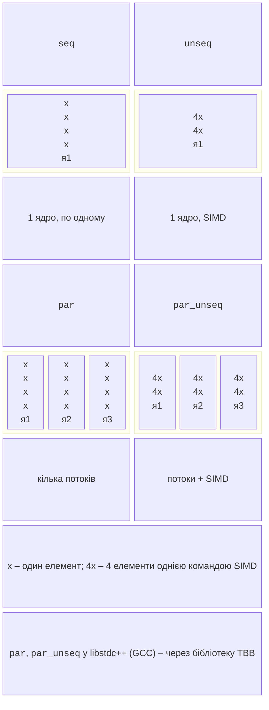

# Паралельні алгоритми та діагностика

## Паралельні алгоритми стандартної бібліотеки

З C++17 більшість алгоритмів заголовків `<algorithm>` і `<numeric>` приймають першим аргументом **політику виконання** (*execution policy*) із заголовка `<execution>` (<https://en.cppreference.com/w/cpp/algorithm/execution_policy_tag_t>), як показано на рис. 9.7:

- `std::execution::seq` – послідовно, як без політики;
- `std::execution::unseq` (C++20) – в одному потоці, але з дозволом векторизації SIMD (тема 7);
- `std::execution::par` – паралельно в кількох потоках;
- `std::execution::par_unseq` – у кількох потоках і з векторизацією.



Рис. 9.7. Політики виконання паралельних алгоритмів {.caption}

```cpp
std::sort(std::execution::par, v.begin(), v.end());
double sum = std::transform_reduce(std::execution::par_unseq,
    v.begin(), v.end(), 0.0, std::plus<>{},
    [](double x) { return x * x; });
std::for_each(std::execution::par, v.begin(), v.end(),
    [](double& x) { x = std::sqrt(x); });
```

Політика – це **дозвіл**, а не наказ: реалізація може виконати алгоритм і послідовно. Програміст гарантує, що функції не змінюють спільних даних без синхронізації, а для `par_unseq` і `unseq` – що вони взагалі не блокують м’ютекси й не виділяють пам’ять. Операція `std::reduce` і `transform_reduce` групує елементи в довільному порядку, тому має бути асоціативною й комутативною (як у PLINQ, тема 6). Виняток, що вилетів із функції паралельного алгоритму, викликає `std::terminate`.

**Паралельні алгоритми в GCC.** Бібліотека libstdc++ реалізує політики `par` і `par_unseq` через бібліотеку **TBB**: якщо під час компіляції знайдено заголовок `<tbb/tbb.h>`, обирається бекенд TBB, і програму потрібно компонувати з TBB (`-ltbb`); якщо заголовка немає, **без жодного попередження** обирається послідовний бекенд. В Ubuntu встановлюють пакет `libtbb-dev`, а в CMake підключають ціль `TBB::tbb`:

```cmake
find_package(TBB REQUIRED)
target_link_libraries(app PRIVATE TBB::tbb)
```

У MinGW, вбудованому в CLion, TBB немає, тому там `std::sort(std::execution::par, …)` виконується в одному потоці. Компілятор Microsoft Visual C++ (Visual Studio 2026) має власну реалізацію паралельних алгоритмів на пулі потоків Windows і TBB не потребує. У прикладі «Паралельні алгоритми STL» порівнюються обидва випадки.

### Модель std::execution у C++26

Стандарт C++26 додає бібліотеку **`std::execution`** (*senders/receivers*, пропозиція P2300): **планувальник** (*scheduler*) визначає, де виконується робота (пул потоків, GPU), **відправник** (*sender*) описує асинхронну операцію, а алгоритми `then`, `when_all`, `bulk` і `sync_wait` будують з них конвеєр, приблизно як `ContinueWith` і `Task.WhenAll` у TPL. Станом на вересень 2026 року бібліотека libstdc++ GCC 15 і GCC 16 цієї моделі не реалізує (макрос `__cpp_lib_senders` не визначено). Спробувати її можна за допомогою еталонної реалізації NVIDIA stdexec. У курсі ця модель розглядається лише оглядово.

## Пошук помилок: ThreadSanitizer і налагоджувач

Гонитва даних може роками не проявлятися й з’явитися на іншому процесорі чи з іншими ключами компілятора. **ThreadSanitizer** (TSan) вбудовує в програму перевірку кожного звернення до пам’яті й повідомляє про гонитви, зокрема ті, що не змінили результату (<https://gcc.gnu.org/onlinedocs/gcc/Instrumentation-Options.html>). Програму збирають з ключем `-fsanitize=thread` і налагоджувальною інформацією `-g`:

```bash
cmake -S . -B build/tsan -G Ninja -DCMAKE_BUILD_TYPE=Debug \
      -DCMAKE_CXX_FLAGS="-fsanitize=thread -g -O1"
cmake --build build/tsan
./build/tsan/bank
```

Під час гонитви TSan виводить блок `WARNING: ThreadSanitizer: data race` з двома стеками викликів: запис в одному потоці й попереднє читання або запис в іншому, з назвами файлів і номерами рядків, а також місце створення потоків (рис. 9.8). Програма з TSan працює в 5–15 разів повільніше й потребує більше пам’яті, тому її використовують лише для тестів. ThreadSanitizer працює в Linux (зокрема у WSL2) і macOS; у MinGW для Windows його немає.

::: info Знімок екрана
Ubuntu terminal: bank example built with `-fsanitize=thread -g -O1`; block "WARNING: ThreadSanitizer: data race" with two stack traces and file:line
:::

Рис. 9.8. Звіт ThreadSanitizer {.caption}

**Налагодження в CLion.** Точка зупину (*breakpoint*) у функції потоку зупиняє програму, коли її досягне будь-який потік. Вікно *Debug* має вкладки *Frames* (стек вибраного потоку і список потоків), *Variables*, *Threads* і *Parallel Stacks* – стеки викликів усіх потоків в одній схемі (<https://www.jetbrains.com/help/clion/debugging-code.html>). Для пулу потоків видно, що більшість робітників чекають у `condition_variable::wait`, а один виконує задачу (рис. 9.9).

::: info Знімок екрана
CLion: breakpoint in `count_primes` of the thread pool example → Debug tool window, Frames tab with the thread list (and Parallel Stacks tab)
:::

Рис. 9.9. Потоки в налагоджувачі CLion {.caption}

## Вимірювання продуктивності

Для вимірювання часу в C++ використовують годинник **`std::chrono::steady_clock`**, який ніколи не йде назад (на відміну від `system_clock`, який коригується синхронізацією часу); різницю двох моментів перетворюють на `std::chrono::duration<double, std::milli>` (приклади програм). Методика та сама, що в темі 1: конфігурація Release (`-O2` або `-O3`), прогрівання (у C++ немає JIT, але є «холодні» кеш і сторінки пам’яті), медіана кількох запусків. Без оптимізації (`-O0`, профіль Debug) код C++ повільніший у кілька разів: у прикладі «Паралельна сума вектора» послідовний час зростає з 134 до 1081 мс. Функції форматування `std::format` і `std::println` не залежать від регіональних налаштувань, тому дробові числа виводяться з крапкою.

**Лічильники `perf`.** У Linux утиліта `perf stat` (<https://man7.org/linux/man-pages/man1/perf-stat.1.html>) запускає програму й показує апаратні та програмні лічильники: використаний процесорний час (`task-clock`), кількість перемикань контексту й міграцій потоків між ядрами, а також загальний час (рис. 9.10). Відношення `task-clock` до загального часу показує, скільки процесорів у середньому було завантажено:

```bash
sudo apt install -y linux-tools-common linux-tools-$(uname -r)
perf stat -e task-clock,context-switches,cpu-migrations \
    ./build/release/parallel_sum
```

У WSL2 пакет `linux-tools` для ядра Microsoft зазвичай недоступний, тому `perf` запускають на звичайній установці Ubuntu, у віртуальній машині або на вузлі кластера (тема 13).

::: info Знімок екрана
Ubuntu (VM or cluster node): `perf stat -e task-clock,context-switches,cpu-migrations ./build/release/parallel_sum`; counters, "CPUs utilized", "seconds time elapsed"
:::

Рис. 9.10. Статистика `perf stat` {.caption}
