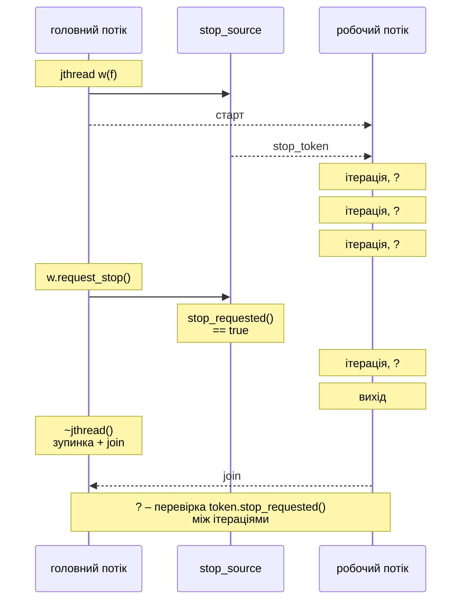
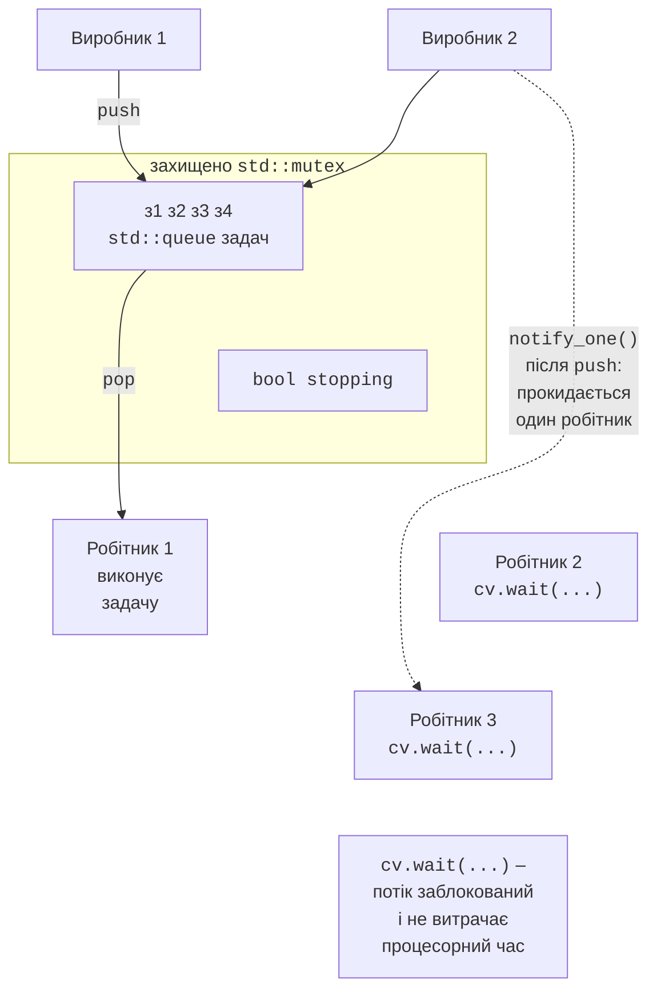

# Потоки та синхронізація в C++

## Потоки std::thread і std::jthread

Бібліотека потоків C++ (<https://en.cppreference.com/w/cpp/thread>) з’явилася в C++11 і працює поверх потоків операційної системи (у Linux – POSIX threads). Об’єкт **`std::thread`** запускає потік одразу під час створення. Функцію потоку й аргументи передають конструктору:

```cpp
void sum_range(int from, int to, long long& result) {
    long long sum = 0;
    for (int i = from; i <= to; ++i) sum += i;
    result = sum;
}

long long a = 0, b = 0;
std::thread t1(sum_range, 1, 50, std::ref(a));      // функція
std::thread t2([&b] { sum_range(51, 100, b); });    // лямбда
t1.join();                                          // чекати
t2.join();
std::println("{} + {} = {}", a, b, a + b);  // 1275 + 3775 = 5050
```

Правила роботи з `std::thread`:

- метод `join()` чекає завершення потоку; `detach()` від’єднує потік, і далі він працює самостійно (його неможливо дочекатися, тому `detach` використовують рідко);
- якщо об’єкт `std::thread` руйнується, поки потік **приєднуваний** (`joinable()`), тобто не викликано ні `join`, ні `detach`, програма аварійно завершується через `std::terminate`;
- аргументи **копіюються** в потік; щоб передати посилання, використовують `std::ref`, а лямбда захоплює посилання через `[&]`. Посилання не повинно пережити об’єкт, на який посилається;
- виняток, не перехоплений у функції потоку, також викликає `std::terminate`.

`std::thread::hardware_concurrency()` повертає кількість логічних процесорів (на i9-11900KF – 16) або 0, якщо вона невідома. Змінна з модифікатором `thread_local` має окрему копію в кожному потоці, наприклад генератор випадкових чисел: `thread_local std::mt19937 gen(seed);`.

### Потік std::jthread і кооперативна зупинка

C++20 додав клас **`std::jthread`** (*joining thread*), який виправляє дві незручності `std::thread` (<https://en.cppreference.com/w/cpp/thread/jthread>):

- деструктор сам викликає `request_stop()` і `join()`, тому забути `join` неможливо;
- потік має вбудований механізм **кооперативної зупинки** (*cooperative cancellation*), аналог `CancellationToken` у C# (тема 5).

Якщо першим параметром функції потоку є `std::stop_token`, `jthread` передає його автоматично (рис. 9.5). Спільний стан зупинки зберігає `std::stop_source`; метод `request_stop()` лише встановлює прапорець, а потік сам перевіряє `stop_requested()` у зручний момент:

```cpp
std::jthread worker([](std::stop_token token) {
    int iterations = 0;
    while (!token.stop_requested()) {    // перевірка між порціями
        ++iterations;
        std::this_thread::sleep_for(10ms);
    }
    std::println("Зупинено після {} ітерацій", iterations);
});
std::this_thread::sleep_for(100ms);
worker.request_stop();       // необов’язково: це зробить деструктор
```



Рис. 9.5. Кооперативна зупинка `std::jthread` {.caption}

Умовна змінна `std::condition_variable_any` має перевантаження `wait(lock, token, pred)`, яке прокидається після `request_stop()`.

## М’ютекси та блокування

**Стан гонитви** (тема 3) у C++ ще небезпечніший, ніж у C#: одночасний запис у змінну з кількох потоків без синхронізації – **невизначена поведінка** (*undefined behavior*), і оптимізувальний компілятор може отримати будь-який результат. Спільні дані захищають **м’ютексом** `std::mutex`. Викликати `lock()` і `unlock()` вручну не рекомендується: якщо між ними виникне виняток, м’ютекс залишиться заблокованим. Замість цього використовують класи-**охоронці** (RAII), які звільняють м’ютекс у деструкторі:

- `std::lock_guard` – найпростіший: блокує в конструкторі, звільняє в деструкторі;
- `std::unique_lock` – можна звільнити й знову заблокувати, перенести в іншу змінну; потрібен для умовних змінних;
- `std::scoped_lock` (C++17) – блокує **кілька** м’ютексів одночасно за алгоритмом уникнення взаємоблокування, тому порядок аргументів не важливий;
- `std::shared_lock` разом із `std::shared_mutex` – блокування «читачі–записувач»: багато потоків читають одночасно, записує лише один (аналог `ReaderWriterLockSlim`).

Наприклад, кеш читає дані під `std::shared_lock lock(mutex_)`, а записує під `std::unique_lock lock(mutex_)`; м’ютекс оголошують `mutable`, щоб блокувати його в константних методах. Переказ між двома рахунками, кожен зі своїм м’ютексом, записують як `std::scoped_lock lock(from.m, to.m)`: два зустрічні перекази не спричинять взаємоблокування (приклад «Банківський рахунок»).

## Умовні змінні, семафори, latch і barrier

**Умовна змінна** `std::condition_variable` дозволяє потоку заснути, доки інший потік не змінить спільний стан, і не витрачати процесорний час на активне очікування (<https://en.cppreference.com/w/cpp/thread/condition_variable>). Вона завжди працює разом із м’ютексом і **предикатом** – умовою, на яку чекають:

```cpp
std::mutex m;
std::condition_variable cv;
std::queue<int> jobs;

// Споживач: заснути, доки черга порожня.
std::unique_lock lock(m);
cv.wait(lock, [] { return !jobs.empty(); });
int job = jobs.front();
jobs.pop();

// Виробник: змінити стан під м’ютексом, потім сповістити.
{
    std::lock_guard lock(m);
    jobs.push(42);
}
cv.notify_one();
```

Метод `wait(lock, pred)` атомарно звільняє м’ютекс і засинає; після пробудження знову блокує м’ютекс і перевіряє предикат. Предикат обов’язковий: потік може прокинутися **хибно** (*spurious wakeup*) без сповіщення, а сповіщення, надіслане до початку очікування, втрачається. Метод `notify_one()` будить один потік, `notify_all()` – усі. На умовній змінній будують черги задач і пули потоків (рис. 9.6).



Рис. 9.6. Черга задач на умовній змінній {.caption}

C++20 додав ще три примітиви:

- **`std::counting_semaphore<N>`** – лічильник дозволів: `acquire()` зменшує його або чекає, `release()` збільшує; `std::binary_semaphore` має один дозвіл. Семафор обмежує кількість потоків, які одночасно використовують ресурс, і не має власника: звільнити його може інший потік;
- **`std::latch`** – одноразова «засувка»: `count_down()` зменшує лічильник, а `wait()` чекає, доки він стане нулем (синхронний старт або очікування завершення N робітників);
- **`std::barrier`** – багаторазовий бар’єр для групи з відомої кількості потоків: `arrive_and_wait()` чекає, доки всі потоки групи дійдуть до бар’єра, після чого починається наступна фаза (покоління гри «Життя», ітерації чисельного методу).

Засоби синхронізації C++ та їхні аналоги в .NET наведено в табл. 9.2.

Таблиця 9.2. Засоби синхронізації C++ та їхні аналоги в .NET {.caption}

| **C++ (заголовок)** | **.NET (теми 3–4)** | **Призначення** |
| --- | --- | --- |
| `mutex` + `lock_guard` (`<mutex>`) | `lock`, `Monitor` | взаємне виключення |
| `scoped_lock` | упорядковане блокування | кілька м’ютексів без взаємоблокування |
| `shared_mutex` (`<shared_mutex>`) | `ReaderWriterLockSlim` | читачі–записувач |
| `condition_variable` | `Monitor.Wait/Pulse` | очікування умови |
| `counting_semaphore` (`<semaphore>`) | `SemaphoreSlim` | обмеження кількості потоків |
| `latch` (`<latch>`) | `CountdownEvent` | очікування N подій |
| `barrier` (`<barrier>`) | `Barrier` | фази групи потоків |
| `atomic` (`<atomic>`) | `Interlocked` | атомарні операції |
| `stop_token` (`<stop_token>`) | `CancellationToken` | кооперативна зупинка |
