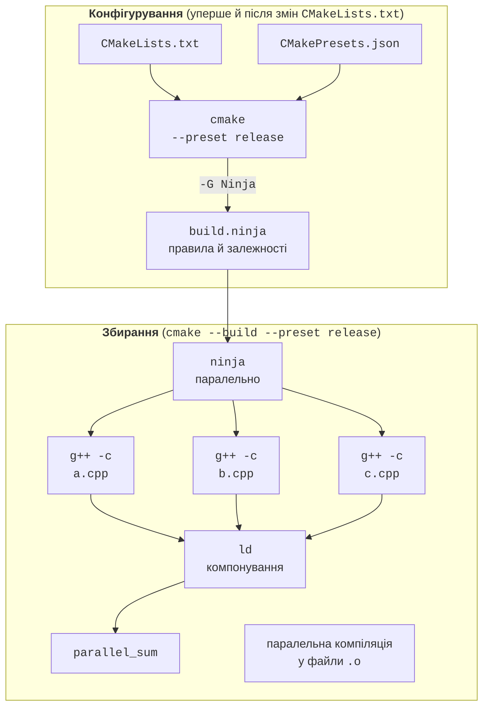

# GCC, CMake, Ninja і CLion

## Інструменти: GCC, CMake, Ninja і CLion

Модуль 2 курсу присвячено високопродуктивним обчисленням мовою C++. У темах 1–7 паралельні програми писалися мовою C#, де середовище виконання .NET саме керує пам’яттю, пулом потоків і JIT-компіляцією. Програма мовою C++ компілюється безпосередньо в машинний код: немає збирача сміття і JIT-прогрівання, компілятор може застосувати векторизацію під конкретний процесор, а програміст повністю керує розміщенням даних. Саме тому C++ разом із C і Fortran – основна мова бібліотек OpenMP, CUDA і MPI (теми 10–12).

Практичні роботи виконуються в **Ubuntu 26.04 LTS** (у WSL2 або на вузлах кластера, тема 13) з такими інструментами (табл. 9.1):

- **GCC** (*GNU Compiler Collection*, <https://gcc.gnu.org/onlinedocs/>) – компілятор `g++`;
- **CMake** (<https://cmake.org/cmake/help/latest/>) – **генератор систем збирання**: за описом проєкту `CMakeLists.txt` створює файли для конкретного інструмента збирання;
- **Ninja** (<https://ninja-build.org/manual.html>) – швидкий інструмент збирання, який виконує команди компіляції паралельно;
- **GDB** – налагоджувач; **TBB** (*Threading Building Blocks*) – бібліотека паралелізму Intel/UXL, потрібна паралельним алгоритмам стандартної бібліотеки GCC.

Таблиця 9.1. Інструменти C++ курсу (станом на вересень 2026 року) {.caption}

| **Інструмент** | **Ubuntu 26.04 LTS (пакет apt)** | **Windows: CLion 2026.2 (вбудовано)** |
| --- | --- | --- |
| Компілятор | `g++` 15.2.0 (GCC 15) | MinGW-w64 GCC 15.2.0 |
| CMake | `cmake` 4.2.3 | CMake 4.3.1 |
| Ninja | `ninja-build` 1.13.2 | Ninja 1.13.2 |
| Налагоджувач | `gdb` 17.1 | GDB 17.1 |
| TBB | `libtbb-dev` 2022.3.0 | немає |

В Ubuntu усе потрібне встановлюється однією командою:

```bash
sudo apt update
sudo apt install -y build-essential cmake ninja-build gdb libtbb-dev
g++ --version && cmake --version && ninja --version
```

**Стандарт мови.** GCC 15 за замовчуванням компілює в режимі `-std=gnu++17`, тому стандарт потрібно задавати явно. Можливості C++20 і C++23, які використовуються в темі (`std::print`, `std::jthread`, `std::move_only_function`), GCC 15 підтримує, а з ключем `-std=c++26` доступна частина можливостей C++26 (<https://gcc.gnu.org/projects/cxx-status.html>). У GCC 16 (травень 2026 року) стандартом за замовчуванням став C++20, а його підтримку в libstdc++ оголошено стабільною. В Ubuntu 26.04 GCC 16 доступний лише як попередня збірка `g++-16`, тому в курсі використовується GCC 15 і стандарт C++23. Усі приклади теми компілюються також з `-std=c++26`.

**JetBrains CLion** (<https://www.jetbrains.com/clion/>) – середовище розробки C++ від JetBrains, безплатне для некомерційного використання й навчання. Проєкти CLion – це проєкти CMake: середовище читає `CMakeLists.txt`, тому той самий проєкт збирається з командного рядка без змін. Компілятор, CMake і налагоджувач CLion бере з **тулчейна** (*toolchain*), який задають у *File → Settings → Build, Execution, Deployment → Toolchains* (рис. 9.1):

- **MinGW** (*bundled*) – GCC для Windows, вбудований у CLion; зручний для першого знайомства;
- **WSL** – компілятор і CMake з Ubuntu у WSL2 (<https://www.jetbrains.com/help/clion/how-to-use-wsl-development-environment-in-product.html>): CLion працює у Windows, а програма збирається й запускається в Linux. Цей тулчейн основний, бо ThreadSanitizer, `perf` і TBB доступні лише в Linux.

::: info Знімок екрана
CLion: File → Settings → Build, Execution, Deployment → Toolchains; WSL toolchain Ubuntu-26.04 with detected CMake, C/C++ compilers, GDB
:::

Рис. 9.1. Тулчейн WSL у CLion {.caption}

## Збирання проєкту: CMake і Ninja

Великий проєкт C++ складається з багатьох файлів `.cpp`, кожен компілюється окремо в об’єктний файл, а потім компонувальник (*linker*) об’єднує їх у виконуваний файл. Писати ці команди вручну незручно, тому збирання виконується у два етапи (рис. 9.2):

1. **конфігурування**: `cmake` читає `CMakeLists.txt`, знаходить компілятор і бібліотеки й генерує файл `build.ninja` з правилами збирання;
2. **збирання**: `ninja` порівнює час зміни файлів, перекомпільовує лише змінені й виконує незалежні команди компіляції паралельно (за замовчуванням – за кількістю процесорів).



Рис. 9.2. Процес збирання C++ проєкту {.caption}

### Файл CMakeLists.txt

Проєкт багатопотокової програми (його використовує приклад «Паралельна сума вектора»):

```cmake
cmake_minimum_required(VERSION 3.30)
project(ParallelSum LANGUAGES CXX)

find_package(Threads REQUIRED)

add_executable(parallel_sum main.cpp)
target_compile_features(parallel_sum PRIVATE cxx_std_23)
target_compile_options(parallel_sum PRIVATE
    -Wall -Wextra "$<$<CONFIG:Release>:-O3;-march=native>")
target_link_libraries(parallel_sum PRIVATE Threads::Threads)

# std::print у MinGW (Windows) потребує додаткової бібліотеки.
if(MINGW)
    target_link_libraries(parallel_sum PRIVATE stdc++exp)
endif()
```

- `cmake_minimum_required` – мінімальна версія CMake; ознака `cxx_std_26` з’явилася у версії 3.30.
- `project` – назва проєкту й мови.
- `find_package(Threads)` – знаходить бібліотеку потоків платформи й створює **імпортовану ціль** `Threads::Threads` (<https://cmake.org/cmake/help/latest/module/FindThreads.html>); у Linux вона додає ключ `-pthread`.
- `add_executable` – **ціль** (*target*): виконуваний файл і його вихідні файли.
- `target_compile_features(… cxx_std_23)` – вимога до стандарту; CMake сам додасть `-std=gnu++23`.
- `target_compile_options` – ключі компілятора. **Генераторний вираз** (*generator expression*) `$<$<CONFIG:Release>:…>` додає `-O3` (найвищий рівень оптимізації) і `-march=native` (команди поточного процесора, зокрема AVX-512) лише для конфігурації Release. Програма з `-march=native` може не запуститися на старішому процесорі.
- `target_link_libraries` – бібліотеки, з якими компонується ціль; умова `if(MINGW)` додає бібліотеку лише для компілятора MinGW.

Слово `PRIVATE` означає, що налаштування стосуються лише цієї цілі й не передаються цілям, які від неї залежать (`PUBLIC` – і їм також). Сучасний CMake описує все через цілі, а не через глобальні змінні `CMAKE_CXX_FLAGS`.

### Пресети CMakePresets.json

Параметри конфігурування (генератор, тип збирання, каталог) зручно зберегти у файлі `CMakePresets.json` поруч із `CMakeLists.txt` (<https://cmake.org/cmake/help/latest/manual/cmake-presets.7.html>). Тоді всі члени команди, CLion і сервер неперервної інтеграції збирають проєкт однаково:

```json
{
  "version": 6,
  "configurePresets": [
    {
      "name": "debug",
      "generator": "Ninja",
      "binaryDir": "${sourceDir}/build/debug",
      "cacheVariables": { "CMAKE_BUILD_TYPE": "Debug" }
    },
    {
      "name": "release",
      "inherits": "debug",
      "binaryDir": "${sourceDir}/build/release",
      "cacheVariables": { "CMAKE_BUILD_TYPE": "Release" }
    }
  ],
  "buildPresets": [
    { "name": "debug", "configurePreset": "debug" },
    { "name": "release", "configurePreset": "release" }
  ]
}
```

Версія схеми 6 підтримується CMake від 3.25, тобто і в Ubuntu, і в CLion. Пресет `release` успадковує генератор від `debug` і змінює лише тип збирання та каталог. Збирання з командного рядка (рис. 9.3):

```bash
cmake --list-presets               # доступні пресети
cmake --preset release             # конфігурування: build/release
cmake --build --preset release     # збирання Ninja
./build/release/parallel_sum       # запуск
```

Без пресетів ті самі дії виконують `cmake -S . -B build -G Ninja -DCMAKE_BUILD_TYPE=Release` і `cmake --build build`.

::: info Знімок екрана
Ubuntu 26.04 terminal: `cmake --preset release`, then `cmake --build --preset release`; Ninja progress lines `[1/4]`…`[4/4]` and the final link line
:::

Рис. 9.3. Збирання з командного рядка {.caption}

**Профілі CMake у CLion.** CLion конфігурує проєкт автоматично. Кожен **профіль CMake** (*CMake profile*) має поля *Name*, *Build type*, *Toolchain*, *Generator*, *CMake options* і *Build directory* і задається в *Settings → Build, Execution, Deployment → CMake* (рис. 9.4). Кнопкою «+» додають профіль *Release* до стандартного *Debug*; поточний профіль обирають на панелі інструментів. Пресети з `CMakePresets.json` CLion показує як окремі профілі, які спочатку вимкнені: їх вмикають прапорцем *Enable profile* (<https://www.jetbrains.com/help/clion/cmake-profile.html>).

::: info Знімок екрана
CLion: Settings → Build, Execution, Deployment → CMake; profiles Debug and Release, Toolchain WSL, Generator Ninja, CMake options field
:::

Рис. 9.4. Профілі CMake Debug і Release з Ninja {.caption}

::: tip Порада
У MinGW (Windows) функції `std::print` і `std::println` потребують додаткової бібліотеки `stdc++exp`, інакше компонувальник повідомляє про `std::__open_terminal`. У Linux вона не потрібна.
:::
