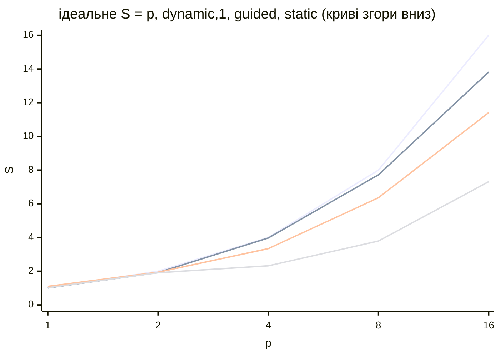

# Приклади та типові помилки

## Приклади програм

Усі програми зібрано компілятором GCC 15.2 (MinGW-w64 з CLion 2026.2.1) з ключами `-std=c++23 -O2 -fopenmp` і запущено на Intel Core i9-11900KF (8 ядер, 16 логічних процесорів) у Windows 11; час між запусками коливається на 10–20 %. В Ubuntu програми збираються без змін (ключ `-lstdc++exp` потрібен лише MinGW).

### Hello OpenMP

Проєкт складається з `CMakeLists.txt` (наведено в розділі «Проєкт CMake») і файлу `main.cpp`. Програма виводить версію OpenMP, кількість процесорів і вітання з кожного потоку команди з 8 потоків.

```cpp
#include <omp.h>
#include <print>

int main()
{
    std::println("OpenMP {}, процесорів: {}, потоків: {}",
                 _OPENMP, omp_get_num_procs(),
                 omp_get_max_threads());

    // Послідовна частина: працює лише головний потік.
    int answer = 42;

    #pragma omp parallel num_threads(8)
    {
        // Змінні, оголошені всередині області, – приватні.
        int id = omp_get_thread_num();
        int count = omp_get_num_threads();
        #pragma omp critical
        std::println("Hello from thread {} of {} (answer = {})",
                     id, count, answer);
    }

    std::println("Знову один потік: {} з {}",
                 omp_get_thread_num(), omp_get_num_threads());
}
```

Проєкт збирається командами `cmake -S . -B build -G Ninja` і `cmake --build build` (тема 9). Змінна `answer` спільна (оголошена до області), `id` і `count` – приватні, а `critical` не дає рядкам різних потоків перемішатися. Результат (порядок рядків щоразу інший, 5 рядків пропущено):

```
OpenMP 201511, процесорів: 16, потоків: 16
Hello from thread 4 of 8 (answer = 42)
Hello from thread 5 of 8 (answer = 42)
Hello from thread 2 of 8 (answer = 42)
…
Hello from thread 3 of 8 (answer = 42)
Знову один потік: 0 з 1
```

### Інтеграл і число π

Програма обчислює $\pi = \int_{0}^{1} 4 / (1 + x^{2}) \mathrm{d} x$ методом середніх прямокутників з $10^{9}$ кроків, вимірює медіану п’яти запусків для 1, 2, 4, 8 і 16 потоків і виводить прискорення, ефективність і похибку.

```cpp
#include <omp.h>
#include <algorithm>
#include <cmath>
#include <numbers>
#include <print>

const long long Steps = 1'000'000'000;

// π як інтеграл 4/(1 + x²) на [0; 1] методом середніх прямокутників.
double ComputePi(int threads)
{
    const double h = 1.0 / Steps;
    double sum = 0.0;
    #pragma omp parallel for num_threads(threads) reduction(+:sum)
    for (long long i = 0; i < Steps; ++i)
    {
        double x = (i + 0.5) * h;
        sum += 4.0 / (1.0 + x * x);
    }
    return sum * h;
}

// Медіана п’яти вимірювань за годинником omp_get_wtime.
double MedianTime(int threads, double& pi)
{
    double t[5];
    for (double& ti : t)
    {
        double start = omp_get_wtime();
        pi = ComputePi(threads);
        ti = omp_get_wtime() - start;
    }
    std::sort(t, t + 5);
    return t[2];
}

int main()
{
    int maxThreads = omp_get_num_procs();
    double pi = 0.0;
    ComputePi(1);                               // прогрівання
    ComputePi(maxThreads);
    double t1 = MedianTime(1, pi);

    std::println("Кроків: {}, процесорів: {}", Steps, maxThreads);
    std::println("{:>3} {:>9} {:>6} {:>6} {:>14}",
                 "p", "Tp, с", "S", "E", "похибка");
    for (int p = 1; p <= maxThreads; p *= 2)
    {
        double tp = p == 1 ? t1 : MedianTime(p, pi);
        double s = t1 / tp;
        std::println("{:>3} {:>9.3f} {:>6.2f} {:>5.0f}% {:>14.2e}",
                     p, tp, s, 100 * s / p,
                     std::abs(pi - std::numbers::pi));
    }
}
```

Змінні `x` і `i` приватні, `h` – спільна константа, а `sum` має в кожному потоці власну копію, яку наприкінці додає клауза `reduction`. Результат:

```
Кроків: 1000000000, процесорів: 16
  p     Tp, с      S      E        похибка
  1     0.831   1.00   100%       1.78e-13
  2     0.658   1.26    63%       1.08e-13
  4     0.397   2.09    52%       2.80e-14
  8     0.209   3.98    50%       2.40e-14
 16     0.114   7.29    46%       3.95e-14
```

Похибка відрізняється для різних $p$, бо змінюється порядок додавання дійсних чисел. Ефективність лише близько 50 %: без прив’язки Windows розміщує потоки `libgomp` на обох логічних процесорах одного ядра, а ділення дійсних чисел від SMT не прискорюється. Та сама програма, зібрана Clang і запущена з `OMP_PLACES=cores` і `OMP_PROC_BIND=spread`, масштабується майже лінійно до 8 потоків, а 16 потоків на 8 ядрах нічого не додають:

```
 p     Tp, с      S      E        похибка
 1     0.886   1.00   100%       1.78e-13
 2     0.476   1.86    93%       1.08e-13
 4     0.229   3.86    97%       2.80e-14
 8     0.115   7.68    96%       2.44e-14
16     0.118   7.53    47%       3.95e-14
```

### Множина Мандельброта і schedule

Програма обчислює кількість ітерацій для зображення 2400×1600 точок множини Мандельброта (не більше 2000 ітерацій на точку). Рядки, що перетинають множину, обчислюються в сотні разів довше за рядки на краях, тому ітерації циклу нерівномірні. Вид розподілу змінюється функцією `omp_set_schedule` для `schedule(runtime)`; для кожного виду виводиться медіана трьох запусків, прискорення відносно послідовної програми, відношення часу роботи найменш і найбільш завантаженого потоку $T_{\text{min}} / T_{\text{max}}$ і перевірка загальної кількості ітерацій.

```cpp
#include <omp.h>
#include <algorithm>
#include <print>
#include <string>
#include <vector>

const int Width = 2400, Height = 1600, MaxIter = 2000;

// Кількість ітерацій для рядка y: чорні точки множини – найдовші.
long long Row(int y)
{
    long long total = 0;
    double ci = -1.0 + 2.0 * y / Height;
    for (int x = 0; x < Width; ++x)
    {
        double cr = -2.2 + 3.0 * x / Width;
        double zr = 0, zi = 0;
        int k = 0;
        while (k < MaxIter && zr * zr + zi * zi <= 4.0)
        {
            double t = zr * zr - zi * zi + cr;
            zi = 2 * zr * zi + ci;
            zr = t;
            ++k;
        }
        total += k;
    }
    return total;
}

// Розподіл рядків задає schedule(runtime) – див. omp_set_schedule.
long long Render(std::vector<double>& busy)
{
    long long total = 0;
    #pragma omp parallel reduction(+:total)
    {
        double start = omp_get_wtime();
        #pragma omp for schedule(runtime) nowait
        for (int y = 0; y < Height; ++y)
            total += Row(y);
        busy[omp_get_thread_num()] = omp_get_wtime() - start;
    }
    return total;
}

struct Mode { std::string name; omp_sched_t kind; int chunk; };

int main()
{
    int p = omp_get_max_threads();
    double start = omp_get_wtime();
    long long expected = 0;
    for (int y = 0; y < Height; ++y) expected += Row(y);
    double t1 = omp_get_wtime() - start;
    std::println("Послідовно: {:.3f} с, ітерацій {}", t1, expected);
    std::println("{:<12} {:>7} {:>6} {:>10}  {}",
                 "schedule", "T, с", "S", "Tmin/Tmax", "перевірка");

    std::vector<Mode> modes = {
        {"static", omp_sched_static, 0},
        {"static,8", omp_sched_static, 8},
        {"dynamic,1", omp_sched_dynamic, 1},
        {"guided", omp_sched_guided, 0}};
    for (const Mode& m : modes)
    {
        omp_set_schedule(m.kind, m.chunk);
        std::vector<double> busy(p);
        double t[3];
        long long total = 0;
        for (double& ti : t)
        {
            double s = omp_get_wtime();
            total = Render(busy);
            ti = omp_get_wtime() - s;
        }
        std::sort(t, t + 3);
        auto [lo, hi] = std::minmax_element(busy.begin(), busy.end());
        std::println("{:<12} {:>7.3f} {:>6.2f} {:>10.2f}  {}",
                     m.name, t[1], t1 / t[1], *lo / *hi,
                     total == expected ? "так" : "НІ");
    }
}
```

Клауза `nowait` прибирає бар’єр, тому в `busy` потрапляє час роботи самого потоку; кожен потік записує свій елемент один раз, тому хибного розділення немає. Результат для 16 потоків:

```
Послідовно: 5.423 с, ітерацій 1955911157
schedule        T, с      S  Tmin/Tmax  перевірка
static         0.757   7.16       0.01  так
static,8       0.379  14.31       0.92  так
dynamic,1      0.376  14.42       1.00  так
guided         0.443  12.24       0.78  так
```

З `static` кожен потік отримує 100 суміжних рядків; потоки з рядками на краях зображення завершують роботу за 1 % часу найповільнішого. Малі порції (`static,8`, `dynamic`) перемішують «важкі» й «легкі» рядки, і завантаження вирівнюється. Прискорення 14,4 на 8 ядрах пояснюється тим, що цей цикл майже не звертається до пам’яті, і логічні процесори SMT працюють майже як окремі ядра. Запуск для 1–16 потоків (`OMP_NUM_THREADS`) дав графік прискорення на рис. 10.11 (розподіл `dynamic` із порцією 16 показав майже той самий час, що `dynamic,1`).



Рис. 10.11. Прискорення програми «Множина Мандельброта» (i9-11900KF, 2400×1600) {.caption}

### Швидке сортування задачами

Програма сортує 50 мільйонів випадкових чисел `int` рекурсивним швидким сортуванням із розбиттям Гоара. Дві половини сортуються як задачі OpenMP, якщо фрагмент довший за поріг, інакше – звичайними рекурсивними викликами. Для порівняння виводиться час `std::sort` і сортування без задач.

```cpp
#include <omp.h>
#include <algorithm>
#include <print>
#include <random>
#include <utility>
#include <vector>

// Розбиття Гоара навколо середнього елемента.
long long Partition(std::vector<int>& a, long long lo, long long hi)
{
    int pivot = a[lo + (hi - lo) / 2];
    long long i = lo - 1, j = hi + 1;
    while (true)
    {
        do ++i; while (a[i] < pivot);
        do --j; while (a[j] > pivot);
        if (i >= j) return j;
        std::swap(a[i], a[j]);
    }
}

// Задачі створюються лише для фрагментів, довших за поріг.
void QuickSort(std::vector<int>& a, long long lo, long long hi,
               long long cutoff)
{
    if (lo >= hi) return;
    long long mid = Partition(a, lo, hi);
    if (hi - lo > cutoff)
    {
        #pragma omp task shared(a)
        QuickSort(a, lo, mid, cutoff);
        #pragma omp task shared(a)
        QuickSort(a, mid + 1, hi, cutoff);
        #pragma omp taskwait
    }
    else
    {
        QuickSort(a, lo, mid, cutoff);
        QuickSort(a, mid + 1, hi, cutoff);
    }
}

double SortTime(std::vector<int> a, long long cutoff)
{
    double start = omp_get_wtime();
    #pragma omp parallel
    #pragma omp single
    QuickSort(a, 0, (long long)a.size() - 1, cutoff);
    double time = omp_get_wtime() - start;
    if (!std::is_sorted(a.begin(), a.end()))
        std::println(stderr, "Помилка: масив не впорядковано");
    return time;
}

int main()
{
    const int N = 50'000'000;
    std::mt19937 gen(2026);
    std::vector<int> data(N);
    for (int& x : data) x = (int)gen();

    std::vector<int> copy = data;
    double start = omp_get_wtime();
    std::sort(copy.begin(), copy.end());
    double tStd = omp_get_wtime() - start;
    std::println("N = {}, потоків: {}", N, omp_get_max_threads());
    std::println("std::sort: {:.3f} с", tStd);

    double t0 = SortTime(data, N);        // без задач
    std::println("{:>10} {:>8} {:>7}", "поріг", "T, с", "S");
    for (long long cutoff : {N, 1'000'000, 100'000, 10'000,
                             1'000, 100, 10})
    {
        double t = cutoff == N ? t0 : SortTime(data, cutoff);
        std::println("{:>10} {:>8.3f} {:>7.2f}", cutoff, t, t0 / t);
    }
}
```

Вектор `a` передано в задачі як `shared`: обидві задачі працюють із непересічними частинами того самого масиву, тому синхронізація не потрібна. Директиви `parallel` і `single` створюють команду потоків і першу задачу; інші потоки команди чекають на бар’єрі блоку `single` і виконують створені задачі. Функція `SortTime` отримує копію масиву, тому кожен поріг сортує однакові дані. Результат:

```
N = 50000000, потоків: 16
std::sort: 3.100 с
     поріг     T, с       S
  50000000    3.862    1.00
   1000000    0.709    5.45
    100000    0.683    5.65
     10000    0.696    5.55
      1000    0.729    5.30
       100    1.530    2.52
       10   10.068    0.38
```

Прискорення обмежене першими розбиттями: розбиття всього масиву виконується одним потоком (закон Амдала). Пороги від 1000 до 1 000 000 дають майже однаковий час, а при порозі 10 створюються мільйони дрібних задач, і сортування стає в 2,6 раза **повільнішим** за послідовне.

## Типові помилки

Найпоширеніші помилки програм OpenMP та способи їх виправлення зібрано в табл. 10.7.

Таблиця 10.7. Типові помилки в програмах OpenMP {.caption}

| **Проблема** | **Причина та виправлення** |
| --- | --- |
| програма працює в одному потоці, `omp_get_num_threads()` повертає 1 | OpenMP не ввімкнено (немає `-fopenmp` або `OpenMP::OpenMP_CXX`) чи виклик поза паралельною областю; перевірити макрос `_OPENMP` |
| `undefined reference to omp_get_thread_num` у MinGW | ключ `-fopenmp` не передано компонувальнику; додати `target_link_options(… -fopenmp)` |
| результат щоразу інший і неправильний | спільна змінна змінюється без синхронізації; `reduction`, `private` або змінна всередині циклу, перевірка з `default(none)` |
| паралельна версія повільніша за послідовну | малий обсяг роботи, `critical` у гарячому циклі, забагато задач; клауза `if`, `reduction`, поріг для задач |
| частина потоків простоює | нерівномірні ітерації зі `schedule(static)`; `dynamic` або `guided` |
| прискорення зупиняється на 3–5 | обмеження пропускною здатністю пам’яті, хибне розділення, NUMA; локальні змінні, перший дотик, `OMP_PROC_BIND=spread` |
| `libgomp: Affinity not supported on this configuration` | прив’язка в MinGW для Windows не працює; вимірювати в Linux або з Clang і `libomp` |
| час коротких фрагментів у Windows дорівнює 0 або 0,001 с | роздільна здатність `omp_get_wtime` у MinGW 1 мс; `std::chrono::steady_clock` |
| задача звертається до знищеної локальної змінної | немає `taskwait` чи `taskgroup` перед виходом з функції; дочекатися задач |
