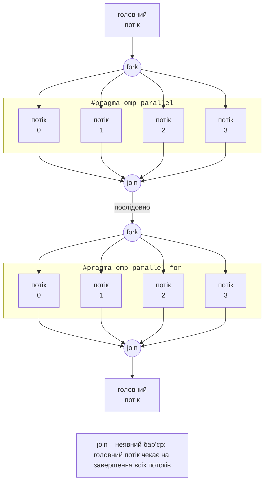

# Модель fork–join і паралельна область

## Модель fork–join і збирання програм OpenMP

**OpenMP** (*Open Multi-Processing*, <https://www.openmp.org/>) – відкритий стандарт паралельного програмування для систем зі спільною пам’яттю мовами C, C++ і Fortran. Стандарт розвиває консорціум OpenMP ARB (*Architecture Review Board*), до якого входять AMD, Intel, NVIDIA, Arm, IBM, HPE та інші. У темі 9 потоки створювалися явно (`std::thread`), а роботу між ними програміст ділив сам. OpenMP дозволяє розпаралелити наявну послідовну програму **директивами компілятора**: програміст позначає, **що** можна виконувати паралельно, а компілятор і бібліотека вирішують, **як** це зробити.

OpenMP складається з трьох частин:

- **директиви** (*directives*) `#pragma omp …` з **клаузами** (*clauses*), наприклад `#pragma omp parallel for reduction(+:sum)`;
- **бібліотека функцій** середовища виконання (*runtime library*) з файлу `<omp.h>`: `omp_get_thread_num()`, `omp_get_wtime()` тощо;
- **змінні середовища** (*environment variables*): `OMP_NUM_THREADS`, `OMP_SCHEDULE`, `OMP_PROC_BIND` та інші, які змінюють поведінку програми без перекомпіляції.

Програма OpenMP працює за моделлю **fork–join** (рис. 10.1). Виконання починає один **головний потік** (*primary thread*). Дійшовши до паралельної області, він **розгалужується** (*fork*): створює **команду** (*team*) потоків, і всі вони виконують код області. У кінці області є **неявний бар’єр** (*implicit barrier*): головний потік чекає, поки завершаться всі потоки команди (*join*), і далі програма знову виконується послідовно. Середовище виконання не знищує потоки після області, а використовує їх повторно, тому наступна паралельна область починається швидко.



Рис. 10.1. Модель fork–join {.caption}

Якщо компілятор не підтримує OpenMP або його не ввімкнено, директиви `#pragma` ігноруються і програма залишається правильною послідовною: розпаралелювання поступове, а послідовну версію легко отримати для порівняння.

### Версії стандарту та компілятори

Останні версії специфікації (<https://www.openmp.org/specifications/>): OpenMP 5.2 (листопад 2021 року) і OpenMP 6.0 (листопад 2024 року); у липні 2026 року опубліковано проєкт OpenMP 6.1 для публічного обговорення. Компілятори впроваджують нові можливості поступово, а версію, яку компілятор підтримує повністю, повідомляє макрос `_OPENMP` – дата специфікації у форматі `ррррмм` (табл. 10.1).

Таблиця 10.1. Підтримка OpenMP компіляторами {.caption}

| **Компілятор** | **`_OPENMP`** | **Підтримка (вересень 2026 року)** |
| --- | --- | --- |
| GCC 15.2 (Ubuntu 26.04, MinGW у CLion) | `201511` | OpenMP 4.5 повністю, більшість можливостей 5.0 і 5.1, частина 5.2 і 6.0; бібліотека `libgomp` |
| GCC 16.2 | `202111` | макрос відповідає OpenMP 5.2; попередження про застарілі директиви |
| Clang 23 (LLVM) | `202011` | OpenMP 5.1; бібліотека `libomp` |

Для GCC підтримку вмикає ключ `-fopenmp`: компілятор обробляє директиви й компонує програму з бібліотекою `libgomp` (<https://gcc.gnu.org/onlinedocs/libgomp/>). Для одного файлу в Ubuntu достатньо команди:

```bash
g++ -std=c++23 -O2 -fopenmp pi.cpp -o pi
OMP_NUM_THREADS=8 ./pi
```

### Проєкт CMake

Структуру проєкту CMake і збирання генератором Ninja розглянуто в темі 9. Для OpenMP у файлі `CMakeLists.txt` модуль `FindOpenMP` (<https://cmake.org/cmake/help/latest/module/FindOpenMP.html>) знаходить потрібні ключі компілятора й створює імпортовану ціль `OpenMP::OpenMP_CXX`, яку підключають до програми:

```cmake
cmake_minimum_required(VERSION 3.28)
project(HelloOpenMP LANGUAGES CXX)

set(CMAKE_CXX_STANDARD 23)
set(CMAKE_CXX_STANDARD_REQUIRED ON)

find_package(OpenMP REQUIRED)

add_executable(hello main.cpp)
target_link_libraries(hello PRIVATE OpenMP::OpenMP_CXX)

if(MINGW)
    # MinGW у Windows: CMake не додає libgomp під час компонування,
    # а std::print потребує бібліотеки libstdc++exp.
    target_link_options(hello PRIVATE -fopenmp)
    target_link_libraries(hello PRIVATE stdc++exp)
endif()
```

Під час конфігурування CMake виводить рядок `Found OpenMP_CXX: -fopenmp (found version "4.5")`. В Ubuntu ціль `OpenMP::OpenMP_CXX` додає `-fopenmp` і під час компіляції, і під час компонування. Для MinGW, вбудованого в CLion, CMake 4.4 не розпізнає бібліотеки компонувальника й додає ключ лише до компіляції, тому без блоку `if(MINGW)` збирання завершується помилкою `undefined reference to omp_get_thread_num`. У CLion проєкт відкривають командою *File → Open* (тека з `CMakeLists.txt`) і запускають кнопкою *Run* (рис. 10.2).

::: info Знімок екрана
CLion: `CMakeLists.txt` with `find_package(OpenMP REQUIRED)` and `OpenMP::OpenMP_CXX` in the editor; Run tool window with «Hello from thread N of 8» lines
:::

Рис. 10.2. Проєкт OpenMP у CLion {.caption}

## Паралельна область

**Паралельна область** (*parallel region*) – блок коду після директиви `#pragma omp parallel`, який виконує кожен потік команди:

У ній кожен потік отримує свій номер `omp_get_thread_num()` (від 0; головний потік – 0) і бачить розмір команди `omp_get_num_threads()`; приклад «Hello OpenMP» наведено далі. Кількість потоків визначається за пріоритетом (від найвищого):

1. клауза `num_threads(n)` директиви;
2. виклик `omp_set_num_threads(n)` перед областю;
3. змінна середовища `OMP_NUM_THREADS`, наприклад `OMP_NUM_THREADS=8 ./app`;
4. значення за замовчуванням – кількість логічних процесорів (16 на i9-11900KF).

Клауза `if(умова)` дозволяє виконувати область паралельно лише тоді, коли це вигідно, наприклад `#pragma omp parallel if(n > 10000)`: для малих даних створювати команду потоків недоцільно. Інші часто вживані функції: `omp_get_max_threads()` – скільки потоків отримає наступна область, `omp_set_num_threads(n)`, `omp_get_num_procs()` – кількість логічних процесорів, `omp_in_parallel()` – чи виконується код у паралельній області.

**Вимірювання часу.** Функція `omp_get_wtime()` повертає `double` – «настінний» час у секундах, тому інтервал дорівнює різниці двох викликів. Роздільну здатність годинника повертає `omp_get_wtick()`: в Ubuntu це наносекунди, а в `libgomp` для MinGW – лише 0,001 с. Короткі фрагменти (мілісекунди) у Windows вимірюють годинником `std::chrono::steady_clock`.

**Вкладені області.** Директива `parallel` усередині паралельної області за замовчуванням виконується командою з одного потоку (максимум активних рівнів – 1). Вкладений паралелізм вмикають функцією `omp_set_max_active_levels(2)` або змінною `OMP_MAX_ACTIVE_LEVELS=2`; кількість потоків при цьому дорівнює добутку розмірів команд і легко перевантажує процесор.
