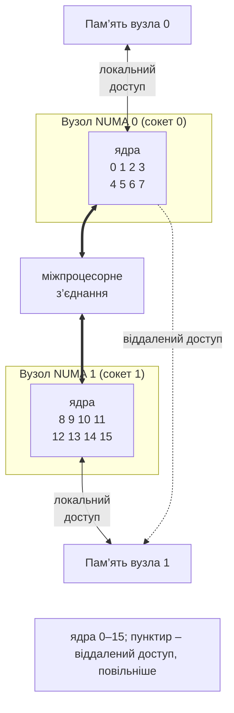
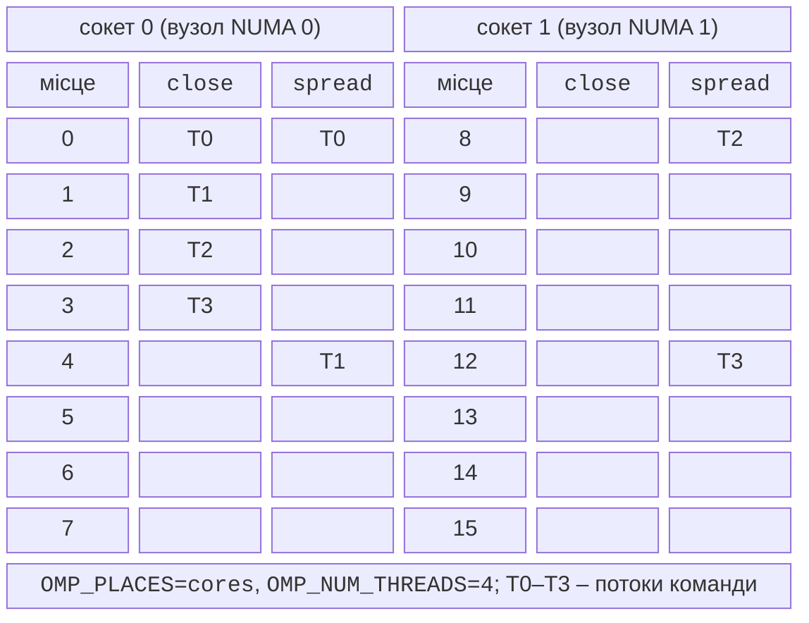

# Продуктивність, NUMA і прив’язка потоків

## Продуктивність і масштабованість

Прискорення програм OpenMP оцінюють так само, як у темі 1: вимірюють час для $p = 1 , 2 , 4 , \dots$ потоків і будують таблицю та графік прискорення $S_{p}$ й ефективності $E_{p}$. Кількість потоків змінюють змінною `OMP_NUM_THREADS`, а вид розподілу – `OMP_SCHEDULE`, тому серія запусків не потребує перекомпіляції:

```bash
for p in 1 2 4 8 16; do
    OMP_NUM_THREADS=$p ./mandel
done
```

Під час роботи програми завантаження ядер показує `htop` в Ubuntu (рис. 10.5) або диспетчер завдань Windows. Рівномірно завантажені ядра ще не означають корисної роботи: потоки OpenMP після паралельної області деякий час **активно чекають** (*spin*), щоб швидко почати наступну. В `libgomp` таке очікування триває 300 000 циклів, його змінюють змінні `OMP_WAIT_POLICY=passive` (одразу засинати) або `GOMP_SPINCOUNT`.

::: info Знімок екрана
Ubuntu terminal: `htop` while `OMP_NUM_THREADS=8 ./mandel` runs; CPU meters at the top, the process threads (press H to show threads)
:::

Рис. 10.5. Завантаження ядер під час роботи OpenMP-програми {.caption}

Типові причини слабкого прискорення:

- **малий обсяг роботи**: цикл із 1000 множень триває 0,001 мс, а створення команди потоків – 0,05 мс; поріг задають клаузою `if(n > …)`;
- **хибне розділення** (*false sharing*, тема 4): потоки записують у сусідні елементи спільного масиву, наприклад `counts[omp_get_thread_num()]++`, і постійно інвалідовують кеш-лінію одне одного; лічильник потоку слід тримати в локальній змінній або використати `reduction`;
- **обмеження пропускною здатністю пам’яті** (*memory bound*): коли дані не вміщуються в кеш, ядра чекають на оперативну пам’ять, і прискорення зупиняється на 3–5 незалежно від кількості потоків;
- **логічні процесори SMT** і **перевантаження** (*oversubscription*): потоків більше, ніж фізичних ядер (вкладені області, кілька процесів OpenMP на вузлі), і виграш залежить від задачі або зникає зовсім;
- **нерівномірні ітерації** зі `schedule(static)`;
- **NUMA**: потоки звертаються до пам’яті іншого процесора (наступний розділ).

Директива `target` переносить обчислення на прискорювач (GPU) у межах того самого стандарту OpenMP; обчислення на графічних процесорах розглянуто в темі 11.

## Архітектура NUMA

Сервер із кількома процесорами (сокетами) має **неоднорідний доступ до пам’яті** (*NUMA*, тема 1): кожен процесор має власні модулі пам’яті, а до пам’яті іншого процесора звертається через міжпроцесорне з’єднання (Intel UPI, AMD HyperTransport), повільніше на десятки відсотків (рис. 10.6). Процесор разом із «своєю» пам’яттю утворює **вузол NUMA** (*NUMA node*). Вузли кластера (тема 13) зазвичай мають два сокети; настільний комп’ютер з одним процесором має один вузол NUMA, як і лабораторний i9-11900KF.



Рис. 10.6. Двосокетна NUMA-система {.caption}

Топологію системи в Linux показують такі команди (пакети `numactl` і `hwloc` в Ubuntu 26.04):

```bash
lscpu | grep -i numa          # кількість вузлів і їхні процесори
numactl --hardware            # пам'ять вузлів і матриця відстаней
lstopo --of ascii             # сокети, кеші, ядра, логічні процесори
```

Утиліта `lstopo` з бібліотеки **hwloc** (*Portable Hardware Locality*, <https://www.open-mpi.org/projects/hwloc/>) малює дерево апаратних ресурсів: пакети (сокети), вузли NUMA, кеші L3/L2/L1, ядра та логічні процесори (рис. 10.7). Команда `numactl --hardware` (<https://man7.org/linux/man-pages/man8/numactl.8.html>) виводить для кожного вузла список процесорів, обсяг і вільну пам’ять, а також **матрицю відстаней** (*node distances*): 10 означає локальний доступ, 20–32 – відносно повільніший віддалений (рис. 10.8).

::: info Знімок екрана
Ubuntu on a two-socket cluster node: `lstopo --of ascii` (or `lstopo topo.png`); Packages, NUMA nodes, L3/L2/L1 caches, cores, PUs
:::

Рис. 10.7. Топологія системи в hwloc {.caption}

::: info Знімок екрана
Ubuntu terminal on the cluster node: `numactl --hardware`; node N cpus, node N size / free, node distances matrix
:::

Рис. 10.8. Відомості про вузли NUMA {.caption}

### Політика першого дотику

Операційна система виділяє процесу віртуальну пам’ять одразу, а **фізичні сторінки** – лише під час першого запису в них. Linux за замовчуванням розміщує сторінку у вузлі NUMA того потоку, який **перший** до неї записав: це **політика першого дотику** (*first-touch policy*, <https://www.kernel.org/doc/html/latest/admin-guide/mm/numa_memory_policy.html>). Звідси типова помилка паралельних програм: масив ініціалізують послідовно в головному потоці, уся пам’ять опиняється у вузлі 0, і половина потоків потім працює з віддаленою пам’яттю.

Правило: **ініціалізувати дані паралельно з тим самим розподілом, що й обчислення**:

```cpp
double* u = new double[n * n];          // сторінки ще не виділено
#pragma omp parallel for schedule(static)
for (long i = 0; i < n; ++i)
    for (long j = 0; j < n; ++j)
        u[i * n + j] = 0.0;      // перший дотик – «свій» вузол
```

Контейнер `std::vector<double> v(n)` заповнює елементи нулями ще в конструкторі, тобто в головному потоці. Для NUMA-систем пам’ять виділяють без ініціалізації (`new double[n]`, `std::make_unique_for_overwrite<double[]>(n)`) і заповнюють у паралельному циклі.

## Прив’язка потоків

За замовчуванням планувальник ОС може переміщати потоки між ядрами й сокетами. Після переміщення потік втрачає «теплий» кеш, а на NUMA-системі – ще й локальну пам’ять. Тому у високопродуктивних обчисленнях потоки **прив’язують** (*thread affinity, binding*) до процесорів двома змінними середовища (табл. 10.6).

- `OMP_PLACES` задає **місця** (*places*) – набори логічних процесорів: `threads` (кожен логічний процесор), `cores` (ядро з усіма його логічними процесорами), `ll_caches` (ядра зі спільним кешем останнього рівня), `numa_domains`, `sockets` або явний список `"{0,1},{2,3}"`.
- `OMP_PROC_BIND` задає **політику** розміщення потоків команди по місцях: `close`, `spread`, `primary`, а також `true` (прив’язати без уточнення) і `false` (не прив’язувати).

Таблиця 10.6. Політики `OMP_PROC_BIND` {.caption}

| **Значення** | **Розміщення потоків** |
| --- | --- |
| `close` | у сусідніх місцях поряд із головним потоком; спільний кеш, один вузол NUMA |
| `spread` | рівномірно по всіх місцях: потоки в різних ядрах і сокетах, максимум пропускної здатності пам’яті |
| `primary` | у тому самому місці, що й головний потік (для вкладених областей) |
| `false` | без прив’язки: розміщує операційна система |

У `libgomp` задана змінна `OMP_PLACES` автоматично вмикає прив’язку. Різницю між `close` і `spread` для 4 потоків на двосокетному вузлі показано на рис. 10.9.



Рис. 10.9. Прив’язка потоків `close` і `spread` {.caption}

Політику `close` обирають, коли потоки інтенсивно обмінюються даними (спільний кеш), а `spread` – для обчислень, обмежених пам’яттю, і для вкладених областей (зовнішня команда `spread` по сокетах, внутрішня `close` у межах сокета: `OMP_PROC_BIND=spread,close`). Фактичне розміщення перевіряють змінними `OMP_DISPLAY_ENV=true` (виводить усі налаштування OpenMP під час запуску) і `OMP_DISPLAY_AFFINITY=true` (рядок прив’язки кожного потоку), рис. 10.10:

```bash
export OMP_NUM_THREADS=16 OMP_PLACES=cores OMP_PROC_BIND=spread
OMP_DISPLAY_ENV=true OMP_DISPLAY_AFFINITY=true ./heat
```

::: info Знімок екрана
Ubuntu cluster node: `OMP_PLACES=cores OMP_PROC_BIND=spread OMP_DISPLAY_ENV=true OMP_DISPLAY_AFFINITY=true ./heat`; the OPENMP DISPLAY ENVIRONMENT block and one affinity line per thread
:::

Рис. 10.10. Фактична прив’язка потоків OpenMP {.caption}

Утиліта `numactl` прив’язує цілий процес до процесорів і пам’яті вузла, не змінюючи програми: запуск `numactl --cpunodebind=0 --membind=1 ./heat` (процесори вузла 0, пам’ять вузла 1) порівняно з `--membind=0` показує, наскільки повільніший віддалений доступ, а `--interleave=all` розміщує сторінки по черзі в усіх вузлах.

### Прив’язка у Windows

Бібліотека `libgomp` із MinGW не підтримує прив’язку у Windows: з `OMP_PROC_BIND` програма виводить `libgomp: Affinity not supported on this configuration` і працює без прив’язки. Бібліотека `libomp` компілятора Clang (LLVM, <https://openmp.llvm.org/>) прив’язку у Windows виконує. Функція `omp_display_affinity(формат)` виводить розміщення поточного потоку: `%n` – номер потоку, `%A` – його логічні процесори.

```cpp
#pragma omp parallel
{
    #pragma omp critical
    omp_display_affinity("потік %n -> процесори {%A}");
}
```

Програму з цим фрагментом зібрано командою `clang++ -std=c++23 -O2 -fopenmp` (Clang 23.1) і запущено в PowerShell з `$env:OMP_NUM_THREADS = 4` і `$env:OMP_PLACES = "cores"`. Виведення двох запусків наведено поруч; кожне з 8 ядер i9-11900KF – місце з двох логічних процесорів `{0,1} {2,3} … {14,15}`:

```
OMP_PROC_BIND = close            OMP_PROC_BIND = spread
потік 0 -> процесори {0,1}       потік 0 -> процесори {0,1}
потік 2 -> процесори {4,5}       потік 1 -> процесори {4,5}
потік 3 -> процесори {6,7}       потік 2 -> процесори {8,9}
потік 1 -> процесори {2,3}       потік 3 -> процесори {12,13}
```

Політика `close` займає чотири ядра поспіль, а `spread` розподіляє потоки через ядро.
