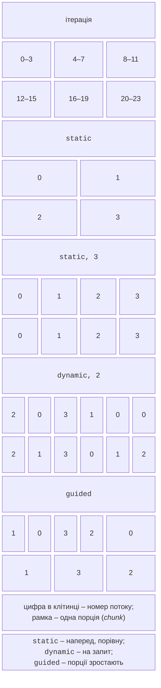

# Змінні, цикли та редукції

## Області видимості змінних

Усі потоки виконують код області у спільному адресному просторі, тому для кожної змінної важливо, чи вона **спільна** (*shared*, один екземпляр для всіх потоків), чи **приватна** (*private*, власний екземпляр у кожному потоці). Правила за замовчуванням:

- змінні, оголошені **до** області (зокрема глобальні й статичні), спільні;
- змінні, оголошені **всередині** області, приватні;
- лічильник циклу, розпаралеленого директивою `for`, приватний.

Клаузи областей видимості (*data-sharing attributes*) змінюють ці правила (табл. 10.2).

Таблиця 10.2. Клаузи областей видимості змінних {.caption}

| **Клауза** | **Дія** |
| --- | --- |
| `shared(x)` | один екземпляр `x` для всіх потоків; доступ потрібно синхронізувати |
| `private(x)` | власна **неініціалізована** копія в кожному потоці; значення після області не змінюється |
| `firstprivate(x)` | власна копія, ініціалізована значенням `x` перед областю |
| `lastprivate(x)` | після циклу `x` отримує значення з **останньої** ітерації (за порядком індексів) |
| `default(none)` | вимагає явно вказати область видимості кожної змінної |

```cpp
int base = 10, last = -1, temp = 0;
#pragma omp parallel for firstprivate(base) lastprivate(last) \
    private(temp) num_threads(4)
for (int i = 0; i < 8; ++i)
{
    temp = base + i;          // temp – копія потоку, base = 10
    last = temp * temp;
}
std::println("last = {}", last);   // last = 289 (ітерація i = 7)
```

Директива продовжується на наступному рядку після символу `\`. Найпоширеніша помилка – забута спільна змінна: допоміжна змінна `temp`, оголошена перед циклом без `private`, стала б спільною, і потоки перезаписували б значення одне одного (**стан гонитви**, тема 3). Тому надійніше оголошувати тимчасові змінні всередині тіла циклу або писати `default(none)`: тоді компілятор повідомляє про кожну змінну без явної клаузи, наприклад `error: 'temp' not specified in enclosing 'parallel'`.

::: tip Порада
Константи, оголошені як `const`, в області з `default(none)` можна не перелічувати. Великі масиви передавайте як `shared`: клауза `private` для `std::vector` створює порожню копію в кожному потоці, а `firstprivate` – повну копію.
:::

## Паралельні цикли

Директива `#pragma omp for` усередині паралельної області **розподіляє ітерації** циклу між потоками команди (*worksharing*). Об’єднана директива `#pragma omp parallel for` створює команду й одразу розподіляє цикл. Цикл повинен мати **канонічну форму**: цілочисельний лічильник або ітератор довільного доступу, умова порівняння `<`, `<=`, `>`, `>=` чи `!=` з незмінною межею та крок `++`, `--`, `+= c`, `-= c`. Кількість ітерацій має бути відомою до початку циклу, тому `break` і зміна лічильника в тілі заборонені. Цикл діапазону `for (auto& x : v)` дозволений з OpenMP 5.0 і підтримується GCC.

```cpp
#pragma omp parallel for
for (std::size_t i = 0; i < a.size(); ++i)
    c[i] = a[i] + b[i];            // ітерації незалежні
```

Розпаралелювати можна лише цикли з **незалежними ітераціями**. Цикл `a[i] = a[i - 1] + 1` має **залежність за даними між ітераціями** (*loop-carried dependency*): директива його не зламає синтаксично, але результат буде неправильним.

### Розподіл ітерацій: schedule

Клауза `schedule(вид[, порція])` визначає, як ітерації діляться на **порції** (*chunks*) і як порції потрапляють до потоків (рис. 10.3, табл. 10.3).



Рис. 10.3. Розподіл 24 ітерацій циклу між 4 потоками за різних `schedule` {.caption}

Таблиця 10.3. Види розподілу ітерацій {.caption}

| **Вид** | **Розподіл** | **Коли використовувати** |
| --- | --- | --- |
| `static` | ітерації діляться наперед на порції однакового розміру (без порції – приблизно $n / p$ на потік); найменші накладні витрати | однакова вартість ітерацій |
| `dynamic` | потік бере наступну порцію (за замовчуванням з 1 ітерації), коли звільняється | нерівномірна вартість ітерацій |
| `guided` | як `dynamic`, але порції починаються з великих і зменшуються до заданого мінімуму | нерівномірна вартість, багато ітерацій |
| `auto` | вибір залишається компілятору й середовищу виконання | експерименти |
| `runtime` | вид задає змінна `OMP_SCHEDULE` або функція `omp_set_schedule` | порівняння без перекомпіляції |

Для `schedule(runtime)` значення задають так: `OMP_SCHEDULE="dynamic,16" ./mandel`. Якщо змінну не задано, `libgomp` використовує `dynamic` з порцією 1. Без клаузи `schedule` GCC розподіляє цикл статично. Для задачі з нерівномірними ітераціями (множина Мандельброта, пошук простих чисел) `static` без порції залишає частину потоків без роботи: у прикладі програм цієї лекції найшвидший потік простоює 99 % часу, а `dynamic` прискорює обчислення майже вдвічі.

### Клаузи collapse і nowait

Клауза `collapse(n)` об’єднує $n$ вкладених циклів в один простір ітерацій. Це корисно, коли зовнішній цикл має мало ітерацій порівняно з кількістю потоків:

```cpp
#pragma omp parallel for collapse(2) schedule(static)
for (int i = 0; i < rows; ++i)
    for (int j = 0; j < cols; ++j)
        image[i * cols + j] = Shade(i, j);
```

Цикли мають бути **ідеально вкладеними** (*perfectly nested*): між заголовками немає інших операторів, а межі внутрішнього циклу не залежать від зовнішнього лічильника (OpenMP 5.0 дозволяє прості залежності, але не всі компілятори їх оптимізують).

Кожна директива `for` закінчується неявним бар’єром. Якщо після циклу в області немає коду, який залежить від його результатів (наприклад, далі йде інший незалежний цикл), клауза `nowait` прибирає очікування; її використано в прикладі «Множина Мандельброта».

## Редукції

Типова задача – обчислити одне значення (суму, максимум) за всіма ітераціями. Спільна змінна `sum += …` без синхронізації дає гонитву, а синхронізація кожного додавання знищує прискорення. Клауза `reduction(оператор:змінні)` створює в кожному потоці приватну копію, ініціалізовану **нейтральним елементом** операції, а в кінці об’єднує копії з початковим значенням змінної (табл. 10.4):

```cpp
double sum = 0.0, lo = INFINITY, hi = -INFINITY;
#pragma omp parallel for reduction(+:sum) reduction(min:lo) \
    reduction(max:hi)
for (int i = 0; i < n; ++i)
{
    sum += a[i];
    lo = std::min(lo, a[i]);
    hi = std::max(hi, a[i]);
}
```

Таблиця 10.4. Оператори редукції {.caption}

| **Оператор** | **Початкове значення копії** | **Приклад** |
| --- | --- | --- |
| `+`, `-`, `\|`, `^`, `\|\|` | `0` (для `\|\|` – `false`) | сума, кількість, об’єднання ознак |
| `*`, `&&` | `1` (для `&&` – `true`) | добуток, «усі елементи задовольняють умову» |
| `&` | усі біти `1` | перетин бітових масок |
| `min`, `max` | найбільше / найменше значення типу | мінімум і максимум |

Оператор має бути асоціативним: порядок об’єднання копій не визначено. Для дійсних чисел це змінює останні знаки суми, тому послідовний і паралельний результати порівнюють із допуском. Редукція можлива і для **секції масиву**, наприклад гістограма `reduction(+:hist[0:10])`: кожен потік отримує власний масив із 10 лічильників.

### Власна редукція: declare reduction

Для власних типів (словник, вектор, структура статистики) оператор оголошують директивою `declare reduction(ім’я : тип : вираз) initializer(…)`: у виразі `omp_out` – накопичене значення, `omp_in` – значення іншої копії, а `omp_priv` в ініціалізаторі – початкове значення копії. Приклад редукції для словника слів наведено в лабораторній роботі.
