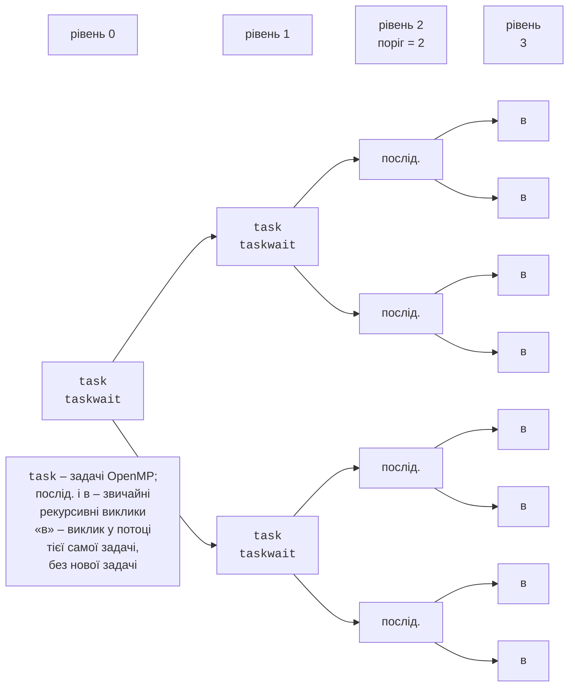

# Синхронізація, задачі та simd

## Синхронізація

Коли потоки все ж змінюють спільні дані, OpenMP надає директиви синхронізації (табл. 10.5).

Таблиця 10.5. Засоби синхронізації OpenMP {.caption}

| **Засіб** | **Призначення** |
| --- | --- |
| `critical [(ім’я)]` | блок виконує не більше одного потоку; однойменні блоки мають спільне блокування, неіменовані – одне глобальне |
| `atomic` | атомарна проста операція над змінною (`x++`, `x += v`, читання, запис); значно швидша за `critical` |
| `single` | блок виконує лише один (будь-який) потік; інші чекають на бар’єрі |
| `masked` | блок виконує лише головний потік, без бар’єра (заміна застарілого `master`) |
| `barrier` | точка, у якій кожен потік чекає на всіх інших |
| `ordered` | частину тіла циклу `for ordered` виконати в порядку ітерацій |
| `omp_lock_t` | явне блокування: `omp_init_lock`, `omp_set_lock`, `omp_unset_lock`, `omp_destroy_lock` |

```cpp
long hits = 0;
std::vector<int> found;
#pragma omp parallel for
for (int i = 0; i < n; ++i)
{
    if (!IsPrime(i)) continue;
    #pragma omp atomic
    hits++;
    #pragma omp critical(found_list)
    found.push_back(i);
}
```

Операцію `hits++` захищає `atomic`: компілятор використовує атомарні інструкції процесора, як `std::atomic` у темі 9. Виклик `push_back` змінює структуру вектора й не є простою операцією, тому потребує `critical`. Назва `found_list` відокремлює це блокування від інших критичних секцій програми. Найкраще ж рішення – уникати синхронізації в гарячому циклі: рахувати через `reduction`, а знайдені значення збирати в локальні вектори потоків і об’єднувати один раз.

У GCC 16 директива `master` і значення `OMP_PROC_BIND=master` спричиняють попередження про застарілий синтаксис, тому в нових програмах використовують `masked` і `primary`.

## Секції та задачі

**Секції** (*sections*) – найпростіший спосіб виконати кілька різних фрагментів паралельно: у блоці `#pragma omp parallel sections` кожен фрагмент позначають директивою `#pragma omp section`, наприклад пошук мінімуму, максимуму й медіани одного масиву. Кількість секцій фіксована в тексті програми, тому для рекурсивних алгоритмів і циклів із невідомою кількістю кроків (обхід дерева, списку) використовують **задачі** (*tasks*). Директива `#pragma omp task` створює задачу – фрагмент коду разом із даними; задачу виконує будь-який вільний потік команди. Задачі створюють усередині паралельної області, зазвичай у блоці `single`, щоб початкову задачу створив один потік.

```cpp
long Fib(int n)
{
    if (n < 25) return FibSerial(n);       // поріг: без задач
    long a, b;
    #pragma omp task shared(a)
    a = Fib(n - 1);
    #pragma omp task shared(b)
    b = Fib(n - 2);
    #pragma omp taskwait                   // чекати на обидві задачі
    return a + b;
}
// Виклик:
#pragma omp parallel
#pragma omp single
result = Fib(40);
```

Змінні, які в точці створення задачі були приватними (як `n`), у задачі за замовчуванням `firstprivate`: задача отримує їхню копію. Тому результат повертають через `shared(a)`, а `taskwait` гарантує, що змінні `a` і `b` ще існують, коли задачі в них записують.

Засоби керування задачами:

- `taskwait` – чекати на завершення **дочірніх** задач поточної задачі;
- `taskgroup { … }` – чекати на всі задачі, створені в блоці, разом з їхніми нащадками;
- `taskloop` – розбити цикл на задачі (клаузи `grainsize(g)` – ітерацій у задачі або `num_tasks(k)`); на відміну від `for`, можна вкладати в інші задачі;
- `depend(in: x) depend(out: y)` – задача з `in` чекає на завершення задачі з `out` для тієї самої змінної; так будують конвеєри й графи залежностей;
- `if(умова)` і `final(умова)` – виконати задачу одразу, без відкладання (накладні витрати менші, але не нульові).

**Поріг** (*cut-off*). Створення задачі коштує сотні наносекунд, а сортування кількох елементів – одиниці. Якщо створювати задачу для кожного рекурсивного виклику, накладні витрати перевищать корисну роботу. Тому задачі створюють лише на верхніх рівнях рекурсії (за глибиною або за розміром фрагмента), а нижче порогу функція викликається звичайно (рис. 10.4).



Рис. 10.4. Дерево задач рекурсивного алгоритму з порогом глибини {.caption}

Поріг за розміром фрагмента надійніший за поріг глибини: у швидкому сортуванні розбиття буває нерівним, і на глибині 2 одна гілка може містити 90 % масиву. У прикладі програм лекції порівняно пороги від 10 до 1 000 000 елементів.

## Векторизація simd

Потоки дають паралелізм між ядрами, а SIMD-інструкції (тема 7) – усередині одного ядра. GCC з `-O2` уже векторизує прості цикли, але часто відмовляється: наприклад, накопичення суми дійсних чисел не можна переставляти без дозволу (порядок додавання змінює результат), а вказівники можуть перекриватися. Директива `#pragma omp simd` повідомляє компілятору, що векторизація безпечна:

```cpp
double sum = 0.0;
#pragma omp simd reduction(+:sum)
for (int i = 0; i < n; ++i)
    sum += x[i] * y[i];
```

- `simd` дозволяє векторизувати цикл; клауза `safelen(k)` – ітерації, віддалені менш ніж на $k$, незалежні; `aligned(p:64)` – пам’ять вирівняна.
- `parallel for simd` – ітерації діляться між потоками, а порція кожного потоку векторизується.
- `declare simd` перед функцією просить компілятор створити її векторну версію, яку можна викликати з циклу `simd`:

```cpp
#pragma omp declare simd
inline float Gauss(float x) { return std::exp(-x * x / 2); }
```

Ключ `-fopenmp-simd` вмикає лише директиви `simd` без багатопотоковості. Щоб компілятор використав AVX2 чи AVX-512 процесора, додають `-march=native` (програма тоді може не запуститися на старішому процесорі). Звіт про векторизовані цикли виводить ключ `-fopt-info-vec-optimized`.
