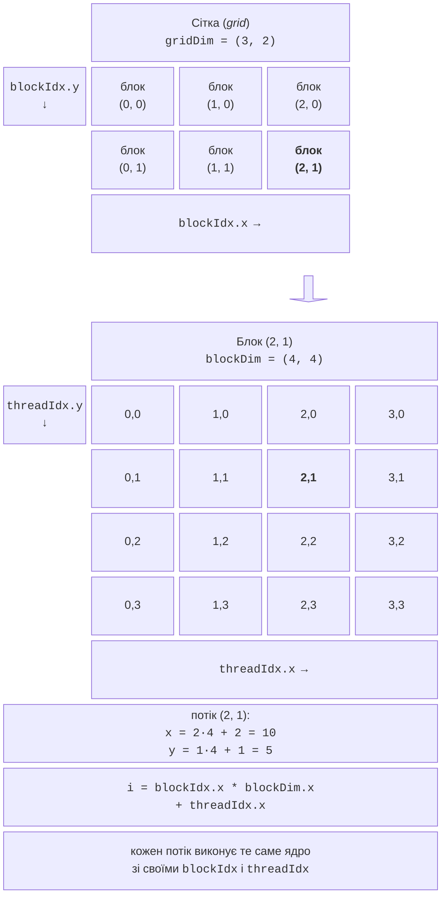
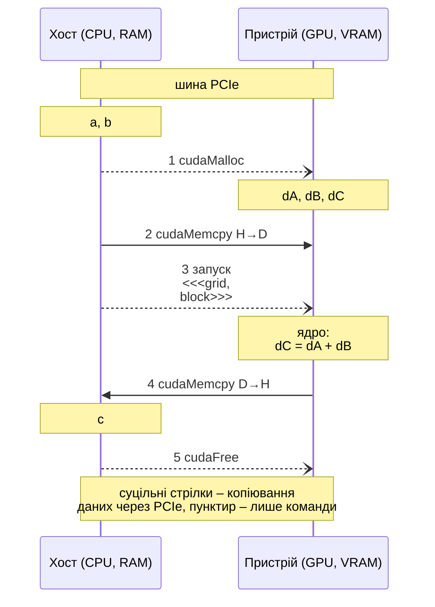
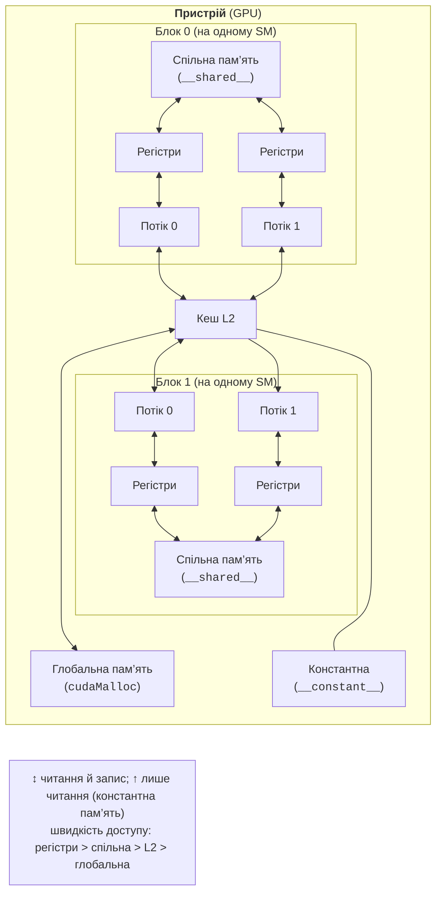

# Модель програмування CUDA C++

## Модель програмування CUDA C++

Програма CUDA C++ – це звичайна програма C++ (*host code*, виконується на CPU, **хості**), яка викликає **ядра** (*kernels*) – функції, що виконуються на GPU (**пристрої**, *device*) великою кількістю потоків. Файли з кодом CUDA мають розширення `.cu`, заголовки – `.cuh`. Компілятор `nvcc` ділить файл на дві частини: код пристрою компілює сам (у PTX і машинний код SASS), а код хоста передає компілятору C++ системи (GCC у Linux, MSVC у Windows). Функції позначають **кваліфікаторами** (табл. 11.2).

Таблиця 11.2. Кваліфікатори функцій CUDA {.caption}

| **Кваліфікатор** | **Виконується** | **Викликається** | **Примітка** |
| --- | --- | --- | --- |
| `__global__` | на GPU | з хоста (запуск ядра) | ядро; повертає `void` |
| `__device__` | на GPU | з коду GPU | допоміжна функція ядра |
| `__host__` | на CPU | з коду CPU | типово для всіх функцій |
| `__host__ __device__` | на обох | з обох | одна функція для CPU і GPU |

### Сітка, блоки й потоки

Ядро запускають спеціальним синтаксисом `Kernel<<<grid, block>>>(аргументи)`. Потоки організовано в ієрархію (рис. 11.3):

- **сітка** (*grid*) – усі потоки одного запуску ядра;
- **блок** (*thread block*) – група до 1024 потоків, що виконується на одному SM і може синхронізуватися та обмінюватися даними через спільну пам’ять;
- **потік** (*thread*) виконує код ядра для «своїх» даних.

Розміри сітки й блоку мають тип `dim3` (три виміри `x`, `y`, `z`; невказані дорівнюють 1). У ядрі доступні вбудовані змінні: `threadIdx` – номер потоку в блоці, `blockIdx` – номер блоку в сітці, `blockDim` – розмір блоку, `gridDim` – розмір сітки.



Рис. 11.3. Ієрархія потоків CUDA {.caption}

**Глобальний індекс** потоку в одновимірній сітці обчислюють за формулою `i = blockIdx.x * blockDim.x + threadIdx.x`. Кількість блоків округлюють угору: `blocks = (n + threads - 1) / threads`, тому в останньому блоці частина потоків «зайва», і ядро обов’язково **перевіряє межі** `if (i < n)`. Розмір блоку зазвичай кратний 32 (розміру варпа): 128, 256 або 512 потоків. Порядок виконання блоків не визначено, тому блоки мають бути незалежними. Обмеження лабораторного GPU наведено в табл. 11.3.

Таблиця 11.3. Обмеження RTX 3060 (`cudaGetDeviceProperties`) {.caption}

| **Обмеження (CC 8.6)** | **Значення** |
| --- | --- |
| потоків у блоці, не більше | 1024 |
| розміри блоку `x`, `y`, `z`, не більше | 1024, 1024, 64 |
| блоків у сітці за `x` / `y`, `z` | $2^{31} - 1$ / 65 535 |
| потоків на SM / блоків на SM | 1536 / 16 |
| спільної пам’яті на блок (типово) | 48 КБ |
| 32-бітових регістрів на SM | 65 536 |

### Перша програма: сума векторів

Програма складається з двох файлів. Заголовок `common.cuh` містить макрос перевірки помилок і функції вимірювання часу, які використовують усі приклади лекції та лабораторної роботи.

```cpp
// common.cuh – перевірка помилок CUDA і вимірювання часу.
#pragma once
#include <algorithm>
#include <chrono>
#include <cstdio>
#include <cstdlib>
#include <vector>
#include <cuda_runtime.h>

// Виклик CUDA Runtime API: у разі помилки – повідомлення й вихід.
#define CUDA_CHECK(call)                                          \
    do {                                                          \
        cudaError_t err = (call);                                 \
        if (err != cudaSuccess) {                                 \
            std::fprintf(stderr, "CUDA: %s (%s) у %s:%d\n",       \
                         cudaGetErrorString(err),                 \
                         cudaGetErrorName(err), __FILE__,         \
                         __LINE__);                               \
            std::exit(EXIT_FAILURE);                              \
        }                                                         \
    } while (0)

// Медіана 5 вимірювань після прогрівання; run() повертає мс.
template <class F> float MedianMs(F run)
{
    run();
    std::vector<float> t;
    for (int r = 0; r < 5; ++r) t.push_back(run());
    std::sort(t.begin(), t.end());
    return t[2];
}

// Час фрагмента коду на CPU, мс.
template <class F> float CpuMs(F body)
{
    auto start = std::chrono::steady_clock::now();
    body();
    std::chrono::duration<float, std::milli> d =
        std::chrono::steady_clock::now() - start;
    return d.count();
}

// Час фрагмента на GPU за подіями CUDA, мс.
template <class F> float GpuMs(F body)
{
    cudaEvent_t start, stop;
    CUDA_CHECK(cudaEventCreate(&start));
    CUDA_CHECK(cudaEventCreate(&stop));
    CUDA_CHECK(cudaEventRecord(start));      // мітка в черзі GPU
    body();
    CUDA_CHECK(cudaEventRecord(stop));
    CUDA_CHECK(cudaEventSynchronize(stop));  // чекати на мітку stop
    float ms = 0;
    CUDA_CHECK(cudaEventElapsedTime(&ms, start, stop));
    CUDA_CHECK(cudaEventDestroy(start));
    CUDA_CHECK(cudaEventDestroy(stop));
    return ms;
}
```

Файл `vector_add.cu` обчислює $c_{i} = a_{i} + b_{i}$ для 50 мільйонів чисел, де $a_{i} = \sin^{2} i$, $b_{i} = \cos^{2} i$, тож кожен результат має дорівнювати 1.

```cpp
// vector_add.cu – сума векторів c = a + b на GPU.
#include <cmath>
#include <cstdio>
#include <vector>
#include "common.cuh"

// Ядро: кожен потік обчислює один елемент.
__global__ void VectorAdd(const float* a, const float* b, float* c,
                          int n)
{
    int i = blockIdx.x * blockDim.x + threadIdx.x;  // індекс потоку
    if (i < n)                                       // перевірка меж
        c[i] = a[i] + b[i];
}

int main()
{
    cudaDeviceProp prop;
    CUDA_CHECK(cudaGetDeviceProperties(&prop, 0));
    std::printf("GPU: %s, CC %d.%d, SM: %d, "
                "пам'ять: %.1f ГБ\n", prop.name, prop.major,
                prop.minor, prop.multiProcessorCount,
                prop.totalGlobalMem / 1073741824.0);

    const int n = 50'000'000;
    const size_t bytes = n * sizeof(float);
    std::vector<float> a(n), b(n), c(n);
    for (int i = 0; i < n; ++i)
    {
        a[i] = std::sin(i) * std::sin(i);
        b[i] = std::cos(i) * std::cos(i);
    }

    // 1. Пам'ять пристрою.
    float *dA, *dB, *dC;
    CUDA_CHECK(cudaMalloc(&dA, bytes));
    CUDA_CHECK(cudaMalloc(&dB, bytes));
    CUDA_CHECK(cudaMalloc(&dC, bytes));

    // 2. Копіювання хост -> пристрій.
    CUDA_CHECK(cudaMemcpy(dA, a.data(), bytes,
                          cudaMemcpyHostToDevice));
    CUDA_CHECK(cudaMemcpy(dB, b.data(), bytes,
                          cudaMemcpyHostToDevice));

    // 3. Запуск ядра: блоки по 256 потоків.
    int threads = 256;
    int blocks = (n + threads - 1) / threads;
    VectorAdd<<<blocks, threads>>>(dA, dB, dC, n);
    CUDA_CHECK(cudaGetLastError());          // помилка запуску
    CUDA_CHECK(cudaDeviceSynchronize());     // помилка виконання

    // 4. Копіювання пристрій -> хост (чекає на завершення ядра).
    CUDA_CHECK(cudaMemcpy(c.data(), dC, bytes,
                          cudaMemcpyDeviceToHost));

    // 5. Звільнення пам'яті пристрою.
    CUDA_CHECK(cudaFree(dA));
    CUDA_CHECK(cudaFree(dB));
    CUDA_CHECK(cudaFree(dC));

    // sin² + cos² = 1 для кожного елемента.
    float maxError = 0.0f;
    for (int i = 0; i < n; ++i)
        maxError = std::fmax(maxError, std::fabs(c[i] - 1.0f));
    std::printf("n = %d, блоків: %d, потоків у блоці: %d\n",
                n, blocks, threads);
    std::printf("Max error: %g\n", maxError);
}
```

Запуск ядра **асинхронний**: хост одразу продовжує роботу, а GPU виконує ядро у фоні. Функція `cudaMemcpy` у стандартному потоці CUDA чекає на завершення попередніх команд, тому результат копіюється вже після роботи ядра. Результат в Ubuntu у WSL2:

```
GPU: NVIDIA GeForce RTX 3060, CC 8.6, SM: 28, пам'ять: 12.0 ГБ
n = 50000000, блоків: 195313, потоків у блоці: 256
Max error: 0
```

## Пам’ять хоста й пристрою

GPU має окрему **пам’ять пристрою** (відеопам’ять), тому типова програма виконує п’ять кроків (рис. 11.4): виділяє пам’ять `cudaMalloc`, копіює вхідні дані `cudaMemcpy(…, cudaMemcpyHostToDevice)`, запускає ядро, копіює результат `cudaMemcpy(…, cudaMemcpyDeviceToHost)` і звільняє пам’ять `cudaFree`. Вказівник, отриманий від `cudaMalloc`, не можна розіменовувати на хості, а вказівник на пам’ять хоста – в ядрі.



Рис. 11.4. Обмін даними між хостом і пристроєм {.caption}

**Закріплена пам’ять** (*pinned, page-locked*). Звичайну пам’ять хоста ОС може витіснити на диск, тому драйвер копіює її через проміжний закріплений буфер. Пам’ять, виділена функцією `cudaMallocHost` (звільняється `cudaFreeHost`), закріплена у фізичній пам’яті, і GPU читає її напряму. Вимірювання копіювання 128 МБ у WSL2: звичайна пам’ять – 11,7 ГБ/с на GPU і 9,2 ГБ/с назад, закріплена – 24,6 і 25,2 ГБ/с. Закріплена пам’ять також потрібна для асинхронних копіювань (розділ про потоки CUDA). Велика кількість закріпленої пам’яті зменшує пам’ять, доступну ОС, тому її виділяють лише для буферів обміну.

**Уніфікована пам’ять** (*Unified Memory*). Функція `cudaMallocManaged` виділяє пам’ять, доступну за тим самим вказівником і на хості, і на пристрої; драйвер переносить сторінки автоматично:

```cpp
float* x;
CUDA_CHECK(cudaMallocManaged(&x, n * sizeof(float)));
for (int i = 0; i < n; ++i) x[i] = 1.0f;       // запис на CPU
Scale<<<(n + 255) / 256, 256>>>(x, 3.0f, n);    // обробка на GPU
CUDA_CHECK(cudaDeviceSynchronize());            // обов'язково
std::printf("x[0] = %.1f\n", x[0]);             // x[0] = 3.0
CUDA_CHECK(cudaFree(x));
```

Код коротшій, але керувати пересиланнями вже не можна. У Windows і WSL2 атрибут `cudaDevAttrConcurrentManagedAccess` дорівнює 0: поки GPU працює, CPU не має права звертатися до уніфікованої пам’яті, тому `cudaDeviceSynchronize` перед читанням обов’язковий, а попереднє завантаження сторінок (`cudaMemPrefetchAsync`) недоступне.

### Ієрархія пам’яті пристрою

У коді ядра доступні кілька видів пам’яті з різною швидкістю й областю видимості (рис. 11.5, табл. 11.4).



Рис. 11.5. Види пам’яті пристрою CUDA {.caption}

Таблиця 11.4. Види пам’яті CUDA {.caption}

| **Пам’ять** | **Оголошення** | **Видимість** | **Особливості** |
| --- | --- | --- | --- |
| регістри | локальні змінні ядра | потік | найшвидша; 64 К регістрів на SM ділять усі потоки |
| спільна | `__shared__` | блок | на кристалі SM, у десятки разів швидша за глобальну; до 48 КБ на блок |
| глобальна | `cudaMalloc`, `__device__` | усі потоки й хост | 12 ГБ, затримка сотні тактів; кешується в L2 |
| константна | `__constant__`, `cudaMemcpyToSymbol` | усі потоки (читання) | 64 КБ, кеш; швидка, коли потоки варпа читають одну адресу |
| локальна | великі масиви в ядрі | потік | фізично в глобальній пам’яті; уникати |

Швидкість глобальної пам’яті залежить від **об’єднання звертань** (*coalescing*): коли 32 потоки варпа читають 32 сусідні елементи (`a[i]` з `i` за номером потоку), апаратура виконує кілька великих транзакцій. Звертання з великим кроком (наприклад, стовпець матриці `a[i * n]`) розбиваються на окремі транзакції й у багато разів повільніші.
