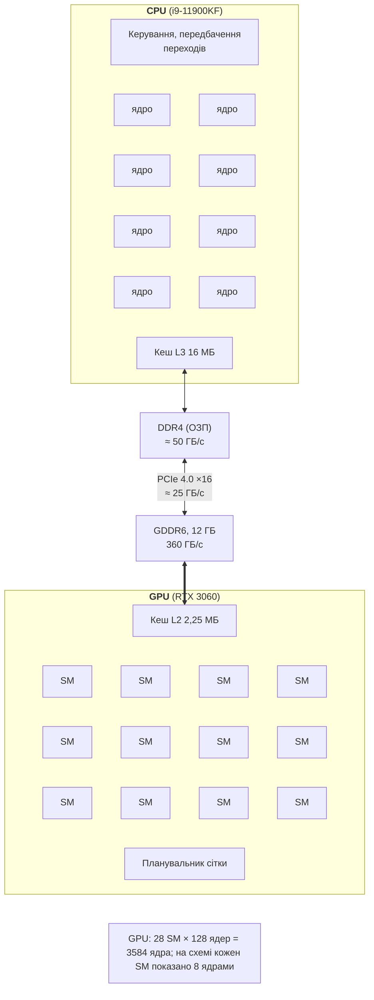

# Архітектура GPU та екосистема CUDA

## Архітектура GPU і CPU

**Графічний процесор** (*GPU, Graphics Processing Unit*) створювали для обробки мільйонів пікселів за однаковим алгоритмом. Сьогодні його використовують і для загальних обчислень (*GPGPU*): лінійної алгебри, обробки зображень, моделювання, навчання нейронних мереж. Центральний процесор і графічний процесор оптимізовано для різних цілей (рис. 11.1):

- **CPU** оптимізовано для **малої затримки** (*latency*) одного потоку: кілька потужних ядер, великі кеші, позачергове виконання та передбачення переходів;
- **GPU** оптимізовано для **пропускної здатності** (*throughput*): тисячі простих ядер, мало логіки керування, швидка пам’ять. Затримку окремої операції GPU приховує тим, що поки одні потоки чекають на пам’ять, інші обчислюють.



Рис. 11.1. Порівняння архітектур CPU та GPU {.caption}

GPU NVIDIA складається з **потокових мультипроцесорів** (*SM, Streaming Multiprocessor*). Кожен SM має власні обчислювальні ядра, регістровий файл, спільну пам’ять і планувальники. Потоки виконуються групами по 32 – **варпами** (*warp*): усі потоки варпа виконують ту саму інструкцію над різними даними. NVIDIA називає цю модель **SIMT** (*Single Instruction, Multiple Threads*): програміст пише код для одного потоку, а апаратура об’єднує потоки у варпи.

**Розгалуження** (*branch divergence*). Якщо потоки одного варпа йдуть різними гілками `if`, варп виконує обидві гілки по черзі, вимикаючи «чужі» потоки. Тому умова, що залежить від номера потоку всередині варпа (наприклад, `if (i % 2 == 0)`), зменшує швидкість, а умова, однакова для всього варпа, майже нічого не коштує.

Характеристики лабораторного ПК наведено в табл. 11.1. Значення для GPU отримано функцією `cudaGetDeviceProperties`.

Таблиця 11.1. Характеристики CPU і GPU лабораторного ПК {.caption}

| **Характеристика** | **i9-11900KF** | **RTX 3060 (CC 8.6)** |
| --- | --- | --- |
| ядра | 8 ядер, 16 логічних процесорів | 28 SM × 128 = 3584 ядра |
| потоків одночасно | 16 | 28 × 1536 = 43 008 |
| пам’ять | DDR4, до 128 ГБ | GDDR6, 12 ГБ |
| пропускна здатність пам’яті | ≈ 50 ГБ/с | 360 ГБ/с |
| пікова продуктивність `float` | ≈ 1 TFLOPS (AVX-512) | ≈ 13 TFLOPS |
| зв’язок | – | PCIe 4.0 ×16, виміряно ≈ 25 ГБ/с |

Головне обмеження GPU – **шина PCIe**: дані потрапляють у відеопам’ять через неї зі швидкістю близько 25 ГБ/с, що в 14 разів повільніше за доступ GPU до власної пам’яті. Тому вигідні задачі, у яких на кожен переданий байт припадає багато обчислень, або задачі, дані яких довго залишаються на GPU.

## Екосистема NVIDIA і CUDA у WSL2

**CUDA** (*Compute Unified Device Architecture*, <https://developer.nvidia.com/cuda-toolkit>) – платформа NVIDIA для обчислень на GPU. Вона складається з:

- **драйвера** GPU, що містить бібліотеку `libcuda` (*Driver API*) і завантажує код на пристрій;
- **CUDA Toolkit**: компілятор `nvcc`, бібліотека **CUDA Runtime** (`cudart`), математичні бібліотеки (cuBLAS, cuFFT, cuRAND, Thrust), профілювальники й `compute-sanitizer`;
- утиліти `nvidia-smi` (стан GPU, драйвер, завантаження, процеси) і `nvcc --version`.

**Compute capability** (CC) – версія архітектури GPU у форматі «головна.другорядна»: 7.5 – Turing, 8.0 і 8.6 – Ampere, 8.9 – Ada Lovelace, 9.0 – Hopper, 10.x і 12.x – Blackwell. Від CC залежать доступні інструкції та обмеження (табл. 11.3). CUDA 13 підтримує GPU з CC 7.5 і новіші: Maxwell, Pascal і Volta вилучено у версії 13.0 (<https://docs.nvidia.com/cuda/cuda-toolkit-release-notes/index.html>). Лабораторна GeForce RTX 3060 має CC 8.6.

**Сумісність версій.** Драйвер підтримує певну версію CUDA, яку `nvidia-smi` показує в заголовку (`CUDA UMD Version`). Програма, зібрана новішим тулкітом тієї самої головної версії, також працює: у CUDA 13 діє **сумісність другорядних версій** (*minor version compatibility*) з драйверами від 580. Наприклад, драйвер 610.88 лабораторного ПК повідомляє CUDA 13.3, а програми, зібрані CUDA 13.4 у Windows, на ньому працюють.

### CUDA у WSL2

Курс використовує CUDA в Ubuntu 26.04 у WSL2 (<https://docs.nvidia.com/cuda/wsl-user-guide/index.html>). Драйвер установлюють **лише у Windows**: WSL2 автоматично надає його Linux як бібліотеку `libcuda.so`. Встановлювати драйвер NVIDIA для Linux усередині WSL **не можна**: він замінить цю бібліотеку й зламає доступ до GPU. У WSL установлюють тільки тулкіт із репозиторію **WSL-Ubuntu** NVIDIA (у вересні 2026 року він містить CUDA 13.3, тому курс використовує 13.3 у WSL і 13.4 у Windows):

```bash
wget https://developer.download.nvidia.com/compute/cuda/repos/\
wsl-ubuntu/x86_64/cuda-keyring_1.1-1_all.deb
sudo dpkg -i cuda-keyring_1.1-1_all.deb
sudo apt-get update
sudo apt-get install cuda-toolkit-13-3   # лише тулкіт, без драйвера
echo 'export PATH=/usr/local/cuda/bin:$PATH' >> ~/.bashrc
```

Пакети `cuda`, `cuda-13-3` і `cuda-drivers` у WSL не встановлюють, бо вони містять драйвер. Після встановлення `nvcc --version` повідомляє `release 13.3, V13.3.73`, а `nvidia-smi` у WSL показує той самий GPU, що й у Windows (рис. 11.2). У вересні 2026 року тулкіт установлює також `nsys` (Nsight Systems) і `compute-sanitizer`. Обмеження WSL2: уніфікована пам’ять працює без одночасного доступу CPU і GPU, обсяг закріпленої пам’яті обмежений, частина функцій `nvidia-smi` недоступна.

::: info Знімок екрана
Windows Terminal, Ubuntu-26.04 (WSL2): `nvidia-smi` and `nvcc --version`; GPU name, driver 610.xx, CUDA UMD 13.3, memory usage; nvcc release 13.3
:::

Рис. 11.2. Відомості про GPU і драйвер у WSL {.caption}
