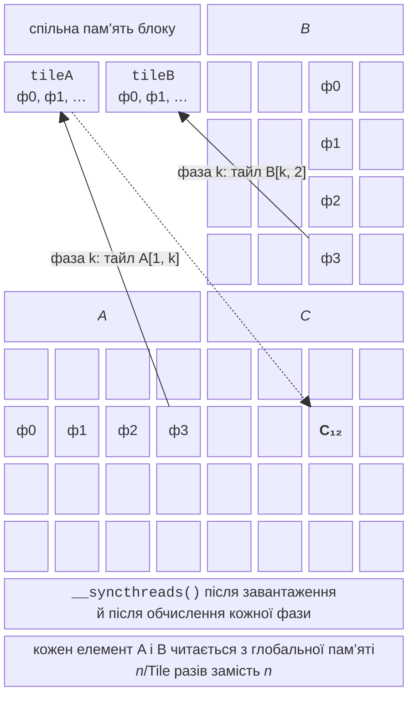

# Спільна пам’ять, потоки CUDA і бібліотеки

## Спільна пам’ять і синхронізація в блоці

Змінна з кваліфікатором `__shared__` існує в одному екземплярі для блоку. Потоки блоку заповнюють її разом, а функція `__syncthreads()` є **бар’єром** для всіх потоків блоку: жоден потік не йде далі, поки інші не дійшли до цієї точки. Бар’єр не можна ставити в гілку `if`, до якої заходять не всі потоки блоку: програма зависне або поведеться непередбачувано. Між різними блоками бар’єра немає: блоки синхронізуються лише завершенням ядра.

### Тайлінг у множенні матриць

**Тайлінг** (*tiling*) ділить матриці на квадратні **тайли** розміром $\text{Tile} \times \text{Tile}$ (рис. 11.7). Блок потоків обчислює один тайл $C$ за $n / \text{Tile}$ **фаз**. На кожній фазі кожен потік копіює по одному елементу тайла $A$ і тайла $B$ у спільну пам’ять, блок синхронізується, і потоки обчислюють частину суми, читаючи тайли зі спільної пам’яті. Кожен елемент глобальної пам’яті тепер читається в $\text{Tile}$ разів рідше.



Рис. 11.7. Множення матриць із тайлами {.caption}

```cpp
// Ядро з тайлами: блок Tile×Tile потоків по черзі завантажує
// тайли A і B у спільну пам'ять (n кратне Tile).
template <int Tile>
__global__ void MatMulTiled(const float* a, const float* b, float* c,
                            int n)
{
    __shared__ float tileA[Tile][Tile];
    __shared__ float tileB[Tile][Tile];
    int tx = threadIdx.x, ty = threadIdx.y;
    int row = blockIdx.y * Tile + ty;
    int col = blockIdx.x * Tile + tx;
    float sum = 0.0f;
    for (int phase = 0; phase < n / Tile; ++phase)
    {
        // Кожен потік копіює по одному елементу A і B.
        tileA[ty][tx] = a[row * n + phase * Tile + tx];
        tileB[ty][tx] = b[(phase * Tile + ty) * n + col];
        __syncthreads();                 // тайли завантажено
        for (int k = 0; k < Tile; ++k)
            sum += tileA[ty][k] * tileB[k][tx];
        __syncthreads();                 // тайли вже не потрібні
    }
    c[row * n + col] = sum;
}
```

Перший `__syncthreads()` гарантує, що тайли повністю завантажені, а другий – що жоден потік не почне перезаписувати тайли наступної фази, поки інші ще їх читають. Ядро спрощено: розмір $n$ має бути кратним `Tile`, інакше потрібні перевірки меж під час завантаження тайлів.

Повна програма `matmul.cu` містить обидва ядра, функцію `MatMulCpu` (цикли в порядку `i-k-j`, рядки між потоками OpenMP), генерує дві випадкові матриці (зерно 10), вимірює кожен спосіб (`MedianMs` з `GpuMs` або `CpuMs`) і порівнює результати GPU з CPU:

```cpp
// matmul.cu – множення матриць C = A·B: CPU (OpenMP), наївне ядро
// та ядро з тайлами у спільній пам'яті. Аргумент: n (кратне 32).
#include <omp.h>
#include <cmath>
#include <random>
#include "common.cuh"

// Наївне ядро: кожен потік читає рядок A і стовпець B
// з глобальної пам'яті.
__global__ void MatMulNaive(const float* a, const float* b, float* c,
                            int n)
{
    int row = blockIdx.y * blockDim.y + threadIdx.y;
    int col = blockIdx.x * blockDim.x + threadIdx.x;
    if (row < n && col < n)
    {
        float sum = 0.0f;
        for (int k = 0; k < n; ++k)
            sum += a[row * n + k] * b[k * n + col];
        c[row * n + col] = sum;
    }
}

// Ядро з тайлами: блок Tile×Tile потоків по черзі завантажує
// тайли A і B у спільну пам'ять (n кратне Tile).
template <int Tile>
__global__ void MatMulTiled(const float* a, const float* b, float* c,
                            int n)
{
    __shared__ float tileA[Tile][Tile];
    __shared__ float tileB[Tile][Tile];
    int tx = threadIdx.x, ty = threadIdx.y;
    int row = blockIdx.y * Tile + ty;
    int col = blockIdx.x * Tile + tx;
    float sum = 0.0f;
    for (int phase = 0; phase < n / Tile; ++phase)
    {
        // Кожен потік копіює по одному елементу A і B.
        tileA[ty][tx] = a[row * n + phase * Tile + tx];
        tileB[ty][tx] = b[(phase * Tile + ty) * n + col];
        __syncthreads();                 // тайли завантажено
        for (int k = 0; k < Tile; ++k)
            sum += tileA[ty][k] * tileB[k][tx];
        __syncthreads();                 // тайли вже не потрібні
    }
    c[row * n + col] = sum;
}

// CPU: рядки C між потоками OpenMP, порядок циклів i-k-j.
void MatMulCpu(const std::vector<float>& a,
               const std::vector<float>& b, std::vector<float>& c,
               int n)
{
    #pragma omp parallel for
    for (int i = 0; i < n; ++i)
    {
        float* ci = &c[(size_t)i * n];
        std::fill(ci, ci + n, 0.0f);
        for (int k = 0; k < n; ++k)
        {
            float aik = a[(size_t)i * n + k];
            const float* bk = &b[(size_t)k * n];
            for (int j = 0; j < n; ++j) ci[j] += aik * bk[j];
        }
    }
}

int main(int argc, char* argv[])
{
    const int n = argc > 1 ? std::atoi(argv[1]) : 2048;
    if (n <= 0 || n % 32 != 0)
    {
        std::fprintf(stderr, "n має бути додатним і кратним 32\n");
        return 1;
    }
    const size_t bytes = (size_t)n * n * sizeof(float);
    std::mt19937 gen(10);
    std::uniform_real_distribution<float> dist(-1.0f, 1.0f);
    std::vector<float> a((size_t)n * n), b(a.size()), c(a.size()),
        ref(a.size());
    for (float& x : a) x = dist(gen);
    for (float& x : b) x = dist(gen);

    float *dA, *dB, *dC;
    CUDA_CHECK(cudaMalloc(&dA, bytes));
    CUDA_CHECK(cudaMalloc(&dB, bytes));
    CUDA_CHECK(cudaMalloc(&dC, bytes));
    float copyMs = MedianMs([&] { return GpuMs([&] {
        CUDA_CHECK(cudaMemcpy(dA, a.data(), bytes,
                              cudaMemcpyHostToDevice));
        CUDA_CHECK(cudaMemcpy(dB, b.data(), bytes,
                              cudaMemcpyHostToDevice));
        CUDA_CHECK(cudaMemcpy(c.data(), dC, bytes,
                              cudaMemcpyDeviceToHost)); }); });
    float cpuMs = MedianMs([&] {
        return CpuMs([&] { MatMulCpu(a, b, ref, n); }); });

    const double flop = 2.0 * n * n * n;
    std::printf("n = %d, CPU: %d потоків OpenMP\n", n,
                omp_get_max_threads());
    std::printf(" час, мс  GFLOPS       S   похибка  спосіб\n");
    std::printf("%8.2f %7.1f %7.1f %9s  CPU, OpenMP\n", cpuMs,
                flop / cpuMs / 1e6, 1.0, "-");
    // Запуск ядра: медіана часу, перевірка з результатом CPU.
    auto run = [&](const char* name, auto kernel, int tile) {
        dim3 block(tile, tile), grid(n / tile, n / tile);
        float ms = MedianMs([&] { return GpuMs([&] {
            kernel<<<grid, block>>>(dA, dB, dC, n);
            CUDA_CHECK(cudaGetLastError()); }); });
        CUDA_CHECK(cudaMemcpy(c.data(), dC, bytes,
                              cudaMemcpyDeviceToHost));
        float err = 0.0f;
        for (size_t i = 0; i < c.size(); ++i)
            err = std::max(err, std::fabs(c[i] - ref[i]));
        std::printf("%8.2f %7.1f %7.1f %9.1e  %s\n", ms,
                    flop / ms / 1e6, cpuMs / ms, err, name);
    };
    run("GPU, наївне ядро 16x16", MatMulNaive, 16);
    run("GPU, тайли 16x16", MatMulTiled<16>, 16);
    run("GPU, тайли 32x32", MatMulTiled<32>, 32);
    std::printf("Копіювання A, B на GPU і C назад: %.2f мс\n",
                copyMs);
    CUDA_CHECK(cudaFree(dA));
    CUDA_CHECK(cudaFree(dB));
    CUDA_CHECK(cudaFree(dC));
}
```

Результат для $n = 2048$ у WSL2:

```
n = 2048, CPU: 16 потоків OpenMP
 час, мс  GFLOPS       S   похибка  спосіб
  151.41   113.5     1.0         -  CPU, OpenMP
   21.69   792.2     7.0   3.4e-05  GPU, наївне ядро 16x16
   16.73  1026.7     9.0   3.4e-05  GPU, тайли 16x16
   17.80   965.3     8.5   3.4e-05  GPU, тайли 32x32
Копіювання A, B на GPU і C назад: 5.05 мс
```

Тайли 16×16 прискорюють ядро на 30 %, а навіть із копіюванням (5 мс) GPU у 7 разів швидший за 16 потоків CPU: множення матриць має $2 n^{3}$ операцій на $3 n^{2}$ переданих чисел. Тайли 32×32 повільніші за 16×16: на SM вміщується лише один блок із 1024 потоків (1024 з 1536 можливих), а поки блок чекає на бар’єрі, SM простоює; із блоками 16×16 на SM працюють шість блоків, і GPU краще приховує затримки. Похибка $3 {,} 4 \cdot 10^{- 5}$ пояснюється іншим порядком додавання чисел `float`. Бібліотека cuBLAS на тих самих матрицях досягає 8,6 TFLOPS (розділ «Бібліотеки»), тобто наше найкраще ядро використовує лише 12 % можливостей GPU.

### Паралельна редукція

**Редукція** (сума, максимум) на GPU виконується деревом: у спільній пам’яті блоку на кожному кроці половина потоків додає до свого елемента елемент на відстані `step`, а `step` зменшується вдвічі. Для 256 потоків потрібно 8 кроків із `__syncthreads()` між ними. Суму блоку потік 0 додає до загального результату атомарною операцією або записує в масив часткових сум. Від вибору активних потоків залежить швидкість:

- **чергування адрес** (*interleaved addressing*): працюють потоки з номерами, кратними $2 \cdot \text{step}$ (`if (tid % (2 * step) == 0)`), тому у кожному варпі активні лише деякі потоки – розгалуження;
- **послідовна адресація** (*sequential addressing*): працюють потоки $0 \dots \text{step} - 1$ (`if (tid < step)`), варпи або повністю активні, або повністю вільні.

Обидва варіанти, порівняння з бібліотекою Thrust і з OpenMP наведено в лабораторній роботі: послідовна адресація вдвічі швидша за чергування адрес.

### Атомарні операції та гістограма

**Атомарні операції** `atomicAdd`, `atomicMin`, `atomicMax`, `atomicCAS` тощо виконують «прочитати – змінити – записати» над глобальною чи спільною пам’яттю неподільно. Вони потрібні, коли потоки записують в одну комірку, наприклад будують **гістограму** (`atomicAdd(&hist[pixel], 1u)`). Якщо багато потоків збільшують **той самий** лічильник, операції виконуються послідовно, і ядро сповільнюється. Рішення – **локальні гістограми**: кожен блок рахує свою гістограму в спільній пам’яті (атомарні операції там значно швидші), а потім додає її до глобальної одним `atomicAdd` на кошик. У лабораторній роботі такий спосіб прискорює гістограму 8K-зображення в 14 разів.

## Асинхронне виконання: потоки CUDA і події

**Потік CUDA** (*stream*, не плутати з потоком виконання) – черга команд GPU: команди одного потоку виконуються по порядку, а команди різних потоків можуть виконуватися одночасно. Команди без явного потоку потрапляють у **стандартний потік** (*default stream*), який синхронізується з іншими. Потоки створюють `cudaStreamCreate(&s)`, передають четвертим параметром запуску `Kernel<<<grid, block, 0, s>>>` і функції `cudaMemcpyAsync(…, s)`, чекають на них `cudaStreamSynchronize(s)` або `cudaDeviceSynchronize()`.

Щоб копіювання перекривалося з обчисленням, дані ділять на частини, і кожну частину обробляють у своєму потоці: поки ядро обробляє частину 1, копіюється частина 2. Асинхронне копіювання працює лише із **закріпленою** пам’яттю. Скільки копіювань можуть іти одночасно, визначає кількість **рушіїв копіювання** (`asyncEngineCount`). У Windows і WSL2 драйвер RTX 3060 повідомляє один рушій, тому копіювання на GPU і назад виконуються по черзі, і важливий **порядок** команд: спочатку всі копіювання на GPU, потім усі ядра, потім усі копіювання назад.

```cpp
for (int s = 0; s < count; ++s)          // 1. усі частини на GPU
    CUDA_CHECK(cudaMemcpyAsync(d + s * chunk, pinned + s * chunk,
        chunkBytes, cudaMemcpyHostToDevice, streams[s]));
for (int s = 0; s < count; ++s)          // 2. ядра
    Process<<<(chunk + 255) / 256, 256, 0, streams[s]>>>(
        d + s * chunk, chunk);
for (int s = 0; s < count; ++s)          // 3. результати назад
    CUDA_CHECK(cudaMemcpyAsync(pinned + s * chunk, d + s * chunk,
        chunkBytes, cudaMemcpyDeviceToHost, streams[s]));
CUDA_CHECK(cudaDeviceSynchronize());
```

Для 128 МБ і ядра, що виконує 1000 операцій на елемент (5,3 мс), виміряно:

```
Ядро: 5.3 мс; без потоків: 16.6 мс
Рушіїв копіювання: 1
Потоків CUDA: 2, час 11.1 мс, S = 1.50
  поспіль у кожному потоці: 16.2 мс, S = 1.02
Потоків CUDA: 4, час 10.8 мс, S = 1.53
  поспіль у кожному потоці: 16.9 мс, S = 0.98
```

Ядро майже повністю сховалося за копіюваннями (рис. 11.8): час 10,8 мс близький до суми двох копіювань (5,5 + 5,3 мс). Якщо ж у кожному потоці записати «копіювання – ядро – копіювання» поспіль, копіювання назад частини 1 стає в чергу рушія перед копіюванням частини 2, і прискорення немає.

```mermaid
gantt
  title Час, мс. H – копіювання на GPU, K – ядро, D – копіювання на хост. Один рушій копіювання: усі H і D виконуються по черзі
  dateFormat x
  axisFormat %-S
  tickInterval 2second
  section без потоків
    H2D : 0, 5500
    ядро : 5500, 10800
    D2H : 10800, 16300
  section 4 потоки CUDA: копіювання
    H1 : 0, 1375
    H2 : 1375, 2750
    H3 : 2750, 4125
    H4 : 4125, 5500
    D1 : 5500, 6875
    D2 : 6875, 8250
    D3 : 8250, 9625
    D4 : 9625, 11000
  section 4 потоки CUDA: обчислення
    K1 : 1375, 2700
    K2 : 2750, 4075
    K3 : 4125, 5450
    K4 : 5500, 6825
```



Рис. 11.8. Перекриття копіювань і обчислень у потоках CUDA {.caption}

**Події** (*events*) `cudaEvent_t` – мітки в черзі GPU. Функція `cudaEventRecord(e, s)` ставить мітку в потік `s`, `cudaEventSynchronize(e)` чекає, поки GPU до неї дійде, а `cudaEventElapsedTime(&ms, start, stop)` повертає час між мітками за годинником GPU (роздільна здатність близько 0,5 мкс). Так працює функція `GpuMs` з `common.cuh`. Годинник CPU (`std::chrono`) для ядра без синхронізації показує лише час **запуску**, а не виконання. Правила коректного вимірювання:

- першим викликом CUDA програма створює контекст (сотні мілісекунд), тому перший запуск – прогрівання; GPU до того ж підвищує частоти не одразу;
- вимірюють медіану кількох запусків;
- для порівняння з CPU враховують **час копіювань**, якщо дані не залишаються на GPU.

## Бібліотеки CUDA і профілювання

Для типових задач краще використати бібліотеку NVIDIA, ніж писати власне ядро:

- **Thrust** (частина CUDA Core Compute Libraries, заголовки в `<thrust/…>`) – контейнер `device_vector` і алгоритми в стилі STL: `reduce`, `sort`, `transform`, `inclusive_scan`;
- **cuBLAS** (<https://docs.nvidia.com/cuda/cublas/index.html>) – лінійна алгебра (BLAS), зокрема `cublasSgemm` для множення матриць; ціль CMake `CUDA::cublas`;
- **cuFFT**, **cuRAND**, **cuSPARSE**, **cuSOLVER** – перетворення Фур’є, випадкові числа, розріджені матриці, розв’язання систем.

```cpp
thrust::host_vector<int> h(n);            // 10 млн чисел від 0 до 999
thrust::device_vector<int> d = h;         // копіювання на GPU
long long sum = thrust::reduce(d.begin(), d.end(), 0LL);
int maxValue = thrust::reduce(d.begin(), d.end(), 0,
                              cuda::maximum<int>());
thrust::sort(d.begin(), d.end());         // сортування на GPU
int median = d[n / 2];                    // копіює один елемент
// сума 4996362961, максимум 999, медіана 500
```

У CUDA 13 функтор `thrust::maximum` застарів, замість нього використовують `cuda::maximum` (заголовок `<cuda/functional>`). Функція `cublasSgemm` на матрицях $2048 \times 2048$ виконалася за 1,99 мс (8,6 TFLOPS), а з тензорними ядрами у режимі TF32 (функція `cublasSetMathMode` зі значенням `CUBLAS_TF32_TENSOR_OP_MATH`, менша точність) – за 1,38 мс (12,4 TFLOPS), тобто у 8–12 разів швидше за наше ядро з тайлами.

### Nsight Systems

**Nsight Systems** (<https://docs.nvidia.com/nsight-systems/>) – профілювальник усієї системи: він показує на часовій шкалі виклики CUDA API, копіювання, ядра та потоки CPU. Звіт створює команда `nsys profile`, а ключ `--stats=true` одразу виводить підсумкові таблиці:

```bash
nsys profile -o matmul --stats=true ./matmul 1024
```

Скорочені таблиці для програми множення матриць ($n = 1024$, WSL2, Nsight Systems 2026.1.3):

```
Time (%)  Total Time (ns)  Num Calls  Name       (cuda_api_sum)
    68.5        129083383          3  cudaMalloc
    23.7         44727663         24  cudaEventSynchronize
     5.4         10217122         21  cudaMemcpy
Time (%)  Total Time (ns)  Instances  Name   (cuda_gpu_kern_sum)
    37.6         16644527          6  MatMulNaive(...)
    33.3         14755962          6  void MatMulTiled<(int)32>(...)
    29.1         12882504          6  void MatMulTiled<(int)16>(...)
Time (%)  Total Time (ns)  Count  Operation   (cuda_gpu_mem_time_sum)
    56.7          4369174     12  [CUDA memcpy Host-to-Device]
    43.3          3330928      9  [CUDA memcpy Device-to-Host]
```

Звіт підтверджує вимірювання програми (медіана ядра з тайлами 16×16 – 2,0 мс) і показує неочевидне: перший `cudaMalloc` триває 128 мс, бо містить створення контексту CUDA. Файл `matmul.nsys-rep` відкривають у графічному Nsight Systems для Windows (*File → Open*), де видно часову шкалу (рис. 11.9). Для аналізу одного ядра (завантаження SM, об’єднання звертань) призначений інший інструмент – **Nsight Compute** (`ncu`).

::: info Знімок екрана
Nsight Systems GUI (Windows) with `matmul.nsys-rep` from `nsys profile ./matmul 1024`; timeline rows CUDA API, Memory (HtoD, DtoH) and Kernels; transfer vs kernel segments
:::

Рис. 11.9. Часова діаграма в Nsight Systems {.caption}
