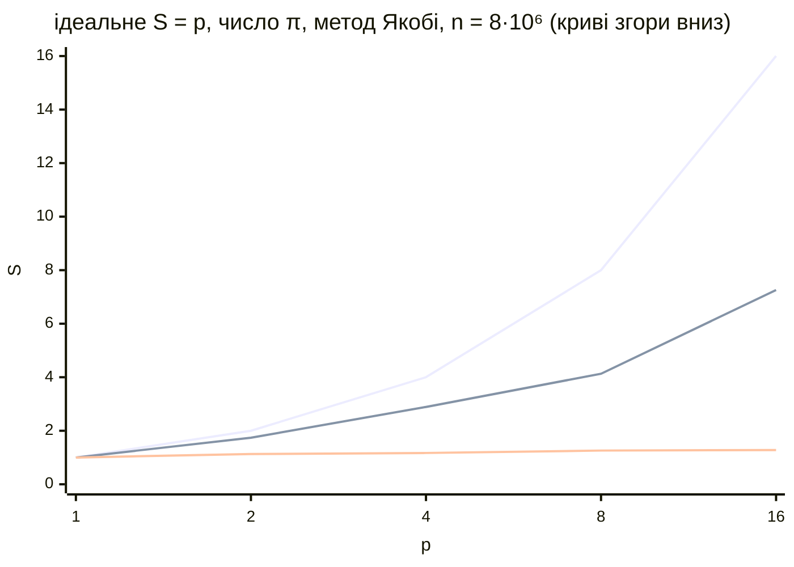

# Приклади та типові помилки

## Приклади програм

Усі програми зібрано проєктом CMake з розділу «Проєкт CMake» (GCC 15.2, Open MPI 5.0.10, конфігурація Release, `-O3`) і запущено у WSL2 (Ubuntu 26.04) на Intel Core i9-11900KF (8 ядер, 16 логічних процесорів). Час – медіана 5 запусків; під час вимірювань у WSL працювали інші програми, тому значення коливаються на 5–15 %.

### Число π: Bcast і Reduce

Програма обчислює $\pi = \int_{0}^{1} 4 / (1 + x^{2}) \mathrm{d} x$ методом середніх прямокутників (як у темі 10). Кількість кроків задає аргумент рангу 0, який розсилає її всім операцією `MPI_Bcast`; кожен ранг підсумовує свої кроки, `MPI_Reduce` збирає суму. Час вимірюється п’ять разів між `MPI_Barrier`, для кожного запуску береться час найповільнішого рангу (`MPI_MAX`), і ранг 0 виводить медіану.

```cpp
#include <mpi.h>
#include <algorithm>
#include <cmath>
#include <cstdlib>
#include <numbers>
#include <print>

// Частина суми методу середніх прямокутників для цього рангу:
// ітерації rank, rank + size, rank + 2·size, … (циклічний розподіл).
double PartialSum(long long steps, int rank, int size)
{
    const double h = 1.0 / steps;
    double sum = 0.0;
    for (long long i = rank; i < steps; i += size)
    {
        double x = (i + 0.5) * h;
        sum += 4.0 / (1.0 + x * x);
    }
    return sum * h;
}

int main(int argc, char* argv[])
{
    MPI_Init(&argc, &argv);
    int rank = 0, size = 0;
    MPI_Comm_rank(MPI_COMM_WORLD, &rank);
    MPI_Comm_size(MPI_COMM_WORLD, &size);

    // Кількість кроків знає лише ранг 0 і розсилає її всім.
    long long steps = 0;
    if (rank == 0)
        steps = argc > 1 ? std::atoll(argv[1]) : 2'000'000'000LL;
    MPI_Bcast(&steps, 1, MPI_LONG_LONG, 0, MPI_COMM_WORLD);

    double pi = 0.0, times[5];
    for (double& t : times)                   // медіана 5 запусків
    {
        MPI_Barrier(MPI_COMM_WORLD);          // спільний старт
        double start = MPI_Wtime();
        double local = PartialSum(steps, rank, size);
        MPI_Reduce(&local, &pi, 1, MPI_DOUBLE, MPI_SUM, 0,
                   MPI_COMM_WORLD);
        t = MPI_Wtime() - start;
    }
    // Час запуску – час найповільнішого рангу.
    double slowest[5];
    MPI_Reduce(times, slowest, 5, MPI_DOUBLE, MPI_MAX, 0,
               MPI_COMM_WORLD);
    if (rank == 0)
    {
        std::sort(slowest, slowest + 5);
        std::println("{} {:.4f} {:.12f} {:.1e}", size, slowest[2], pi,
                     std::abs(pi - std::numbers::pi));
    }
    MPI_Finalize();
}
```

Програма виводить один рядок: кількість процесів, час, $\pi$ і похибку. Таблицю прискорення будує скрипт `scale.sh`, який запускає програму для 1–16 процесів і обчислює $S$ та $E$ утилітою `awk`. Для 16 процесів на 8 ядрах потрібен ключ `--use-hwthread-cpus` (слоти – логічні процесори):

```bash
#!/bin/bash
# Серія запусків для 1, 2, 4, 8, 16 процесів і таблиця S та E.
for np in 1 2 4 8 16; do
    # 16 рангів на 8 ядрах: логічні процесори SMT як окремі слоти.
    opts=""; [ $np -gt 8 ] && opts="--use-hwthread-cpus"
    mpirun -np $np $opts ./build/pi
done | awk 'NR == 1 { t1 = $2
                      printf "%3s %8s %6s %5s %16s %8s\n",
                             "np", "T, с", "S", "E", "pi", "похибка" }
            { s = t1 / $2
              printf "%3d %8.3f %6.2f %4.0f%% %16s %8s\n",
                     $1, $2, s, 100 * s / $1, $3, $4 }'
```

Результат `bash scale.sh` (рис. 12.11):

```
np     T, с      S     E               pi  похибка
 1    1.604   1.00  100%   3.141592653590  4.6e-14
 2    0.919   1.74   87%   3.141592653590  1.3e-13
 4    0.554   2.89   72%   3.141592653590  4.6e-14
 8    0.388   4.13   52%   3.141592653590  1.8e-15
16    0.221   7.26   45%   3.141592653590  1.0e-13
```

::: info Знімок екрана
Ubuntu terminal (WSL2): `bash scale.sh` in the folder of the lecture project; the table np, T, S, E, pi, похибка for 1, 2, 4, 8, 16 processes
:::

Рис. 12.11. Таблиця масштабованості MPI-програми {.caption}

Результат не залежить від кількості процесів у межах 12 знаків, а похибка змінюється через інший порядок додавання. Обмін тут мінімальний (одне число в `MPI_Bcast` і одне в `MPI_Reduce`), проте прискорення на 8 процесах лише 4,1. Причина не в MPI: та сама програма на OpenMP у WSL з `OMP_PLACES=cores OMP_PROC_BIND=spread` дала майже ті самі часи (0,57 с на 4 потоках і 0,38 с на 8). Один процес працює на найвищій частоті турборежиму, а коли завантажено всі ядра, частота знижується; крім того, віртуальні процесори WSL2 ділять ядра з Windows і з іншими програмами. Вісім серій запусків дали на 4 процесах прискорення від 2,0 до 3,3, тому в таблиці наведено серію з медіанними значеннями. 16 процесів на логічних процесорах SMT прискорюють ще в 1,75 раза, бо цикл обчислює ділення, а не звертається до пам’яті. Графік прискорення разом із методом Якобі (наступний приклад) наведено на рис. 12.12.



Рис. 12.12. Прискорення програм MPI у WSL2 (i9-11900KF, 8 ядер) {.caption}

### Кільцевий обмін і взаємоблокування

Процеси утворюють кільце: ранг $r$ на кожному кроці передає блок чисел правому сусідові $(r + 1) \bmod p$ і отримує блок від лівого. Отриманий блок додається до суми й передається далі, тому після $p - 1$ кроків кожен ранг має суму блоків усіх рангів ($1 + 2 + \dots + p$). Спосіб обміну і розмір блоку задають аргументи.

```cpp
#include <mpi.h>
#include <cstdlib>
#include <print>
#include <string_view>
#include <vector>

// Кільцевий обмін: на кожному кроці ранг передає блок правому
// сусідові й отримує блок від лівого. Після size - 1 кроків кожен
// ранг має суму блоків усіх рангів.
// Аргументи: send | ssend | sendrecv | isend, кількість чисел.
int main(int argc, char* argv[])
{
    MPI_Init(&argc, &argv);
    int rank = 0, size = 0;
    MPI_Comm_rank(MPI_COMM_WORLD, &rank);
    MPI_Comm_size(MPI_COMM_WORLD, &size);

    std::string_view mode = argc > 1 ? argv[1] : "sendrecv";
    int count = argc > 2 ? std::atoi(argv[2]) : 1000;
    int right = (rank + 1) % size;
    int left = (rank - 1 + size) % size;

    std::vector<double> out(count, rank + 1.0), in(count), sum = out;
    double start = MPI_Wtime();
    for (int step = 1; step < size; ++step)
    {
        if (mode == "send" || mode == "ssend")
        {   // Небезпечно: усі ранги спочатку відправляють.
            if (mode == "send")
                MPI_Send(out.data(), count, MPI_DOUBLE, right, 0,
                         MPI_COMM_WORLD);
            else
                MPI_Ssend(out.data(), count, MPI_DOUBLE, right, 0,
                          MPI_COMM_WORLD);
            MPI_Recv(in.data(), count, MPI_DOUBLE, left, 0,
                     MPI_COMM_WORLD, MPI_STATUS_IGNORE);
        }
        else if (mode == "sendrecv")
        {   // Відправлення й отримання однією операцією.
            MPI_Sendrecv(out.data(), count, MPI_DOUBLE, right, 0,
                         in.data(), count, MPI_DOUBLE, left, 0,
                         MPI_COMM_WORLD, MPI_STATUS_IGNORE);
        }
        else
        {   // Неблокуючі: спочатку обидва запити, потім Waitall.
            MPI_Request requests[2];
            MPI_Irecv(in.data(), count, MPI_DOUBLE, left, 0,
                      MPI_COMM_WORLD, &requests[0]);
            MPI_Isend(out.data(), count, MPI_DOUBLE, right, 0,
                      MPI_COMM_WORLD, &requests[1]);
            MPI_Waitall(2, requests, MPI_STATUSES_IGNORE);
        }
        for (int i = 0; i < count; ++i) sum[i] += in[i];
        out.swap(in);                       // далі передаємо отримане
    }
    double time = MPI_Wtime() - start;

    if (rank == 0)
        std::println("{:<8} {:>8} чисел: сума = {} (очікується {}), "
                     "{:.3f} мс", mode, count, sum[0],
                     size * (size + 1) / 2, time * 1e3);
    MPI_Finalize();
}
```

Після `MPI_Waitall` обидва буфери вільні, тому `out.swap(in)` безпечний. Запуски з 4 процесами (`timeout 10` завершує зависле завдання через 10 с, код 124):

```bash
for count in 500 511; do
    timeout 10 mpirun -np 4 ./build/ring send $count; echo "код $?"
done
timeout 10 mpirun -np 4 ./build/ring ssend 1; echo "код $?"
mpirun -np 4 ./build/ring sendrecv 100000
mpirun -np 4 ./build/ring isend 100000
```

```
send          500 чисел: сума = 10 (очікується 10), 0.101 мс
код 0
код 124
код 124
sendrecv   100000 чисел: сума = 10 (очікується 10), 0.758 мс
isend      100000 чисел: сума = 10 (очікується 10), 0.790 мс
```

З `MPI_Send` програма працює для 500 чисел (4000 байтів) і зависає вже для 511 чисел: 4088 байтів разом із заголовком перевищують межу негайного відправлення 4096 байтів, і `MPI_Send` чекає на `MPI_Recv` сусіда, який сам стоїть в `MPI_Send`. З `MPI_Ssend` програма зависає навіть для одного числа. Така помилка особливо небезпечна: програма проходить тести на малих даних і зависає на реальних. Варіанти з `MPI_Sendrecv` і неблокуючими операціями працюють для будь-якого розміру.

### Метод Якобі: декомпозиція області й гібридна версія

Метод Якобі розв’язує систему лінійних рівнянь із діагональною перевагою $(2 + \sigma) u_{i} - u_{i - 1} - u_{i + 1} = b_{i}$, $i = 0 \dots n - 1$, $u_{- 1} = u_{n} = 0$ – таку систему розв’язують на кожному кроці неявної схеми для рівняння теплопровідності. Ітерація $$u_{i}^{k + 1} = (u_{i - 1}^{k} + u_{i + 1}^{k} + b_{i}) / (2 + \sigma)$$ для кожного $i$ використовує лише сусідні вузли, тому вектор ділять на $p$ суміжних блоків. Кожен ранг зберігає свій блок і дві **гало-комірки** з крайніми вузлами сусідів і перед кожною ітерацією обмінюється ними (`MPI_Sendrecv` ліворуч і праворуч). Праву частину $b$ обрано так, що точний розв’язок $u_{i} = \sin (\pi x_{i})$, тому програма виводить найбільшу похибку. Програма гібридна: ітерації в межах блоку виконуються потоками OpenMP, а обміни – головним потоком між паралельними областями (`MPI_THREAD_FUNNELED`). З `OMP_NUM_THREADS=1` це «чиста» програма MPI.

```cpp
#include <mpi.h>
#include <omp.h>
#include <algorithm>
#include <cmath>
#include <cstdlib>
#include <numbers>
#include <print>
#include <vector>

// Метод Якобі для системи (2 + σ)·u[i] - u[i-1] - u[i+1] = b[i],
// i = 0…n-1, u[-1] = u[n] = 0 (крок неявної схеми теплопровідності).
// Праву частину b обрано так, що точний розв'язок u[i] = sin(πx[i]).
// Аргументи: кількість невідомих n, кількість ітерацій.
const double Sigma = 0.1;

double Exact(long g, long n)             // g – глобальний номер вузла
{
    return std::sin(std::numbers::pi * (g + 1) / (n + 1));
}

int main(int argc, char* argv[])
{
    int provided = 0;
    MPI_Init_thread(&argc, &argv, MPI_THREAD_FUNNELED, &provided);
    int rank = 0, size = 0;
    MPI_Comm_rank(MPI_COMM_WORLD, &rank);
    MPI_Comm_size(MPI_COMM_WORLD, &size);
    if (provided < MPI_THREAD_FUNNELED)
        MPI_Abort(MPI_COMM_WORLD, 1);

    const long n = argc > 1 ? std::atol(argv[1]) : 8'000'000;
    const int iters = argc > 2 ? std::atoi(argv[2]) : 500;
    // Блоковий розподіл: перші n % size рангів отримують на 1 більше.
    const long local = n / size + (rank < n % size ? 1 : 0);
    const long first = rank * (n / size)
                       + std::min<long>(rank, n % size);
    // Сусіди; MPI_PROC_NULL – «немає сусіда», обмін з ним порожній.
    const int left = rank > 0 ? rank - 1 : MPI_PROC_NULL;
    const int right = rank < size - 1 ? rank + 1 : MPI_PROC_NULL;

    // u[0] і u[local + 1] – гало-комірки з вузлами сусідів.
    std::vector<double> u(local + 2, 0.0), v(local + 2, 0.0),
                        b(local + 2);
    #pragma omp parallel for
    for (long i = 1; i <= local; ++i)
    {
        long g = first + i - 1;
        b[i] = (2 + Sigma) * Exact(g, n)
               - (g > 0 ? Exact(g - 1, n) : 0)
               - (g < n - 1 ? Exact(g + 1, n) : 0);
    }

    double commTime = 0.0;
    MPI_Barrier(MPI_COMM_WORLD);
    double start = MPI_Wtime();
    for (int it = 0; it < iters; ++it)
    {
        double c = MPI_Wtime();
        // Обмін гало: перший вузол – лівому сусідові, від правого –
        // його перший вузол у u[local + 1]; потім у зворотний бік.
        MPI_Sendrecv(&u[1], 1, MPI_DOUBLE, left, 0,
                     &u[local + 1], 1, MPI_DOUBLE, right, 0,
                     MPI_COMM_WORLD, MPI_STATUS_IGNORE);
        MPI_Sendrecv(&u[local], 1, MPI_DOUBLE, right, 1,
                     &u[0], 1, MPI_DOUBLE, left, 1,
                     MPI_COMM_WORLD, MPI_STATUS_IGNORE);
        commTime += MPI_Wtime() - c;

        // Обчислення – потоками OpenMP усередині рангу.
        #pragma omp parallel for schedule(static)
        for (long i = 1; i <= local; ++i)
            v[i] = (u[i - 1] + u[i + 1] + b[i]) / (2 + Sigma);
        u.swap(v);
    }
    double time = MPI_Wtime() - start;

    // Найбільша похибка відносно точного розв'язку.
    double error = 0.0;
    #pragma omp parallel for reduction(max:error)
    for (long i = 1; i <= local; ++i)
        error = std::max(error,
                         std::abs(u[i] - Exact(first + i - 1, n)));
    MPI_Allreduce(MPI_IN_PLACE, &error, 1, MPI_DOUBLE, MPI_MAX,
                  MPI_COMM_WORLD);
    double times[2] = {time, commTime}, slowest[2];
    MPI_Reduce(times, slowest, 2, MPI_DOUBLE, MPI_MAX, 0,
               MPI_COMM_WORLD);
    if (rank == 0)
        std::println("{:>2} x {:<2} {:>8.3f} {:>8.3f} {:>10.2e}",
                     size, omp_get_max_threads(), slowest[0],
                     slowest[1], error);
    MPI_Finalize();
}
```

Ранги 0 і $p - 1$ мають лише одного сусіда: другий дорівнює `MPI_PROC_NULL`, і відповідна половина `MPI_Sendrecv` нічого не робить, а гало-комірка залишається нулем (гранична умова). Рядок результату: «ранги × потоки», час ітерацій, час обмінів `Tcomm` (найбільший серед рангів), похибка. Скрипт `jscale.sh` запускає кожну конфігурацію 5 разів і виводить рядок із медіанним часом (сортування за четвертим стовпцем):

```bash
#!/bin/bash
# Масштабованість методу Якобі: медіана 5 запусків конфігурації.
# Аргументи: n ітерацій [weak] (weak – n на один ранг).
median() {       # медіана 5 запусків за часом (4-й стовпець)
    for k in 1 2 3 4 5; do "$@"; done | sort -g -k4 | sed -n 3p
}
export OMP_NUM_THREADS=1
for np in 1 2 4 8 16; do
    opts=""; [ $np -gt 8 ] && opts="--use-hwthread-cpus"
    n=$1; [ "$3" == weak ] && n=$(($1 * np))
    median mpirun -np $np $opts ./build/jacobi $n $2
done
```

Сильна масштабованість для двох розмірів: $8 \cdot 10^{6}$ невідомих (три масиви по 64 МБ, 500 ітерацій) і $4 \cdot 10^{5}$ невідомих (9,6 МБ, вміщуються в кеш L3; 10 000 ітерацій), потім слабка – $5 \cdot 10^{5}$ невідомих на ранг:

```bash
bash jscale.sh 8000000 500; bash jscale.sh 400000 10000
bash jscale.sh 500000 2000 weak
```

```
n = 8000000, 500 ітерацій:
 1 x 1     3.779    0.000   2.54e-11
 2 x 1     3.348    0.080   2.54e-11
 4 x 1     3.230    0.433   2.54e-11
 8 x 1     2.990    0.695   2.54e-11
16 x 1     2.947    1.264   2.54e-11
n = 400000, 10000 ітерацій:
 1 x 1     1.918    0.002   3.33e-15
 2 x 1     1.076    0.092   3.33e-15
 4 x 1     0.675    0.099   3.33e-15
 8 x 1     0.506    0.187   3.33e-15
16 x 1     0.651    0.422   3.33e-15
```

```
n = 500000 на ранг, 2000 ітерацій:
 1 x 1     0.671    0.001   3.33e-15
 2 x 1     1.128    0.029   3.33e-15
 4 x 1     2.813    0.391   3.33e-15
 8 x 1     6.718    1.678   3.33e-15
16 x 1    13.230    7.070   3.44e-15
```

Похибка однакова для будь-якої кількості процесів, отже, обмін гало правильний. Для $8 \cdot 10^{6}$ невідомих прискорення на 8 процесах лише 1,26: кожна ітерація читає й записує по 8 байтів на вузол у трьох масивах і майже не обчислює, тож усі ядра чекають на одну шину пам’яті (як приклад з теплопровідністю в темі 10). Коли дані вміщуються в кеш ($4 \cdot 10^{5}$ невідомих), прискорення на 8 процесах – 3,8, а на 16 процесах час зростає: ранги на логічних процесорах одного ядра заважають один одному, і частка очікування в обміні (`Tcomm`) сягає 65 %. Слабка масштабованість на одному комп’ютері для такої задачі неможлива: обсяг даних зростає разом з кількістю процесів, а пропускна здатність пам’яті – ні, тому час зростає майже пропорційно $p$ (ефективність 10 % на 8 процесах). На кластері кожен вузол додає власну пам’ять, і та сама програма масштабується значно краще; саме це вимірюють у темі 13.

Для гібридних конфігурацій скрипт `hybrid.sh` ділить 8 ядер між рангами (`--map-by slot:PE=t`) і задає кожному рангу $t$ потоків OpenMP, прив’язаних до ядер:

```bash
#!/bin/bash
# Конфігурації «ранги × потоки» для 8 ядер: кожен ранг отримує
# PE=t ядер (--map-by slot:PE=t), а його потоки OpenMP – по ядру.
median() {       # медіана 5 запусків за часом (4-й стовпець)
    for k in 1 2 3 4 5; do "$@"; done | sort -g -k4 | sed -n 3p
}
export OMP_PLACES=cores OMP_PROC_BIND=close
for r in 8 4 2 1; do
    t=$((8 / r))
    OMP_NUM_THREADS=$t median mpirun -np $r --map-by slot:PE=$t \
        -x OMP_NUM_THREADS ./build/jacobi "$@"
done
```

```bash
bash hybrid.sh 8000000 500; bash hybrid.sh 400000 10000
```

```
n = 8000000, 500 ітерацій:
 8 x 1     3.326    0.701   2.54e-11
 4 x 2     3.085    0.195   2.54e-11
 2 x 4     3.088    0.029   2.54e-11
 1 x 8     3.090    0.001   2.54e-11
n = 400000, 10000 ітерацій:
 8 x 1     0.574    0.206   3.33e-15
 4 x 2     0.543    0.114   3.33e-15
 2 x 4     0.560    0.048   3.33e-15
 1 x 8     0.547    0.001   3.33e-15
```

На одному комп’ютері всі конфігурації дають майже однаковий час (різниця в межах коливань вимірювань): задачу обмежує пам’ять, а не кількість процесів. Зате з меншою кількістю рангів різко зменшується час обмінів: з 0,70 с для 8 рангів до 0,03 с для 2 рангів. На кластері з мережею 1 Гбіт/с кожен обмін коштує десятки мікросекунд замість часток мікросекунди, тому конфігурація «ранг на сокет, потоки на ядра» там вигідніша. Для порівняння: той самий запуск `OMP_NUM_THREADS=8 mpirun -np 1 ./build/jacobi 400000 10000` без `--map-by slot:PE=8` триває 1,86 с проти 0,56 с – усі 8 потоків прив’язано до одного ядра.

## Налагодження та типові помилки

Найпростіший засіб налагодження – виведення з номером рангу: `std::println("[{}] …", rank, …)` або ключ `mpirun --output tag`, який позначає кожен рядок як `[1,ранг]<stdout>:`. Виведення різних процесів перемішується, тому для впорядкованого звіту дані збирають на ранзі 0 (`MPI_Gather`) і виводять там. Для зависань корисні `timeout` і приєднання налагоджувача до окремого процесу (`gdb -p PID` або *Attach to Process* у CLion). Типові помилки наведено в табл. 12.12; повідомлення Open MPI 5.0 скопійовано з реальних запусків.

Таблиця 12.12. Типові помилки в програмах MPI {.caption}

| **Проблема** | **Причина та виправлення** |
| --- | --- |
| програма зависає без повідомлень | взаємоблокування: усі ранги спочатку відправляють, або тег, тип чи ранг у `MPI_Recv` не відповідає `MPI_Send`, або колективну операцію викликали не всі ранги; `MPI_Sendrecv`, неблокуючі операції, перевірка конвертів |
| працює на малих даних, зависає на великих | програма покладається на буферизацію `MPI_Send` (межа 4096 байтів у спільній пам’яті); перевірити з `MPI_Ssend`, виправити порядок обмінів |
| `MPI_ERR_TRUNCATE: message truncated` | буфер `MPI_Recv` менший за повідомлення; `MPI_Probe` і `MPI_Get_count` або більший буфер |
| `help about: prun:proc-exit-no-sync` | процес завершився без `MPI_Finalize` (`return` у гілці одного рангу, виняток); викликати `MPI_Finalize` на всіх шляхах або `MPI_Abort` |
| `help about: prte-rmaps-base:alloc-error` | процесів більше, ніж слотів (ядер); `--use-hwthread-cpus`, `--oversubscribe`, `slots=` у файлі вузлів |
| `help about: …` замість тексту помилки | у пакетах Ubuntu немає файлів довідки PRRTE; зміст помилки – у назві теми після `about:` |
| ранги працюють повільніше, ніж очікувалося | `--oversubscribe` без потреби (процеси не прив’язані), `mpirun -np 1` з багатьма потоками OpenMP на одному ядрі; перевірити `--report-bindings` |
| результат залежить від кількості процесів | неправильний розподіл меж блоків (залишок `n % p`), пропущений обмін гало чи кути сітки; порівняти з послідовною версією на малих даних |
| запуск на кількох ВМ зависає | немає SSH без пароля між усіма вузлами, брандмауер блокує порти, вибрано не той мережевий адаптер; `ssh вузол hostname`, `btl_tcp_if_include` |
