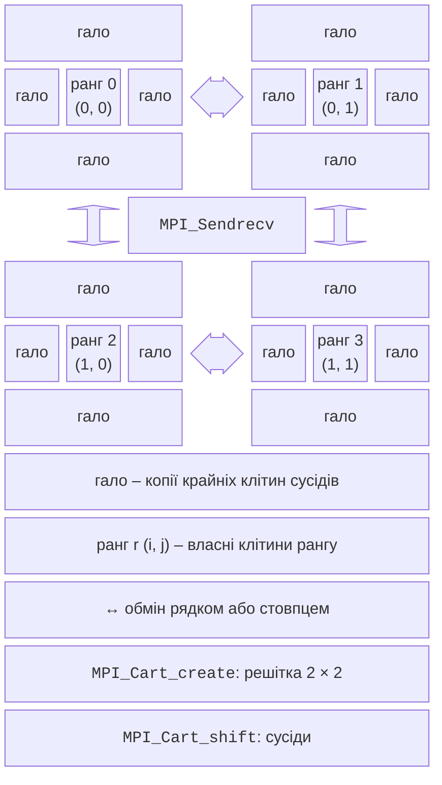

# Колективні операції та комунікатори

## Колективні операції

**Колективна операція** (*collective*) виконується **усіма** процесами комунікатора: кожен процес викликає ту саму функцію з узгодженими аргументами. Колективи простіші й зазвичай швидші за цикли з `MPI_Send`/`MPI_Recv`: реалізація обирає алгоритм для кількості процесів і розміру даних. Основні операції показано на рис. 12.5 і в табл. 12.7.

```mermaid
block-beta
  columns 1
  block:op0
    columns 9
    op0t["<code>MPI_Bcast</code>"]:9
    space:4 op0ar<["&nbsp;"]>(right) space:4
    op0x00["A"] op0x01[" "] op0x02[" "] op0x03[" "] op0p0["P0"] op0y00["A"] op0y01[" "] op0y02[" "] op0y03[" "]
    op0x10[" "] op0x11[" "] op0x12[" "] op0x13[" "] op0p1["P1"] op0y10["A"] op0y11[" "] op0y12[" "] op0y13[" "]
    op0x20[" "] op0x21[" "] op0x22[" "] op0x23[" "] op0p2["P2"] op0y20["A"] op0y21[" "] op0y22[" "] op0y23[" "]
    op0x30[" "] op0x31[" "] op0x32[" "] op0x33[" "] op0p3["P3"] op0y30["A"] op0y31[" "] op0y32[" "] op0y33[" "]
  end
  block:op1
    columns 9
    op1t["<code>MPI_Scatter</code>"]:9
    space:4 op1ar<["&nbsp;"]>(right) space:4
    op1x00["A"] op1x01["B"] op1x02["C"] op1x03["D"] op1p0["P0"] op1y00["A"] op1y01[" "] op1y02[" "] op1y03[" "]
    op1x10[" "] op1x11[" "] op1x12[" "] op1x13[" "] op1p1["P1"] op1y10["B"] op1y11[" "] op1y12[" "] op1y13[" "]
    op1x20[" "] op1x21[" "] op1x22[" "] op1x23[" "] op1p2["P2"] op1y20["C"] op1y21[" "] op1y22[" "] op1y23[" "]
    op1x30[" "] op1x31[" "] op1x32[" "] op1x33[" "] op1p3["P3"] op1y30["D"] op1y31[" "] op1y32[" "] op1y33[" "]
  end
  block:op2
    columns 9
    op2t["<code>MPI_Gather</code>"]:9
    space:4 op2ar<["&nbsp;"]>(right) space:4
    op2x00["A"] op2x01[" "] op2x02[" "] op2x03[" "] op2p0["P0"] op2y00["A"] op2y01["B"] op2y02["C"] op2y03["D"]
    op2x10["B"] op2x11[" "] op2x12[" "] op2x13[" "] op2p1["P1"] op2y10[" "] op2y11[" "] op2y12[" "] op2y13[" "]
    op2x20["C"] op2x21[" "] op2x22[" "] op2x23[" "] op2p2["P2"] op2y20[" "] op2y21[" "] op2y22[" "] op2y23[" "]
    op2x30["D"] op2x31[" "] op2x32[" "] op2x33[" "] op2p3["P3"] op2y30[" "] op2y31[" "] op2y32[" "] op2y33[" "]
  end
  block:op3
    columns 9
    op3t["<code>MPI_Allgather</code>"]:9
    space:4 op3ar<["&nbsp;"]>(right) space:4
    op3x00["A"] op3x01[" "] op3x02[" "] op3x03[" "] op3p0["P0"] op3y00["A"] op3y01["B"] op3y02["C"] op3y03["D"]
    op3x10["B"] op3x11[" "] op3x12[" "] op3x13[" "] op3p1["P1"] op3y10["A"] op3y11["B"] op3y12["C"] op3y13["D"]
    op3x20["C"] op3x21[" "] op3x22[" "] op3x23[" "] op3p2["P2"] op3y20["A"] op3y21["B"] op3y22["C"] op3y23["D"]
    op3x30["D"] op3x31[" "] op3x32[" "] op3x33[" "] op3p3["P3"] op3y30["A"] op3y31["B"] op3y32["C"] op3y33["D"]
  end
  block:op4
    columns 9
    op4t["<code>MPI_Reduce</code>"]:9
    space:4 op4ar<["&nbsp;"]>(right) space:4
    op4x00["1"] op4x01[" "] op4x02[" "] op4x03[" "] op4p0["P0"] op4y00["10"] op4y01[" "] op4y02[" "] op4y03[" "]
    op4x10["2"] op4x11[" "] op4x12[" "] op4x13[" "] op4p1["P1"] op4y10[" "] op4y11[" "] op4y12[" "] op4y13[" "]
    op4x20["3"] op4x21[" "] op4x22[" "] op4x23[" "] op4p2["P2"] op4y20[" "] op4y21[" "] op4y22[" "] op4y23[" "]
    op4x30["4"] op4x31[" "] op4x32[" "] op4x33[" "] op4p3["P3"] op4y30[" "] op4y31[" "] op4y32[" "] op4y33[" "]
  end
  block:op5
    columns 9
    op5t["<code>MPI_Allreduce</code>"]:9
    space:4 op5ar<["&nbsp;"]>(right) space:4
    op5x00["1"] op5x01[" "] op5x02[" "] op5x03[" "] op5p0["P0"] op5y00["10"] op5y01[" "] op5y02[" "] op5y03[" "]
    op5x10["2"] op5x11[" "] op5x12[" "] op5x13[" "] op5p1["P1"] op5y10["10"] op5y11[" "] op5y12[" "] op5y13[" "]
    op5x20["3"] op5x21[" "] op5x22[" "] op5x23[" "] op5p2["P2"] op5y20["10"] op5y21[" "] op5y22[" "] op5y23[" "]
    op5x30["4"] op5x31[" "] op5x32[" "] op5x33[" "] op5p3["P3"] op5y30["10"] op5y31[" "] op5y32[" "] op5y33[" "]
  end
  n["P0–P3 – процеси (корінь – P0);<br>стовпці – елементи даних;<br>операція редукції – сума"]
```



Рис. 12.5. Колективні операції MPI {.caption}

Таблиця 12.7. Колективні операції {.caption}

| **Операція** | **Дія** |
| --- | --- |
| `MPI_Bcast` | розіслати дані кореня (*root*) усім процесам |
| `MPI_Scatter` | розділити масив кореня на рівні частини: $i$-та частина – процесу $i$ |
| `MPI_Gather` | зібрати рівні частини всіх процесів у масив кореня |
| `MPI_Scatterv`, `MPI_Gatherv` | те саме для частин **різного** розміру: масиви кількостей `counts` і зміщень `displs` |
| `MPI_Allgather` | зібрати частини в усіх процесах |
| `MPI_Alltoall` | кожен процес надсилає $i$-ту частину процесу $i$ («транспонування») |
| `MPI_Reduce` | об’єднати значення операцією (`MPI_SUM`, `MPI_PROD`, `MPI_MIN`, `MPI_MAX`, `MPI_LAND`, `MPI_MINLOC` …) у корені |
| `MPI_Allreduce` | те саме з результатом в усіх процесах |
| `MPI_Scan` | префіксна редукція: процес $i$ отримує результат для процесів $0 \dots i$ |
| `MPI_Barrier` | синхронізація без даних |

```cpp
// Корінь 0 має size · 2 чисел, кожен процес отримує по 2.
std::vector<int> send, recv(size), mine(2);
if (rank == 0)
    for (int i = 0; i < size * 2; ++i) send.push_back(i * 10);
MPI_Scatter(send.data(), 2, MPI_INT, mine.data(), 2, MPI_INT, 0,
            MPI_COMM_WORLD);
int local = mine[0] + mine[1];
MPI_Gather(&local, 1, MPI_INT, recv.data(), 1, MPI_INT, 0,
           MPI_COMM_WORLD);                // на ранзі 0: 10 50 90 130
```

У `MPI_Scatter` і `MPI_Gather` кількість елементів задають **на один процес**, а масив кореня має `size` частин. Параметр `MPI_IN_PLACE` замість буфера відправлення означає «дані вже в буфері результату»: `MPI_Allreduce(MPI_IN_PLACE, &sum, 1, MPI_DOUBLE, MPI_SUM, comm)` замінює локальну суму глобальною.

Правила колективних операцій:

- їх викликають **усі** процеси комунікатора в **однаковому порядку**; якщо один процес пропустить виклик (наприклад, через `if (rank != 0)`), програма зависне;
- колективні операції не мають тегів і не змішуються з двоточковими;
- крім `MPI_Barrier`, вони не обов’язково синхронізують процеси: корінь `MPI_Bcast` може завершити виклик раніше, ніж інші отримають дані;
- операції редукції для дійсних чисел об’єднують значення в порядку, залежному від кількості процесів, тому останні знаки суми відрізняються (як у редукціях OpenMP).

**Алгоритми.** Наївна розсилка `MPI_Bcast` послідовними `MPI_Send` з кореня триває $p - 1$ передавань. Реалізації використовують **дерево** (*binomial tree*): на кожному кроці кожен процес, що вже має дані, передає їх іншому, і всі $p$ процесів отримують дані за $\log_{2} p$ кроків. Для великих масивів `MPI_Allreduce` виконується **кільцем** (*ring*): масив ділиться на $p$ частин, які обходять кільце так, що кожен процес передає лише близько $2 n$ елементів незалежно від $p$. Open MPI обирає алгоритм автоматично (компонент `coll/tuned`).

Стандарт MPI-3 додав **неблокуючі колективні операції** `MPI_Ibcast`, `MPI_Iallreduce` тощо, які повертають `MPI_Request` і завершуються `MPI_Wait`, а MPI-4.0 – **постійні** (*persistent*) колективи для обміну, що повторюється в циклі.

## Похідні типи, комунікатори та топології

### Похідні типи даних

Щоб передати структуру або несуміжні елементи масиву одним повідомленням, створюють **похідний тип** (*derived datatype*): опис розміщення даних у пам’яті. Тип створюють, реєструють функцією `MPI_Type_commit` і після використання звільняють `MPI_Type_free`:

- `MPI_Type_contiguous(n, old, &t)` – $n$ суміжних елементів;
- `MPI_Type_vector(count, blocklen, stride, old, &t)` – `count` блоків по `blocklen` елементів з кроком `stride`; так описують **стовпець** матриці, що зберігається рядками;
- `MPI_Type_create_struct` – структура з полями різних типів.

```cpp
struct Sale
{
    int shop;          // номер магазину
    double amount;     // сума, грн
    char date[11];     // "2026-09-18"
};

int lengths[3] = {1, 1, 11};
MPI_Aint offsets[3] = {offsetof(Sale, shop), offsetof(Sale, amount),
                       offsetof(Sale, date)};
MPI_Datatype types[3] = {MPI_INT, MPI_DOUBLE, MPI_CHAR};
MPI_Datatype saleType;
MPI_Type_create_struct(3, lengths, offsets, types, &saleType);
MPI_Type_commit(&saleType);
MPI_Send(sales, 2, saleType, 1, 0, MPI_COMM_WORLD);   // 2 записи
// …
MPI_Type_free(&saleType);
```

Зміщення полів беруть макросом `offsetof` (заголовок `<cstddef>`), а не рахують вручну: компілятор вирівнює поля, і між `int` та `double` є 4 невикористані байти. Розмір типу (*extent*), який повертає `MPI_Type_get_extent`, тут дорівнює `sizeof(Sale)` = 32 байти, тому масив записів передається правильно. Структури з `std::string` чи `std::vector` так передати не можна: вони містять вказівники на пам’ять процесу.

### Нові комунікатори

Функція `MPI_Comm_split(comm, color, key, &newcomm)` ділить процеси на групи: процеси з однаковим `color` потрапляють в один новий комунікатор, а `key` задає порядок рангів у ньому. Колективні операції в новому комунікаторі стосуються лише його процесів.

```cpp
int color = rank % 2;                     // парні й непарні ранги
MPI_Comm half;
MPI_Comm_split(MPI_COMM_WORLD, color, rank, &half);
int halfRank, halfSize, sum = 0;
MPI_Comm_rank(half, &halfRank);
MPI_Comm_size(half, &halfSize);
MPI_Allreduce(&rank, &sum, 1, MPI_INT, MPI_SUM, half);
std::println("світ {} -> група {}: ранг {} з {}, сума {}",
             rank, color, halfRank, halfSize, sum);
MPI_Comm_free(&half);
```

```
світ 0 -> група 0: ранг 0 з 2, сума 2
світ 1 -> група 1: ранг 0 з 2, сума 4
світ 2 -> група 0: ранг 1 з 2, сума 2
світ 3 -> група 1: ранг 1 з 2, сума 4
```

Так організують, наприклад, обчислення за рядками й стовпцями решітки процесів або окремі групи для незалежних підзадач. Функція `MPI_Comm_split_type` з `MPI_COMM_TYPE_SHARED` створює комунікатор процесів **одного вузла**, що корисно для гібридних програм.

### Декартові топології

Для задач на сітках процеси зручно розмістити в **декартовій топології** (*Cartesian topology*) – решітці розмірності 1, 2 або 3 (рис. 12.6):

```cpp
int dims[2] = {0, 0}, periods[2] = {1, 1};  // тор: краї замкнені
MPI_Dims_create(size, 2, dims);             // 4 → 2 × 2, 8 → 4 × 2
MPI_Comm grid;
MPI_Cart_create(MPI_COMM_WORLD, 2, dims, periods, 1, &grid);
int up, down, left, right;
MPI_Cart_shift(grid, 0, 1, &up, &down);     // сусіди по рядках
MPI_Cart_shift(grid, 1, 1, &left, &right);  // сусіди по стовпцях
```

`MPI_Dims_create` підбирає якомога «квадратнішу» решітку, `MPI_Cart_create` створює комунікатор з топологією (параметр `reorder = 1` дозволяє бібліотеці перенумерувати процеси, тому ранг беруть уже з нового комунікатора), `MPI_Cart_coords` повертає координати процесу, а `MPI_Cart_shift` повертає ранги сусідів у заданому вимірі. На краю неперіодичної решітки сусід дорівнює `MPI_PROC_NULL`: обмін із ним нічого не робить, тому крайові процеси не потребують окремих умов.



Рис. 12.6. Декомпозиція області та обмін гало-зонами {.caption}

**Декомпозиція області** (*domain decomposition*) ділить сітку на блоки, по одному на процес. Для обчислення крайових вузлів блоку потрібні значення сусідніх блоків, тому кожен блок має рамку **гало** (*halo, ghost cells*) з копіями крайових вузлів сусідів. Перед кожним кроком процеси обмінюються гало (`MPI_Sendrecv` з кожним сусідом), а потім обчислюють свої вузли незалежно. Обсяг обміну пропорційний **периметру** блоку, а обсяг обчислень – **площі**, тому двовимірна декомпозиція вигідніша за смуги, коли процесів багато. Приклад декартової топології для гри «Життя» наведено в лабораторній роботі.

## Паралельні алгоритми з передаванням повідомлень

Більшість програм MPI будують за кількома типовими схемами (табл. 12.8).

Таблиця 12.8. Типові схеми паралельних алгоритмів MPI {.caption}

| **Схема** | **Реалізація засобами MPI** |
| --- | --- |
| інтегрування, Монте-Карло | кожен процес обробляє свою частину кроків або випадкових точок (генератор з окремим зерном на ранг), `MPI_Reduce` підсумовує; обмін – кілька чисел |
| «майстер–робітник» (*master–worker*) | ранг 0 роздає завдання по одному, робітник після відповіді отримує наступне (`MPI_ANY_SOURCE`, теги «робота»/«стоп»); динамічний розподіл для нерівномірних завдань |
| множення матриць | `MPI_Bcast` матриці $B$, `MPI_Scatter` рядків $A$, локальне множення, `MPI_Gather` рядків $C$; для великих матриць – блоки на решітці процесів (алгоритм Кеннона) |
| парно-непарне сортування | кожен процес сортує свою частину; $p$ фаз обміну з сусідом (`MPI_Sendrecv` частин), після злиття менший процес залишає менші елементи |
| метод Якобі, клітинні автомати | декомпозиція області, обмін гало з сусідами на кожному кроці, `MPI_Allreduce` для норми похибки |

Спільне правило: **мінімізувати кількість і обсяг повідомлень**. Кожне повідомлення має фіксовану затримку, тому одне повідомлення з 1000 чисел значно дешевше за 1000 повідомлень по одному числу; дані, які потрібні всім, розсилають колективною операцією, а не з кожного процесу окремо. Прикладом «майстер–робітник» є множина Мандельброта в лабораторній роботі, а метод Якобі з декомпозицією наведено в розділі «Приклади програм».
