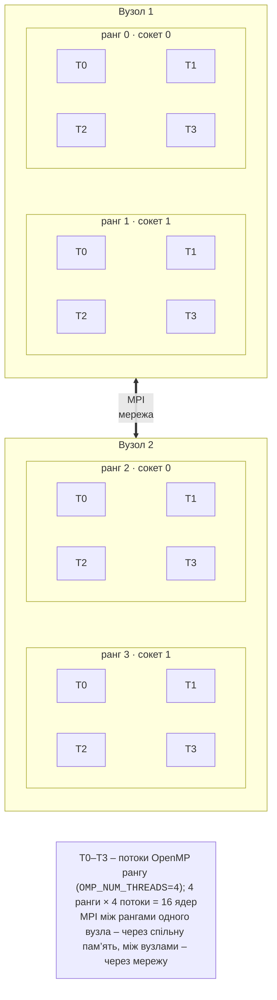

# Гібридні програми й продуктивність

## Гібридні програми MPI + OpenMP

**Гібридна програма** (*hybrid*) поєднує дві моделі: MPI між процесами (зазвичай по одному або по два на вузол – на кожен сокет), OpenMP між потоками всередині процесу (рис. 12.7). Переваги порівняно з «чистим» MPI, де ранг займає кожне ядро:

- менше процесів – менше повідомлень і менше копій гало-зон та допоміжних масивів у пам’яті вузла;
- потоки ділять дані без копіювання, а навантаження всередині вузла можна балансувати `schedule(dynamic)`;
- колективні операції на тисячах вузлів працюють із меншою кількістю учасників.

Недоліки: складніше програмування, розпаралелені OpenMP лише цикли, частина коду (обміни) виконується одним потоком, а неправильна прив’язка легко знищує виграш.



Рис. 12.7. Гібридна програма MPI + OpenMP {.caption}

### Рівні підтримки потоків

Якщо в програмі є потоки, MPI ініціалізують функцією `MPI_Init_thread`, указуючи, як потоки викликатимуть функції MPI (табл. 12.9). Бібліотека повертає в `provided` рівень, який вона фактично підтримує; якщо він нижчий за потрібний, програма має завершитися.

Таблиця 12.9. Рівні підтримки потоків у MPI {.caption}

| **Рівень** | **Хто викликає функції MPI** |
| --- | --- |
| `MPI_THREAD_SINGLE` | у процесі лише один потік |
| `MPI_THREAD_FUNNELED` | потоків багато, але MPI викликає лише головний потік (поза паралельними областями або в `masked`) |
| `MPI_THREAD_SERIALIZED` | будь-який потік, але не одночасно (наприклад, у `critical`) |
| `MPI_THREAD_MULTIPLE` | будь-які потоки одночасно; найзручніше, але найповільніше |

```cpp
int provided = 0;
MPI_Init_thread(&argc, &argv, MPI_THREAD_FUNNELED, &provided);
if (provided < MPI_THREAD_FUNNELED)
    MPI_Abort(MPI_COMM_WORLD, 1);
// …
for (int it = 0; it < iters; ++it)
{
    ExchangeHalo(u);                      // MPI – лише головний потік
    #pragma omp parallel for              // обчислення – потоками
    for (long i = 1; i <= local; ++i) v[i] = Update(u, i);
    u.swap(v);
}
```

Найпоширеніша схема – `MPI_THREAD_FUNNELED`: обміни виконуються між паралельними областями, тобто послідовно, а цикли – паралельно. Open MPI 5.0 у пакеті Ubuntu на запит `MPI_THREAD_MULTIPLE` повертає саме цей рівень (перевірено виведенням `provided` = 3), але в програмах курсу достатньо `FUNNELED`.

### Розміщення рангів і прив’язка

Щоб процеси й потоки не заважали один одному, кожен ранг прив’язують до **окремого набору ядер**, а потоки OpenMP – до ядер усередині цього набору (тема 10). В Open MPI 5.0 розміщенням керують ключі `--map-by` і `--bind-to`; прив’язку за замовчуванням описано в документації `mpirun`: для 1–2 процесів – до ядра, для більшої кількості – до сокета (*package*), без прив’язки – при `--oversubscribe`. У версії 5.0.10 у WSL процеси прив’язувалися до ядер і при `-np 4` та `-np 8`, тому фактичну прив’язку завжди перевіряють ключем `--report-bindings`.

Таблиця 12.10. Розміщення рангів і прив’язка в Open MPI 5.0 {.caption}

| **Ключ** | **Розміщення** |
| --- | --- |
| `--map-by core` (типово) | ранги по черзі на ядра: 0, 1, 2, … |
| `--map-by slot:PE=4` | кожному рангу 4 ядра (*processing elements*) поспіль |
| `--map-by ppr:2:package:PE=4` | по 2 ранги на сокет, по 4 ядра кожному |
| `--map-by node` | ранги по черзі на вузли (круговий розподіл) |
| `--map-by …:HWTCPUS`, `--use-hwthread-cpus` | одиниця розміщення – логічний процесор |
| `--bind-to core`, `package`, `none` | прив’язати до ядра, сокета або не прив’язувати |

Команда для 2 рангів по 4 потоки на 8 ядрах:

```bash
export OMP_NUM_THREADS=4 OMP_PLACES=cores OMP_PROC_BIND=close
mpirun -np 2 --map-by slot:PE=4 --report-bindings ./build/jacobi
```

```
[Intel:10420] Rank 0 bound to package[0][core:L0-3]
[Intel:10420] Rank 1 bound to package[0][core:L4-7]
```

Ранг 0 отримав ядра 0–3, ранг 1 – ядра 4–7; потоки OpenMP з `OMP_PLACES=cores` розміщуються лише в межах ядер свого рангу (рис. 12.8). Ключ `-x OMP_NUM_THREADS` передає змінну процесам на інших вузлах; на одному комп’ютері процеси й так успадковують середовище.

::: info Знімок екрана
Ubuntu terminal (WSL2): `OMP_NUM_THREADS=4 mpirun -np 2 --map-by slot:PE=4 --report-bindings ./build/jacobi`; the two «Rank N bound to package[0][core:L…]» lines and the program output
:::

Рис. 12.8. Прив’язка рангів гібридної програми до ядер {.caption}

::: tip Увага
Одиночний процес `mpirun -np 1` за замовчуванням прив’язується до **одного** ядра, і всі його потоки OpenMP змагаються за це ядро. У вимірюваннях цієї лекції метод Якобі з 8 потоками так працював у 3,3 раза повільніше, ніж із `--bind-to none` чи `--map-by slot:PE=8`. Правило: кількість ядер рангу (`PE`) має дорівнювати `OMP_NUM_THREADS`.
:::

## Запуск на кількох комп’ютерах

На кількох комп’ютерах (віртуальних машинах або вузлах кластера) `mpirun` запускає процеси через SSH (<https://docs.open-mpi.org/en/v5.0.x/launching-apps/ssh.html>). Умови, які вимагає документація Open MPI 5.0:

1. з кожного вузла на кожен вузол можна зайти через SSH **без пароля й фрази-пароля**: процеси запускаються деревом, тобто не лише з першого вузла;
2. на всіх вузлах установлено ту саму версію Open MPI **за тим самим шляхом** (у пакетах Ubuntu – `/usr/bin`), тому `mpirun`, бібліотеки й програма знаходяться без налаштування `PATH` і `LD_LIBRARY_PATH`;
3. програма лежить на всіх вузлах за однаковим шляхом: у спільній теці NFS (тема 13) або скопійована на кожен вузол;
4. вузли бачать один одного за іменами (`/etc/hosts` або DNS), а брандмауер дозволяє з’єднання TCP між ними (Open MPI використовує динамічні порти).

Послідовність дій для трьох віртуальних машин `node1`–`node3` з Ubuntu 26.04 (по 4 ядра), з’єднаних мережею 1 Гбіт/с:

```bash
# На кожній ВМ: однаковий користувач, Open MPI, компілятор.
sudo apt install openmpi-bin libopenmpi-dev g++ cmake ninja-build
# На node1: ключ без фрази-пароля і копія на всі вузли (і на себе).
ssh-keygen -t ed25519 -N "" -f ~/.ssh/id_ed25519
for h in node1 node2 node3; do ssh-copy-id $h; done
for h in node1 node2 node3; do ssh $h hostname; done  # без пароля
# Той самий ключ – на node2 і node3 (кожен з кожним).
for h in node2 node3; do scp ~/.ssh/id_ed25519* $h:.ssh/; done
```

Файл вузлів (*hostfile*) перелічує імена та кількість слотів; рядки з `#` – коментарі:

```
# hosts – вузли навчального стенда
node1 slots=4
node2 slots=4
node3 slots=4
```

```bash
mpirun --hostfile hosts -np 12 ./build/hello
mpirun --host node1:4,node2:4 -np 8 ./build/pi
mpirun --hostfile hosts -np 3 --map-by node ./build/pingpong
# Лише мережа ВМ 192.168.50.0/24 для MPI і для служб запуску:
mpirun --hostfile hosts -np 12 \
    --mca btl_tcp_if_include 192.168.50.0/24 \
    --prtemca oob_tcp_if_include 192.168.50.0/24 ./build/pi
```

Без `slots=` у файлі вузлів Open MPI вважає слотами ядра кожного вузла, а з `--host` без `:N` – один слот на вузол. Ключ `--map-by node` розміщує ранги по одному на вузол по черзі (для вимірювання мережевого обміну між двома рангами на різних вузлах). Якщо ВМ мають кілька мережевих адаптерів (NAT і внутрішня мережа), обміни слід явно спрямувати у внутрішню мережу параметрами `btl_tcp_if_include` (для повідомлень MPI) і `oob_tcp_if_include` (для службових з’єднань PRRTE), інакше запуск зависає на недоступній адресі. Результат запуску на трьох ВМ показано на рис. 12.9.

::: info Знімок екрана
Terminal on node1 (Ubuntu 26.04 VM): `cat hosts`, `mpirun --hostfile hosts -np 12 ./build/hello`; «Rank N of 12 on node1/node2/node3» lines from all three VMs
:::

Рис. 12.9. Запуск MPI-програми на трьох віртуальних машинах {.caption}

На кластері з планувальником завдань вузли й слоти `mpirun` бере з виділення планувальника, а завдання запускають командою `srun --mpi=pmix` у скрипті `sbatch`; це розглянуто в темі 13.

## Аналіз продуктивності

### Модель α–β

Час передавання повідомлення з $m$ байтів оцінюють **моделлю α–β** (модель Хокні):

$$
T (m) = \alpha + \beta m ,
$$

де $\alpha$ – **затримка** (*latency*): час на повідомлення без даних (виклики бібліотеки, мережевий стек), а $\beta$ – час передавання одного байта, обернений до **пропускної здатності** (*bandwidth*) $B = 1 / \beta$. Для малих повідомлень домінує $\alpha$, для великих – $\beta m$. Параметри вимірюють програмою «пінг-понг»: ранг 0 відправляє повідомлення рангу 1, той повертає його, і половина часу обміну «туди й назад» дорівнює $T (m)$.

```cpp
for (int r = 0; r < reps; ++r)
{
    if (rank == 0)
    {
        MPI_Send(buffer.data(), bytes, MPI_CHAR, 1, 0,
                 MPI_COMM_WORLD);
        MPI_Recv(buffer.data(), bytes, MPI_CHAR, 1, 0, MPI_COMM_WORLD,
                 MPI_STATUS_IGNORE);
    }
    else if (rank == 1)
    {
        MPI_Recv(buffer.data(), bytes, MPI_CHAR, 0, 0, MPI_COMM_WORLD,
                 MPI_STATUS_IGNORE);
        MPI_Send(buffer.data(), bytes, MPI_CHAR, 0, 0,
                 MPI_COMM_WORLD);
    }
}
double t = (MPI_Wtime() - start) / reps / 2;   // в один бік
```

Повну програму `pingpong.cpp` (розміри від 1 байта до 16 МБ з кроком ×16, 1000 повторень для малих і 50 для великих повідомлень) запущено двома рангами у WSL: через спільну пам’ять (типовий вибір Open MPI на одному комп’ютері) і через TCP на петлевому інтерфейсі (`--mca pml ob1 --mca btl self,tcp`), що імітує мережевий стек без самої мережі (табл. 12.11).

Таблиця 12.11. Час передавання повідомлення «пінг-понг» у WSL {.caption}

| **Байтів** | **Спільна пам’ять, мкс** | **МБ/с** | **TCP (петля), мкс** | **МБ/с** |
| --- | --- | --- | --- | --- |
| 1 | 0,14 | 7 | 2,89 | 0 |
| 4096 | 1,20 | 3418 | 3,69 | 1111 |
| 65 536 | 5,56 | 11 796 | 18,43 | 3555 |
| 1 048 576 | 59,41 | 17 649 | 109,59 | 9568 |
| 16 777 216 | 1875,23 | 8947 | 2200,45 | 7624 |

У спільній пам’яті $\alpha \approx 0 {,} 14$ мкс, а найбільша пропускна здатність – близько 17 ГБ/с для повідомлень 1 МБ (16 МБ уже не вміщуються в кеш L3, і швидкість падає вдвічі). Мережевий стек TCP додає до затримки приблизно 3 мкс навіть без мережі. У реальній мережі Ethernet 1 Гбіт/с між віртуальними машинами типові значення значно гірші: $\alpha$ – десятки мікросекунд, $B$ – не більше 117 МБ/с (теоретична межа 125 МБ/с мінус заголовки кадрів). Ці значення – орієнтир для прогнозу; справжні параметри стенда студенти вимірюють тією самою програмою з `--map-by node`.

**Приклад прогнозу.** Метод Якобі на сітці $4000 \times 4000$ дійсних чисел, поділеній на 4 смуги, на кожному кроці передає кожному сусідові рядок з 4000 чисел (32 000 байтів). За $\alpha = 50$ мкс і $B = 110$ МБ/с один обмін триває $50 + 32000 / 110 \approx 340$ мкс, а обчислення смуги з 4 млн вузлів – кілька мілісекунд, тобто комунікації забирають близько 10 % часу. На 64 процесах смуга стає в 16 разів вужчою, обчислення скорочуються в 16 разів, а обмін – ні, і комунікації переважають. Тому для великої кількості процесів переходять до двовимірної декомпозиції та гібридних програм.

### Сильна й слабка масштабованість

**Сильна масштабованість** (*strong scaling*): розмір задачі сталий, кількість процесів зростає; ідеально час зменшується в $p$ разів, а межу задає закон Амдала (тема 1). **Слабка масштабованість** (*weak scaling*): розмір задачі зростає пропорційно $p$ (сталий обсяг на процес); ідеально час не змінюється, а ефективність $E = T_{1} / T_{p}$ показує втрати на комунікації (закон Густафсона). Для програм MPI додатково вимірюють **частку комунікацій** – частину часу, витрачену у функціях обміну (у прикладах лекції – сумарний час `MPI_Sendrecv`, `Tcomm`). На одному комп’ютері цей час включає й очікування повільніших сусідів, тобто нерівномірність завантаження.

Під час роботи програми процеси рангів видно в `htop` (рис. 12.10): кожен ранг – окремий процес, дочірній для `prterun` (так називається `mpirun` в Open MPI 5.0). На кластері завантаження вузлів переглядають так само на кожному вузлі або засобами моніторингу (тема 13).

::: info Знімок екрана
Ubuntu terminal (WSL2): `htop` in tree view (F5) while `mpirun -np 8 ./build/jacobi 8000000 5000` runs in a second terminal; eight `jacobi` processes under `prterun`, eight loaded cores
:::

Рис. 12.10. Процеси MPI-рангів на комп’ютері {.caption}

Час, виміряний на одному комп’ютері, не переноситься напряму на кластер: у WSL процеси обмінюються через спільну пам’ять (затримка менша за мікросекунду), але ділять одну шину пам’яті й кеш L3, а частота процесора знижується, коли завантажено всі ядра. На кластері ситуація протилежна: пам’ять кожного вузла окрема, а мережа повільніша на два порядки.
