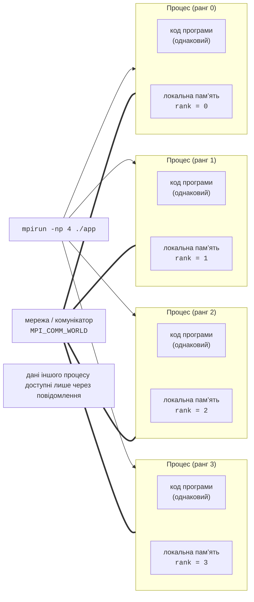

# Стандарт MPI і запуск програм

## Модель розподіленої пам’яті та стандарт MPI

У темах 9–11 усі потоки працювали в **спільній пам’яті** (*shared memory*) одного комп’ютера: будь-який потік міг прочитати будь-яку змінну програми. Обчислювальний кластер (тема 13) складається з багатьох **вузлів** (*nodes*) – окремих комп’ютерів, з’єднаних мережею. Кожен вузол має власну оперативну пам’ять, і процес на одному вузлі не може звернутися до пам’яті іншого. Це модель **розподіленої пам’яті** (*distributed memory*): процеси обмінюються даними лише **повідомленнями** (*messages*), які явно відправляє один процес і приймає інший.

**MPI** (*Message Passing Interface*) – стандарт бібліотеки передавання повідомлень для мов C, C++ і Fortran. Стандарт описує функції (`MPI_Send`, `MPI_Recv`, `MPI_Bcast` тощо), а реалізації, сумісні зі стандартом, надають бібліотеку й засоби запуску. Програма MPI зазвичай працює за моделлю **SPMD** (*Single Program, Multiple Data*): засіб запуску створює $p$ **процесів** з однією й тією самою програмою, а кожен процес отримує свій номер – **ранг** (*rank*) від 0 до $p - 1$ і за ним вирішує, яку частину даних обробляти (рис. 12.1). Процеси об’єднано в **комунікатор** (*communicator*) – групу процесів, у межах якої вони обмінюються повідомленнями; комунікатор усіх процесів програми називається `MPI_COMM_WORLD`.



Рис. 12.1. Модель SPMD з розподіленою пам’яттю {.caption}

На відміну від потоків, процеси MPI нічого не ділять між собою: у кожного власні копії всіх змінних, тому гонитв за даними між процесами немає, а кожен обмін видно в тексті програми. Ціна цього – явне розбиття даних і час на передавання повідомлень. Ті самі процеси можна запустити на одному комп’ютері (обмін через спільну пам’ять, швидко) або на кількох вузлах кластера (обмін через мережу, повільніше), не змінюючи програми.

### Стандарт і реалізації

Стандарт розвиває **MPI Forum** (<https://www.mpi-forum.org/docs/>), до якого входять розробники реалізацій, виробники обладнання та суперкомп’ютерні центри (табл. 12.1).

Таблиця 12.1. Версії стандарту MPI {.caption}

| **Версія** | **Ухвалено** | **Основні нововведення** |
| --- | --- | --- |
| MPI-3.1 | червень 2015 | неблокуючі колективні операції, односторонні обміни (RMA), доповнення MPI-3.0; основа більшості реалізацій |
| MPI-4.0 | червень 2021 | сеанси (*sessions*), розділені (*partitioned*) обміни, «великі» лічильники `MPI_Count`, постійні колективні операції |
| MPI-4.1 | листопад 2023 | уточнення й виправлення MPI-4.0 |
| MPI-5.0 | червень 2025 | уперше – стандартний двійковий інтерфейс (*ABI*): програму, зібрану з однією реалізацією, можна запускати з іншою |

Найпоширеніші відкриті реалізації:

- **Open MPI** (<https://www.open-mpi.org/>) – реалізація, яку використовує курс. У вересні 2026 року актуальна гілка – 5.0.x (остання версія 5.0.11, готується 6.0); розробники заявляють повну відповідність MPI-3.1 і багато можливостей MPI-4.0. Процеси запускає середовище **PRRTE** через інтерфейс **PMIx** (*Process Management Interface for Exascale*), через який з Open MPI працюють і планувальники завдань, зокрема Slurm (тема 13).
- **MPICH** (<https://www.mpich.org/>) – еталонна реалізація Аргоннської національної лабораторії; гілка 5.0 (стабільна версія 5.0.1) повністю підтримує MPI-5.0. На MPICH засновані Intel MPI і реалізації виробників суперкомп’ютерів.
- **Microsoft MPI** (<https://learn.microsoft.com/message-passing-interface/microsoft-mpi>) – реалізація для Windows, сумісна з MPICH (остання версія 10.1.3); вона відстає від нових версій стандарту, а вузли кластерів працюють під Linux, тому в курсі програми MPI збирають і запускають в Ubuntu (у WSL2 або на віртуальних машинах).

Програма, написана за стандартом, збирається будь-якою реалізацією без змін, відрізняються лише засоби запуску та їхні параметри. Далі всі команди наведено для Open MPI 5.0.

## Встановлення, збирання та запуск

### Встановлення в Ubuntu

В Ubuntu 26.04 Open MPI встановлюють із пакетів дистрибутива (версія 5.0.10 з PMIx 5.0.9):

```bash
sudo apt install openmpi-bin libopenmpi-dev   # mpirun, заголовки
ompi_info --version                           # Open MPI v5.0.10
mpicxx --showme                               # що додає обгортка
```

Пакет `openmpi-bin` містить засіб запуску `mpirun` (синоніми `mpiexec`, `prterun`) і **обгортки компілятора** (*wrapper compilers*) `mpicc` і `mpicxx`, а `libopenmpi-dev` – заголовок `mpi.h` і бібліотеки. Обгортка викликає звичайний `g++` і додає шляхи до заголовків та бібліотеки MPI; команда `mpicxx --showme` показує цей виклик:

```
g++ -I/usr/lib/x86_64-linux-gnu/openmpi/include
    -I/usr/lib/x86_64-linux-gnu/openmpi/include/openmpi
    -L/usr/lib/x86_64-linux-gnu/openmpi/lib -lmpi
```

Версію перевіряють командою `ompi_info --version`. Команда `mpirun --version` у пакетах Ubuntu 26.04 замість версії виводить повідомлення `Sorry! You were supposed to get help about: version But I couldn't open the help file`: у пакет не потрапили файли довідки середовища PRRTE. Так само «без тексту» виводяться й інші повідомлення `mpirun` про помилки, тому в них важливе слово після `help about:` – назва помилки (приклади – у розділі «Типові помилки»).

### Проєкт CMake

Файл із однією програмою можна зібрати обгорткою: `mpicxx -std=c++23 -O2 hello.cpp -o hello`. У проєкті CMake модуль `FindMPI` (<https://cmake.org/cmake/help/latest/module/FindMPI.html>) знаходить бібліотеку MPI і створює імпортовану ціль `MPI::MPI_CXX`, яка додає всі потрібні ключі без обгортки. Для гібридних програм додають ще `OpenMP::OpenMP_CXX` (тема 10). Один `CMakeLists.txt` збирає всі приклади лекції:

```cmake
cmake_minimum_required(VERSION 3.28)
project(MpiExamples LANGUAGES CXX)

set(CMAKE_CXX_STANDARD 23)
set(CMAKE_CXX_STANDARD_REQUIRED ON)
if(NOT CMAKE_BUILD_TYPE)
    set(CMAKE_BUILD_TYPE Release)
endif()

find_package(MPI REQUIRED)
find_package(OpenMP REQUIRED)

foreach(name hello pi ring pingpong jacobi)
    add_executable(${name} ${name}.cpp)
    target_link_libraries(${name} PRIVATE MPI::MPI_CXX)
endforeach()
# Гібридна програма: MPI між процесами, OpenMP усередині.
target_link_libraries(jacobi PRIVATE OpenMP::OpenMP_CXX)
```

Під час конфігурування (`cmake -S . -B build -G Ninja`) CMake виводить рядки `Found MPI_CXX: …/libmpi.so (found version "3.1")` і `Found OpenMP_CXX: -fopenmp (found version "4.5")`: версія MPI – це версія стандарту, яку реалізація заявляє повністю (макроси `MPI_VERSION` і `MPI_SUBVERSION`, у `ompi_info` – рядок `MPI API: 3.1.0`), а не версія Open MPI. Модуль також задає змінні `MPIEXEC_EXECUTABLE` (шлях до `mpiexec`) і `MPIEXEC_NUMPROC_FLAG` (`-n`), якими користуються для тестів CTest.

### Перша програма

Кожна програма MPI починається викликом `MPI_Init` і закінчується `MPI_Finalize`; між ними процес дізнається кількість процесів і свій ранг:

```cpp
#include <mpi.h>
#include <print>
#include <string_view>

int main(int argc, char* argv[])
{
    MPI_Init(&argc, &argv);

    int size = 0, rank = 0;
    MPI_Comm_size(MPI_COMM_WORLD, &size);   // кількість процесів
    MPI_Comm_rank(MPI_COMM_WORLD, &rank);   // номер цього процесу

    char host[MPI_MAX_PROCESSOR_NAME];
    int length = 0;
    MPI_Get_processor_name(host, &length);

    if (rank == 0)
    {
        char version[MPI_MAX_LIBRARY_VERSION_STRING];
        MPI_Get_library_version(version, &length);
        std::string_view text(version);       // до першої коми
        std::println("MPI {}.{}, {}", MPI_VERSION, MPI_SUBVERSION,
                     text.substr(0, text.find(',')));
    }
    std::println("Rank {} of {} on {}", rank, size, host);

    MPI_Finalize();
}
```

Програму збирають і запускають чотирма процесами (рис. 12.2):

```bash
cmake -S . -B build -G Ninja && cmake --build build
mpirun -np 4 ./build/hello
```

```
Rank 1 of 4 on Intel
Rank 3 of 4 on Intel
Rank 2 of 4 on Intel
MPI 3.1, Open MPI v5.0.10
Rank 0 of 4 on Intel
```

Кожен процес виводить свій рядок, а засіб запуску пересилає виведення всіх процесів у термінал у порядку надходження, тому порядок рядків щоразу інший. `Intel` – ім’я комп’ютера (у WSL збігається з іменем Windows-комп’ютера). Функція `MPI_Get_processor_name` на кластері показує, на якому вузлі працює процес.

::: info Знімок екрана
Windows Terminal, Ubuntu 26.04 (WSL2): `cmake --build build`, then `mpirun -np 4 ./build/hello`; unordered «Rank N of 4 on …» lines
:::

Рис. 12.2. Збирання та запуск MPI-програми {.caption}

### Засіб запуску mpirun

Засіб запуску розміщує процеси по **слотах** (*slots*) – місцях для процесів. Для локального комп’ютера Open MPI за замовчуванням вважає слотом **фізичне ядро**, тому на i9-11900KF (8 ядер, 16 логічних процесорів) команда `mpirun -np 16` завершується помилкою `prte-rmaps-base:alloc-error` («недостатньо слотів»). Основні ключі `mpirun` (<https://docs.open-mpi.org/en/v5.0.x/man-openmpi/man1/mpirun.1.html>) наведено в табл. 12.2.

Таблиця 12.2. Основні ключі `mpirun` в Open MPI 5.0 {.caption}

| **Ключ** | **Призначення** |
| --- | --- |
| `-np N` (`-n N`) | кількість процесів |
| `--use-hwthread-cpus` | слотами вважаються логічні процесори (16 замість 8); процеси прив’язуються до логічних процесорів |
| `--oversubscribe` | дозволити більше процесів, ніж слотів; процеси тоді **не прив’язуються** до ядер і працюють у «щадному» режимі очікування |
| `--hostfile файл`, `--host a:4,b:4` | вузли та кількість слотів на них (розділ «Запуск на кількох комп’ютерах») |
| `--map-by …`, `--bind-to …` | розміщення процесів і прив’язка до ядер (розділ «Гібридні програми») |
| `--report-bindings` | вивести прив’язку кожного рангу |
| `--output tag` | позначати кожен рядок виведення номером рангу: `[1,0]<stdout>:` |
| `-x ІМ’Я[=значення]` | передати змінну середовища процесам на інших вузлах |
| `--mca параметр значення` | задати параметр компонента Open MPI (MCA), наприклад мережу |

Модель SPMD не обов’язкова: `mpirun -np 1 ./master : -np 4 ./worker` запускає **різні** програми в одному `MPI_COMM_WORLD` (модель MPMD), ранги нумеруються наскрізно.

### MPI у CLion

Проєкт із `CMakeLists.txt` відкривають у CLion (тема 9) з тулчейном WSL: *File → Settings → Build, Execution, Deployment → Toolchains*, кнопка *+* → *WSL*, дистрибутив `Ubuntu-26.04` (<https://www.jetbrains.com/help/clion/how-to-use-wsl-development-environment-in-product.html>). Кнопка *Run* запускає програму як один процес без `mpirun` (ранг 0 з 1). Для запуску кількома процесами документація CLion (<https://www.jetbrains.com/help/clion/openmpi.html>) рекомендує конфігурацію *Shell Script*: *Run → Edit Configurations → +  → Shell Script*, *Execute: Script text*, текст `mpirun -np 4 ./build/hello` і в розділі *Before launch* крок *Build* (рис. 12.3). Налагоджують окремий ранг приєднанням до процесу (*Run → Attach to Process*, **Ctrl+Alt+F5**).

::: info Знімок екрана
CLion: `CMakeLists.txt` with `find_package(MPI REQUIRED)` and `MPI::MPI_CXX`; Shell Script run configuration `mpirun -np 4 …/hello`; Run window with four «Rank N of 4» lines; WSL toolchain in the status bar
:::

Рис. 12.3. MPI-проєкт у CLion з тулчейном WSL {.caption}
