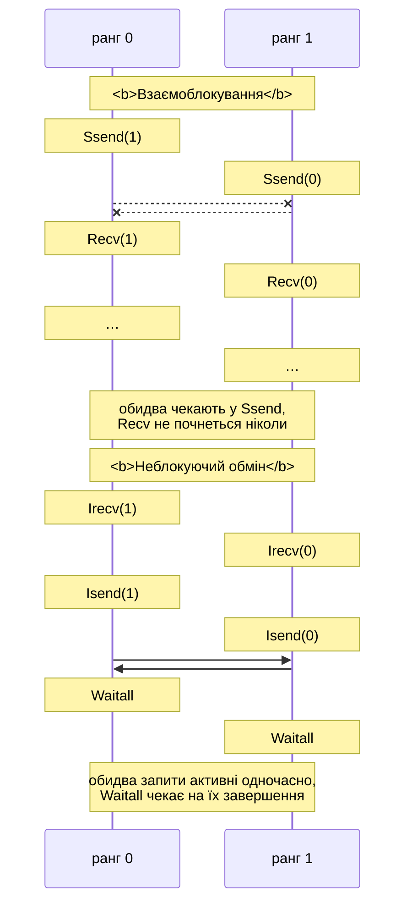

# Двоточкові та неблокуючі обміни

## Структура програми MPI

Функції MPI мають префікс `MPI_` і повертають код помилки (`MPI_SUCCESS` – успіх). За замовчуванням помилка в будь-якій функції аварійно завершує всю програму (обробник `MPI_ERRORS_ARE_FATAL`), тому коди зазвичай не перевіряють. Основні функції середовища наведено в табл. 12.3.

Таблиця 12.3. Основні функції середовища MPI {.caption}

| **Функція** | **Призначення** |
| --- | --- |
| `MPI_Init(&argc, &argv)` | ініціалізувати MPI; викликається один раз, до інших функцій |
| `MPI_Init_thread(…, required, &provided)` | те саме з потрібним рівнем підтримки потоків (розділ «Гібридні програми») |
| `MPI_Finalize()` | завершити роботу з MPI; після неї функції MPI викликати не можна |
| `MPI_Comm_size(comm, &size)` | кількість процесів у комунікаторі |
| `MPI_Comm_rank(comm, &rank)` | ранг поточного процесу в комунікаторі |
| `MPI_Get_processor_name(name, &len)` | ім’я вузла |
| `MPI_Wtime()`, `MPI_Wtick()` | час у секундах (`double`) і роздільна здатність годинника (у WSL – $10^{- 9}$ с) |
| `MPI_Barrier(comm)` | чекати, поки всі процеси комунікатора дійдуть до бар’єра |
| `MPI_Abort(comm, code)` | аварійно завершити **усі** процеси з кодом `code` |

**Вимірювання часу.** Годинники процесів не синхронізовані, а процеси можуть почати роботу в різний час. Тому перед вимірюванням викликають `MPI_Barrier`, а часом паралельної частини вважають час **найповільнішого** процесу: локальні інтервали об’єднують операцією `MPI_Reduce` з `MPI_MAX` (приклад «Число π»).

**Типи даних.** Функції обміну приймають не байти, а **кількість елементів** і **тип MPI**, тому бібліотека правильно передає дані між комп’ютерами з різним поданням чисел (табл. 12.4).

Таблиця 12.4. Відповідність базових типів MPI і C++ {.caption}

| **Тип MPI** | **Тип C++** | **Тип MPI** | **Тип C++** |
| --- | --- | --- | --- |
| `MPI_CHAR` | `char` | `MPI_DOUBLE` | `double` |
| `MPI_INT` | `int` | `MPI_FLOAT` | `float` |
| `MPI_LONG_LONG` | `long long` | `MPI_UINT8_T` | `std::uint8_t` |
| `MPI_UNSIGNED` | `unsigned` | `MPI_CXX_BOOL` | `bool` |
| `MPI_BYTE` | байти без перетворення | `MPI_INT64_T` | `std::int64_t` |

C++-інтерфейс (`MPI::Comm` тощо) вилучено ще зі стандарту MPI-3.0, тому з C++ викликають функції мовою C; `std::vector` передають як `v.data()` і `(int)v.size()`.

## Двоточкові операції

**Двоточкова операція** (*point-to-point*) передає повідомлення від одного процесу іншому. Блокуючі функції відправлення й отримання:

```cpp
int MPI_Send(const void* buf, int count, MPI_Datatype type,
             int dest, int tag, MPI_Comm comm);
int MPI_Recv(void* buf, int count, MPI_Datatype type,
             int source, int tag, MPI_Comm comm, MPI_Status* status);
```

Повідомлення складається з **даних** (`buf`, `count`, `type`) і **конверта** (*envelope*): ранг відправника, ранг отримувача, **тег** (*tag*) – ціле число, що розрізняє види повідомлень, і комунікатор. `MPI_Recv` приймає повідомлення з відповідним конвертом; `count` у ньому – розмір буфера, тобто **максимальна** кількість елементів. Повідомлення між двома процесами з однаковим тегом не обганяють одне одного: вони надходять у порядку відправлення.

Замість конкретних значень у `MPI_Recv` можна вказати `MPI_ANY_SOURCE` (від будь-якого процесу) і `MPI_ANY_TAG` (з будь-яким тегом). Тоді справжні відправник і тег записуються в структуру `MPI_Status` (поля `MPI_SOURCE`, `MPI_TAG`, `MPI_ERROR`), а фактичну кількість елементів повертає `MPI_Get_count`. Якщо статус не потрібен, передають `MPI_STATUS_IGNORE`.

```cpp
if (rank != 0)
{   // Кожен ранг надсилає rank · 10 чисел з тегом 7.
    std::vector<int> data(rank * 10, rank);
    MPI_Send(data.data(), (int)data.size(), MPI_INT, 0, 7,
             MPI_COMM_WORLD);
}
else
{   // Ранг 0 приймає в порядку надходження.
    std::vector<int> buffer(1000);
    for (int k = 1; k < size; ++k)
    {
        MPI_Status status;
        MPI_Recv(buffer.data(), 1000, MPI_INT, MPI_ANY_SOURCE,
                 MPI_ANY_TAG, MPI_COMM_WORLD, &status);
        int count = 0;
        MPI_Get_count(&status, MPI_INT, &count);
        std::println("від {} тег {}: {} чисел", status.MPI_SOURCE,
                     status.MPI_TAG, count);
    }
}
```

Для 4 процесів фрагмент виводить `від 1 тег 7: 10 чисел`, `від 2 тег 7: 20 чисел`, `від 3 тег 7: 30 чисел` (порядок може бути іншим). Якщо розмір повідомлення наперед невідомий, його дізнаються без отримання даних: `MPI_Probe(source, tag, comm, &status)` чекає на повідомлення й заповнює статус, після чого виділяють буфер потрібного розміру (`MPI_Get_count`) і викликають `MPI_Recv`. Так передають рядки `std::string` змінної довжини.

### Режими відправлення

Коли `MPI_Send` повертає керування, буфер `buf` можна змінювати, але це **не означає**, що отримувач уже прийняв повідомлення. Стандарт визначає чотири режими відправлення (табл. 12.5).

Таблиця 12.5. Режими відправлення повідомлень {.caption}

| **Функція** | **Коли завершується** |
| --- | --- |
| `MPI_Send` | стандартний режим: реалізація сама вирішує – скопіювати мале повідомлення в буфер і одразу повернутися або чекати на отримувача |
| `MPI_Ssend` | синхронний: лише після того, як отримувач **почав** прийом (`MPI_Recv`) |
| `MPI_Bsend` | буферизований: копіює дані в буфер, наданий `MPI_Buffer_attach`, і одразу повертається |
| `MPI_Rsend` | режим готовності: коректний, лише якщо отримувач **уже** викликав `MPI_Recv`; інакше результат не визначено |

Стандартний режим у реалізаціях працює за двома протоколами. Мале повідомлення відправляється **негайно** (*eager*): дані разом із конвертом копіюються в буфер отримувача, і `MPI_Send` завершується, навіть якщо `MPI_Recv` ще не викликано. Велике повідомлення передається за **протоколом рандеву** (*rendezvous*): відправник чекає, поки отримувач буде готовий, тобто `MPI_Send` поводиться як `MPI_Ssend`. Межу між протоколами задає реалізація; в Open MPI 5.0 для процесів одного комп’ютера (компонент `sm`) це 4096 байтів разом із заголовком (`ompi_info --param btl sm --level 9`, параметр `btl_sm_eager_limit`). Програма, яка працює лише завдяки буферизації малих повідомлень, **некоректна**: зі збільшенням даних вона зависне (приклад «Кільцевий обмін»).

## Взаємоблокування та неблокуючі обміни

**Взаємоблокування** (*deadlock*, тема 3) у MPI виникає, коли процеси чекають один на одного в блокуючих операціях. Типовий випадок – обмін між сусідами, у якому кожен процес спочатку відправляє, а потім приймає (рис. 12.4, ліворуч): обидва процеси блокуються в `MPI_Ssend` (або у великому `MPI_Send`), і жоден не доходить до `MPI_Recv`. Програма не завершується й не виводить жодної помилки.



Рис. 12.4. Взаємоблокування двоточкового обміну та його усунення {.caption}

Способи уникнути взаємоблокування:

- **змінити порядок**: парні ранги спочатку відправляють, непарні – приймають (для кільця з непарною кількістю процесів потрібна обережність);
- **поєднана операція** `MPI_Sendrecv`: відправлення й отримання в одному виклику, бібліотека виконує їх без взаємоблокування:

  ```cpp
  MPI_Sendrecv(out, n, MPI_DOUBLE, right, 0,   // що й кому
               in, n, MPI_DOUBLE, left, 0,     // що й від кого
               MPI_COMM_WORLD, MPI_STATUS_IGNORE);
  ```

- **неблокуючі операції** (рис. 12.4, праворуч).

### Неблокуючі операції

Функції `MPI_Isend` і `MPI_Irecv` (*I* – *immediate*) лише **починають** обмін і одразу повертають **запит** (*request*) типу `MPI_Request`. Поки запит не завершено, буфер не можна змінювати (після `MPI_Isend`) або читати (після `MPI_Irecv`). Завершення перевіряють функції табл. 12.6.

Таблиця 12.6. Завершення неблокуючих операцій {.caption}

| **Функція** | **Дія** |
| --- | --- |
| `MPI_Wait(&req, &status)` | чекати на завершення одного запиту |
| `MPI_Waitall(n, reqs, statuses)` | чекати на всі `n` запитів |
| `MPI_Waitany(n, reqs, &index, &status)` | чекати на будь-який запит; його номер – `index` |
| `MPI_Test(&req, &flag, &status)` | перевірити без очікування: `flag` = 1, якщо завершено |
| `MPI_Testall(n, reqs, &flag, statuses)` | перевірити всі запити без очікування |

```cpp
MPI_Request requests[2];
MPI_Irecv(in.data(), n, MPI_DOUBLE, left, 0, MPI_COMM_WORLD,
          &requests[0]);
MPI_Isend(out.data(), n, MPI_DOUBLE, right, 0, MPI_COMM_WORLD,
          &requests[1]);
// Тут можна обчислювати те, що не залежить від in і out.
MPI_Waitall(2, requests, MPI_STATUSES_IGNORE);
```

Між початком обміну й `MPI_Waitall` процес може виконувати корисну роботу: так досягають **перекриття обчислень і комунікацій** (*overlap*). Наприклад, у методі сіток спочатку запускають обмін гало-зонами, потім обчислюють **внутрішні** вузли, яким гало не потрібне, і лише після `MPI_Waitall` – крайові. Чи справді передавання йде у фоні, залежить від реалізації й мережі; Open MPI у спільній пам’яті переважно просуває обмін під час викликів MPI, тому всередині довгого обчислення корисно іноді викликати `MPI_Test`.
