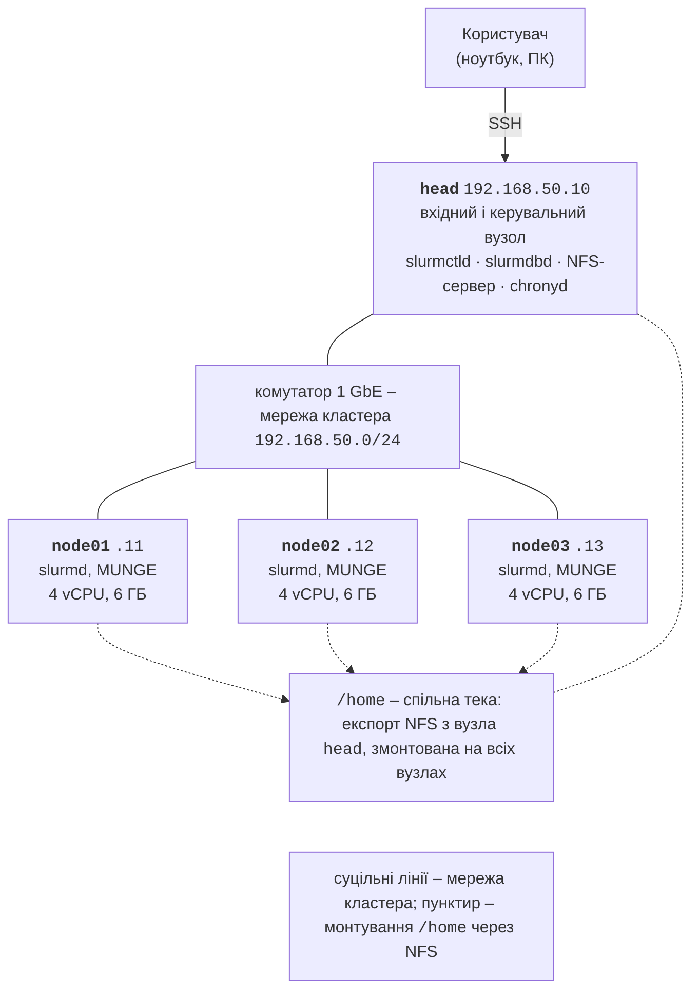

# Архітектура кластера та вузли

## Архітектура обчислювального кластера

**Обчислювальний кластер** (*computing cluster*) – група комп’ютерів (**вузлів**, *nodes*), з’єднаних мережею, які користувач бачить як одну систему для паралельних обчислень. Кожен вузол має власні процесори, пам’ять і копію операційної системи, тому програма для кластера працює з розподіленою пам’яттю: процеси на різних вузлах обмінюються повідомленнями (MPI, тема 12). Такі кластери з серійних комп’ютерів під Linux називають кластерами Beowulf; з них складається більшість суперкомп’ютерів списку TOP500 (<https://top500.org/>).

Вузли кластера мають різні ролі:

- **вхідний вузол** (*login node*) – сюди користувачі підключаються через SSH, редагують і збирають програми, надсилають завдання в чергу; важкі обчислення на ньому запускати не можна;
- **керувальний вузол** (*head, management node*) – працюють служби планувальника (`slurmctld`), облік завдань, моніторинг, часто сервер часу й файлів;
- **обчислювальні вузли** (*compute nodes*) – виконують завдання, мають лише мінімальний набір служб;
- **вузли зберігання** (*storage nodes*) – обслуговують спільну файлову систему.

Вузли з’єднують мережі двох типів: **мережа керування** (Ethernet 1 Гбіт/с) для SSH, служб і файлів та **обчислювальна мережа** (*interconnect*) з малою затримкою для MPI: InfiniBand або Ethernet 100–400 Гбіт/с. У невеликому кластері обидві ролі виконує одна мережа. Спільна **файлова система** робить домашні каталоги й програми однаковими на всіх вузлах: у малих кластерах це NFS, у великих – паралельні системи Lustre, BeeGFS або IBM Storage Scale.

### Навчальний стенд

Навчальний кластер цього курсу складається з чотирьох віртуальних машин (ВМ) Hyper-V з Ubuntu Server 26.04 LTS (рис. 13.1, табл. 13.1). Вузол `head` поєднує ролі вхідного та керувального вузла і сервера NFS, а три обчислювальні вузли `node01`–`node03` виконують завдання. Усі вузли підключено до однієї мережі 1 GbE; студенти мають права адміністратора (`sudo`) на всіх ВМ і будують кластер самостійно.



Рис. 13.1. Архітектура навчального обчислювального кластера {.caption}

Таблиця 13.1. Віртуальні машини навчального кластера {.caption}

| **ВМ** | **Роль** | **IP-адреса** | **vCPU** | **Пам’ять** |
| --- | --- | --- | --- | --- |
| `head` | вхідний і керувальний вузол, NFS, облік | `192.168.50.10` | 2 | 4 ГБ |
| `node01` | обчислювальний вузол | `192.168.50.11` | 4 | 6 ГБ |
| `node02` | обчислювальний вузол | `192.168.50.12` | 4 | 6 ГБ |
| `node03` | обчислювальний вузол | `192.168.50.13` | 4 | 6 ГБ |

Разом ВМ потребують 14 віртуальних процесорів і 22 ГБ пам’яті, тож усі чотири поміщаються на лабораторному ПК з i9-11900KF (16 логічних процесорів) і 32 ГБ пам’яті. Інший варіант – по одній ВМ на кількох ПК лабораторії, з’єднаних комутатором 1 GbE: тоді обмін між вузлами проходить справжньою мережею, і вимірювання масштабованості ближчі до реального кластера.

**Чому не WSL2?** У WSL2 можна запустити Slurm на одному «вузлі» (так налаштовано навчальний ПК: вузол `Intel`, розділ `debug`), і цього досить, щоб вивчити команди й скрипти завдань. Проте кластера з WSL2 не побудувати:

- один дистрибутив – один вузол, а мережа WSL2 працює через NAT і не дає вузлам бачити одне одного;
- у конфігурації WSL використано `ProctrackType=proctrack/linuxproc` і `TaskPlugin=task/none`: Slurm не прив’язує задачі до процесорів і не обмежує пам’ять;
- дистрибутив зупиняється через 15 с після закриття останнього сеансу WSL (параметр `instanceIdleTimeout` у файлі `.wslconfig`, <https://learn.microsoft.com/windows/wsl/wsl-config>), і завдання, що виконувалися, обриваються; під час підготовки лекції так двічі перервалося тестове завдання, а в `squeue` воно ще кілька хвилин мало стан `R`.

::: tip Порада
Для перевірки конфігурації без ВМ можна запустити кластер із контейнерів Docker (образ `ubuntu:26.04` з тими самими пакетами, спільний том замість NFS). Частину виведення в цій лекції отримано саме так, на вузлах з іменами `head` і `node01`–`node03`. Час роботи програм у контейнерах не показовий: усі вони ділять процесори одного ПК.
:::

## Підготовка вузлів

### Віртуальні машини Hyper-V

Hyper-V входить до Windows 11 Pro, Enterprise та Education (у редакції Home його немає). Роль вмикають у PowerShell від імені адміністратора, після чого комп’ютер перезавантажують (<https://learn.microsoft.com/virtualization/hyper-v-on-windows/quick-start/enable-hyper-v>):

```powershell
Enable-WindowsOptionalFeature -Online `
    -FeatureName Microsoft-Hyper-V -All
```

Для ВМ на одному ПК створюють **внутрішній віртуальний комутатор** і мережу NAT (<https://learn.microsoft.com/virtualization/hyper-v-on-windows/user-guide/setup-nat-network>): вузли отримують адреси `192.168.50.0/24`, а ПК – адресу шлюзу `192.168.50.1` і доступ до інтернету для встановлення пакетів. Далі цикл створює чотири ВМ другого покоління з дисками 40 ГБ і вимкненою динамічною пам’яттю (Slurm має знати сталий обсяг пам’яті вузла):

```powershell
New-VMSwitch -SwitchName ClusterNet -SwitchType Internal
$if = Get-NetAdapter -Name "vEthernet (ClusterNet)"
New-NetIPAddress -IPAddress 192.168.50.1 -PrefixLength 24 `
    -InterfaceIndex $if.ifIndex
New-NetNat -Name ClusterNAT `
    -InternalIPInterfaceAddressPrefix 192.168.50.0/24

$iso = "D:\ISO\ubuntu-26.04-live-server-amd64.iso"
foreach ($vm in "head", "node01", "node02", "node03") {
    $cpu = if ($vm -eq "head") { 2 } else { 4 }
    $ram = if ($vm -eq "head") { 4GB } else { 6GB }
    New-VM -Name $vm -Generation 2 -MemoryStartupBytes $ram `
        -NewVHDPath "D:\HyperV\$vm.vhdx" -NewVHDSizeBytes 40GB `
        -SwitchName ClusterNet
    Set-VMProcessor -VMName $vm -Count $cpu
    Set-VMMemory -VMName $vm -DynamicMemoryEnabled $false
    Add-VMDvdDrive -VMName $vm -Path $iso
    Set-VMFirmware -VMName $vm -EnableSecureBoot Off `
        -FirstBootDevice (Get-VMDvdDrive -VMName $vm)
}
```

Безпечне завантаження (*Secure Boot*) вимкнено за рекомендацією Microsoft для ВМ з Linux (<https://learn.microsoft.com/windows-server/virtualization/hyper-v/supported-ubuntu-virtual-machines-on-hyper-v>). Якщо ВМ розміщено на різних ПК, замість внутрішнього створюють **зовнішній** комутатор, прив’язаний до мережевої карти 1 GbE: `New-VMSwitch -Name ClusterNet -NetAdapterName "Ethernet"`, а адреси вузлів виділяє адміністратор мережі лабораторії.

Ubuntu Server 26.04 LTS встановлюють на кожну ВМ з образу ISO (<https://ubuntu.com/download/server>): мінімальна інсталяція, користувач-адміністратор, позначка *Install OpenSSH server*. Встановлювати вузли можна один раз: після налаштування `node01` його диск копіюють (або експортують ВМ), а потім змінюють ім’я та IP-адресу. Перед кожним ризикованим кроком (встановлення Slurm, зміна параметрів ядра) зручно зробити контрольну точку ВМ: `Checkpoint-VM -Name node01 -SnapshotName slurm`.

### Мережа, імена вузлів і користувачі

Статичну адресу в Ubuntu задає **Netplan** (<https://documentation.ubuntu.com/server/explanation/networking/about-netplan/>) – файл YAML у каталозі `/etc/netplan/`, наприклад для `node01`:

```yaml
# /etc/netplan/50-cluster.yaml
network:
  version: 2
  ethernets:
    eth0:
      addresses: [192.168.50.11/24]
      routes:
        - to: default
          via: 192.168.50.1
      nameservers:
        addresses: [1.1.1.1, 8.8.8.8]
```

Ім’я мережевого інтерфейсу (у ВМ Hyper-V – зазвичай `eth0`) показує команда `ip -br addr`. Файл застосовують командою `sudo netplan apply`, ім’я вузла задають `sudo hostnamectl set-hostname node01`. Щоб вузли знаходили одне одного без DNS, у файл `/etc/hosts` кожного вузла додають однакові рядки:

```
192.168.50.10  head
192.168.50.11  node01
192.168.50.12  node02
192.168.50.13  node03
```

**Однакові користувачі.** Slurm запускає процеси завдання від імені користувача на обчислювальному вузлі за його числовим ідентифікатором (UID), а NFS перевіряє права доступу теж за UID і GID. Тому кожен користувач кластера повинен мати **однакові UID і GID на всіх вузлах**. У невеликому кластері користувачів створюють однаковими командами на кожному вузлі (у великих – використовують LDAP або FreeIPA):

```bash
sudo groupadd -g 2001 hpc
sudo useradd -m -u 2001 -g hpc -s /bin/bash student
```

Службові користувачі `slurm` і `munge` створюються під час встановлення пакетів. У пакетах Ubuntu користувач `slurm` має фіксований UID 64030 на всіх вузлах (`id slurm` → `uid=64030(slurm)`), а для `munge` UID може відрізнятися, бо MUNGE перевіряє лише ключ.

### Синхронізація часу

Облікові дані MUNGE (далі) мають термін дії 300 с, і вузол з неправильним часом їх відхиляє, тому годинники всіх вузлів мають бути синхронізовані. В Ubuntu, починаючи з 25.10, за синхронізацію часу відповідає служба **chrony** (<https://documentation.ubuntu.com/server/how-to/networking/serve-ntp-with-chrony/>). Вузол `head` синхронізується з інтернетом і роздає час решті вузлів:

```bash
# head: /etc/chrony/conf.d/cluster.conf
allow 192.168.50.0/24
# node01–node03: /etc/chrony/conf.d/cluster.conf
server head iburst prefer
```

Після `sudo systemctl restart chrony` стан перевіряють командами `chronyc sources` (у рядку `head` має стояти `^*` – обране джерело) і `chronyc tracking` (відхилення, *System time*).

### Брандмауер

Брандмауер **ufw** (<https://documentation.ubuntu.com/server/how-to/security/firewalls/>) у кластері налаштовують так, щоб вузли довіряли одне одному повністю, а ззовні був відкритий лише SSH. Служби Slurm використовують порти 6817 (`slurmctld`), 6818 (`slurmd`) і 6819 (`slurmdbd`), а `srun` і MPI – ще й випадкові порти, тому простіше дозволити всю підмережу кластера:

```bash
sudo ufw allow OpenSSH
sudo ufw allow from 192.168.50.0/24
sudo ufw enable
sudo ufw status numbered
```

На ВМ, доступних лише через внутрішній комутатор, ufw можна не вмикати; на реальному кластері з вузлом, відкритим в інтернет, брандмауер обов’язковий.
