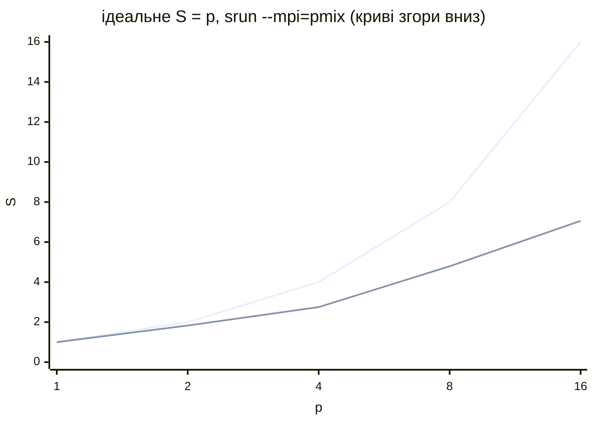

# Налаштування, моніторинг і типові помилки

## Налаштування операційної системи для високопродуктивних обчислень

Обчислювальний вузол виконує одну задачу: якомога швидше рахувати. Налаштування за замовчуванням в Ubuntu розраховані на універсальний сервер (енергоощадність, швидкий відгук), тому на вузлах кластера їх змінюють (табл. 13.7). Кожну зміну перевіряють вимірюванням: деякі параметри прискорюють одні програми й сповільнюють інші.

Таблиця 13.7. Налаштування ОС обчислювальних вузлів {.caption}

| **Параметр** | **Налаштування** | **Мета** |
| --- | --- | --- |
| регулятор частоти | `cpupower frequency-set -g performance` | найвища частота без затримки розгону |
| SMT (Hyper-Threading) | `/sys/devices/system/cpu/smt/control`: `off` | одна задача на фізичне ядро для програм, обмежених FPU або пам’яттю |
| переривання | служба `irqbalance` | розподіл переривань мережі між ядрами |
| прозорі великі сторінки | `/sys/kernel/mm/transparent_hugepage/enabled` | менше промахів TLB для великих масивів |
| підкачка | `vm.swappiness=10` | не витісняти пам’ять обчислень на диск |
| NUMA | `kernel.numa_balancing=0` | не переносити сторінки, коли потоки прив’язано |
| ліміти процесів | `memlock`, `nofile` у `/etc/security/limits.d/` | закріплення пам’яті для RDMA, багато відкритих файлів і з’єднань MPI |
| мережа | MTU 9000 (jumbo frames) | менше пакетів і переривань для великих повідомлень |
| служби | вимкнути зайві: `snapd`, автооновлення | менше «шуму» ОС під час обчислень |

### Регулятор частоти й SMT

Ядро Linux змінює частоту процесора **регулятором** (*governor*): `powersave` або `schedutil` підвищують частоту лише під навантаженням, `performance` тримає найвищу. Утиліта `cpupower` в Ubuntu входить до пакета `linux-tools-common` разом із пакетом для поточного ядра:

```bash
sudo apt install linux-tools-common linux-tools-$(uname -r)
cpupower frequency-info            # драйвер, регулятор, межі частоти
sudo cpupower frequency-set -g performance
cpupower frequency-info | grep -A2 "current policy"
```

Налаштування діє до перезавантаження; постійним його робить, наприклад, служба **tuned** (далі). У ВМ Hyper-V частотою керує хост: у гостьовій системі немає драйвера `cpufreq` (у WSL2 на навчальному ПК немає навіть каталогу `/sys/devices/system/cpu/cpu0/cpufreq`), і `cpupower` не може змінити регулятор. Тому регулятор налаштовують на фізичних вузлах (рис. 13.11), а для ВМ – у плані електроживлення Windows хоста. Так само Slurm може змінювати частоту для окремих завдань (ключ `srun --cpu-freq`), якщо на вузлах є драйвер `cpufreq` (у конфігурації WSL `CpuFreqGovernors=OnDemand,Performance,UserSpace`).

::: info Знімок екрана
Terminal on a physical Ubuntu 26.04 node: `cpupower frequency-info` before and after `sudo cpupower frequency-set -g performance`; driver, available governors, current policy (not available in Hyper-V VMs)
:::

Рис. 13.11. Регулятор частоти процесора {.caption}

Логічні процесори SMT одного ядра ділять його обчислювальні блоки й кеш. Для програм, обмежених арифметикою з дійсними числами або пропускною здатністю пам’яті, другий потік ядра майже нічого не додає (у темі 10 16 потоків на 8 ядрах дали те саме, що 8), тому на багатьох кластерах SMT вимикають у BIOS або командою `echo off | sudo tee /sys/devices/system/cpu/smt/control`, після чого в `slurm.conf` задають `ThreadsPerCore=1`. Інший підхід – залишити SMT і виділяти завданням цілі ядра (`CR_Core`) або використовувати ключ `srun --hint=nomultithread`.

### Пам’ять: великі сторінки, підкачка, NUMA

**Прозорі великі сторінки** (*Transparent Huge Pages*, THP) дозволяють ядру відображати пам’ять сторінками 2 МБ замість 4 КБ, і програма з великими масивами рідше промахується в TLB. Режим `always` вмикає їх для всіх процесів, `madvise` – лише для областей, позначених програмою (`madvise(MADV_HUGEPAGE)`), `never` – вимикає. Поточні значення читають без прав адміністратора (вивід у WSL на навчальному ПК):

```
$ cat /sys/kernel/mm/transparent_hugepage/enabled
always [madvise] never
$ cat /proc/sys/vm/swappiness
60
$ ulimit -l -n
max locked memory           (kbytes, -l) 65536
open files                          (-n) 10240
```

Постійні параметри ядра записують у файл `/etc/sysctl.d/90-hpc.conf` і застосовують командою `sudo sysctl --system`:

```
vm.swappiness = 10
kernel.numa_balancing = 0
vm.zone_reclaim_mode = 1
```

`vm.swappiness` задає схильність ядра витісняти сторінки процесів у файл підкачки: 60 (за замовчуванням) підходить для настільних систем, для обчислювальних вузлів – 10 або менше. **Автоматичне балансування NUMA** періодично переносить сторінки ближче до потоків, що їх використовують; для програм, які самі прив’язують потоки й розміщують дані за політикою першого дотику (тема 10), воно лише додає накладні витрати, тому його вимикають.

**tuned.** Служба `tuned` (пакет `tuned`) застосовує готові профілі налаштувань. Профіль `hpc-compute` з пакета Ubuntu 26.04 успадковує `latency-performance` (регулятор `performance`, `vm.swappiness=10`) і додає `transparent_hugepages=always`, `kernel.numa_balancing=0`, `vm.zone_reclaim_mode=1` та опитування мережі без переривань:

```bash
sudo apt install tuned
sudo tuned-adm profile hpc-compute
tuned-adm active
```

### Ліміти процесів

Бібліотеки MPI для мереж InfiniBand і RDMA закріплюють (*pin*) буфери в пам’яті, і з обмеженням `memlock` 64 МБ (значення за замовчуванням) програма завершується з помилкою реєстрації пам’яті. Великі MPI-програми відкривають тисячі з’єднань і файлів. Ліміти задають у `/etc/security/limits.d/90-hpc.conf`:

```
*   soft  memlock  unlimited
*   hard  memlock  unlimited
*   soft  nofile   65536
*   hard  nofile   65536
```

Slurm за замовчуванням **переносить** ліміти користувача з вузла, де виконано `sbatch`, на обчислювальні вузли (`PropagateResourceLimits=ALL`), тому ліміти змінюють на всіх вузлах. Служба `slurmd` у пакеті Ubuntu вже запускається з `LimitMEMLOCK=infinity` (файл `/usr/lib/systemd/system/slurmd.service`). Перевірити ліміти всередині завдання можна командою `srun bash -c 'ulimit -l -n'`.

### Мережа і зайві служби

**Jumbo frames.** Стандартний розмір кадру Ethernet (MTU) – 1500 байтів; MTU 9000 зменшує кількість пакетів і переривань для великих повідомлень MPI. MTU має бути однаковим на всіх вузлах і на комутаторі, інакше великі пакети губляться. У Netplan для інтерфейсу додають `mtu: 9000`, а перевіряють пакетом без фрагментації: `ping -M do -s 8972 node02` (8972 байти даних + 28 байтів заголовків = 9000). У Hyper-V jumbo frames вмикають ще й у властивостях мережевої карти хоста (*Jumbo Packet*) для зовнішнього комутатора.

**Зайві служби.** Кожна служба на вузлі періодично займає процесор і збільшує розкид часу кроків MPI (коли один ранг затримався, чекають усі). На обчислювальних вузлах вимикають непотрібне: `systemctl list-units --type=service --state=running` показує запущені служби, а `sudo systemctl disable --now snapd unattended-upgrades` зупиняє, наприклад, snap і автоматичні оновлення (оновлення встановлюють планово, коли вузли вільні).

## Моніторинг і діагностика

**Навантаження вузлів.** Утиліта `htop` показує завантаження кожного процесора та потоки процесів, `mpstat -P ALL 1` (пакет `sysstat`) – завантаження процесорів щосекунди, а `sar` зберігає історію навантаження: після `sudo systemctl enable --now sysstat` команда `sar -u` показує завантаження процесора за день з інтервалом 10 хв. Для всіх вузлів одразу: `pdsh -w node[01-03] uptime`.

**Журнали Slurm.** `slurmctld` пише в `/var/log/slurm/slurmctld.log`, `slurmd` – у `/var/log/slurm/slurmd.log` на кожному вузлі; повідомлення служб також бачить `journalctl -u slurmd`. Докладність журналу змінюють параметрами `SlurmctldDebug` і `SlurmdDebug` (`info`, `debug`), а для пошуку помилки запуску службу зупиняють і запускають у терміналі: `sudo slurmd -D -vvv`.

**Стани вузлів.** Основні стани, які показує `sinfo`, зібрано в табл. 13.8.

Таблиця 13.8. Стани вузлів Slurm {.caption}

| **Стан** | **Значення** |
| --- | --- |
| `IDLE` | вузол вільний |
| `ALLOCATED`, `MIXED` | зайнятий повністю / частково |
| `PLANNED` | вільний, але зарезервований backfill для завдання з черги |
| `DRAIN`, `DRAINING` | адміністратор виводить вузол з роботи: нових завдань немає, поточні (у `DRAINING`) завершуються |
| `DOWN` | вузол недоступний; завдання на ньому завершено зі станом `NODE_FAIL` |
| `*` після стану | `slurmd` не відповідає (`idle*`, `down*`) |

Щоб обслужити вузол, його переводять у стан `DRAIN` з причиною, а після роботи повертають (`RESUME`); причину показує `sinfo -R`:

```
$ sudo scontrol update nodename=node02 state=drain \
      reason="заміна модуля пам’яті"
$ sinfo -R -o "%30E %8u %20H %N"
REASON                         USER     TIMESTAMP            NODELIST
заміна модуля па root     2026-09-18T19:22:02  node02
$ sudo scontrol update nodename=node02 state=resume
```

Ширина стовпця `%30E` рахується в байтах, тому причину українською обрізано; короткі причини латиницею (`reason="RAM replacement"`) читаються краще.

**Збій вузла.** На тестовому кластері вузол `node03` «заморозили» під час роботи завдання. Через `SlurmdTimeout` (300 с) `slurmctld` позначив його як `DOWN`, а завдання завершилося зі станом `NODE_FAIL` (ключ `--no-requeue`; без нього пакетне завдання повертається в чергу):

```
$ sinfo -R
REASON               USER      TIMESTAMP           NODELIST
Not responding       slurm     2026-09-18T19:28:49 node03
$ sacct -j 48 --format=JobID,JobName,State%12,Elapsed,NodeList
JobID           JobName        State    Elapsed        NodeList
------------ ---------- ------------ ---------- ---------------
48             nodefail    NODE_FAIL   00:06:51          node03
48.batch          batch    CANCELLED   00:06:51          node03
$ grep -o "Killing.*\|error: Nodes.*DOWN" /var/log/slurm/slurmctld.log
Killing JobId=48 on failed node node03
error: Nodes node03 not responding, setting DOWN
```

Після відновлення вузла й перезапуску `slurmd` вузол зареєструвався і з `ReturnToService=1` автоматично повернувся в стан `idle`. Якщо вузол позначено `DOWN` з іншої причини (наприклад, `Low RealMemory`), після виправлення конфігурації його повертають командою `scontrol update nodename=node03 state=resume`.

## Масштабованість MPI-програми

Прискорення $S_{p} = T_{1} / T_{p}$ і ефективність $E_{p} = S_{p} / p$ на кластері вимірюють так само, як у темах 1 і 10, але $p$ – кількість процесів MPI на одному або кількох вузлах. Зручно отримати одне виділення й запускати кроки з різною кількістю процесів, щоб усі вимірювання йшли на тих самих вузлах:

```bash
#!/bin/bash
#SBATCH --job-name=pi-scan
#SBATCH --nodes=1
#SBATCH --exclusive
#SBATCH --time=00:20:00
#SBATCH --output=pi-scan-%j.out

for p in 1 2 4 8 16; do
    for run in 1 2 3 4 5 6; do          # 1-й запуск – прогрівання
        srun --mpi=pmix -n $p ./pi_mpi 2000000000 | grep процесів
    done
done
```

Скрипт виконано на навчальному ПК у WSL (один вузол `Intel`, 16 логічних процесорів, `task/none` – без прив’язки задач) двічі з інтервалом 20 хв. У табл. 13.9 наведено медіани 5 запусків після прогрівання для обох серій, у рис. 13.12 – графік прискорення першої серії.

Таблиця 13.9. Час і прискорення π-програми MPI на одному вузлі (WSL, i9-11900KF, $2 \cdot 10^{9}$ кроків), дві серії вимірювань {.caption}

| **$p$** | **$T_{p}$, с (1)** | **$S_{p}$** | **$E_{p}$, %** | **$T_{p}$, с (2)** | **$S_{p}$** |
| --- | --- | --- | --- | --- | --- |
| 1 | 1,764 | 1,00 | 100 | 1,624 | 1,00 |
| 2 | 0,963 | 1,83 | 92 | 0,883 | 1,84 |
| 4 | 0,641 | 2,75 | 69 | 0,629 | 2,58 |
| 8 | 0,368 | 4,79 | 60 | 0,380 | 4,27 |
| 16 | 0,250 | 7,06 | 44 | 0,296 | 5,49 |



Рис. 13.12. Прискорення π-програми MPI на одному вузлі (WSL, i9-11900KF) {.caption}

Ефективність падає вже на 4 процесах: без прив’язки задач (`TaskPlugin=task/none` у WSL) Linux може розмістити два процеси на логічних процесорах одного ядра, і розкид між запусками для 2 і 4 процесів сягав 30 %, а прискорення для 16 процесів у двох серіях – 7,06 і 5,49. Вимірювання на ПК, де працюють інші програми, треба повторювати й указувати розкид. Прискорення не перевищує 7 на 8 фізичних ядрах, як і в OpenMP-версії з теми 10: SMT для ділення дійсних чисел майже нічого не додає. На кластері з `task/affinity` Slurm прив’язує задачі до окремих ядер, і прискорення до кількості ядер ближче до ідеального. Там само виміряно **накладні витрати запуску**: крок `srun --mpi=pmix` з 8 процесами й 1000 кроків обчислення займав 0,46 с «настінного» часу, а `mpirun -n 8` усередині того самого виділення – 0,26 с (медіани 6 запусків). Для завдань, що тривають хвилини, різниця непомітна, але тисячі коротких кроків `srun` краще об’єднати в один.

Для кластера з кількох вузлів у скрипті задають `--nodes=3` і кроки `srun -N1`, `-N2`, `-N3` з однаковою кількістю процесів на вузлі. Для програми π обмін між процесами – одна операція `MPI_Reduce` з 8 байтами, тому мережа 1 GbE майже не впливає на час, і прискорення на трьох вузлах близьке до $3 \cdot S_{\text{вузла}}$. Програми, які обмінюються даними на кожному кроці (задача Якобі, тема 12), масштабуються гірше: затримка повідомлення в мережі 1 GbE – десятки мікросекунд проти долей мікросекунди в пам’яті одного вузла. Порівняння одного вузла з кількома при однаковій загальній кількості процесів показує частку часу, яку забирає мережа.

## Типові помилки

Найпоширеніші помилки під час побудови кластера й запуску завдань зібрано в табл. 13.10.

Таблиця 13.10. Типові помилки кластера Slurm {.caption}

| **Проблема** | **Причина та виправлення** |
| --- | --- |
| `Invalid credential` / `Munge decode failed` у журналах | різні `munge.key` на вузлах або розбіжність часу понад 5 хв; скопіювати ключ, перевірити `chronyc tracking` |
| вузол у стані `DRAIN` з причиною `Low RealMemory` | `RealMemory` у `slurm.conf` більше за фактичну пам’ять; взяти значення з `slurmd -C` із запасом |
| `sinfo` показує `down*`, вузол не відповідає | не запущено `slurmd`, брандмауер блокує порт 6818, ім’я вузла не розв’язується; `systemctl status slurmd`, `/etc/hosts`, `ufw status` |
| кожен процес MPI пише «ранг 0 з 1» | `srun` без PMIx; `--mpi=pmix` або `MpiDefault=pmix` |
| завдання `COMPLETED`, але файлу виводу немає | каталог для `--output` не існує або недоступний на вузлі; створити його, перевірити NFS |
| `Permission denied` на обчислювальному вузлі | різні UID користувача на вузлах; однакові `useradd -u` |
| `PD (Resources)` назавжди | запит більший за будь-який вузол (`--mem`, `--cpus-per-task`); перевірити `sinfo -N -l` |
| `PD (DependencyNeverSatisfied)` | попереднє завдання завершилося з помилкою; `scancel` або `--kill-on-invalid-dep=yes` |
| програма OpenMP у завданні повільна | не задано `OMP_NUM_THREADS=$SLURM_CPUS_PER_TASK`, потоки перевантажують ядра |
| завдання в WSL перервалося, `squeue` показує `R` | дистрибутив зупинився після закриття сеансу; тримати сеанс відкритим або `instanceIdleTimeout=-1` у `.wslconfig` |
