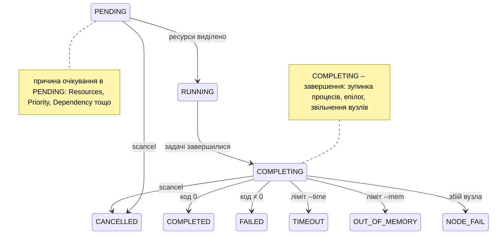

# Скрипти завдань і облік

## Скрипти завдань

**Пакетне завдання** – скрипт командної оболонки, який `sbatch` ставить у чергу. На початку скрипту рядки `#SBATCH` задають параметри завдання (це коментарі для bash, але директиви для `sbatch`); ті самі ключі можна передати в командному рядку, і вони мають вищий пріоритет. Коли ресурси виділено, Slurm виконує скрипт на **першому** вузлі виділення, у каталозі, з якого його надіслали; команди `srun` у скрипті запускають паралельні кроки на всіх виділених вузлах. Основні параметри зібрано в табл. 13.4 (<https://slurm.schedmd.com/archive/slurm-25.11-latest/sbatch.html>).

Таблиця 13.4. Параметри `sbatch` {.caption}

| **Параметр** | **Значення** |
| --- | --- |
| `-J`, `--job-name=ім’я` | назва завдання в черзі |
| `-p`, `--partition=розділ` | розділ (без нього – розділ за замовчуванням) |
| `-N`, `--nodes=n` | кількість вузлів (можна діапазон `2-4`) |
| `-n`, `--ntasks=n` | кількість задач (процесів, рангів MPI) |
| `--ntasks-per-node=n` | задач на кожному вузлі |
| `-c`, `--cpus-per-task=n` | CPU на задачу (потоки OpenMP) |
| `--mem=4G`, `--mem-per-cpu=500M` | пам’ять на вузол або на CPU |
| `-t`, `--time=гг:хх:сс` | ліміт часу: `30`, `2:00:00`, `1-12:00:00` |
| `-o`, `--output=файл` | файл виводу; `%j` – номер завдання, `%x` – назва, `%A`/`%a` – номер масиву / елемента |
| `-a`, `--array=1-10%4` | масив завдань (`%4` – не більше 4 одночасно) |
| `-d`, `--dependency=afterok:123` | залежність від інших завдань |
| `--exclusive` | вузли лише для цього завдання |

Ліміт `--time` варто задавати реалістично: завдання з коротким лімітом планувальник запускає раніше (backfill), а завдання, що перевищило ліміт, Slurm зупиняє зі станом `TIMEOUT`. Без `--time` діє `DefaultTime` або `MaxTime` розділу.

**Змінні середовища.** Slurm передає завданню й кожній задачі змінні `SLURM_*` (табл. 13.5), за якими скрипт і програма дізнаються про виділені ресурси.

Таблиця 13.5. Змінні середовища Slurm {.caption}

| **Змінна** | **Значення** |
| --- | --- |
| `SLURM_JOB_ID` | номер завдання |
| `SLURM_JOB_NODELIST` | виділені вузли: `node[01-02]` |
| `SLURM_NTASKS`, `SLURM_CPUS_PER_TASK` | кількість задач і CPU на задачу |
| `SLURM_PROCID` | номер задачі в кроці (0…n – 1), як ранг MPI |
| `SLURM_LOCALID` | номер задачі на її вузлі |
| `SLURM_NODEID` | номер вузла у виділенні |
| `SLURM_ARRAY_JOB_ID`, `SLURM_ARRAY_TASK_ID` | номер масиву й елемента |
| `SLURM_SUBMIT_DIR` | каталог, з якого надіслано завдання |

### Приклад «Перше завдання»

Завдання займає два вузли по дві задачі. Скрипт виводить параметри виділення, а `srun` – рядок із номером, вузлом і процесором кожної задачі.

```bash
#!/bin/bash
#SBATCH --job-name=hello
#SBATCH --nodes=2
#SBATCH --ntasks-per-node=2
#SBATCH --cpus-per-task=1
#SBATCH --mem-per-cpu=500M
#SBATCH --time=00:02:00
#SBATCH --output=hello-%j.out

# Цю частину виконує лише перший вузол виділення.
echo "Завдання $SLURM_JOB_ID ($SLURM_JOB_NAME) у розділі" \
     "$SLURM_JOB_PARTITION"
echo "Вузли: $SLURM_JOB_NODELIST, задач: $SLURM_NTASKS," \
     "каталог: $SLURM_SUBMIT_DIR"
echo "Скрипт виконується на $(hostname)"

# Крок завдання: srun запускає задачу на кожному виділеному CPU.
srun bash -c 'echo "задача $SLURM_PROCID (локальна $SLURM_LOCALID)" \
    "на $(hostname), CPU $(taskset -c -p $$ | cut -d: -f2)"'
```

Команда `sbatch hello.sbatch` відповідає `Submitted batch job 8` і одразу повертає керування; результат з’являється у файлі `hello-8.out`:

```
Завдання 8 (hello) у розділі debug
Вузли: node[01-02], задач: 4, каталог: /home/student
Скрипт виконується на node01
задача 1 (локальна 1) на node01, CPU  1
задача 0 (локальна 0) на node01, CPU  0
задача 2 (локальна 0) на node02, CPU  0
задача 3 (локальна 1) на node02, CPU  1
```

Кожна задача прив’язана до **одного** логічного процесора (`task/affinity`): на вузлі їх 4, а задач 2. У WSL на навчальному ПК (`task/none`) та сама команда показує для кожної задачі всі процесори `0-15`.

### Життєвий цикл завдання

Надіслане завдання має стан `PENDING`, доки планувальник не виділить ресурси, потім `RUNNING`, а після завершення задач – проміжний стан `COMPLETING` (зупинка процесів, звільнення вузлів) і один з кінцевих станів (рис. 13.7, <https://slurm.schedmd.com/archive/slurm-25.11-latest/job_state_codes.html>).



Рис. 13.7. Життєвий цикл завдання Slurm {.caption}

Кінцеві стани тестових завдань у `sacct` (підготовку наведено далі): успішне, завершене з кодом 3, перевищення ліміту 1 хв, скасоване `scancel`, перевищення `--mem=200M`:

```
$ sacct -j 24,25,26,27,29 -o JobID,JobName,State%14,ExitCode,Elapsed
JobID           JobName          State ExitCode    Elapsed
------------ ---------- -------------- -------- ----------
24                   ok      COMPLETED      0:0   00:00:06
24.batch          batch      COMPLETED      0:0   00:00:06
25                 fail         FAILED      3:0   00:00:01
25.batch          batch         FAILED      3:0   00:00:01
26              timeout        TIMEOUT      0:0   00:01:15
26.batch          batch      CANCELLED     0:15   00:01:16
27               cancel CANCELLED by +      0:0   00:00:04
27.batch          batch      CANCELLED     0:15   00:00:05
29                  oom  OUT_OF_MEMORY    0:125   00:00:01
29.batch          batch  OUT_OF_MEMORY    0:125   00:00:01
```

`ExitCode` має вигляд `код:сигнал`: `3:0` – програма повернула 3, `0:15` – процес зупинено сигналом 15 (`SIGTERM`). Завдання `timeout` працювало 1 хв 15 с при ліміті 1 хв: Slurm перевіряє ліміти періодично й дає процесам час завершитися після `SIGTERM`.

### Запуск MPI-програм

Програма MPI (тема 12) складається з процесів-рангів, яким потрібно дізнатися свій номер, кількість процесів і адреси інших рангів. Цю інформацію надає **менеджер процесів** через інтерфейс PMI (*Process Management Interface*). Open MPI 5 підтримує лише **PMIx**, тому в Slurm з пакетів Ubuntu програми MPI запускають так (<https://slurm.schedmd.com/archive/slurm-25.11-latest/mpi_guide.html>):

```
$ srun --mpi=list
MPI plugin types are...
	none
	pmi2
	cray_shasta
	pmix
specific pmix plugin versions available: pmix_v5
$ srun --mpi=pmix -n4 ./pi_mpi 400000000
ранг 0 з 4 на вузлі Intel
процесів  4: pi = 3.141592653590, похибка 1.3e-13, час 0.085 с
ранг 1 з 4 на вузлі Intel
ранг 2 з 4 на вузлі Intel
ранг 3 з 4 на вузлі Intel
```

Якщо в `slurm.conf` не задано `MpiDefault=pmix` (як у WSL на навчальному ПК) і ключ `--mpi` пропущено, `srun` запускає $n$ **незалежних** копій програми, кожна з яких вважає себе єдиним рангом:

```
$ srun -n2 ./pi_mpi 100000000
ранг 0 з 1 на вузлі Intel
процесів  1: pi = 3.141592653590, похибка 6.3e-13, час 0.081 с
ранг 0 з 1 на вузлі Intel
процесів  1: pi = 3.141592653590, похибка 6.3e-13, час 0.081 с
```

З `--mpi=pmi2` Open MPI попереджає: `No PMIx server was reachable, but a PMI1/2 was detected` і також запускає незалежні копії. Команда `mpirun` теж працює всередині виділення: вона бере список вузлів і кількість слотів зі змінних Slurm (`salloc -n4 mpirun ./pi_mpi`), але ранги запускають її власні служби (PRRTE), тож Slurm не бачить окремих задач і не обмежує їх cgroup кожної задачі. Крім того, `mpirun` за замовчуванням розміщує ранги на **ядрах**: на вузлі з 8 ядрами й 16 логічними процесорами `mpirun -n 16` відмовляється запускатися (повідомлення `allocation-overload`) без ключа `--use-hwthread-cpus`, а `srun -n 16` запускає 16 задач.

### Приклад «MPI на кластері»

Програма обчислює $\pi$ як інтеграл $4 / (1 + x^{2})$ на $[ 0 ; 1 ]$ методом середніх прямокутників: кожен ранг додає кожен $p$-й прямокутник, а `MPI_Reduce` збирає суму на ранзі 0.

```cpp
// π як інтеграл 4/(1 + x²) на [0; 1]: кожен процес MPI
// обчислює свою частину кроків, MPI_Reduce додає частини.
#include <mpi.h>
#include <cmath>
#include <cstdlib>
#include <numbers>
#include <print>
#include <unistd.h>

int main(int argc, char* argv[])
{
    MPI_Init(&argc, &argv);
    int rank, size;
    MPI_Comm_rank(MPI_COMM_WORLD, &rank);
    MPI_Comm_size(MPI_COMM_WORLD, &size);

    char host[64];
    gethostname(host, sizeof host);
    std::println("ранг {} з {} на вузлі {}", rank, size, host);

    const long long steps =
        argc > 1 ? std::atoll(argv[1]) : 2'000'000'000LL;
    const double h = 1.0 / steps;

    MPI_Barrier(MPI_COMM_WORLD);
    double start = MPI_Wtime();
    double sum = 0.0;
    for (long long i = rank; i < steps; i += size)
    {
        double x = (i + 0.5) * h;
        sum += 4.0 / (1.0 + x * x);
    }
    double part = sum * h, pi = 0.0;
    MPI_Reduce(&part, &pi, 1, MPI_DOUBLE, MPI_SUM, 0,
               MPI_COMM_WORLD);
    double time = MPI_Wtime() - start;

    if (rank == 0)
        std::println("процесів {:>2}: pi = {:.12f}, похибка {:.1e},"
                     " час {:.3f} с", size, pi,
                     std::abs(pi - std::numbers::pi), time);
    MPI_Finalize();
}
```

Програму збирають на `head` у спільному каталозі командою `mpicxx -std=c++23 -O2 pi_mpi.cpp -o pi_mpi`, тож виконуваний файл одразу доступний на всіх вузлах. Скрипт завдання займає три вузли по чотири ранги:

```bash
#!/bin/bash
#SBATCH --job-name=pi-mpi
#SBATCH --nodes=3
#SBATCH --ntasks-per-node=4
#SBATCH --time=00:05:00
#SBATCH --output=pi-%j.out

echo "Вузли: $SLURM_JOB_NODELIST, процесів: $SLURM_NTASKS"
srun --mpi=pmix ./pi_mpi 3000000000
```

Результат (рис. 13.8; рядки рангів виводяться в довільному порядку, частину пропущено):

```
Вузли: node[01-03], процесів: 12
ранг 3 з 12 на вузлі node01
ранг 8 з 12 на вузлі node03
ранг 9 з 12 на вузлі node03
ранг 6 з 12 на вузлі node02
ранг 1 з 12 на вузлі node01
ранг 0 з 12 на вузлі node01
процесів 12: pi = 3.141592653590, похибка 2.0e-14, час 3.725 с
ранг 4 з 12 на вузлі node02
ранг 11 з 12 на вузлі node03
…
```

Ранги 0–3 працюють на `node01`, 4–7 – на `node02`, 8–11 – на `node03` (розподіл `block` за замовчуванням). Час у тестовому кластері з контейнерів не показовий: усі «вузли» ділили чотири процесори ПК. Вимірювання масштабованості розглянуто в останньому розділі.

::: info Знімок екрана
Terminal on head: `cat pi.sbatch`, `sbatch pi.sbatch`, `squeue -u $USER`, then `cat pi-<id>.out` with the rank lines of node01–node03 and the timing line
:::

Рис. 13.8. Надсилання завдання та його результат {.caption}

### Гібридні завдання MPI + OpenMP

У гібридній програмі кожен ранг MPI створює кілька потоків OpenMP (тема 10). Розкладку задають три параметри: кількість вузлів, рангів на вузлі (`--ntasks-per-node`) і CPU на ранг (`--cpus-per-task`), а кількість потоків OpenMP беруть зі змінної Slurm:

```bash
#SBATCH --nodes=3
#SBATCH --ntasks-per-node=2
#SBATCH --cpus-per-task=2
export OMP_NUM_THREADS=$SLURM_CPUS_PER_TASK
srun --mpi=pmix ./hybrid
```

Без `OMP_NUM_THREADS` кожен ранг створив би стільки потоків, скільки процесорів на вузлі, і 2 ранги на вузлі з 4 CPU запустили б 8 потоків. `srun` у скрипті успадковує `--cpus-per-task` від `sbatch`, тому з `task/affinity` кожен ранг прив’язано до своїх 2 CPU (перевірено функцією `sched_getaffinity` у прикладі лабораторної роботи). Програму з OpenMP збирають з ключем `-fopenmp`: `mpicxx -std=c++23 -O2 -fopenmp hybrid.cpp -o hybrid`.

### Масиви завдань

**Масив завдань** (*job array*) запускає однаковий скрипт для багатьох значень параметра: кожен **елемент** масиву – окреме завдання з номером `SLURM_ARRAY_TASK_ID`, яке планувальник розміщує незалежно (<https://slurm.schedmd.com/archive/slurm-25.11-latest/job_array.html>). Масив надсилають одним `sbatch` з ключем `--array`: `1-10`, `0-99:5` (крок 5), `1,4,9`, `1-100%10` (не більше 10 одночасно). У черзі масив показано одним рядком `9_[1-10]`, а елементи – як `9_3`.

### Приклад «Масив завдань»

Програма моделює політ м’яча з опором повітря методом Ейлера і виводить дальність для заданого кута й швидкості. Масив із 10 елементів перебирає кути 5°, 10°, …, 50°, а результати збирають в один файл.

```cpp
// Політ м'яча з опором повітря: дальність для заданого кута.
// Аргументи: кут у градусах, початкова швидкість у м/с.
// Виведення (CSV): кут, дальність, м, час польоту, с.
#include <cmath>
#include <cstdlib>
#include <numbers>
#include <print>

int main(int argc, char* argv[])
{
    if (argc < 3)
    {
        std::println(stderr, "Використання: throw <кут> <v0>");
        return 1;
    }
    const double angle = std::atof(argv[1]);
    const double v0 = std::atof(argv[2]);
    const double g = 9.81, k = 0.02;      // k – опір, 1/м
    const double dt = 1e-6;               // крок методу Ейлера, с

    double a = angle * std::numbers::pi / 180;
    double x = 0, y = 0, vx = v0 * std::cos(a), vy = v0 * std::sin(a);
    double t = 0;
    while (y >= 0)
    {
        double v = std::hypot(vx, vy);    // опір ~ v²
        vx -= k * v * vx * dt;
        vy -= (g + k * v * vy) * dt;
        x += vx * dt;
        y += vy * dt;
        t += dt;
    }
    std::println("{},{:.2f},{:.3f}", angle, x, t);
}
```

```bash
#!/bin/bash
#SBATCH --job-name=throw
#SBATCH --array=1-10
#SBATCH --ntasks=1
#SBATCH --time=00:05:00
#SBATCH --output=out/throw-%A_%a.out

# Елемент масиву з номером 1..10 перевіряє кут 5, 10, ..., 50°.
ANGLE=$(( SLURM_ARRAY_TASK_ID * 5 ))
echo "# завдання ${SLURM_ARRAY_JOB_ID}_${SLURM_ARRAY_TASK_ID}" \
     "на $(hostname)" >&2
./throw "$ANGLE" 30
```

Каталог `out` треба створити до надсилання (`mkdir -p out`): Slurm не створює каталоги для файлів виводу, і без каталогу вивід просто втрачається (у тесті завдання з `-o nodir/x-%j.out` мало стан `COMPLETED`, але файлу не було). Після виконання всіх елементів рядки CSV збирають і сортують за дальністю:

```
$ cat out/throw-9_*.out | grep -v '^#' | sort -t, -k2 -n | tail -3
45,41.55,3.365
35,41.88,2.804
40,42.19,3.096
$ grep -h '^#' out/throw-9_*.out | head -3
# завдання 9_1 на node01
# завдання 9_10 на node01
# завдання 9_2 на node02
```

Без опору повітря найбільшу дальність дає кут 45°, а з опором – 40° (42,19 м). Десять елементів виконано на трьох вузлах паралельно. Порівняно з циклом у скрипті масив має перевагу: кожен елемент чекає лише на один вільний CPU, а збій одного елемента не зупиняє інших.

### Залежності завдань

Ключ `--dependency` (`-d`) відкладає старт завдання до виконання умови щодо інших завдань (табл. 13.6). Номер попереднього завдання повертає `sbatch --parsable`, тому ланцюжок будують у скрипті: `jid=$(sbatch --parsable prepare.sbatch)`, потім `sbatch -d afterok:$jid compute.sbatch`.

Таблиця 13.6. Типи залежностей завдань {.caption}

| **Умова** | **Завдання стартує, коли** |
| --- | --- |
| `after:id` | завдання `id` стартувало або скасоване |
| `afterok:id` | завдання `id` успішно завершилося (код 0) |
| `afternotok:id` | завдання `id` завершилося з помилкою, `TIMEOUT`, збоєм вузла |
| `afterany:id` | завдання `id` завершилося з будь-яким станом |
| `aftercorr:id` | відповідний елемент масиву `id` успішно завершився |
| `singleton` | завершилися всі попередні завдання користувача з тією самою назвою |

Для масиву умова `afterok` виконується, лише коли успішні **всі** елементи. Якщо умова вже не може виконатися (попереднє завдання завершилося з помилкою), завдання залишається в черзі з причиною `DependencyNeverSatisfied`, доки його не скасують; ключ `--kill-on-invalid-dep=yes` скасовує таке завдання автоматично. Приклад ланцюжка «підготовка → обчислення → звіт» наведено в лабораторній роботі.

## Облік і планування

### Облік виконаних завдань: sacct

Команда `sacct` (<https://slurm.schedmd.com/archive/slurm-25.11-latest/sacct.html>) читає історію з бази `slurmdbd`: для кожного завдання – рядок самого завдання та рядки його кроків (`.batch` – скрипт, `.0`, `.1`, … – кроки `srun`). Без ключів вона показує завдання поточного користувача за сьогодні; `-S`/`-E` задають інтервал часу, `-u`/`--allusers` – користувачів, `-X` – лише завдання без кроків, `--format` – стовпці (рис. 13.9):

```
$ sacct -j 50 -o JobID,JobName,NNodes,NCPUS,Elapsed,State
JobID           JobName   NNodes      NCPUS    Elapsed      State
------------ ---------- -------- ---------- ---------- ----------
50               pi-mpi        3         12   00:00:04  COMPLETED
50.batch          batch        1          4   00:00:04  COMPLETED
50.0             pi_mpi        3         12   00:00:03  COMPLETED
```

Для обробки програмою зручний ключ `--parsable2`: стовпці розділено символом `|`, без вирівнювання, а `--noheader` прибирає заголовок. Корисні поля: `Submit`, `Start`, `End` (очікування – `Start` мінус `Submit`), `CPUTimeRAW` (секунди CPU = `NCPUS` × `ElapsedRaw`), `MaxRSS` (найбільша пам’ять задачі, лише для кроків), `State`, `ExitCode`. Поточні завдання, що виконуються, показує також `sstat -j <номер>`.

::: info Знімок екрана
Terminal on head: `sacct -j <id> --format=JobID,JobName,Partition,NNodes,NCPUS,Elapsed,State,ExitCode` for a completed MPI job; the job line, `.batch` and `.0` step lines
:::

Рис. 13.9. Облік виконаних завдань {.caption}

### FIFO і планування із заповненням

Найпростіший порядок – **FIFO** (*first in, first out*): завдання стартують у порядку надходження (точніше, пріоритету), і якщо перше в черзі не може стартувати, чекають усі наступні. Велике завдання, якому потрібні всі вузли, змушує простоювати вузли, що звільнилися раніше.

**Планування із заповненням** (*backfill scheduling*, <https://slurm.schedmd.com/archive/slurm-25.11-latest/sched_config.html>) виправляє це: планувальник обчислює для кожного завдання з вищим пріоритетом час старту в майбутньому (**резервування**) за лімітами `--time` завдань, що виконуються, і запускає раніше завдання з нижчим пріоритетом, **якщо воно встигне завершитися до резервування** і не відкладе його. Модуль `sched/backfill` переглядає чергу кожні 30 с (параметр `bf_interval`). Тому реалістичний `--time` вигідний самому користувачеві: коротке завдання «пролазить» у проміжки.

Приклад на тестовому кластері з трьох вузлів (завдання займали вузли повністю, `--exclusive`, рис. 13.10): `model-R` (1 вузол, ліміт 4 хв) виконується; `big-A` потребує 3 вузлів на 5 хв і чекає на `model-R`; далі надійшли `long-B` (1 вузол, 10 хв) і `short-C` (1 вузол, 2 хв). Черга в той момент показана вище в описі `squeue`.

```mermaid
gantt
  title Час, хв. R, A, B, C – завдання в порядку надходження. C (ліміт 2 хв) завершиться до старту A, тому стартує раніше за чергою. B (ліміт 10 хв) відклав би A і чекає до кінця A
  dateFormat x
  axisFormat %-M
  tickInterval 1minute
  зараз : vert, 18000, 0ms
  section node01
    R (ліміт 4 хв) : 0, 240000
    A – резерв, 3 вузли, 5 хв : 240000, 540000
    B → : 540000, 618000
  section node02
    C (backfill) : 18000, 138000
    A – резерв, 3 вузли, 5 хв : 240000, 540000
  section node03
    A – резерв, 3 вузли, 5 хв : 240000, 540000
```



Рис. 13.10. Планування із заповненням (backfill) {.caption}

Очікуваний час старту завдань у черзі показує `squeue --start` (`%S` – час старту, `%Y` – вузли, на які їх заплановано), а журнал `slurmctld` – хто запустив завдання:

```
$ squeue --start -o "%.5i %.8j %.2t %.19S %.5D %Y"
JOBID     NAME ST          START_TIME NODES SCHEDNODES
   60    big-A PD 2026-09-18T19:47:40     3 node[01-03]
   61   long-B PD 2026-09-18T19:53:00     1 node01
$ grep -o "backfill.*" /var/log/slurm/slurmctld.log | tail -1
backfill: _start_job: Started JobId=62 in debug on node02
```

Завдання `short-C` стартувало через 30 с після надсилання, під час чергового проходу backfill, хоча в черзі стояло після `big-A` і `long-B`: воно завершиться до 19:47:40, коли спливе ліміт `model-R` і для `big-A` звільниться `node01`. Завдання `long-B` з лімітом 10 хв відклало б `big-A`, тому чекає з причиною `Priority` і стартує після нього. Вузол `node03` має стан `planned`: він вільний, але зарезервований для `big-A`. Запас часу має бути помітним: в одному з попередніх дослідів (ліміт `model-R` 3 хв) прохід backfill припав на момент, коли запас до резервування був меншим за хвилину, і `short-C` залишився в черзі до кінця `big-A`: backfill планує час блоками `bf_resolution` (60 с за замовчуванням).

### Пріоритети, розділи та QoS

Порядок у черзі визначає **пріоритет** завдання. У Slurm 25.11 за замовчуванням діє модуль `priority/multifactor` (<https://slurm.schedmd.com/archive/slurm-25.11-latest/priority_multifactor.html>): пріоритет – зважена сума факторів

$$P = w_{\text{age}} \cdot A + w_{\text{fs}} \cdot F + w_{\text{size}} \cdot J + w_{\text{part}} \cdot R + w_{\text{qos}} \cdot Q ,$$

де $A$ – час очікування, $F$ – **справедлива частка** (*fair share*: хто менше використав ресурсів свого рахунку, той має вищий пріоритет), $J$ – розмір завдання, $R$ і $Q$ – пріоритети розділу та QoS; усі фактори нормовано до $[ 0 ; 1 ]$. Ваги задають параметри `PriorityWeightAge`, `PriorityWeightFairshare` тощо; за замовчуванням вони нульові, і всі завдання мають однаковий пріоритет, тобто порядок FIFO з backfill, як на тестовому кластері. Складові пріоритету показує команда `sprio`, а використання рахунків – `sshare`.

**Розділи** групують вузли й задають обмеження: розділ `debug` навчального кластера дозволяє завдання до 30 хв, `long` – до 2 діб на тих самих вузлах. На реальних кластерах окремі розділи мають вузли з GPU або великою пам’яттю. **QoS** (*Quality of Service*, <https://slurm.schedmd.com/archive/slurm-25.11-latest/qos.html>) – набір обмежень і пріоритету, який створюють через `sacctmgr` і дозволяють рахункам: наприклад, QoS `short` з найбільшою тривалістю 1 год і вищим пріоритетом або обмеження кількості одночасних завдань користувача (`MaxJobsPerUser`). Щоб Slurm перевіряв такі обмеження, у `slurm.conf` задають `AccountingStorageEnforce=associations,limits,qos`.
