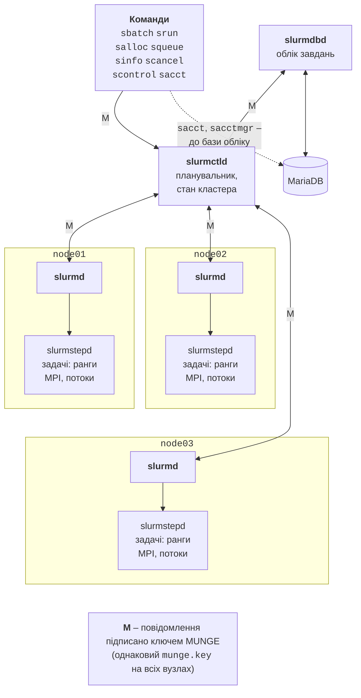

# Планувальник Slurm і команди

## Планувальник Slurm

**Slurm** (*Simple Linux Utility for Resource Management*, <https://slurm.schedmd.com/documentation.html>) – відкритий менеджер ресурсів і планувальник завдань, який використовують більшість суперкомп’ютерів TOP500. Його розробляє компанія SchedMD; нові версії виходять двічі на рік і нумеруються роком і місяцем: 25.11 (листопад 2025 року), 26.05 (травень 2026 року). В Ubuntu 26.04 є версія 25.11.2, тому посилання в лекції ведуть на документацію 25.11 (<https://slurm.schedmd.com/archive/slurm-25.11-latest/>). Slurm виконує три функції:

- **виділяє ресурси** (*allocation*): вузли, процесори, пам’ять, GPU – на заданий час;
- **запускає і контролює** задачі на виділених ресурсах;
- **керує чергою**: вирішує, яке завдання запустити наступним.

### Компоненти

Slurm складається з кількох служб (рис. 13.4):

- `slurmctld` – центральна служба на керувальному вузлі: зберігає стан вузлів і завдань, планує чергу; може мати резервну копію на іншому вузлі;
- `slurmd` – служба кожного обчислювального вузла: отримує завдання, запускає й контролює задачі, повідомляє про стан вузла;
- `slurmstepd` – процес, який `slurmd` створює для кожного кроку завдання; він запускає задачі користувача, збирає їхній вивід і статистику;
- `slurmdbd` – служба обліку: записує історію завдань у базу даних MariaDB або MySQL;
- команди користувача (`sbatch`, `srun`, `squeue` та інші) звертаються до `slurmctld` мережею.



Рис. 13.4. Компоненти Slurm {.caption}

**MUNGE** (*MUNGE Uid 'N' Gid Emporium*, <https://dun.github.io/munge/>) – служба автентифікації: кожне повідомлення між компонентами Slurm містить облікові дані (*credential*) з UID і GID відправника, зашифровані й підписані спільним ключем `/etc/munge/munge.key`. Тому **ключ має бути однаковим на всіх вузлах**, служба `munged` має запускатися раніше за служби Slurm, а годинники вузлів – бути синхронізованими (<https://slurm.schedmd.com/archive/slurm-25.11-latest/quickstart_admin.html>).

### Встановлення

Пакети Ubuntu розподіляють служби за ролями вузлів: на `head` – `slurmctld` і `slurm-client` (команди), для обліку – `slurmdbd` і `mariadb-server`; на обчислювальних вузлах – `slurmd` і `slurm-client`. Пакет `munge` встановлюється як залежність, а його ключ створюється під час встановлення на кожному вузлі **окремо**, тому ключ з `head` копіюють на інші вузли:

```bash
# head
sudo apt install slurmctld slurm-client munge
# node01–node03
sudo apt install slurmd slurm-client munge
# head: однаковий ключ MUNGE на всіх вузлах
for n in node01 node02 node03; do
  sudo cat /etc/munge/munge.key |
    ssh $n 'sudo tee /etc/munge/munge.key >/dev/null &&
            sudo chown munge:munge /etc/munge/munge.key &&
            sudo chmod 400 /etc/munge/munge.key &&
            sudo systemctl restart munge'
done
munge -n | ssh node02 unmunge    # перевірка між вузлами
```

Команда `sudo` на віддаленому вузлі без термінала працює, якщо вона не запитує пароль; інакше ключ копіюють через `scp` у домашній каталог і переносять на кожному вузлі вручну. Успішна перевірка виводить `STATUS: Success (0)`, адресу вузла-відправника, UID і GID:

```
STATUS:          Success (0)
ENCODE_HOST:     pro12-head.pro12-net (172.18.0.5)
ENCODE_TIME:     2026-09-18 19:13:42 +0000 (1789758822)
DECODE_TIME:     2026-09-18 19:13:42 +0000 (1789758822)
TTL:             300
CIPHER:          aes128 (4)
MAC:             sha256 (5)
ZIP:             none (0)
UID:             student (2001)
GID:             hpc (2001)
LENGTH:          0
```

Версію Slurm показує `sinfo --version`: `slurm-wlm 25.11.2`. Пакети Ubuntu зберігають конфігурацію в `/etc/slurm/`, стан служб – у `/var/lib/slurm/`, журнали – у `/var/log/slurm/`.

### Конфігурація slurm.conf

Головний файл `/etc/slurm/slurm.conf` описує кластер: керувальний вузол, модулі (*plugins*), вузли та **розділи** (*partitions*) – черги з наборами вузлів і обмеженнями. Файл має бути **однаковим на всіх вузлах**. Заготовку зручно створити у вебконфігураторі (<https://slurm.schedmd.com/archive/slurm-25.11-latest/configurator.html>), а потім доповнити. Для навчального кластера:

```
# /etc/slurm/slurm.conf – однаковий на всіх вузлах кластера
ClusterName=hpclab
SlurmctldHost=head
AuthType=auth/munge
SlurmUser=slurm
StateSaveLocation=/var/lib/slurm/slurmctld
SlurmdSpoolDir=/var/lib/slurm/slurmd
SlurmctldLogFile=/var/log/slurm/slurmctld.log
SlurmdLogFile=/var/log/slurm/slurmd.log
MpiDefault=pmix
ProctrackType=proctrack/cgroup
TaskPlugin=task/cgroup,task/affinity
ReturnToService=1
# Планування та розподіл ресурсів
SchedulerType=sched/backfill
SelectType=select/cons_tres
SelectTypeParameters=CR_Core_Memory
DefMemPerCPU=1000
# Облік через slurmdbd
AccountingStorageType=accounting_storage/slurmdbd
AccountingStorageHost=head
JobAcctGatherType=jobacct_gather/cgroup
# Вузли та розділи
NodeName=node[01-03] CPUs=4 Boards=1 SocketsPerBoard=1 \
    CoresPerSocket=2 ThreadsPerCore=2 RealMemory=5800
PartitionName=debug Nodes=node[01-03] Default=YES MaxTime=00:30:00
PartitionName=long Nodes=node[01-03] MaxTime=2-00:00:00
```

Основні параметри пояснено в табл. 13.2 (повний опис – <https://slurm.schedmd.com/archive/slurm-25.11-latest/slurm.conf.html>). Довгий рядок продовжують на наступному рядку символом `\`.

Таблиця 13.2. Основні параметри `slurm.conf` {.caption}

| **Параметр** | **Значення** |
| --- | --- |
| `SlurmctldHost` | вузол зі службою `slurmctld` |
| `MpiDefault=pmix` | `srun` запускає програми MPI через PMIx без ключа `--mpi` |
| `ProctrackType`, `TaskPlugin` | відстеження процесів завдання та обмеження процесорів і пам’яті засобами cgroup; `task/affinity` прив’язує задачі до ядер |
| `ReturnToService=1` | вузол, що перестав відповідати, повертається в роботу після повторної реєстрації (0 – лише вручну) |
| `SchedulerType` | `sched/backfill` – черга з заповненням проміжків (типово) |
| `SelectType`, `SelectTypeParameters` | розподіл окремих ядер і пам’яті (`CR_Core_Memory`), а не цілих вузлів |
| `DefMemPerCPU` | пам’ять (МБ) на один CPU, якщо завдання не вказало `--mem` |
| `NodeName` | вузли та їхні ресурси: CPU, сокети, ядра, потоки, пам’ять (МБ) |
| `PartitionName` | розділ: вузли, `Default`, найбільший час `MaxTime` |

**Ресурси вузла.** Рядок `NodeName` не пишуть навмання: команда `slurmd -C` на обчислювальному вузлі виводить виявлену апаратну конфігурацію саме у форматі `slurm.conf` (рис. 13.5). На навчальному ПК у WSL2 (утиліта `fmt` лише переносить довгий рядок, щоб він помістився на сторінці):

```
$ slurmd -C | fmt -w 64
Exception caught: rsmi_init.
NodeName=Intel CPUs=16 Boards=1 SocketsPerBoard=1 CoresPerSocket=8
ThreadsPerCore=2 RealMemory=31997 UpTime=0-01:43:31
```

Рядок `Exception caught` виводить модуль пошуку графічних процесорів AMD (ROCm SMI), яких на ПК немає; на результат він не впливає. `RealMemory` у конфігурації задають трохи меншим за виявлене значення (у навчальному ПК – 30000 замість 31997), щоб залишити пам’ять операційній системі. Якщо конфігурація **більша** за наявні ресурси, вузол переходить у стан `DRAIN` з причиною `Low RealMemory` або `Low socket*core*thread count`; якщо менша – `slurmd` пише в журнал попередження `Node configuration differs from hardware`.

::: info Знімок екрана
Terminal on node02 (Hyper-V VM): `slurmd -C`; the line `NodeName=node02 CPUs=… Boards=… SocketsPerBoard=… CoresPerSocket=… ThreadsPerCore=… RealMemory=…` and UpTime
:::

Рис. 13.5. Параметри вузла для slurm.conf {.caption}

### Обмеження ресурсів: cgroup.conf

Ubuntu 26.04 використовує лише **cgroup v2** – механізм ядра Linux, що обмежує групу процесів. З `ProctrackType=proctrack/cgroup` і `TaskPlugin=task/cgroup` Slurm створює для кожного завдання й кроку окрему групу, тож завдання не може зайняти чужі ядра чи пам’ять, а після завершення всі його процеси гарантовано знищуються. Файл `/etc/slurm/cgroup.conf` (<https://slurm.schedmd.com/archive/slurm-25.11-latest/cgroup.conf.html>):

```
CgroupPlugin=autodetect
ConstrainCores=yes
ConstrainRAMSpace=yes
ConstrainSwapSpace=yes
```

`ConstrainCores` обмежує задачі виділеними ядрами, `ConstrainRAMSpace` – пам’ять значенням `--mem`, а `ConstrainSwapSpace` забороняє «дозаймати» пам’ять у файлі підкачки. Без останнього параметра тестове завдання, яке перевищило `--mem=200M`, не завершилося з помилкою, а почало повільно працювати з підкачкою; з ним Slurm завершив його зі станом `OUT_OF_MEMORY`.

### Запуск служб

Служби запускає `systemd`; спочатку MUNGE, потім Slurm:

```bash
# head
sudo systemctl enable --now munge slurmctld
# node01–node03 (або clush -w node[01-03])
sudo systemctl enable --now munge slurmd
# будь-який вузол
sinfo
```

Після зміни `slurm.conf` файл копіюють на всі вузли (`clush -w node[01-03] --copy /etc/slurm/slurm.conf`) і виконують `sudo scontrol reconfigure`; зміни вузлів і портів потребують перезапуску служб. Щоб не копіювати файл, Slurm підтримує режим без конфігурації на вузлах (*configless*): `SlurmctldParameters=enable_configless` у `slurm.conf` і `SLURMD_OPTIONS="--conf-server head"` у `/etc/default/slurmd`.

### Облік завдань: slurmdbd (огляд)

Без обліку команда `sacct` повідомляє `Slurm accounting storage is disabled` (так налаштовано WSL на навчальному ПК), а черга не знає, скільки ресурсів уже використали користувачі. Облік вмикають службою `slurmdbd` на `head`: вона зберігає історію завдань у базі MariaDB, а `slurmctld` надсилає їй дані (параметри `AccountingStorage*` у `slurm.conf`). Файл `/etc/slurm/slurmdbd.conf` (права `600`, власник `slurm`) містить пароль до бази (<https://slurm.schedmd.com/archive/slurm-25.11-latest/accounting.html>):

```
AuthType=auth/munge
DbdHost=head
SlurmUser=slurm
LogFile=/var/log/slurm/slurmdbd.log
PidFile=/run/slurmdbd.pid
StorageType=accounting_storage/mysql
StorageHost=localhost
StorageUser=slurm
StoragePass=пароль_бази
StorageLoc=slurm_acct_db
```

Після створення користувача бази й запуску `slurmdbd` (до `slurmctld`) адміністратор реєструє кластер, **рахунки** (*accounts* – групи, лабораторії, проєкти) і користувачів командою `sacctmgr`:

```bash
sudo sacctmgr -i add cluster hpclab
sudo sacctmgr -i add account lab Description="Лабораторія"
sudo sacctmgr -i add user student account=lab
sacctmgr show assoc format=cluster,account,user
```

Зв’язок «кластер – рахунок – користувач» називається **асоціацією** (*association*); до неї прив’язують обмеження та частки ресурсів, які використовує планувальник (розділ «Облік і планування»).

## Команди користувача

Користувач працює з кластером лише через команди Slurm (табл. 13.3); довідку показує `man <команда>` або сторінка документації (<https://slurm.schedmd.com/archive/slurm-25.11-latest/quickstart.html>).

Таблиця 13.3. Команди користувача Slurm {.caption}

| **Команда** | **Призначення** |
| --- | --- |
| `sinfo` | стан розділів і вузлів; `-N -l` – по вузлах, `-R` – причини недоступності |
| `squeue` | черга завдань; `-u $USER`, `--start` – очікуваний час старту |
| `sbatch` | надіслати скрипт завдання в чергу (пакетне завдання) |
| `srun` | запустити паралельні задачі: окреме завдання або крок усередині виділення |
| `salloc` | отримати виділення ресурсів для інтерактивної роботи |
| `scancel` | скасувати завдання: `scancel 123`, `scancel -u $USER` |
| `scontrol` | подробиці й керування: `show job 123`, `show node node01`, `hold`, `release`, `update` |
| `sacct` | облік виконаних завдань і кроків (потрібен `slurmdbd`) |

**sinfo.** Розділи й вузли тестового кластера під час роботи кількох завдань (у стовпці `STATE` значення `alloc` – вузол повністю зайнятий, `idle` – вільний, `plnd` (`planned`) – вільний, але зарезервований для завдання, що чекає). Ключ `-o` задає стовпці: `%N` – вузли, `%T` – стан, `%c` – CPU, `%z` – сокети, ядра й потоки ядра, `%m` – пам’ять (МБ):

```
$ sinfo
PARTITION AVAIL  TIMELIMIT  NODES  STATE NODELIST
debug*       up      30:00      1   plnd node03
debug*       up      30:00      2  alloc node[01-02]
long         up 2-00:00:00      1   plnd node03
long         up 2-00:00:00      2  alloc node[01-02]
$ sinfo -N -p debug -o "%8N %10T %5c %8z %8m"
NODELIST STATE      CPUS  S:C:T    MEMORY
node01   allocated  4     1:2:2    3700
node02   allocated  4     1:2:2    3700
node03   planned    4     1:2:2    3700
```

Зірочка після `debug` позначає розділ за замовчуванням. Вузлу, що не відповідає, `sinfo` додає до стану `*` (`down*`). Докладну таблицю вузлів з усіма стовпцями виводить `sinfo -N -l`.

**squeue.** Черга з завданнями трьох користувачів у той самий момент (стовпець `ST`: `R` – виконується, `PD` – чекає; у дужках – **причина очікування**; `TIME_L` – ліміт часу):

```
$ squeue -o "%.5i %.8j %.7u %.2t %.6l %.5M %.5D %R"
JOBID     NAME    USER ST TIME_L  TIME NODES NODELIST(REASON)
   61   long-B student PD  10:00  0:00     1 (Priority)
   60    big-A   olena PD   5:00  0:00     3 (Resources)
   62  short-C student  R   2:00  0:01     1 node02
   59  model-R    ivan  R   4:00  0:31     1 node01
```

Причина `Resources` – бракує вільних ресурсів, `Priority` – попереду є завдання з вищим пріоритетом, `Dependency` – чекає на інше завдання, `QOSMaxJobsPerUserLimit` та подібні – досягнуто обмеження. Без ключа `-o` `squeue` виводить стовпці `JOBID`, `PARTITION`, `NAME`, `USER`, `ST`, `TIME`, `NODES`, `NODELIST(REASON)`. Знімок рис. 13.6 показує обидві команди на кластері з ВМ.

::: info Знімок екрана
Terminal on head: `sinfo -N -l` and `squeue -l` while several test users have running and pending jobs; node states idle/alloc/mix and reasons (Resources, Priority)
:::

Рис. 13.6. Стан розділів і черги завдань {.caption}

**srun і salloc.** Команда `srun` поза виділенням сама створює завдання, чекає на ресурси, запускає задачі й виводить їхній результат у термінал. Команда `salloc` лише виділяє ресурси й відкриває командну оболонку на вхідному вузлі; кожен `srun` у ній запускає **крок** (*job step*) на виділених вузлах, а `exit` звільняє ресурси (сеанс на тестовому кластері; команди `salloc` подано з файлу, запрошення командного рядка додано для наочності):

```
student@head$ srun -N2 hostname
node02
node01
student@head$ salloc -N2 -n4 -t 10
salloc: Granted job allocation 100
salloc: Nodes node[01-02] are ready for job
student@head$ echo "$SLURM_JOB_ID: $SLURM_JOB_NODELIST, $SLURM_NTASKS"
100: node[01-02], 4
student@head$ srun hostname
node01
node02
node02
node01
student@head$ exit
salloc: Relinquishing job allocation 100
```

Інтерактивну оболонку безпосередньо на обчислювальному вузлі дає `srun --pty bash` (наприклад, щоб зібрати програму на вузлі з іншим процесором); її також слід закривати, бо ресурси зайняті, доки оболонка відкрита.

**scontrol.** Команда `scontrol show job 13` показує всі параметри завдання: стан і причину, час надсилання й старту, виділені вузли та CPU, файл виводу. Фрагмент для завдання на навчальному ПК:

```
JobId=13 JobName=pi-mpi
   UserId=vano(1000) GroupId=vano(1000) MCS_label=N/A
   Priority=1 Nice=0 Account=(null) QOS=(null)
   JobState=RUNNING Reason=None Dependency=(null)
   …
   RunTime=00:00:03 TimeLimit=00:10:00 TimeMin=N/A
   SubmitTime=2026-09-18T18:57:43 EligibleTime=2026-09-18T18:57:43
   …
   Partition=debug AllocNode:Sid=localhost:6902
   ReqNodeList=(null) ExcNodeList=(null)
   NodeList=Intel
   BatchHost=Intel
   NumNodes=1 NumCPUs=16 NumTasks=16 CPUs/Task=1 ReqB:S:C:T=0:0:*:*
   …
   Command=/home/vano/pro12/pi.sbatch
   …
   StdOut=/home/vano/pro12/pi-13.out
```

Рядок `StartTime` (пропущено) містить і `EndTime` – для завдання, що виконується, це момент, коли спливе його ліміт часу. Цей самий `scontrol` дозволяє власникові зменшити ліміт часу (`scontrol update job=13 TimeLimit=5`; збільшити може лише адміністратор), притримати завдання в черзі (`scontrol hold 13`) і відпустити його (`scontrol release 13`).
