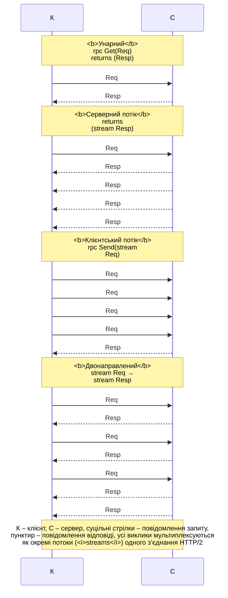

# gRPC і порівняння технологій

## gRPC і Protocol Buffers

**gRPC** – відкритий фреймворк RPC, створений у Google і розвинений у CNCF (<https://grpc.io/docs/what-is-grpc/core-concepts/>). Його основа:

- транспорт **HTTP/2**: одне TCP-з’єднання мультиплексує багато одночасних викликів (кожен – окремий потік HTTP/2), заголовки стискаються, дані передаються двійковими кадрами;
- контракт і формат повідомлень **Protocol Buffers** (protobuf) – компактна двійкова серіалізація зі схемою в файлі `.proto` (<https://protobuf.dev/programming-guides/proto3/>);
- генерація клієнтів і серверів для багатьох мов: C#, C++, Java, Go, Python тощо.

### Файл `.proto`

```proto
syntax = "proto3";
option csharp_namespace = "Orders";
package orders;

// Сервіс замовлень: унарний виклик і серверний потік.
service OrderService {
  rpc GetOrder (OrderRequest) returns (Order);
  rpc ListOrders (ListRequest) returns (stream Order);
}

message OrderRequest {
  int32 id = 1;
}

message ListRequest {
  double min_total = 1;      // лише замовлення від цієї суми
}

message Order {
  int32 id = 1;
  string customer = 2;
  repeated OrderLine lines = 3;
  OrderStatus status = 4;
}

message OrderLine {
  string product = 1;
  int32 quantity = 2;
  double price = 3;
}

enum OrderStatus {
  ORDER_STATUS_UNSPECIFIED = 0;
  ORDER_STATUS_NEW = 1;
  ORDER_STATUS_PAID = 2;
  ORDER_STATUS_SHIPPED = 3;
}
```

`message` описує структуру даних, `service` – набір методів `rpc`. Кожне поле має **номер** (`= 1`), який і передається в двійковому вигляді замість назви. Номери не можна змінювати після публікації контракту: нові поля додають з новими номерами, тоді старі клієнти просто ігнорують їх. Типи `int32`, `int64`, `double`, `bool`, `string`, `bytes`, вкладені повідомлення, `repeated` (списки), `map<K, V>` і `enum` (перше значення має дорівнювати 0). У proto3 скалярні поля не мають «null»: відсутнє поле читається як значення за замовчуванням (0, порожній рядок).

### Пакети та генерація коду

Для ASP.NET Core використовують реалізацію gRPC на .NET (<https://learn.microsoft.com/aspnet/core/grpc/>):

- `Grpc.AspNetCore` (у прикладах 2.83.0) – сервер: метапакет з `Grpc.Tools` і `Google.Protobuf`;
- `Grpc.Net.Client` (2.83.0), `Google.Protobuf` (3.36.1), `Grpc.Tools` (2.84.0) – консольний клієнт.

Пакет `Grpc.Tools` під час збирання викликає компілятор `protoc` і генерує класи C# з файлів, підключених елементом `Protobuf` у `.csproj`. Атрибут `GrpcServices` визначає, що генерувати: `Server` (абстрактний базовий клас `OrderService.OrderServiceBase`), `Client` (клас `OrderService.OrderServiceClient`), `Both` або `None` (лише повідомлення):

```xml
<!-- Orders.Server.csproj -->
<Protobuf Include="Protos\orders.proto" GrpcServices="Server" />

<!-- Orders.Client.csproj: посилання на той самий файл -->
<Protobuf Include="..\Orders.Server\Protos\orders.proto"
          GrpcServices="Client" Link="Protos\orders.proto" />
```

Згенерований код потрапляє в теку `obj` і не редагується. Рішення з двома проєктами в Rider показано на рис. 14.6; Rider підсвічує синтаксис `.proto` і переходить від C#-класу до повідомлення.

::: info Знімок екрана
Rider: solution Orders with projects Orders.Server and Orders.Client in Solution Explorer; editor split: `Protos/orders.proto` and `Orders.Server.csproj` with the `<Protobuf Include=… GrpcServices="Server" />` line
:::

Рис. 14.6. Файл `orders.proto` у рішенні Rider {.caption}

Сервіс успадковує згенерований базовий клас і перевизначає методи, а в `Program.cs` його реєструють: `builder.Services.AddGrpc()` і `app.MapGrpcService<OrderApi>()`. gRPC потребує HTTP/2; для локальної розробки без TLS Kestrel налаштовують на HTTP/2 явно (`listen.Protocols = HttpProtocols.Http2`), а клієнт звертається за адресою `http://localhost:5001`. Браузери не можуть напряму викликати gRPC; для них існує gRPC-Web (<https://learn.microsoft.com/aspnet/core/grpc/grpcweb>).

## Типи викликів gRPC, дедлайни та перехоплювачі

gRPC підтримує чотири типи методів (рис. 14.7):

- **унарний** (*unary*): один запит – одна відповідь; клієнт викликає `await client.GetOrderAsync(request)`;
- **серверний потік** (*server streaming*, `returns (stream Order)`): сервер пише кілька повідомлень через `IServerStreamWriter<T>.WriteAsync`, клієнт читає `call.ResponseStream.ReadAllAsync()` циклом `await foreach`;
- **клієнтський потік** (*client streaming*, `rpc Send (stream Req)`): клієнт пише `call.RequestStream.WriteAsync(...)`, завершує `CompleteAsync()` і отримує одну відповідь; сервер читає `IAsyncStreamReader<T>`;
- **двонаправлений потік** (*bidirectional streaming*): обидві сторони читають і пишуть незалежно (чат, ігри, телеметрія з командами).



Рис. 14.7. Типи викликів gRPC {.caption}

### Дедлайни, скасування та метадані

**Дедлайн** (*deadline*) – момент часу UTC, після якого виклик скасовується: `client.ListOrders(request, deadline: DateTime.UtcNow.AddSeconds(1))`. За замовчуванням дедлайну **немає**, тому виклик може чекати вічно – дедлайн слід задавати завжди. Дедлайн передається серверу в заголовку; коли він минає, клієнт отримує `RpcException` з кодом `DeadlineExceeded`, а на сервері спрацьовує `ServerCallContext.CancellationToken`. Сервер повинен передавати цей токен у свої асинхронні операції, інакше продовжить марну роботу. Клієнт також може скасувати виклик токеном (`cancellationToken:`) або `Dispose()` виклику – тоді код `Cancelled` (<https://learn.microsoft.com/aspnet/core/grpc/deadlines-cancellation>).

**Метадані** (*metadata*) – пари «ключ–значення» в заголовках HTTP/2: клієнт передає `Metadata` (токен автентифікації, ідентифікатор запиту, назву клієнта), сервер читає `context.RequestHeaders.GetValue("client-name")`.

### Коди статусу

Результат кожного виклику – **код статусу** (повний список із 17 кодів: <https://grpc.io/docs/guides/status-codes/>). Сервіс повідомляє про помилку винятком `throw new RpcException(new Status(StatusCode.NotFound, "…"))`; клієнт перехоплює `RpcException` і читає `StatusCode` та `Status.Detail`. Необроблений виняток сервісу перетворюється на код `Unknown` без подробиць, якщо не ввімкнено `EnableDetailedErrors` (типово `false`, бо подробиці можуть розкрити внутрішню інформацію).

Найважливіші коди: `OK`; `Cancelled` (скасовано клієнтом); `InvalidArgument`; `DeadlineExceeded`; `NotFound` і `AlreadyExists`; `PermissionDenied` і `Unauthenticated`; `ResourceExhausted` (вичерпано ліміт, зокрема повідомлення понад 4 МБ за замовчуванням); `Unavailable` (тимчасова недоступність, запит можна повторити); `Unimplemented`, `Internal`, `Unknown` (помилки на сервері).

### Перехоплювачі

**Перехоплювач** (*interceptor*) – клас, похідний від `Grpc.Core.Interceptors.Interceptor`, який обгортає виклики на сервері чи клієнті: журналювання, вимірювання часу, перевірка токена, повтори. Серверний перехоплювач перевизначає `UnaryServerHandler`, `ServerStreamingServerHandler` тощо, виконує свою роботу і викликає `continuation` (наступний обробник). Його реєструють `options.Interceptors.Add<LoggingInterceptor>()` у `AddGrpc`, а клієнтський – `channel.Intercept(new ClientLogger())`. Документація: <https://learn.microsoft.com/aspnet/core/grpc/interceptors>.

## Інструменти й порівняння технологій

### gRPC reflection і `grpcurl`

Інструменти мають знати контракт сервісу. Їм можна передати файл `.proto` або ввімкнути на сервері **gRPC reflection** – службовий сервіс, який повертає опис усіх сервісів: пакет `Grpc.AspNetCore.Server.Reflection`, виклики `builder.Services.AddGrpcReflection()` і `app.MapGrpcReflectionService()`. Reflection розкриває перелік API, тому в робочому середовищі його вмикають лише для розробки (<https://learn.microsoft.com/aspnet/core/grpc/test-tools>).

Утиліта командного рядка `grpcurl` (<https://github.com/fullstorydev/grpcurl>) перетворює JSON на protobuf і назад (рис. 14.8). Параметр `-plaintext` потрібен для сервера без TLS, `-d` (JSON запиту) записують перед адресою; у PowerShell лапки всередині JSON екранують `\"`:

```powershell
grpcurl -plaintext localhost:5001 list
grpcurl -plaintext localhost:5001 describe orders.OrderService
grpcurl -plaintext -d '{\"id\": 2}' localhost:5001 `
    orders.OrderService/GetOrder
```

::: info Знімок екрана
Windows Terminal, Orders.Server running: `grpcurl -plaintext localhost:5001 list`, `describe orders.OrderService`, unary call GetOrder with -d id 2; JSON response with customer «Іван Коваль» and two lines visible
:::

Рис. 14.8. Виклик gRPC-сервісу з командного рядка {.caption}

### HTTP Client у Rider

Вбудований HTTP Client Rider виконує запити з файлів `.http`, зокрема gRPC-запити з ключовим словом `GRPC` (потрібні плагіни *Protocol Buffers* і *gRPC*; підтримуються унарні виклики та серверні потоки; для TLS перед адресою пишуть `grpcs://`). Автодоповнення працює за файлом `.proto` або через reflection сервера (<https://www.jetbrains.com/help/rider/Http_client_in__product__code_editor.html>):

Такий запит і відповідь сервера показано на рис. 14.9.

```
### Замовлення № 2
GRPC localhost:5001/orders.OrderService/GetOrder
client-name: rider

{
  "id": 2
}
```

::: info Знімок екрана
Rider: file `orders.http` with the GRPC request above, gutter Run icon clicked; Services / response panel with JSON of order 2; Orders.Server running
:::

Рис. 14.9. Запит gRPC у HTTP Client Rider {.caption}

У робочому середовищі gRPC і HTTP використовують лише з **TLS** (адреса `https://`, для розробки – сертифікат `dotnet dev-certs https --trust`), а автентифікацію виконують токенами в метаданих (<https://learn.microsoft.com/aspnet/core/grpc/security>).

### Порівняння технологій

Характеристики підходів підсумовує табл. 14.2.

Таблиця 14.2. Порівняння сокетів, WCF, gRPC і REST {.caption}

| **Критерій** | **Сокети** | **WCF / CoreWCF** | **gRPC** | **REST (HTTP API)** |
| --- | --- | --- | --- | --- |
| контракт | власний протокол | WSDL, `[ServiceContract]` | `.proto` | OpenAPI |
| формат | будь-який | SOAP XML, двійковий у NetTcp | protobuf | JSON |
| транспорт | TCP, UDP | HTTP, TCP | HTTP/2 | HTTP/1.1, 2, 3 |
| потоки | вручну | обмежено | 4 типи викликів | ні |
| застосування | ігри, власні протоколи | наявні сервіси WCF | виклики між сервісами | публічні API, браузер |

**Затримка** (*latency*) – час одного виклику (медіана й 99-й перцентиль), **пропускна здатність** (*throughput*) – кількість викликів за секунду. Для ілюстрації автор виміряв виклик «додати два числа» різними технологіями на i9-11900KF: сервер і клієнт в одному процесі на `localhost`, 20 000 послідовних викликів після прогріву, потім 16 одночасних клієнтів протягом 3 с (табл. 14.3).

Таблиця 14.3. Затримка й пропускна здатність на localhost (i9-11900KF) {.caption}

| **Технологія** | **Медіана, мс** | **p99, мс** | **Викликів/с (16 клієнтів)** |
| --- | --- | --- | --- |
| TCP-сокет, кадри JSON | 0,046 | 0,073 | 262 198 |
| REST (HTTP/1.1, JSON) | 0,110 | 0,178 | 162 101 |
| gRPC (HTTP/2, protobuf) | 0,144 | 0,258 | 121 883 |
| CoreWCF (BasicHttp, SOAP) | 0,160 | 0,342 | 84 136 |

Для крихітних повідомлень на петлевому інтерфейсі найшвидший «голий» сокет, а gRPC навіть повільніший за REST: накладні витрати HTTP/2 більші за виграш від protobuf, а 16 клієнтів gRPC ділили одне з’єднання. Переваги gRPC – великі повідомлення, реальна мережа, потокові виклики та строгий контракт (<https://learn.microsoft.com/aspnet/core/grpc/comparison>); свій сценарій завжди вимірюють.
