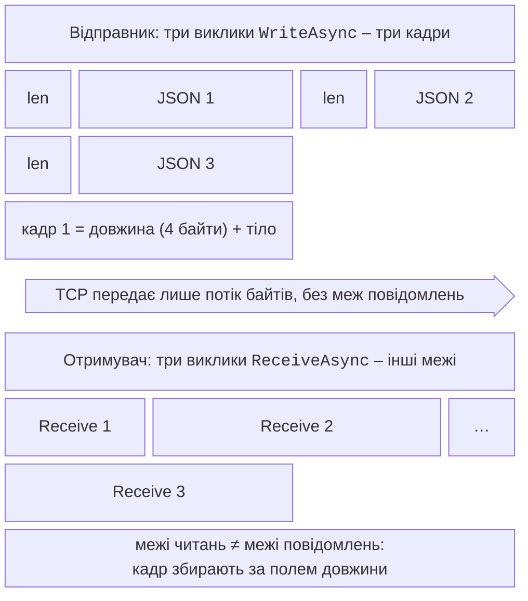

# Протоколи та надійність

## Протокол прикладного рівня

TCP передає **потік байтів**: три виклики `WriteAsync` відправника можуть прийти одним читанням або, навпаки, одне повідомлення – кількома (рис. 14.3). Тому поверх TCP потрібен власний **протокол прикладного рівня** (*application protocol*), який визначає, де закінчується повідомлення (**кадрування**, *framing*), як кодуються дані (**серіалізація**) і які повідомлення допустимі.



Рис. 14.3. Кадрування повідомлень у потоці TCP {.caption}

Два поширені способи кадрування:

- **роздільник** (*delimiter*): кожне повідомлення закінчується символом `\n` (`StreamReader.ReadLineAsync`); просто, але текст не може містити роздільника, а зловмисник може надіслати нескінченний рядок;
- **префікс довжини** (*length prefix*): перед тілом записують його довжину, наприклад 4 байти в порядку big-endian (`BinaryPrimitives.WriteInt32BigEndian`); отримувач читає рівно 4 байти, потім рівно стільки байтів тіла. Перед виділенням буфера довжину обов’язково перевіряють на максимум.

Прочитати рівно `n` байтів допомагає цикл до заповнення буфера або метод `Stream.ReadExactlyAsync` (.NET 7 і новіші), який кидає `EndOfStreamException`, якщо потік закінчився раніше.

### Серіалізація

Тіло кадру кодують текстовим або двійковим форматом:

- **JSON** (`System.Text.Json`, <https://learn.microsoft.com/dotnet/standard/serialization/system-text-json/overview>): `JsonSerializer.SerializeToUtf8Bytes(message, JsonSerializerOptions.Web)` – читабельний, легко налагоджувати, але об’ємніший. Типовий кодувальник екранує кирилицю (`\u041E…`), тому об’єкт `{ id = 7, name = "Олена", score = 12.5 }` займає 61 байт;
- **двійковий** формат через `BinaryWriter`/`BinaryReader`: виклики `writer.Write(7)`, `writer.Write("Олена")`, `writer.Write(12.5)` дають 23 байти (`int` – 4, рядок – байт довжини й 10 байтів UTF-8, `double` – 8), але обидві сторони мають однаково знати порядок полів;
- **Protocol Buffers** – компактний двійковий формат зі схемою, який використовує gRPC (розділ «gRPC і Protocol Buffers»).

Високонавантажені сервери (зокрема Kestrel) читають мережу через бібліотеку `System.IO.Pipelines` (<https://learn.microsoft.com/dotnet/standard/io/pipelines>): `PipeReader` повертає всі накопичені байти як `ReadOnlySequence<byte>`, програма вирізає повні кадри, а неповний кадр залишається в буфері з пулу до наступного читання без копіювання.

## Протокол UDP

UDP надсилає окремі **дейтаграми** без з’єднання. Клас `UdpClient` має методи `SendAsync(bytes, endpoint)` і `ReceiveAsync(token)`; результат `UdpReceiveResult` містить байти й адресу відправника. Опис: <https://learn.microsoft.com/dotnet/api/system.net.sockets.udpclient>.

- **Одноадресна** розсилка (*unicast*) – на конкретну кінцеву точку.
- **Широкомовна** (*broadcast*) – на адресу `255.255.255.255` (`IPAddress.Broadcast`) усім вузлам локальної мережі; потрібна властивість `EnableBroadcast = true`, маршрутизатори такі пакети не пропускають.
- **Групова** (*multicast*) – на адресу групи `224.0.0.0`–`239.255.255.255`; пакети отримують лише учасники групи:

```cs
IPAddress group = IPAddress.Parse("239.0.0.222");
using UdpClient receiver = new(5060);        // порт групи
receiver.JoinMulticastGroup(group);
using UdpClient sender = new() { MulticastLoopback = true };
await sender.SendAsync("оголошення"u8.ToArray(),
    new IPEndPoint(group, 5060));
UdpReceiveResult r = await receiver.ReceiveAsync(token);
```

Застосунок над UDP сам вирішує, що робити із втратами, дублікатами й порядком: нумерує дейтаграми, повторює важливі повідомлення, ігнорує застарілі. Дейтаграма понад 65 507 байтів навіть не надсилається: `SendAsync` кидає `SocketException` з кодом `MessageSize` (перевірено). Практично дейтаграми роблять меншими за MTU мережі (близько 1400 байтів), щоб уникнути фрагментації.

## Надійність мережевої взаємодії

### Таймаути

Мережевий виклик без таймауту може чекати вічно: сервер «завис», кабель від’єднано, пакет загубився. Властивості `ReceiveTimeout` і `SendTimeout` класів `Socket` і `TcpClient` (типово 0 – без обмеження) діють лише на **синхронні** методи. Асинхронні операції обмежують токеном скасування (тема 5):

```cs
using CancellationTokenSource timeout = new(TimeSpan.FromSeconds(3));
await client.ConnectAsync(host, port, timeout.Token);
int n = await stream.ReadAsync(buffer, timeout.Token);
```

Після скасування операції читання стан з’єднання невизначений (частину кадру могло бути прочитано), тому таке з’єднання закривають.

### Повторні спроби

Тимчасові збої (сервер перезапускається, мережа перевантажена) лікуються **повторною спробою** з **експоненційною затримкою** (*exponential back-off*) і випадковою добавкою (*jitter*), щоб тисячі клієнтів не повторювали запити одночасно. Повторюють лише тимчасові помилки й лише обмежену кількість разів:

```cs
static async Task<TcpClient> ConnectWithRetryAsync(string host,
    int port, int attempts)
{
    for (int attempt = 1; ; attempt++)
    {
        TcpClient client = new();
        try
        {
            using CancellationTokenSource timeout =
                new(TimeSpan.FromSeconds(3));
            await client.ConnectAsync(host, port, timeout.Token);
            return client;
        }
        catch (Exception ex) when (attempt < attempts
            && ex is OperationCanceledException or SocketException
            {
                SocketErrorCode: SocketError.ConnectionRefused
                    or SocketError.TimedOut
            })
        {
            client.Dispose();
            int delay = 200 * (1 << (attempt - 1))   // 200, 400, 800…
                + Random.Shared.Next(100);           // «джитер»
            string reason = ex is SocketException se
                ? se.SocketErrorCode.ToString() : "таймаут";
            Console.WriteLine($"спроба {attempt}: {reason}, " +
                $"повтор через {delay} мс");
            await Task.Delay(delay);
        }
        catch
        {
            client.Dispose();       // остання спроба або інша помилка
            throw;
        }
    }
}
```

Виклик `ConnectWithRetryAsync("127.0.0.1", 5999, attempts: 3)` до порту, який ніхто не слухає, виводить «спроба 1: ConnectionRefused, повтор через 201 мс», «спроба 2: ConnectionRefused, повтор через 484 мс», а третя помилка виходить до викликальника. Цікаво, що в Windows відмова від з’єднання з `127.0.0.1` надходить не миттєво, а приблизно через 2 с (стек кілька разів повторює SYN), а з ім’ям `localhost` – через 4 с, бо перевіряються обидві адреси `::1` і `127.0.0.1`. Для повторних спроб у HTTP-клієнтах використовують готові бібліотеки стійкості (пакет `Microsoft.Extensions.Http.Resilience`), а gRPC має вбудовані повтори (<https://learn.microsoft.com/aspnet/core/grpc/retries>).

### Keep-alive і закриття з’єднання

Якщо клієнт зник без закриття (вимкнено живлення), сервер дізнається про це лише під час наступного запису. Механізм **keep-alive** TCP періодично надсилає порожні пакети-перевірки; його вмикає `socket.SetSocketOption(SocketOptionLevel.Socket, SocketOptionName.KeepAlive, true)`, а параметри `TcpKeepAliveTime` (секунди тиші), `TcpKeepAliveInterval` і `TcpKeepAliveRetryCount` задають на рівні `SocketOptionLevel.Tcp`. Прикладні протоколи часто додають власні **хартбіти** (*heartbeat*) – повідомлення «я живий» раз на кілька секунд. Коректне закриття виконують так: відправник викликає `Shutdown(SocketShutdown.Send)` (пакет FIN – «даних більше не буде»), отримувач дочитує дані до `ReceiveAsync == 0`, відповідає й закриває свій бік, після чого обидва викликають `Dispose`.

### Обробка `SocketException`

Помилки сокетів повідомляє `SocketException` з властивістю `SocketErrorCode` типу `SocketError` (<https://learn.microsoft.com/dotnet/api/system.net.sockets.socketerror>). Під час читання й запису через `NetworkStream` ті самі помилки загорнуто в `IOException` (`InnerException`). Найчастіші коди: `ConnectionRefused` (порт ніхто не слухає), `ConnectionReset` (інша сторона аварійно закрила з’єднання), `TimedOut`, `AddressAlreadyInUse` (порт зайнятий іншим процесом), `AccessDenied` (порт захоплено іншою програмою в ексклюзивному режимі; під час підготовки прикладу так поводився порт UDP 5050), `HostNotFound`.
