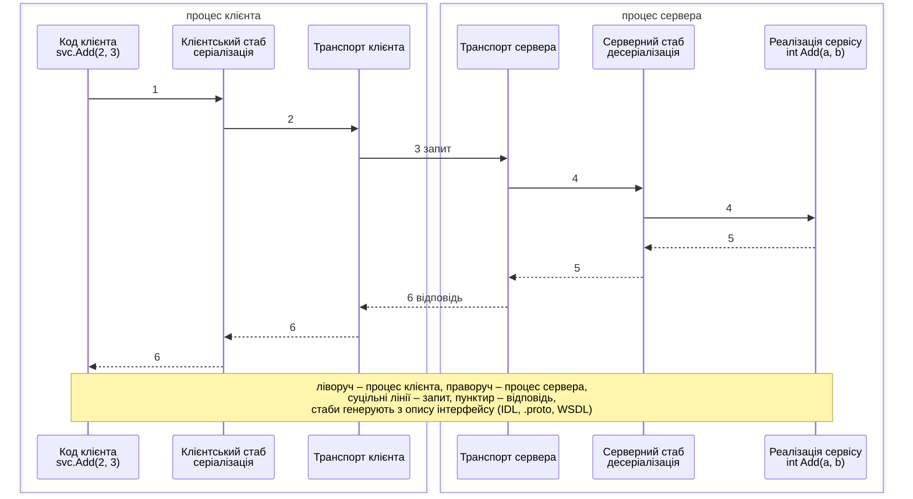
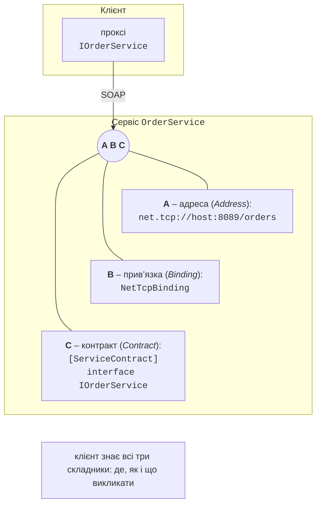

# Віддалений виклик процедур і WCF

## Віддалений виклик процедур

Власний протокол над сокетами дає повний контроль, але вимагає багато рутинного коду. **Віддалений виклик процедур** (*Remote Procedure Call*, RPC) приховує мережу: клієнт викликає метод так, ніби сервіс локальний, а згенерований код виконує все інше (рис. 14.4).



Рис. 14.4. Віддалений виклик процедури {.caption}

1. Код клієнта викликає метод **клієнтського стабу** (*stub*, *proxy*) з тією самою сигнатурою.
2. Стаб **маршалізує** (*marshal*) виклик: серіалізує назву методу й аргументи в повідомлення.
3. Транспорт передає повідомлення мережею.
4. **Серверний стаб** (*skeleton*) десеріалізує повідомлення і викликає реалізацію сервісу.
5. Результат або виняток серіалізується у відповідь.
6. Клієнтський стаб повертає результат або кидає виняток у коді клієнта.

Стаби генерують з **мови опису інтерфейсів** (*Interface Definition Language*, IDL), незалежної від мови програмування: WSDL у SOAP-сервісах WCF, файли `.proto` у gRPC, OpenAPI для REST.

### Семантика викликів та ідемпотентність

Локальний виклик виконується рівно один раз. Віддалений – ні: якщо відповідь не надійшла, клієнт не знає, чи дійшов запит до сервера. Розрізняють **семантику** викликів:

- **at-most-once** (не більше одного разу): без повторних спроб; операцію могло бути не виконано;
- **at-least-once** (щонайменше один раз): клієнт повторює запит до отримання відповіді; операцію могло бути виконано кілька разів;
- **exactly-once** (рівно один раз) досягається лише поєднанням повторів на клієнті й **усунення дублікатів** на сервері.

Операція **ідемпотентна** (*idempotent*), якщо повторне виконання не змінює результату: «встановити баланс 100», «вилучити замовлення 7», читання. Неідемпотентні операції («зняти 100 грн») роблять безпечними **ідентифікатором запиту**: клієнт генерує `Guid` один раз і повторює запит з ним, а сервер пам’ятає вже виконані ідентифікатори і повертає збережений результат. У пам’яті сервера це можна зробити словником `ConcurrentDictionary<Guid, Lazy<Task<T>>>` і методом `GetOrAdd`: `Lazy<T>` гарантує, що навіть за гонитви (тема 4) операцію буде запущено один раз (у перевірці три одночасні запити з одним ідентифікатором виконали операцію один раз). У реальному сервісі ідентифікатори зберігають у базі даних з терміном життя.

## WCF і CoreWCF

**Windows Communication Foundation** (WCF) – фреймворк .NET Framework (з 2006 року) для SOAP-сервісів і RPC (<https://learn.microsoft.com/dotnet/framework/wcf/>). Основне поняття WCF – **кінцева точка** (*endpoint*), яка складається з трьох частин «ABC» (рис. 14.5):

- **A – адреса** (*Address*): де сервіс, наприклад `net.tcp://host:8089/orders` або `http://host/orders.svc`;
- **B – прив’язка** (*Binding*): як передаються повідомлення – транспорт, кодування, безпека (`BasicHttpBinding` – SOAP 1.1 через HTTP, `WSHttpBinding`, `NetTcpBinding` – двійкове кодування через TCP, `NetNamedPipeBinding`);
- **C – контракт** (*Contract*): що можна викликати – інтерфейс з атрибутом `[ServiceContract]`, методи з `[OperationContract]`, типи даних з `[DataContract]` і `[DataMember]`.



Рис. 14.5. Кінцева точка WCF: адреса, прив’язка, контракт {.caption}

Один сервіс може мати кілька кінцевих точок з тим самим контрактом і різними прив’язками. WCF генерує WSDL-опис, з якого клієнтський проксі створює `svcutil` або `dotnet-svcutil` (<https://learn.microsoft.com/dotnet/core/additional-tools/dotnet-svcutil-guide>).

### WCF у сучасному .NET

Серверну частину WCF не перенесено в .NET Core і .NET 5+: вона існує лише в .NET Framework 4.x. Для сучасного .NET є два шляхи:

- **клієнтські бібліотеки** WCF – пакети `System.ServiceModel.Http`, `System.ServiceModel.NetTcp` та інші (<https://github.com/dotnet/wcf>), у вересні 2026 року версія 10.0.652802; вони дозволяють викликати наявні SOAP-сервіси з .NET 10;
- **CoreWCF** (<https://github.com/CoreWCF/CoreWCF>) – проєкт спільноти за підтримки Microsoft, реалізація серверної частини WCF на ASP.NET Core. Поточна версія 1.9 (випуск 24 квітня 2026, виправлення 1.9.1) підтримує .NET 8, 9, 10 і .NET Framework 4.6.2+ (<https://dotnet.microsoft.com/platform/support/policy/corewcf>); пакети `CoreWCF.Primitives`, `CoreWCF.Http`, `CoreWCF.NetTcp` та інші.

CoreWCF призначений передусім для **перенесення** наявних WCF-сервісів: контракти й реалізації переносяться майже без змін (простір імен `CoreWCF` замість `System.ServiceModel`), а конфігурацію кінцевих точок записують у коді. Додавання кінцевої точки `NetTcpBinding` до сервісу складу з лабораторної роботи 14 (перевірено разом із клієнтом на `System.ServiceModel.NetTcp`):

```cs
builder.WebHost.UseNetTcp(8089);              // пакет CoreWCF.NetTcp
builder.Services.AddServiceModelServices();
// …
app.UseServiceModel(model =>
{
    model.AddService<WarehouseService>();
    model.AddServiceEndpoint<WarehouseService, IWarehouseService>(
        new NetTcpBinding(), "net.tcp://localhost:8089/warehouse");
});
```

Клієнт використовує той самий контракт з `new NetTcpBinding()` і `new EndpointAddress("net.tcp://localhost:8089/warehouse")`.

Для **нових** сервісів Microsoft рекомендує gRPC (виклики між сервісами) або HTTP API; посібник для розробників WCF: <https://learn.microsoft.com/dotnet/architecture/grpc-for-wcf-developers/>.
