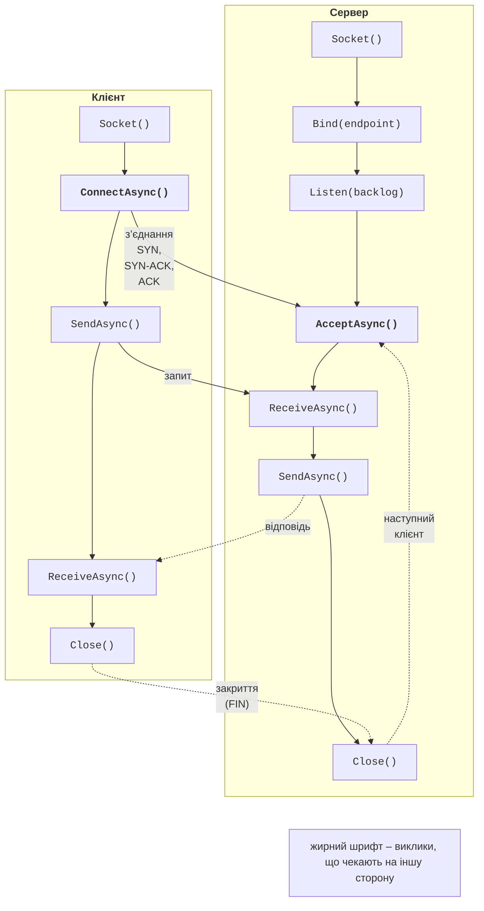

# Мережна взаємодія та сокети

## Моделі взаємодії в розподілених системах

У темах 2–7 паралельні обчислення виконувалися в **одному процесі** на спільній пам’яті. **Розподілена система** (*distributed system*) – це кілька процесів на одному чи різних комп’ютерах, які не мають спільної пам’яті й обмінюються **повідомленнями** через мережу. Так побудовані вебсервіси, кластери (теми 12–13), брокери повідомлень (тема 15) і хмарні застосунки (теми 16–17).

Основні моделі взаємодії:

- **клієнт–сервер** (*client–server*): сервер очікує запити на відомій адресі, клієнти самі встановлюють з’єднання; сервер обслуговує багатьох клієнтів одночасно;
- **багаторівнева архітектура** (*multi-tier*): клієнт звертається до сервера застосунку, а той – до сервера бази даних чи інших сервісів; кожен рівень є клієнтом для наступного;
- **однорангова модель** (*peer-to-peer*, P2P): кожен вузол водночас клієнт і сервер (обмін файлами, блокчейн, розподілені хеш-таблиці).

За способом очікування взаємодія буває **синхронною** (клієнт чекає відповіді, як у звичайному виклику методу) та **асинхронною** (клієнт надсилає повідомлення й продовжує роботу, відповідь надходить пізніше або не потрібна зовсім). У .NET синхронну за логікою взаємодію реалізують асинхронним кодом `async`/`await` (тема 5), щоб очікування мережі не займало потоків.

::: tip Хибні припущення розподілених обчислень
Л. Пітер Дойч і його колеги із Sun Microsystems сформулювали вісім помилкових припущень, які роблять початківці: мережа надійна; затримка нульова; пропускна здатність нескінченна; мережа безпечна; топологія не змінюється; є один адміністратор; транспортування безкоштовне; мережа однорідна. Кожне з них у реальній системі хибне, тому мережевий код завжди має таймаути, повторні спроби, перевірку даних і захист каналу.
:::

## Стек протоколів TCP/IP

Мережеві програми працюють над стеком TCP/IP: **канальний** рівень (Ethernet, Wi-Fi), **мережевий** (IP – доставка пакетів між вузлами), **транспортний** (TCP або UDP – доставка між процесами) і **прикладний** (HTTP, SMTP, gRPC або власний протокол).

- **IP-адреса** визначає вузол: IPv4 – 32 біти (`192.168.0.10`, петлева адреса `127.0.0.1`), IPv6 – 128 бітів (`2001:db8::1`, петлева `::1`). Адреса `0.0.0.0` (`IPAddress.Any`) під час прив’язки означає «усі мережеві інтерфейси».
- **Порт** (0–65535) визначає процес на вузлі. Порти до 1023 зарезервовані для відомих служб (80 – HTTP, 443 – HTTPS); у прикладах цієї теми використано порти 5000–5055.
- **Кінцева точка** (*endpoint*) – пара «адреса, порт», у .NET клас `IPEndPoint`.
- **DNS** перетворює ім’я на адреси: `await Dns.GetHostAddressesAsync("localhost")` на комп’ютері автора повернув дві адреси: `::1` (`InterNetworkV6`) і `127.0.0.1` (`InterNetwork`).

Транспортні протоколи порівнює табл. 14.1.

Таблиця 14.1. Порівняння протоколів TCP і UDP {.caption}

| **Властивість** | **TCP** | **UDP** |
| --- | --- | --- |
| з’єднання | встановлюється (трикрокове рукостискання SYN, SYN-ACK, ACK) | немає: кожна дейтаграма незалежна |
| надійність | підтвердження, повторне надсилання, контрольні суми | дейтаграма може загубитися або надійти двічі |
| порядок | байти надходять у порядку відправлення | порядок не гарантовано |
| межі повідомлень | немає: **потік байтів** | зберігаються: одна дейтаграма – одне повідомлення (до 65 507 байтів у IPv4) |
| керування потоком | так (вікно, контроль перевантаження) | ні |
| застосування | HTTP/1.1, HTTP/2, gRPC, бази даних, SSH | DNS, потокове відео, ігри, виявлення сервісів, HTTP/3 (QUIC) |

### Діагностичні утиліти

Перевірити, чи слухає сервер порт, можна командами (рис. 14.1):

```powershell
Get-NetTCPConnection -LocalPort 5000 -State Listen
Test-NetConnection 127.0.0.1 -Port 5000   # TcpTestSucceeded : True
ss -tlnp | grep 5000                      # Linux (bash)
```

`Get-NetTCPConnection` показує адресу, порт, стан `Listen` і номер процесу (`OwningProcess`), `Test-NetConnection` пробує з’єднатися, а `ss` у Linux замінює застарілий `netstat`. Пакети переглядають аналізатором **Wireshark** (<https://www.wireshark.org/docs/>); у Windows трафік `localhost` захоплюють на адаптері *Adapter for loopback traffic capture*.

::: info Знімок екрана
Windows Terminal: `dotnet run -c Release -- server` of the echo example in one tab; in another `Get-NetTCPConnection -LocalPort 5000 -State Listen` and `Test-NetConnection 127.0.0.1 -Port 5000`; optionally Ubuntu `ss -tlnp | grep 5000`
:::

Рис. 14.1. Сервер, що слухає порт 5000 {.caption}

## Сокети в .NET

**Сокет** (*socket*) – об’єкт операційної системи, через який процес надсилає та отримує дані мережею. У .NET є два рівні API (<https://learn.microsoft.com/dotnet/fundamentals/networking/sockets/sockets-overview>):

- клас `Socket` з простору імен `System.Net.Sockets` – тонка обгортка над сокетами ОС (Winsock у Windows, BSD-сокети в Linux): `Bind`, `Listen`, `AcceptAsync`, `ConnectAsync`, `SendAsync`, `ReceiveAsync`, `Shutdown`;
- класи `TcpListener`, `TcpClient`, `UdpClient` – спрощені обгортки для типових сценаріїв; `TcpClient` дає `NetworkStream`, тобто звичайний `Stream`, з яким працюють `StreamReader`, `StreamWriter`, `CopyToAsync` та серіалізатори.

Послідовність викликів TCP-сервера й клієнта показано на рис. 14.2. Сервер створює сокет, прив’язує його до кінцевої точки (`Bind`), переводить у режим очікування (`Listen`, параметр – довжина черги непринятих з’єднань) і приймає з’єднання (`AcceptAsync`). Кожне прийняте з’єднання – **новий** сокет, а слухаючий сокет знову чекає наступного клієнта.



Рис. 14.2. Послідовність викликів TCP-сокетів {.caption}

```cs
// Сервер: один запит і одна відповідь.
using Socket listener = new(AddressFamily.InterNetwork,
    SocketType.Stream, ProtocolType.Tcp);
listener.Bind(new IPEndPoint(IPAddress.Loopback, 5000));
listener.Listen(backlog: 100);
using Socket handler = await listener.AcceptAsync();
byte[] buffer = new byte[1024];
int received = await handler.ReceiveAsync(buffer, SocketFlags.None);
string request = Encoding.UTF8.GetString(buffer, 0, received);
byte[] reply = Encoding.UTF8.GetBytes($"pong: {request}");
await handler.SendAsync(reply, SocketFlags.None);
handler.Shutdown(SocketShutdown.Both);    // коректне закриття
```

Клієнт створює такий самий сокет, викликає `ConnectAsync(endpoint)`, надсилає `"ping"` і отримує `pong: ping`; наступний `ReceiveAsync` клієнта повертає 0.

`ReceiveAsync` повертає кількість прочитаних байтів; **нуль** означає, що інша сторона закрила з’єднання. Метод може повернути **менше** байтів, ніж надіслано: TCP не зберігає межі повідомлень (розділ «Протокол прикладного рівня»). Для IPv6 створюють сокет `AddressFamily.InterNetworkV6`; властивість `DualMode = true` дозволяє такому сокету приймати й IPv4-з’єднання (типово `false`).

### Обслуговування багатьох клієнтів

Сервер, який обробляє клієнта в циклі прийому, обслуговує лише одного клієнта за раз. Класичне рішення «потік на клієнта» (тема 2) погано масштабується: тисяча клієнтів – тисяча потоків зі стеками. У .NET кожне з’єднання обслуговує **асинхронна задача**: цикл прийому викликає `sessions.Add(ServeAsync(client, token))` без `await` і одразу повертається до `AcceptTcpClientAsync`, а `ServeAsync` читає й пише через `await`. Поки клієнт мовчить, задача не займає потоку, тому сервер на кількох потоках пулу обслуговує тисячі з’єднань. Задачі зберігають у списку, щоб під час зупинки дочекатися їх (`Task.WhenAll`) і не втратити винятки (приклад «Відлуння TCP»). Опис класів `TcpListener` і `TcpClient`: <https://learn.microsoft.com/dotnet/fundamentals/networking/sockets/tcp-classes>.

::: tip Пастка
Спільні дані сервера (список клієнтів, лічильники, кімнати чату) змінюються з різних задач одночасно, тому потребують синхронізації або потокобезпечних колекцій (теми 3–4). Запис у той самий `NetworkStream` з двох задач одночасно перемішує байти повідомлень: у кожного з’єднання має бути один записувач або блокування на запис.
:::
