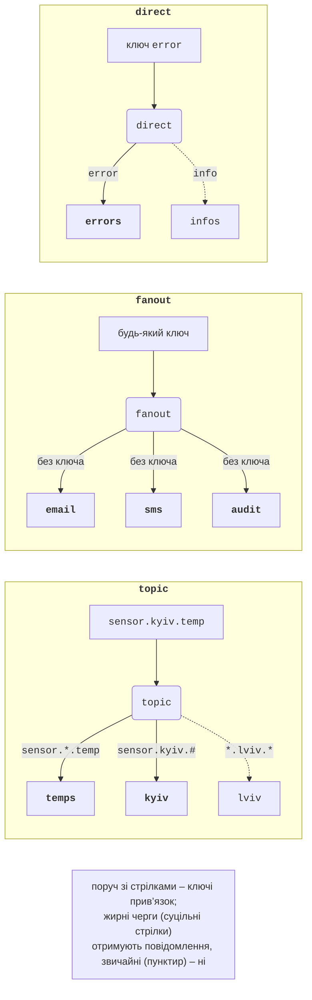
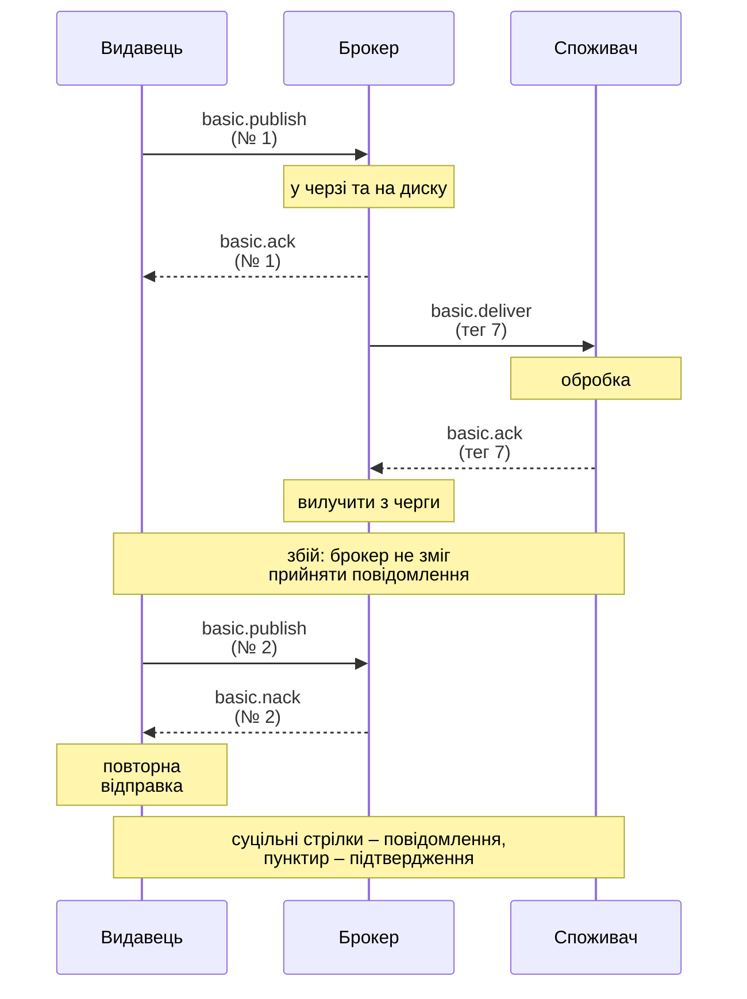

# Маршрутизація та гарантії доставки

## Обмінники та маршрутизація

Тип обмінника визначає, як ключ маршрутизації повідомлення порівнюється з ключами прив’язок (<https://www.rabbitmq.com/docs/exchanges>, рис. 15.6):

- **direct** – у черги, ключ прив’язки яких **точно збігається** з ключем повідомлення (маршрутизація за рівнем журналу: `error`, `warning`, `info`);
- **fanout** – у **всі** прив’язані черги, ключ ігнорується (розсилка подій кільком незалежним сервісам);
- **topic** – ключ складається зі слів через крапку (`sensor.kyiv.temp`), прив’язка – шаблон, де `*` замінює рівно одне слово, а `#` – нуль або більше слів (`sensor.*.temp`, `sensor.kyiv.#`);
- **headers** – маршрутизація за заголовками замість ключа: аргумент прив’язки `x-match` зі значенням `all` (збігаються всі вказані заголовки) або `any` (хоча б один);
- **типовий** обмінник `""` (різновид direct) – доставка в чергу з іменем, що дорівнює ключу.



Рис. 15.6. Типи обмінників {.caption}

Обмінник оголошують `ExchangeDeclareAsync`, прив’язку створюють `QueueBindAsync`:

```cs
await channel.ExchangeDeclareAsync("events", ExchangeType.Topic,
    durable: true);
QueueDeclareOk q = await channel.QueueDeclareAsync(queue: "",
    durable: false, exclusive: true, autoDelete: true);
await channel.QueueBindAsync(q.QueueName, "events", "orders.#");
```

Черга з порожнім ім’ям отримує від брокера унікальне ім’я на кшталт `amq.gen-4GM2fGEr7AevNGZYauPcAQ` (властивість `QueueName`). Така **ексклюзивна** черга – типовий спосіб підписатися на події на час роботи програми. Якщо ж підписник має отримувати події й тоді, коли вимкнений, йому потрібна іменована стійка черга (лабораторна робота 15, приклад 3).

Для headers-обмінника перевірено: прив’язка `x-match = all` з `class = 10-А` і `role = parent` отримала лише повідомлення `10-А/parent`, а `x-match = any` з `class = 10-А` і `role = teacher` – усі три: `10-А/parent`, `10-А/student`, `11-Б/teacher`.

Повідомлення, яке не збіглося з жодною прив’язкою, обмінник мовчки **відкидає**. Щоб дізнатися про це, видавець публікує з `mandatory: true`: брокер поверне повідомлення (розділ «Гарантії доставки»). Прив’язки обмінника видно у вебконсолі (рис. 15.7).

::: info Знімок екрана
Management UI → Exchanges → `events` (type topic) while the «Журнал подій» example waits for Enter: Bindings section with three amq.gen-… queues and routing keys `*.error`, `*.critical`, `orders.#`, `#`
:::

Рис. 15.7. Прив’язки обмінника `events` типу topic {.caption}

## Гарантії доставки

Повідомлення може загубитися на трьох ділянках: між видавцем і брокером (обрив з’єднання), у брокері (перезапуск, збій диска) і між брокером і споживачем (падіння під час обробки). Кожну ділянку захищає свій механізм (рис. 15.8, <https://www.rabbitmq.com/docs/reliability>).

### Стійкість

Щоб повідомлення пережило перезапуск брокера, потрібні обидві умови: **стійка черга** (`durable: true`) і **стійке повідомлення** (`Persistent = true`). Кворумні черги й потоки зберігають повідомлення на диску завжди. Стійкі обмінники й прив’язки також переживають перезапуск.

### Підтвердження видавця

**Підтвердження видавця** (*publisher confirms*) повідомляє, що брокер **прийняв відповідальність** за повідомлення: для стійкого повідомлення – після запису в усі черги й на диск, для кворумної черги – після підтвердження більшістю реплік. У клієнті 7 їх вмикають під час створення каналу:

```cs
CreateChannelOptions options = new(
    publisherConfirmationsEnabled: true,
    publisherConfirmationTrackingEnabled: true);
await using IChannel channel =
    await connection.CreateChannelAsync(options);
try
{
    await channel.BasicPublishAsync("", "payments", mandatory: true,
        basicProperties: props, body: body);  // чекає basic.ack
}
catch (PublishException ex)       // basic.nack або повернення
{
    Console.WriteLine($"не прийнято (повернення: {ex.IsReturn})");
}
```

З відстеженням (`publisherConfirmationTrackingEnabled`) `BasicPublishAsync` завершується лише після підтвердження брокера, а відмова (`basic.nack`) або повернення нерозподіленого повідомлення (`mandatory: true`) перетворюється на виняток `PublishException`. Властивість `IsReturn = true` означає, що повідомлення не потрапило в жодну чергу (перевірено публікацією в чергу з описаною назвою `paymnts`), `false` – що брокер відмовив (перевірено переповненням черги з `x-overflow = reject-publish`). Для відстеження клієнт додає до повідомлення заголовок `x-dotnet-pub-seq-no` з номером публікації.



Рис. 15.8. Підтвердження видавця та споживача {.caption}

Очікування підтвердження кожного повідомлення – це повний кругообіг і запис на диск. Швидше публікувати **пакетами**: запустити кілька публікацій і лише потім дочекатися всіх (`ValueTask` зберігають у списку, як у прикладі нижче). Вимірювання (20 000 повідомлень по 256 байтів, медіана 5 запусків) наведено в табл. 15.4.

```cs
List<ValueTask> batch = new(100);
for (int i = 0; i < count; i++)
{
    batch.Add(channel.BasicPublishAsync("", queue, false, props,
        body));
    if (batch.Count == 100)
    {
        foreach (ValueTask t in batch) await t;   // 100 підтверджень
        batch.Clear();
    }
}
foreach (ValueTask t in batch) await t;
```

Таблиця 15.4. Швидкість публікації (i9-11900KF, Docker Desktop, 10 000 повідомлень) {.caption}

| **Режим видавця** | **Класична черга, пов./с** | **Кворумна черга, пов./с** |
| --- | --- | --- |
| без підтверджень, нестійкі | 88 182 | 18 999 |
| без підтверджень, стійкі | 101 295 | 18 695 |
| підтвердження кожного | 1 478 | 189 |
| підтвердження пакетами по 100 | 36 883 | 5 067 |

Підтвердження по одному сповільнює публікацію в 70–100 разів; пакети повертають більшу частину швидкості. Кворумна черга повільніша за класичну, бо кожне повідомлення проходить журнал Raft з синхронізацією диска (у Docker Desktop диск віртуальної машини WSL 2 відносно повільний). Документацію підтверджень видавця: <https://www.rabbitmq.com/docs/publishers>.

### Семантика доставки та ідемпотентність

Як і для RPC (тема 14), розрізняють **семантику доставки**:

- **at-most-once** (не більше одного разу): `autoAck: true`, без підтверджень видавця – швидко, але повідомлення можуть губитися;
- **at-least-once** (щонайменше один раз): підтвердження видавця + повторна публікація після помилки, ручні ack після обробки – повідомлення не губляться, але можуть прийти **двічі**: видавець повторив публікацію, бо підтвердження загубилося, або споживач упав після обробки, але до `BasicAck`;
- **exactly-once** (рівно один раз) брокер гарантувати не може; ефект «рівно один раз» досягають на рівні застосунку – **ідемпотентним споживачем** (*idempotent consumer*), який пам’ятає ідентифікатори оброблених повідомлень і пропускає дублікати.

Приклад ідемпотентного споживача зарахування платежів: видавець задає `MessageId`, а споживач перевіряє його у «таблиці» оброблених ідентифікаторів (у програмі – `ConcurrentDictionary`, у реальній системі – таблиця бази даних з унікальним ключем, оновлювана в тій самій транзакції, що й дані):

```cs
consumer.ReceivedAsync += async (_, ea) =>
{
    string id = ea.BasicProperties.MessageId!;
    string mark = ea.Redelivered ? ", повторна доставка" : "";
    // TryAdd атомарно: лише перша доставка «виграє».
    if (processed.TryAdd(id, true))
    {
        balance += decimal.Parse(Encoding.UTF8.GetString(
            ea.Body.Span));
        Console.WriteLine($"{name}: {id} зараховано{mark}");
    }
    else
    {
        Console.WriteLine($"{name}: {id} – дублікат{mark}");
    }
    await ch.BasicAckAsync(ea.DeliveryTag, false);
};
```

У перевірці видавець надіслав `dep-1`, `dep-2`, ще раз `dep-1` (імітація повтору) і `dep-3`, кожен на 100 грн; споживач A обробив `dep-3`, але «упав» до `BasicAck` (канал закрито), і брокер повторно доставив `dep-3` споживачу B:

```
A: dep-1 зараховано
A: dep-2 зараховано
A: dep-1 – дублікат
A: dep-3 зараховано
A: збій до BasicAck
B: dep-3 – дублікат, повторна доставка
баланс: 300 грн
```
