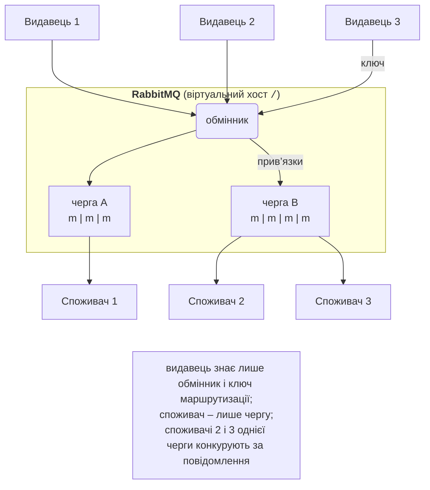

# Обмін повідомленнями та RabbitMQ

## Асинхронний обмін повідомленнями

У темі 14 клієнт і сервер спілкувалися **безпосередньо**: через сокет або виклик gRPC. Такий зв’язок **тісний**: клієнт має знати адресу сервера, сервер має працювати саме в момент виклику, а якщо він повільний чи перевантажений, клієнт чекає. **Обмін повідомленнями** (*messaging*) додає між ними посередника – **брокер повідомлень** (*message broker*). Відправник кладе повідомлення в брокер і продовжує роботу, а отримувач забирає його, коли готовий.

Переваги такої **слабкої зв’язаності** (*loose coupling*):

- **у просторі**: відправник не знає, хто і скільки отримувачів обробить повідомлення; нові сервіси підключаються без зміни відправника;
- **у часі**: отримувач може бути тимчасово вимкнений – повідомлення чекають у черзі;
- **за швидкістю**: черга **буферизує** піки навантаження (*load levelling*). Сайт за хвилину розпродажу приймає 10 000 замовлень, а склад обробляє 50 за секунду – замовлення просто довше лежать у черзі;
- **масштабування**: щоб обробляти швидше, досить запустити ще кілька отримувачів тієї самої черги.

Ціна – додатковий компонент інфраструктури, затримка доставки й **асинхронність**: відправник не отримує відповіді одразу, а повідомлення може бути доставлено повторно. Порівняння з прямими викликами наведено в табл. 15.1.

Таблиця 15.1. Прямий виклик і обмін повідомленнями через брокер {.caption}

| **Властивість** | **Прямий виклик (RPC, gRPC, REST)** | **Брокер повідомлень** |
| --- | --- | --- |
| взаємодія | синхронна: запит і відповідь | асинхронна: «надіслав і забув» або відповідь окремим повідомленням |
| доступність отримувача | має працювати в момент виклику | може бути вимкненим, повідомлення чекають |
| кількість отримувачів | один | один (черга завдань) або багато (публікація–підписка) |
| пікове навантаження | відмови або таймаути | згладжується чергою |
| типове застосування | запит даних, коротка операція | фонові завдання, події, інтеграція сервісів |

Поширені брокери та платформи: **RabbitMQ**, Apache ActiveMQ, Apache Kafka (розподілений журнал подій), NATS, хмарні Azure Service Bus і Amazon SQS. У цій темі використано RabbitMQ – один із найпоширеніших брокерів з відкритим кодом.

## Архітектура RabbitMQ і модель AMQP 0-9-1

**RabbitMQ** (<https://www.rabbitmq.com/>) – брокер повідомлень з відкритим кодом (ліцензія MPL 2.0), написаний мовою Erlang, яку створено для надійних розподілених систем. У вересні 2026 року актуальна серія – 4.3 (випуск 4.3.0 від 23 квітня 2026, виправлення 4.3.6 від 16 вересня 2026; <https://www.rabbitmq.com/release-information>). Основний протокол RabbitMQ – **AMQP 0-9-1** (*Advanced Message Queuing Protocol*); з версії 4.0 брокер також «рідно» підтримує AMQP 1.0, а плагінами – MQTT, STOMP і власний протокол потоків (streams).

Модель AMQP 0-9-1 (<https://www.rabbitmq.com/tutorials/amqp-concepts>) складається з таких сутностей (рис. 15.1):

- **видавець** (*publisher*, *producer*) – програма, що надсилає повідомлення;
- **повідомлення** (*message*) – **тіло** (масив байтів: текст, JSON, protobuf) і **властивості** (*properties*): тип вмісту, ідентифікатор, пріоритет, заголовки (*headers*) тощо;
- **обмінник** (*exchange*) – «поштове відділення» брокера: видавець надсилає повідомлення не в чергу, а в обмінник разом із **ключем маршрутизації** (*routing key*);
- **прив’язка** (*binding*) – правило «обмінник → черга» з ключем або шаблоном; за прив’язками обмінник вирішує, у які черги покласти копії повідомлення;
- **черга** (*queue*) – упорядкований буфер повідомлень (FIFO), що зберігає їх до обробки;
- **споживач** (*consumer*) – програма, яка підписалася на чергу; брокер сам **доставляє** (*push*) їй повідомлення.



Рис. 15.1. Взаємодія через брокер повідомлень {.caption}

Видавець не знає про черги й споживачів, а споживач – про видавців: їх з’єднують лише обмінники й прив’язки, які можна змінювати без зміни коду.

### З’єднання та канали

Клієнт відкриває одне тривале TCP-**з’єднання** (*connection*) з брокером (порт 5672, з TLS – 5671). Встановлення з’єднання дороге (рукостискання TCP, автентифікація), тому всередині нього створюють легкі **канали** (*channels*) – логічні з’єднання, мультиплексовані в одному TCP-потоці (<https://www.rabbitmq.com/docs/channels>). Кожна операція протоколу (оголосити чергу, опублікувати, підтвердити) виконується в каналі. Типово дозволено до 2047 каналів на з’єднання. Правило: одне з’єднання на процес, окремий канал для кожного незалежного видавця чи споживача. Помилка протоколу (наприклад, звернення до неіснуючої черги) **закриває канал**, а не з’єднання.

### Віртуальні хости, користувачі й права

**Віртуальний хост** (*virtual host*, vhost) – ізольований простір імен усередині брокера: власні обмінники, черги, права (<https://www.rabbitmq.com/docs/vhosts>). Типовий vhost – `/`. Так один брокер обслуговує кілька застосунків або навчальних груп. **Користувач** має пароль і права в кожному vhost (<https://www.rabbitmq.com/docs/access-control>): три регулярні вирази для дій **configure** (створювати й вилучати сутності), **write** (публікувати) і **read** (споживати). Вбудований користувач `guest` (пароль `guest`) типово може підключатися лише з `localhost`; у контейнері Docker (наступний розділ) з’єднання з Windows через проброшений порт також приймаються.

Метадані брокера (vhost, користувачі, черги, прив’язки) зберігає сховище **Khepri** на основі алгоритму консенсусу Raft; з версії 4.3 це єдине сховище метаданих (<https://www.rabbitmq.com/docs/metadata-store>).

## Розгортання RabbitMQ і засоби керування

На лабораторних ПК RabbitMQ запускають у **Docker Desktop** з офіційного образу (<https://hub.docker.com/_/rabbitmq>); докладно контейнери розглянуто в темі 17. Образ з тегом `4-management` містить останню версію серії 4 (у вересні 2026 – 4.3.6) з увімкненим плагіном вебконсолі:

```powershell
docker run -d --name rabbit --hostname rabbit `
    -p 5672:5672 -p 15672:15672 `
    -v rabbit-data:/var/lib/rabbitmq rabbitmq:4-management
docker ps          # STATUS: Up …, PORTS: 0.0.0.0:5672->5672/tcp …
docker logs rabbit # … Server startup complete
```

Параметр `-p 5672:5672` відкриває порт AMQP, `-p 15672:15672` – порт вебконсолі. Том `rabbit-data` зберігає дані брокера (стійкі черги, повідомлення, користувачів) між перестворенням контейнера, а фіксоване ім’я вузла `--hostname rabbit` потрібне, бо RabbitMQ зберігає дані в теці з іменем вузла. Перевірено: vhost, створений у першому контейнері, залишився в новому контейнері з тим самим томом. Запуск триває кілька секунд (рис. 15.2). Зупинка й повторний запуск – `docker stop rabbit`, `docker start rabbit`. На сервері Ubuntu брокер встановлюють з apt-репозиторіїв команди RabbitMQ (<https://www.rabbitmq.com/docs/install-debian>).

::: info Знімок екрана
Windows Terminal: the `docker run … rabbitmq:4-management` command above, then `docker ps` showing container `rabbit`, image `rabbitmq:4-management`, status Up, ports 5672 and 15672
:::

Рис. 15.2. Запуск RabbitMQ у контейнері Docker {.caption}

### Вебконсоль керування

Вебконсоль (<https://www.rabbitmq.com/docs/management>) відкривають у браузері за адресою `http://localhost:15672` (користувач `guest`, пароль `guest`). Вкладки: *Overview* (версія, графіки швидкості повідомлень, кількість з’єднань і черг), *Connections*, *Channels*, *Exchanges*, *Queues and Streams* (вміст і споживачі кожної черги, кнопки *Publish message*, *Get messages*, *Purge*), *Admin* (користувачі, vhost, політики) (рис. 15.3).

::: info Знімок екрана
Browser `http://localhost:15672` after login guest/guest → Overview while the Orders example runs: RabbitMQ 4.3.6, Erlang 27, Queued messages and Message rates charts, Global counts, node `rabbit@rabbit`
:::

Рис. 15.3. Вебконсоль керування RabbitMQ {.caption}

### Утиліти командного рядка

Утиліти брокера запускають усередині контейнера командою `docker exec` (<https://www.rabbitmq.com/docs/cli>): `rabbitmqctl` керує сутностями, `rabbitmq-diagnostics` перевіряє стан вузла, `rabbitmq-plugins` вмикає плагіни. Приклад: окремий vhost і користувач для навчальної групи.

```powershell
docker exec rabbit rabbitmq-diagnostics ping    # Ping succeeded
docker exec rabbit rabbitmqctl add_vhost pi-41
docker exec rabbit rabbitmqctl add_user student 'S3cret!'
docker exec rabbit rabbitmqctl set_permissions -p pi-41 `
    student '.*' '.*' '.*'
docker exec rabbit rabbitmqctl list_queues name type messages
docker exec rabbit rabbitmq-plugins list -e      # увімкнені плагіни
```

Три вирази `'.*'` дають користувачу всі права configure, write, read у vhost `pi-41`. Команда `list_queues` виводить таблицю черг з типом і кількістю повідомлень (стовпці можна додавати: `consumers`, `messages_unacknowledged`).
