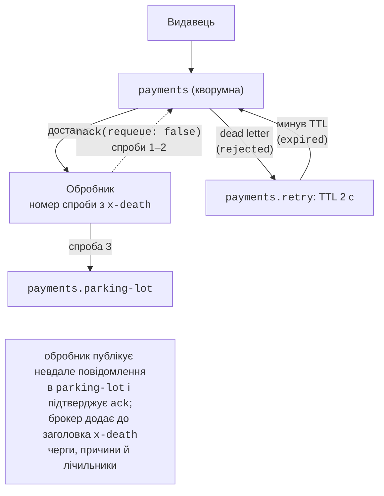

# Типи черг, RPC та експлуатація

## Типи черг, dead letter exchange і TTL

Тип черги задає аргумент `x-queue-type` під час оголошення (<https://www.rabbitmq.com/docs/queues>); порівняння – у табл. 15.5.

Таблиця 15.5. Типи черг RabbitMQ {.caption}

| **Властивість** | **Класична** (`classic`) | **Кворумна** (`quorum`) | **Потік** (`stream`) |
| --- | --- | --- | --- |
| зберігання | на одному вузлі | реплікується алгоритмом Raft (типово 3 репліки) | реплікований журнал, лише дописування |
| читання | повідомлення вилучається після ack | вилучається після ack | не вилучається; читають з будь-якої позиції (*offset*) |
| стійкість | за вибором | завжди | завжди |
| особливості | ексклюзивні й тимчасові черги, пріоритети `x-max-priority` | ліміт доставок (типово 20), dead lettering at-least-once | повторне читання історії, мільйони повідомлень, багато читачів |
| застосування | тимчасові черги, відповіді RPC | важливі черги завдань і подій | журнали подій, телеметрія, аудит |

**Кворумна черга** (<https://www.rabbitmq.com/docs/quorum-queues>) – рекомендований тип для даних, які не можна втратити: у кластері вона працює, доки доступна більшість реплік. Кворумна черга рахує **невдалі доставки** в заголовку `x-delivery-count` і після **ліміту доставок** (`x-delivery-limit`, з версії 4.0 типово 20) відкидає «отруйне» повідомлення (*poison message*) або передає в dead letter exchange. Перевірено з лімітом 3: `BasicRejectAsync(requeue: true)` і падіння споживача збільшують лічильник, і четверта доставка стає останньою. А `BasicNackAsync(requeue: true)` у RabbitMQ 4.3 вважається **явним поверненням** і не рахується: за 1,5 с одне повідомлення доставлено 254 рази без перенесення в DLX. Такий «гарячий цикл» марно навантажує брокер і споживача.

**Потік** (<https://www.rabbitmq.com/docs/streams>) читають з позиції, заданої аргументом споживача `x-stream-offset` (`"first"`, `"last"`, номер, час); для потоку обов’язкові prefetch і ручні підтвердження: без prefetch брокер закриває канал з помилкою `PRECONDITION_FAILED` («consumer prefetch count is not set»). Перевірено: після публікації п’яти повідомлень читач з `"first"` отримав усі п’ять (позиції 0–4), а читач з позиції 3 – лише два останні; повідомлення лишаються в потоці для наступних читачів.

::: tip Пастка
Параметри вже наявної черги змінити повторним оголошенням не можна: `QueueDeclareAsync` з іншими аргументами закриває канал з помилкою `406 PRECONDITION_FAILED` («inequivalent arg 'x-max-length'», перевірено). Чергу вилучають (`QueueDeleteAsync`, вебконсоль) і створюють заново або змінюють параметри **політиками** (`rabbitmqctl set_policy`).
:::

### Час життя та обмеження довжини

- **TTL повідомлень** (<https://www.rabbitmq.com/docs/ttl>): аргумент черги `x-message-ttl` (мс) або властивість повідомлення `Expiration`. Перевірено: з двох повідомлень з `Expiration` 500 і 60 000 мс через 1 с у черзі лишилося одне.
- **TTL черги** `x-expires`: невикористовувана черга вилучається.
- **Обмеження довжини** (<https://www.rabbitmq.com/docs/maxlength>): `x-max-length` (повідомлень) або `x-max-length-bytes`. Типова стратегія переповнення `drop-head` відкидає найстаріші (перевірено: з п’яти повідомлень у черзі з лімітом 3 лишилися `m3`, `m4`, `m5`), а `x-overflow = reject-publish` відхиляє нові (видавець з підтвердженнями отримує `PublishException`).
- **Пріоритети** (<https://www.rabbitmq.com/docs/priority>): класична черга з `x-max-priority`, властивість `Priority`. Перевірено: повідомлення з пріоритетами 1, 5, 0, 3, 5 видано в порядку 5, 5, 3, 1, 0.

### Dead letter exchange і повторні спроби

**Dead letter exchange** (DLX, <https://www.rabbitmq.com/docs/dlx>) – обмінник, у який брокер перенаправляє «мертві» повідомлення черги з аргументом `x-dead-letter-exchange` (і, можливо, `x-dead-letter-routing-key`). Повідомлення «вмирає», якщо його відхилено з `requeue: false` (причина `rejected`), минув TTL (`expired`), черга переповнена (`maxlen`) або вичерпано ліміт доставок (`delivery_limit`). Брокер додає заголовок `x-death`: масив записів з чергою, причиною, лічильником `count` і часом.

На цьому будують **повторні спроби із затримкою** (рис. 15.9). Невдале повідомлення з черги `payments` відхиляється і через DLX потрапляє в чергу `payments.retry` без споживачів з TTL 2 с; коли TTL минає, повідомлення знову через DLX повертається в `payments`. Номер спроби обробник обчислює за `x-death`, а після трьох невдач публікує повідомлення в чергу **parking-lot** для ручного розбору (рис. 15.10). Такий підхід відрізняє **тимчасові** збої (таймаут зовнішнього сервісу – повтор допоможе) від **постійних** (картку відхилено – повтор не допоможе). Повний код – приклад «Надійна публікація» в кінці лекції. У RabbitMQ 4.3 кворумні черги також отримали вбудовані **затримані повтори** (аргументи `x-delayed-retry-type`, `x-delayed-retry-min`, `x-delayed-retry-max`); у перевірці з мінімальною затримкою 500 мс повернуті `BasicNackAsync` повідомлення надходили знову через  0,5 с.

Рис. 15.9. Повторні спроби через dead letter exchange {.caption}

::: info Знімок екрана
Management UI → Queues and Streams → `payments.parking-lot` → Get messages (Ack mode: Nack message requeue true) → Get Message(s): headers x-death with two entries (payments / rejected / count 2 and payments.retry / expired / count 2), x-first-death-reason rejected, payload `{"Id":"P-3",…}`
:::

Рис. 15.10. Повідомлення в черзі `payments.parking-lot` {.caption}

## Шаблон RPC поверх черг

Іноді через брокер потрібен запит із відповіддю: брокер згладжує навантаження й розподіляє запити між кількома серверами. Шаблон **RPC через черги**:

1. клієнт створює власну ексклюзивну **чергу відповідей** (одну на весь клієнт);
2. публікує запит у чергу сервісу з властивостями `ReplyTo` (ім’я черги відповідей) і `CorrelationId` (унікальний ідентифікатор запиту, наприклад `Guid`);
3. сервер обробляє запит і публікує відповідь через типовий обмінник у чергу `ReplyTo`, копіюючи `CorrelationId`;
4. клієнт за `CorrelationId` знаходить очікувальника (`TaskCompletionSource`) і завершує його; відповідь з невідомим ідентифікатором (запізнілу) ігнорує;
5. очікування обмежують **таймаутом**, а запиту задають `Expiration`, щоб брокер вилучив його, якщо жоден сервер не взяв запит вчасно.

Кілька запитів можуть очікувати одночасно: відповіді розрізняє `CorrelationId`. Замість власної черги відповідей можна використати **direct reply-to** – псевдочергу `amq.rabbitmq.reply-to`, яка не створює черги в брокері (<https://www.rabbitmq.com/docs/direct-reply-to>). Повна програма (обчислення чисел Фібоначчі) наведена в лабораторній роботі 15, приклад 1. Якщо брокер не потрібен, для RPC краще підходить gRPC (тема 14): менша затримка і строгий контракт.

## Розподілені обчислення через брокер

Черга завдань природно реалізує **паралелізм задач** між процесами й комп’ютерами (порівняйте з пулом потоків у темі 5):

- **координатор** розбиває задачу на частини й публікує їх у стійку чергу `tasks` з `ReplyTo` власної черги результатів і спільним `CorrelationId` задачі;
- **робітники** (будь-яка кількість процесів на будь-яких комп’ютерах) з однаковим prefetch обчислюють частини, публікують результати й підтверджують завдання;
- координатор збирає результати й об’єднує їх (редукція, тема 6).

Балансування навантаження забезпечує prefetch: швидший робітник просто бере більше частин. Відмовостійкість – ручні підтвердження: частина, яку обробляв робітник, що впав, повертається в чергу й дістається іншому. Масштабують запуском додаткових робітників без зміни координатора. Частин має бути в кілька разів більше, ніж робітників, а кожна – тривати значно довше за пересилання повідомлення.

Автор виміряв обчислення $\int_{0}^{1} 4 / (1 + x^{2}) \mathrm{d} x = \pi$ методом середніх прямокутників (2,56 · 109 кроків, 64 частини) програмою з лабораторної роботи 15 (приклад 2): робітники – окремі процеси на тому самому ПК, медіана 5 запусків (табл. 15.6).

Таблиця 15.6. Обчислення інтеграла робітниками через RabbitMQ (i9-11900KF) {.caption}

| **Варіант** | **Час, с** | **Прискорення** |
| --- | --- | --- |
| послідовно в одному процесі | 2,28 | 1,00 |
| 1 робітник | 2,60 | 0,88 |
| 2 робітники | 2,32 | 0,98 |
| 4 робітники | 1,10 | 2,1 |
| 8 робітників | 0,58 | 3,9 |
| 16 робітників | 0,44 | 5,2 |

Прискорення значно нижче за кількість робітників. Вісім фізичних ядер ділять робітники, брокер у Docker і координатор, а кожна частина додає пересилання двох повідомлень. Під час вимірювань з’ясувалося й головне джерело втрат: з prefetch 1 робітник після кожної частини (36 мс обчислень) чекав наступну ще приблизно 40 мс, і обчислення одним робітником тривало 5,1 с замість 2,3 с. Робітник надсилає два малі кадри поспіль (результат і `BasicAck`), і шлях через проброшений порт Docker Desktop затримує другий із них, а брокер видає наступну частину лише після підтвердження. RPC-сервер з лабораторної роботи 15 (приклад 1), запущений у контейнері поруч із брокером, такої затримки не мав. Prefetch 2 здебільшого приховує затримку (наступна частина вже чекає в робітника), але не повністю: з двома робітниками прискорення в різних серіях вимірювань коливалося від 1,5 до майже 1 (у таблиці – серія, виміряна за найменшого фонового навантаження). Висновки: частини мають бути значно довшими за час пересилання, а «затримка нульова» – хибне припущення (тема 14); вимірюйте на реальній інфраструктурі й повторюйте вимірювання.

## Моніторинг і експлуатація

**Метрики.** Вебконсоль показує для кожної черги кількість повідомлень *Ready* і *Unacked*, швидкості публікації, доставки й підтвердження, кількість споживачів і їхнє завантаження (*consumer utilisation*). Черга, що безупинно росте, – сигнал додати споживачів або шукати помилку. Для систем моніторингу образ містить плагін `rabbitmq_prometheus` (метрики на порту 15692, <https://www.rabbitmq.com/docs/prometheus>).

**Діагностика** (<https://www.rabbitmq.com/docs/monitoring>): утиліта `rabbitmq-diagnostics` має команди `ping`, `check_running`, `status` (версії, пам’ять, диск, плагіни) і `list_deprecated_features`, а `rabbitmqctl` – `list_connections`, `list_consumers` і `list_queues`. Коли пам’ять брокера чи вільне місце на диску перетинають пороги, спрацьовує **тривога** (*alarm*), і брокер блокує всіх видавців, доки ситуація не виправиться; тому черги не повинні необмежено рости.

**Відновлення з’єднань.** Клієнт .NET з `AutomaticRecoveryEnabled` відновлює з’єднання, канали, оголошені черги, прив’язки й споживачів. Перевірено перезапуском контейнера (`docker restart`) під час роботи споживача «Привіт, RabbitMQ»: після перезапуску він без втручання отримав повідомлення, надіслане в стійку чергу. Повідомлення, які публікувалися в момент розриву, клієнт не повторює: це робить застосунок (підтвердження видавця + повтор).

**Кластер.** Для відмовостійкості RabbitMQ розгортають кластером з непарної кількості вузлів (зазвичай 3): метадані Khepri й кворумні черги реплікуються і працюють, поки доступна більшість вузлів (<https://www.rabbitmq.com/docs/clustering>). Колишні «дзеркальні» класичні черги вилучено у версії 4.0 – їх замінили кворумні черги. Контрольний список для робочого середовища: <https://www.rabbitmq.com/docs/production-checklist>.

**Бібліотеки вищого рівня.** **MassTransit** (<https://masstransit.massient.com/>) приховує топологію брокера: повідомлення – класи C#, споживачі – класи `IConsumer<T>`, повтори, dead letter, саги й «outbox» налаштовуються декларативно; підтримує RabbitMQ, Azure Service Bus, Amazon SQS. Версія 9 (з січня 2026 року, у вересні – 9.2.2) поширюється за комерційною ліцензією компанії Massient, версія 8 залишається відкритою (Apache 2.0). У курсі використовується «чистий» `RabbitMQ.Client`, щоб бачити, що відбувається на рівні протоколу.
