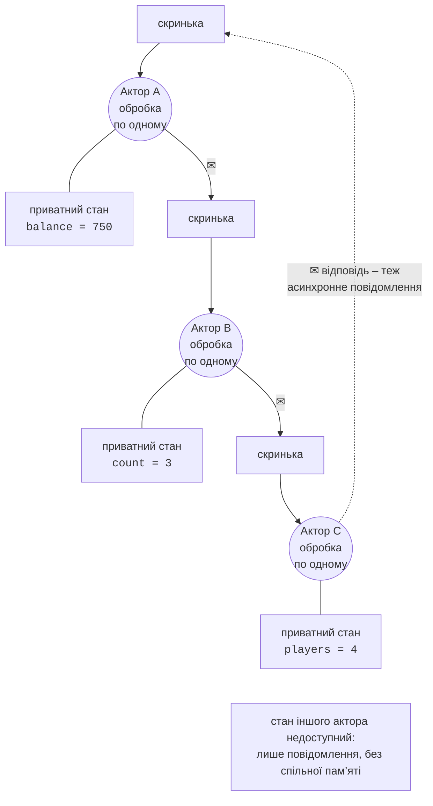
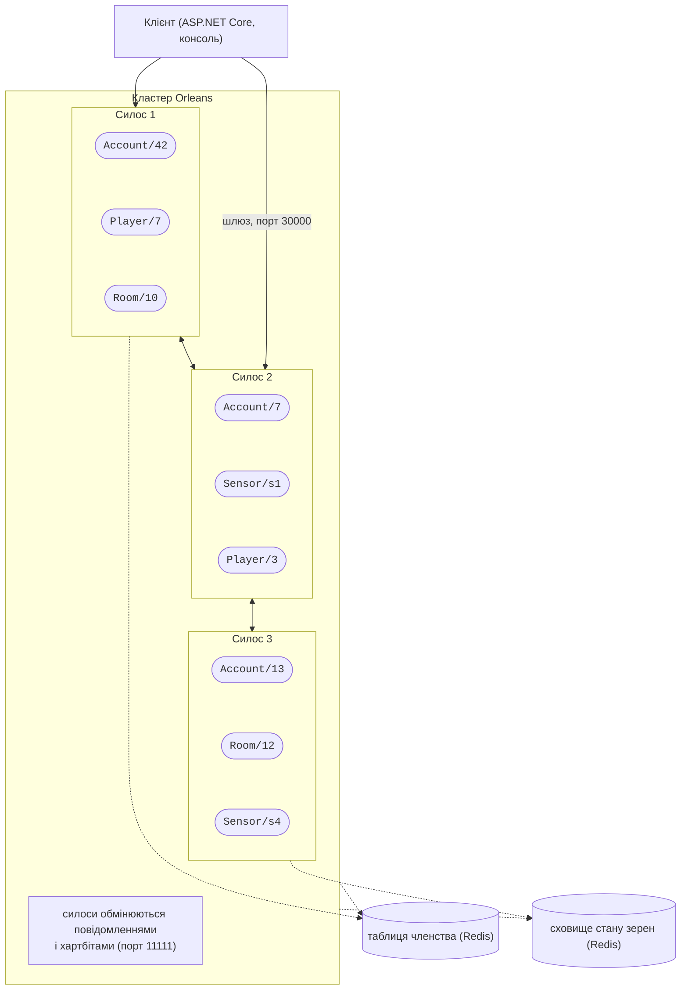
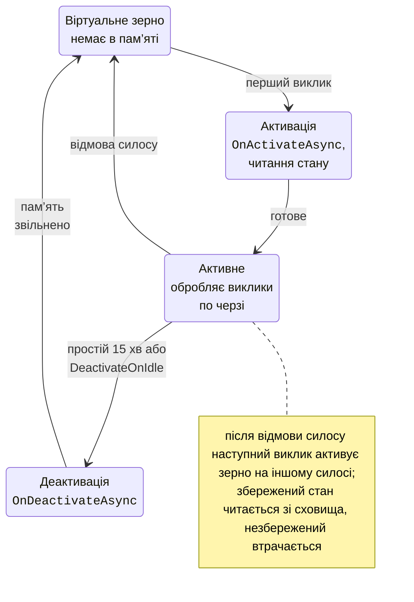

# Модель акторів і проєкт Orleans

## Модель акторів

У темах 3–4 кілька потоків змінювали спільні дані, а від гонитви захищали блокування. У розподіленій системі спільної пам’яті немає зовсім (тема 14), тому потрібна інша модель. **Модель акторів** (*actor model*) запропонував Карл Г’юїтт у 1973 році. Її поняття:

- **актор** – незалежна сутність із **приватним станом**, до якого ніхто інший не має доступу;
- актори взаємодіють лише **асинхронними повідомленнями**: відправник кладе повідомлення в **поштову скриньку** (*mailbox*) отримувача й не чекає (рис. 16.1);
- актор обробляє повідомлення **по одному**: прочитав, змінив свій стан, надіслав повідомлення іншим акторам, створив нових акторів;
- місце виконання актора прозоре: адреса однакова для актора в тому самому процесі й на іншому комп’ютері.



Рис. 16.1. Модель акторів {.caption}

Оскільки стан змінює лише сам актор і лише в одному потоці обробки, **блокування не потрібні**, а гонитви за даними не виникає. Паралелізм виникає з кількості акторів: тисячі акторів обробляють свої скриньки одночасно на всіх ядрах. Помилка в одному акторі не псує стан інших.

Модель реалізують мова **Erlang** (Ericsson, 1986; телефонні комутатори, WhatsApp; <https://www.erlang.org/>) з принципом «нехай падає» (*let it crash*) і деревами **наглядачів** (*supervisors*), які перезапускають актори; **Akka** для JVM і **Akka.NET** (<https://getakka.net/>), де актори створюються й адресуються явно; **Microsoft Orleans**, який розглянуто далі.

Найпростіший актор у .NET – клас із приватним полем, каналом `Channel<T>` (тема 4) як поштовою скринькою й однією задачею, що читає канал (повний код – приклад «Лічильник-актор без Orleans»). Відправник викликає `SendAsync` (*tell*, «надіслати й забути») або `AskAsync` (*ask*, «запит – відповідь» через `TaskCompletionSource<int>`). Шістнадцять задач по 100 000 повідомлень `Increment` дали точно 1 600 000, тоді як звичайний `counter++` з `Parallel.For` без синхронізації дав лише 322 214–537 622 у трьох запусках.

::: tip Порівняння з блокуваннями
Блокування захищає **дані**, і кожен, хто їх змінює, має пам’ятати про `lock`. Актор захищає дані **архітектурно**: іншого шляху до стану, крім повідомлення, немає. Ціна – черга повідомлень і асинхронність: навіть читання стану стає повідомленням з відповіддю, а «гаряча» скринька одного актора обмежує пропускну здатність.
:::

## Віртуальні актори Orleans

**Orleans** – фреймворк Microsoft для розподілених застосунків .NET, створений у Microsoft Research (<https://learn.microsoft.com/dotnet/orleans/overview>). Його використовують сервіси Azure, Xbox, Skype, PlayFab, ігри Halo і Gears of War. Orleans запровадив **віртуальних акторів** (*virtual actors*): актор існує **завжди** логічно, його не створюють і не знищують явно, а фізичний екземпляр у пам’яті з’являється під час першого виклику.

- **Зерно** (*grain*) – віртуальний актор: **ідентичність** (тип і ключ, наприклад `account/UA-001`), **поведінка** (методи інтерфейсу) і **стан**.
- **Активація** (*activation*) – екземпляр класу зерна в пам’яті одного сервера. Середовище Orleans створює її автоматично й вилучає після простою (типово 15 хв, `GrainCollectionOptions.CollectionAge`).
- **Силос** (*silo*) – процес-хост, у якому живуть активації зерен (рис. 16.2).
- **Кластер** (*cluster*) – група силосів з однаковим `ClusterId`; силоси знаходять одне одного через **таблицю членства** і розподіляють зерна між собою.
- **Клієнт** (*client*) – застосунок, що викликає зерна через **шлюз** (*gateway*) силосу; клієнт може працювати в окремому процесі або в тому самому процесі, що й силос (*co-hosting*).



Рис. 16.2. Кластер Orleans {.caption}

**Розміщення** (*placement*) вирішує, на якому силосі активувати зерно (з Orleans 9.2 типова стратегія `ResourceOptimizedPlacement` враховує завантаження процесора й пам’яті; є також `[RandomPlacement]`, `[PreferLocalPlacement]` тощо). Розподілений **каталог зерен** (*grain directory*) пам’ятає, де живе кожна активація, і гарантує, що в кластері одночасно є не більше однієї активації зерна (з версії 9.0 каталог строго узгоджений). Викликальник нічого з цього не бачить: він має лише посилання на зерно й викликає метод, а Orleans знаходить або створює активацію. Життєвий цикл зерна показано на рис. 16.3.



Рис. 16.3. Життєвий цикл зерна {.caption}

## Проєкт Orleans на .NET 10

Поточна стабільна версія – **Orleans 10.3.1** (28 серпня 2026 року), вона підтримує .NET 8, 9 і 10 (<https://www.nuget.org/packages/Microsoft.Orleans.Server>). Основні пакети:

- `Microsoft.Orleans.Sdk` – атрибути, базові інтерфейси й генератор коду серіалізації (у всіх проєктах з інтерфейсами й класами зерен);
- `Microsoft.Orleans.Server` – силос (містить `Microsoft.Orleans.Runtime`, де оголошено `IPersistentState<T>`);
- `Microsoft.Orleans.Client` – зовнішній клієнт;
- провайдери: `Microsoft.Orleans.Persistence.Redis`, `Microsoft.Orleans.Clustering.Redis`, `Microsoft.Orleans.Reminders.Redis`, `Microsoft.Orleans.Streaming`, `Microsoft.Orleans.Reminders`.

Типове рішення складається з чотирьох проєктів (рис. 16.4): бібліотеки інтерфейсів `Bank.Abstractions` (`Sdk`), бібліотеки реалізацій `Bank.Grains` (`Sdk`, `Runtime`), консольного силосу `Bank.Silo` (`Server`, `Persistence.Redis`) і консольного клієнта `Bank.Client` (`Client`). Клієнт посилається лише на інтерфейси.

::: info Знімок екрана
Rider: solution Bank (Bank.slnx) with Bank.Abstractions, Bank.Grains, Bank.Silo, Bank.Client in Solution Explorer; `IAccountGrain.cs` open; NuGet references of Bank.Silo expanded
:::

Рис. 16.4. Рішення Orleans у Rider {.caption}

### Інтерфейс зерна

Інтерфейс успадковує маркер типу ключа: `IGrainWithStringKey`, `IGrainWithGuidKey`, `IGrainWithIntegerKey` або складені `IGrainWithGuidCompoundKey`, `IGrainWithIntegerCompoundKey`. Методи повертають `Task`, `Task<T>`, `ValueTask` або `ValueTask<T>`: кожен виклик – повідомлення, а відповідь надходить асинхронно. Типи, що передаються між процесами, позначають `[GenerateSerializer]`, а їхні поля – `[Id(n)]` (номери, як у protobuf, не змінюють після публікації); `[Immutable]` дозволяє не копіювати об’єкт у межах одного силосу.

```cs
namespace Bank;

// Контракт зерна: ключ – номер рахунку (рядок).
public interface IAccountGrain : IGrainWithStringKey
{
    Task<decimal> GetBalance();
    Task Deposit(decimal amount);
    Task Withdraw(decimal amount);
    Task Transfer(string toAccount, decimal amount);
    Task<AccountInfo> GetInfo();
}

// Дані, що передаються між клієнтом і силосом.
[GenerateSerializer, Immutable]
public sealed record AccountInfo(
    [property: Id(0)] string Number,
    [property: Id(1)] decimal Balance,
    [property: Id(2)] int Operations,
    [property: Id(3)] string Silo);
```

### Клас зерна

Клас успадковує `Grain` і реалізує інтерфейс. Стан рахунку впроваджується в конструктор як `IPersistentState<AccountState>` (розділ «Стан зерен і його збереження»). Властивості базового класу: `GrainFactory` (посилання на інші зерна), `RuntimeIdentity` (адреса силосу), метод розширення `this.GetPrimaryKeyString()` повертає ключ.

```cs
using Orleans.Runtime;

namespace Bank;

// Стан, який зберігає провайдер «bank» (пам’ять або Redis).
[GenerateSerializer]
public sealed class AccountState
{
    [Id(0)] public decimal Balance { get; set; }
    [Id(1)] public int Operations { get; set; }
}

public sealed class AccountGrain(
    [PersistentState("account", "bank")]
    IPersistentState<AccountState> account) : Grain, IAccountGrain
{
    string Number => this.GetPrimaryKeyString();

    public override Task OnActivateAsync(CancellationToken token)
    {
        Console.WriteLine($"  [силос] активація {Number}, " +
            $"баланс {account.State.Balance}");
        return Task.CompletedTask;
    }

    public Task<decimal> GetBalance() =>
        Task.FromResult(account.State.Balance);

    public async Task Deposit(decimal amount)
    {
        if (amount <= 0)
            throw new ArgumentOutOfRangeException(nameof(amount));
        account.State.Balance += amount;
        account.State.Operations++;
        await account.WriteStateAsync();
    }

    public async Task Withdraw(decimal amount)
    {
        if (amount > account.State.Balance)
            throw new InvalidOperationException(
                $"{Number}: недостатньо коштів " +
                $"({account.State.Balance} < {amount})");
        account.State.Balance -= amount;
        account.State.Operations++;
        await account.WriteStateAsync();
    }

    public async Task Transfer(string toAccount, decimal amount)
    {
        await Withdraw(amount);
        IAccountGrain target =
            GrainFactory.GetGrain<IAccountGrain>(toAccount);
        await target.Deposit(amount);   // виклик іншого зерна
    }

    public Task<AccountInfo> GetInfo() => Task.FromResult(
        new AccountInfo(Number, account.State.Balance,
            account.State.Operations, RuntimeIdentity));
}
```

Виняток зерна серіалізується і повторно кидається в коді викликальника, тому клієнт перехоплює `InvalidOperationException` так само, як локальний. Метод `Transfer` не атомарний: якщо `Deposit` не вдасться, гроші вже знято. Для атомарних операцій над кількома зернами Orleans має розподілені ACID-транзакції (<https://learn.microsoft.com/dotnet/orleans/grains/transactions>), а на практиці часто застосовують **сагу** з компенсаційними діями.

### Силос і клієнт

Силос – звичайний хост .NET (`Host.CreateApplicationBuilder`), до якого метод `UseOrleans` додає середовище Orleans. `UseLocalhostClustering` налаштовує кластер з одного силосу на `localhost` (порт силосу 11111, шлюзу 30000) – лише для розробки.

```cs
using Microsoft.Extensions.Hosting;
using Microsoft.Extensions.Logging;
using StackExchange.Redis;

Console.OutputEncoding = System.Text.Encoding.UTF8;
bool redis = args.Contains("--redis");

HostApplicationBuilder builder = Host.CreateApplicationBuilder(args);
builder.Logging.SetMinimumLevel(LogLevel.Warning);
builder.UseOrleans(silo =>
{
    silo.UseLocalhostClustering();   // порти 11111 і 30000
    if (redis)
    {
        silo.AddRedisGrainStorage("bank", options =>
            options.ConfigurationOptions =
                ConfigurationOptions.Parse("localhost:6379"));
    }
    else
    {
        silo.AddMemoryGrainStorage("bank");
    }
});

using IHost host = builder.Build();
await host.StartAsync();
Console.WriteLine($"Силос запущено, сховище: " +
    (redis ? "Redis" : "пам’ять") + ". Ctrl+C – зупинка.");
await host.WaitForShutdownAsync();
```

Без `<ServerGarbageCollection>true</ServerGarbageCollection>` у `.csproj` силос попереджає в журналі, що працює без серверного збирача сміття; для силосів цей режим рекомендований. Клієнт підключається методом `UseOrleansClient` і отримує `IClusterClient`:

```cs
using System.Diagnostics;
using Bank;
using Microsoft.Extensions.DependencyInjection;
using Microsoft.Extensions.Hosting;
using Microsoft.Extensions.Logging;

Console.OutputEncoding = System.Text.Encoding.UTF8;
HostApplicationBuilder builder = Host.CreateApplicationBuilder(args);
builder.Logging.SetMinimumLevel(LogLevel.Warning);
builder.UseOrleansClient(client => client.UseLocalhostClustering());
using IHost host = builder.Build();
await host.StartAsync();               // з’єднання зі шлюзом силосу
IClusterClient cluster =
    host.Services.GetRequiredService<IClusterClient>();

if (args is ["balance", var number])   // лише переглянути рахунок
{
    Print(await cluster.GetGrain<IAccountGrain>(number).GetInfo());
}
else
{
    await RunDemoAsync(cluster);
}
await host.StopAsync();                // коректне від’єднання

static async Task RunDemoAsync(IClusterClient cluster)
{
    IAccountGrain olena = cluster.GetGrain<IAccountGrain>("UA-001");
    IAccountGrain bohdan = cluster.GetGrain<IAccountGrain>("UA-002");
    await olena.Deposit(1000);

    // 1000 одночасних викликів одного зерна без блокувань.
    Stopwatch clock = Stopwatch.StartNew();
    await Task.WhenAll(Enumerable.Range(0, 1000)
        .Select(_ => bohdan.Deposit(1)));
    Console.WriteLine($"1000 поповнень по 1 грн: " +
        $"{clock.ElapsedMilliseconds} мс");

    await olena.Transfer("UA-002", 250);
    try
    {
        await bohdan.Transfer("UA-001", 5000);
    }
    catch (InvalidOperationException ex)
    {
        Console.WriteLine($"Відмова: {ex.Message}");
    }
    Print(await olena.GetInfo());
    Print(await bohdan.GetInfo());
}

static void Print(AccountInfo a) => Console.WriteLine(
    $"{a.Number}: {a.Balance,8:N2} грн, операцій {a.Operations}, " +
    $"силос {a.Silo}");
```

`GetGrain` не звертається до мережі: він лише створює **посилання** (*grain reference*) – згенерований проксі, схожий на стаб RPC (тема 14). Силос запускають першим, потім клієнт; обидва – командою `dotnet run -c Release` у теці свого проєкту (рис. 16.5). Результат клієнта:

```
1000 поповнень по 1 грн: 262 мс
Відмова: UA-002: недостатньо коштів (1250 < 5000)
UA-001:   750,00 грн, операцій 2, силос S127.0.0.1:11111:148759967
UA-002: 1 250,00 грн, операцій 1001, силос S127.0.0.1:11111:148759967
```

Силос вивів `[силос] активація UA-001, баланс 0` і `[силос] активація UA-002, баланс 0`: кожне зерно активовано один раз, під час першого виклику. Тисяча одночасних поповнень дала рівно 1000 операцій без жодного `lock`. Адреса силосу `S127.0.0.1:11111:148759967` містить IP, порт і **епоху** (час запуску), тому перезапущений силос має іншу адресу.

::: info Знімок екрана
Windows Terminal split into two panes: left – `dotnet run -c Release` in Bank.Silo (line «Силос запущено…» and two «[силос] активація» lines); right – `dotnet run -c Release` in Bank.Client with the four result lines
:::

Рис. 16.5. Запуск силосу та активація зерен {.caption}
