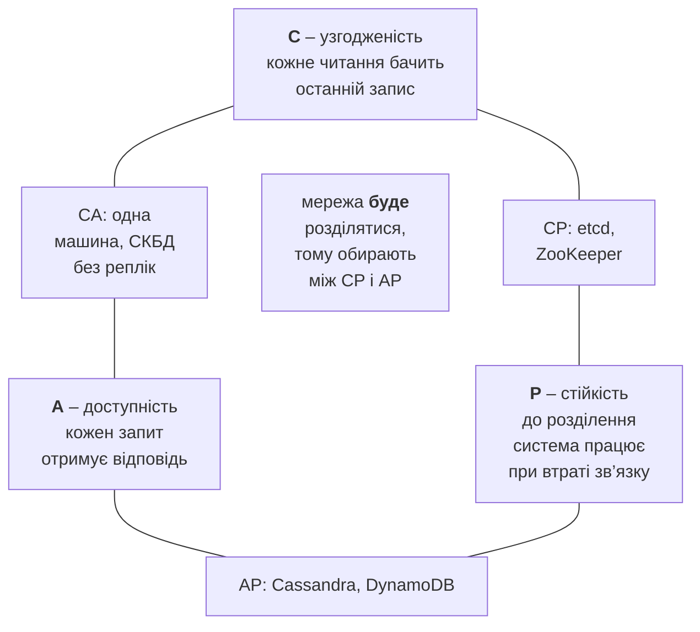
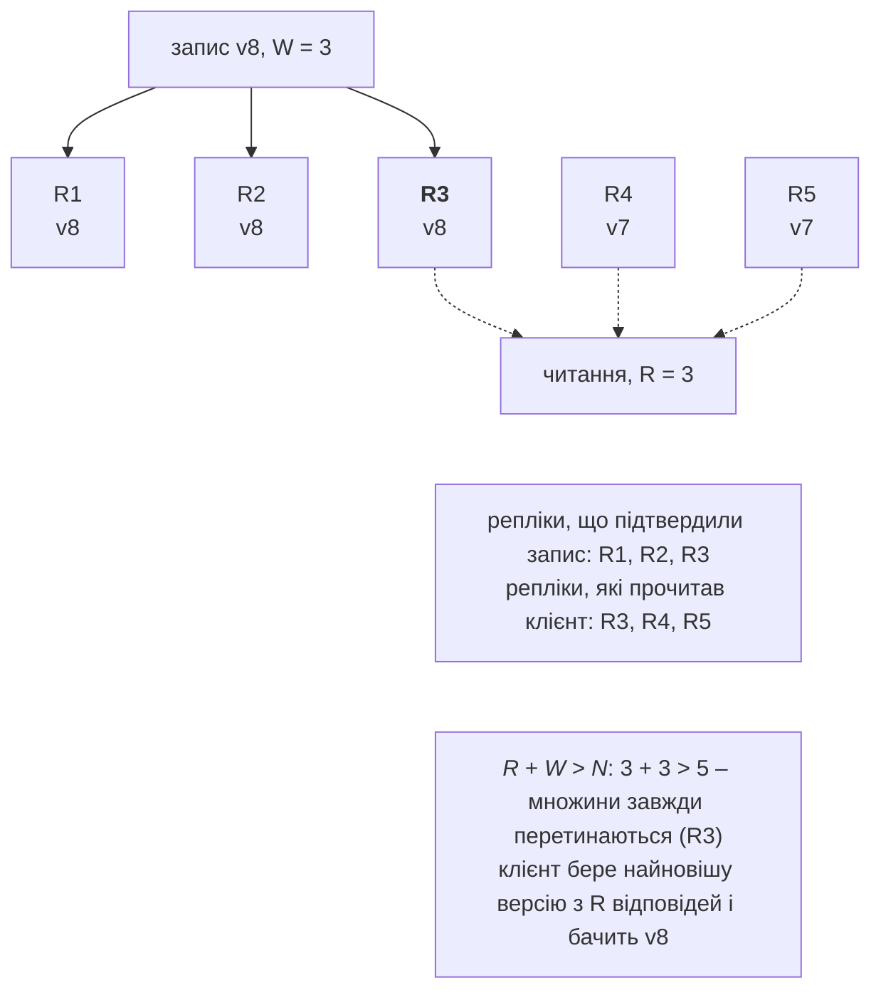

# CAP, узгодженість і відмовостійкість

## Теорема CAP і PACELC

Відмова силосу змушує вибирати: чекати, поки кластер з’ясує, хто живий (і на цей час відмовляти в обслуговуванні), чи відповідати негайно, ризикуючи працювати зі старими даними. Цей вибір формалізує **теорема CAP** (Ерік Брюер, 2000; доведення – Сет Гілберт і Ненсі Лінч, 2002). Розподілена система з реплікованими даними не може водночас гарантувати всі три властивості (рис. 16.9):

- **C – узгодженість** (*consistency*, у сенсі лінеаризовності): кожне читання повертає результат останнього успішного запису, ніби копія даних одна;
- **A – доступність** (*availability*): кожен запит до працюючого вузла отримує відповідь (не помилку й не нескінченне очікування);
- **P – стійкість до розділення** (*partition tolerance*): система продовжує роботу, коли мережа розпалася на частини, що не бачать одна одну.

Рис. 16.9. Теорема CAP {.caption}

Розділення мережі неминучі (тема 14: «мережа надійна» – хибне припущення), тому реально обирають, **як поводитися під час розділення**:

- **CP**: частина без кворуму відмовляє в записах (і часто в читаннях), зате дані не розходяться – etcd, ZooKeeper, Consul, реляційні СКБД з синхронною реплікацією;
- **AP**: кожна частина продовжує приймати запити, а розбіжності узгоджуються після відновлення зв’язку – Cassandra, DynamoDB у типовому режимі, DNS, кеші.

**PACELC** (Даніель Абаді, 2010) доповнює CAP: **якщо** є розділення (P), вибір між A і C; **інакше** (E, *else*), навіть коли все працює, вибір між **затримкою** (L, *latency*) і узгодженістю (C), бо синхронна реплікація повільніша. Cassandra і DynamoDB – PA/EL, а Azure Cosmos DB дає п’ять рівнів узгодженості на вибір (<https://learn.microsoft.com/azure/cosmos-db/consistency-levels>).

Orleans щодо окремого зерна ближчий до CP: каталог гарантує одну активацію, а під час з’ясування долі силосу виклики його зерен відмовляють (11 с у вимірюванні вище). Стан у сховищі захищає ETag: друга активація не перезапише чужий запис.

## Моделі узгодженості та кворуми

**Модель узгодженості** – домовленість, що може побачити читання після запису (від сильної до слабкої):

- **сильна** (*strong*, лінеаризовність): операції ніби виконуються миттєво в одному глобальному порядку;
- **послідовна** (*sequential*): усі бачать той самий порядок операцій, який зберігає порядок кожного клієнта, але не обов’язково реальний час;
- **причинна** (*causal*): причинно пов’язані операції (відповідь після повідомлення) усі бачать у правильному порядку; незалежні – у будь-якому; реалізується, зокрема, **векторними годинниками**;
- **читання власних записів** (*read-your-writes*): клієнт завжди бачить свої зміни (сеансова узгодженість);
- **кінцева** (*eventual*): якщо записи припинилися, згодом усі репліки зійдуться до одного значення. Для автоматичного злиття розбіжних реплік використовують **CRDT** (типи даних без конфліктів, наприклад лічильник, що зберігає окремий внесок кожної репліки).

### Реплікація і кворуми N/R/W

У реплікації **лідер–послідовники** (*leader–follower*) усі записи йдуть через лідера, а послідовники отримують копію синхронно (узгодженість, але затримка) або асинхронно (швидко, але читання з послідовника може бути застарілим). У **безлідерній** реплікації (Dynamo, Cassandra) клієнт пише на кілька реплік одразу, а узгодженість регулюють **кворумами**: $N$ – кількість реплік, $W$ – скільки мають підтвердити запис, $R$ – зі скількох читати (рис. 16.10). Якщо $R + W \gt N$, множини реплік запису й читання обов’язково перетинаються, і читання бачить останню версію.

Рис. 16.10. Реплікація з кворумами {.caption}

Симулятор з прикладу «Симулятор кворумів» виконав по 100 000 операцій (половина записів, половина читань) для $N = 5$ з різними $W$, $R$ і кількістю відрізаних реплік (табл. 16.3).

Таблиця 16.3. Кворуми при N = 5: відмови й застарілі читання {.caption}

| **Відрізано** | **W** | **R** | **R + W &gt; N** | **Відмов** | **Застарілих читань** |
| --- | --- | --- | --- | --- | --- |
| 0 з 5 | 3 | 3 | так | 0 % | 0 % |
| 0 з 5 | 1 | 1 | ні | 0 % | 80,0 % |
| 0 з 5 | 2 | 2 | ні | 0 % | 30,0 % |
| 2 з 5 | 3 | 3 | так | 0 % | 0 % |
| 2 з 5 | 5 | 1 | так | 50,0 % | 0 % |
| 3 з 5 | 3 | 3 | так | 100 % | 0 % |
| 3 з 5 | 1 | 1 | ні | 0 % | 49,9 % |

Результат збігається з теорією: при $W = R = 1$ читання влучає в єдину оновлену репліку з імовірністю 1/5 (80 % застарілих); при $W = R = 2$ імовірність побачити запис дорівнює $1 - C_{3}^{2} / C_{5}^{2}$, тобто 70 %. Кворум $3 + 3$ витримує втрату двох реплік, але при відрізаних трьох система **відмовляє** (CP), тоді як $1 + 1$ продовжує працювати ціною застарілих даних (AP). Запис на всі репліки ($W = 5$) робить читання дешевим, але недоступним стає будь-який запис при втраті однієї репліки.

## Консенсус: Paxos і Raft

**Консенсус** – згода кількох вузлів щодо одного значення (хто лідер, який наступний запис у журналі), попри відмови частини вузлів. Класичний алгоритм **Paxos** (Леслі Лемпорт, 1989) складний для розуміння, тому в 2014 році Д. Онгаро і Дж. Оустерхаут запропонували **Raft** (<https://raft.github.io/>), який використовують etcd, Consul, CockroachDB, RabbitMQ (кворумні черги, тема 15).

Ідеї Raft:

- вузол перебуває в одному зі станів: **послідовник** (*follower*), **кандидат** (*candidate*), **лідер** (*leader*); час поділено на **терми** (*terms*) з номерами;
- **вибір лідера**: послідовник, який не отримував хартбітів лідера випадковий час (150–300 мс), стає кандидатом, збільшує терм і просить голоси; перемагає той, хто отримав більшість;
- **реплікація журналу**: лідер додає запис у свій журнал, розсилає його послідовникам і вважає **зафіксованим** (*committed*), коли запис має більшість вузлів;
- кластер з $2 f + 1$ вузлів витримує відмову $f$ вузлів: з 5 вузлів – 2.

**Розщеплення мозку** (*split brain*) – дві частини кластера вважають себе головними й приймають суперечливі записи. Вимога **більшості** виключає його: більшість може бути лише в одній частині розділеної мережі, а стара частина з лідером-меншістю не може фіксувати записи. Тому кластери консенсусу мають непарну кількість вузлів (3, 5, 7). Orleans не використовує Paxos для членства: він покладається на сховище з атомарними операціями й може працювати навіть тоді, коли вижила менша частина силосів.

## Відмовостійкість розподілених систем

**Відмовостійкість** (*fault tolerance*) – здатність продовжувати роботу, коли частина компонентів відмовила. Типи відмов:

- **аварійна зупинка** (*crash*): процес або вузол зупинився й мовчить;
- **пропуск** (*omission*): губляться окремі повідомлення чи відповіді;
- **часові** (*timing*): відповідь приходить надто пізно (перевантаження, паузи збирача сміття);
- **візантійські** (*Byzantine*): вузол поводиться довільно чи зловмисно; для згоди потрібно щонайменше $3 f + 1$ вузлів на $f$ зрадників (Лемпорт, Шостак, Піз, 1982).

Інструменти відмовостійкості:

- **реплікація** даних і сервісів, **хартбіти** й **таймаути** для виявлення відмов (детектор завжди балансує між швидкістю виявлення та хибними спрацюваннями);
- **повтори** (*retry*) лише тимчасових помилок з **експоненційною затримкою** і **джитером** (тема 14) та обмеженою кількістю спроб;
- **запобіжник** (*circuit breaker*, <https://learn.microsoft.com/azure/architecture/patterns/circuit-breaker>): після серії невдач «розмикається» й одразу відмовляє без звернення до хворого сервісу, через певний час пропускає **пробний** запит (напіввідкритий стан) і «замикається», якщо той успішний. Так повтори тисяч клієнтів не добивають сервіс, що відновлюється;
- **ідемпотентність** операцій та ідентифікатори запитів (тема 14), щоб повтори не дублювали платежі;
- **обмеження часу** всього запиту, **ізоляція** ресурсів (*bulkhead*) і **деградація** (запасна відповідь з кешу).

У .NET ці стратегії дає пакет `Microsoft.Extensions.Resilience` (10.10.0) на основі бібліотеки Polly (<https://learn.microsoft.com/dotnet/core/resilience/>): `AddResiliencePipeline` будує **конвеєр стійкості** зі стратегій `AddRetry`, `AddCircuitBreaker`, `AddTimeout`, `AddFallback`, `AddHedging` тощо, які виконуються в порядку додавання. Повний приклад клієнта з повторами й запобіжником – лабораторна робота 16, приклад 3.
