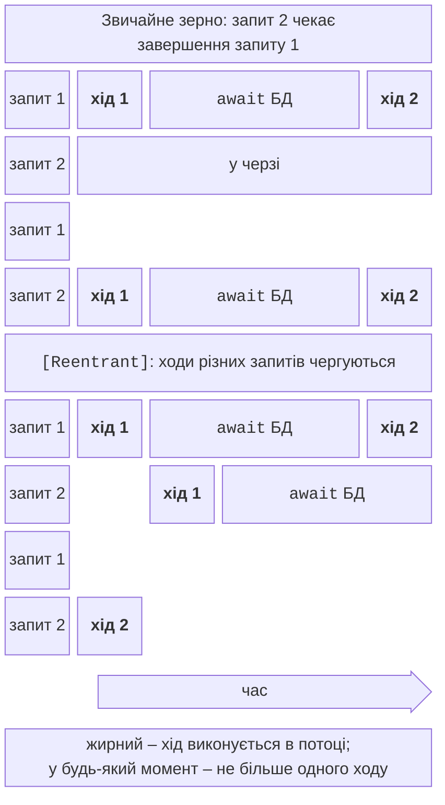

# Виконання та стан зерен

## Модель виконання: ходи та реентрантність

Активація зерна **однопотокова**: у кожен момент виконується не більше одного фрагмента її коду. Такий фрагмент між двома `await` називають **ходом** (*turn*). За замовчуванням зерно **не реентрантне**: наступний запит починається лише після **повного** завершення попереднього, навіть якщо той чекає на `await` бази даних (рис. 16.6). Тому стан можна читати й змінювати без блокувань, навіть через `await`.



Рис. 16.6. Ходи звичайного й реентрантного зерна {.caption}

Способи дозволити чергування запитів (<https://learn.microsoft.com/dotnet/orleans/grains/request-scheduling>):

- `[Reentrant]` на класі зерна – будь-які запити чергуються своїми ходами;
- `[AlwaysInterleave]` на методі інтерфейсу – цей метод чергується з будь-якими іншими;
- `[ReadOnly]` на методі інтерфейсу – методи «лише читання» виконуються одночасно між собою;
- `[MayInterleave(nameof(Predicate))]` – рішення для кожного запиту статичним методом;
- `RequestContext.AllowCallChainReentrancy()` – дозволити повернення в зерно лише в межах поточного ланцюжка викликів.

Окремий випадок – `[StatelessWorker]`: зерно без стану, для якого Orleans створює **кілька** активацій на кожному силосі (типово до кількості ядер) і завжди виконує їх локально. Так роблять перевірку, перетворення, маршрутизацію запитів (зерно `MatchmakerGrain` у прикладі «Ігрове лобі»).

### Перевірка на практиці

Програма з двома зернами-лічильниками й зерном `PingGrain` (усе в одному процесі; таймаут виклику зменшено з типових 30 с до 2 с):

```cs
public class CounterGrain : Grain, ICounterGrain
{
    int value;

    public async Task Increment()
    {
        int seen = value;                  // прочитати
        await Task.Delay(100);             // «запит до бази даних»
        value = seen + 1;                  // записати
    }

    public Task<int> Get() => Task.FromResult(value);
}

[Reentrant]                                // ходи викликів чергуються
public class ReentrantCounterGrain : CounterGrain, IReentrantCounter;

public class PingGrain : Grain, IPingGrain
{
    public async Task CallOther(IPingGrain other, bool allow)
    {
        using IDisposable? scope = allow
            ? RequestContext.AllowCallChainReentrancy() : null;
        await other.CallBack(this.AsReference<IPingGrain>());
    }

    public Task CallBack(IPingGrain caller) => caller.Ping();

    public Task Ping() => Task.CompletedTask;
}
```

Десять одночасних `Increment` для кожного лічильника й цикл A → B → A без дозволу та з ним:

```
звичайне зерно: 1132 мс, лічильник = 10
[Reentrant]: 96 мс, лічильник = 1
цикл A→B→A, дозвіл=False: TimeoutException через 2560 мс
цикл A→B→A, дозвіл=True: OK за 5 мс
```

Звичайне зерно виконало запити по черзі (10 × 100 мс) і не загубило жодного. Реентрантне впоралося за 0,1 с, але всі десять ходів прочитали `value = 0` до `await`, тож результат – 1: гонитва повернулася, хоча код і досі виконується в одному потоці. Цикл A → B → A у нереентрантних зернах – **взаємоблокування** (тема 3): A чекає на B, B чекає на A, і лише таймаут відповіді (`SiloMessagingOptions.ResponseTimeout`, типово 30 с) перериває очікування. `AllowCallChainReentrancy` дозволяє повернення тільки в цьому ланцюжку. Правило: вмикати реентрантність лише там, де стан між `await` не використовується або перевіряється повторно.

## Стан зерен і його збереження

Поки активація живе, стан зерна лежить у пам’яті силосу, і читання не звертаються до сховища. **Постійний стан** (*persistent state*) описують класом з `[GenerateSerializer]` і отримують у конструкторі як `IPersistentState<T>` з атрибутом `[PersistentState("назва", "провайдер")]` (<https://learn.microsoft.com/dotnet/orleans/grains/grain-persistence/>):

- `State` – об’єкт стану, який Orleans **читає зі сховища перед активацією**;
- `WriteStateAsync()` – записати стан (зерно саме вирішує коли: після кожної зміни або пакетом);
- `ReadStateAsync()`, `ClearStateAsync()`, `RecordExists`, `Etag`.

Провайдери реєструють у силосі за іменем: `AddMemoryGrainStorage("bank")` – у пам’яті силосу (для розробки й тестів: стан зникає разом із силосом); `AddRedisGrainStorage` – Redis; є також ADO.NET (SQL Server, PostgreSQL, MySQL, Oracle), Azure Table і Blob, Cosmos DB, DynamoDB.

### Redis у Docker

Redis запускають офіційним образом (<https://hub.docker.com/_/redis>) з увімкненим журналом дозапису (*append-only file*), щоб дані переживали перезапуск контейнера (<https://redis.io/docs/latest/operate/oss_and_stack/management/persistence/>); контейнери й Docker детально розглядає тема 17:

```powershell
docker run -d --name pro15-redis -p 6379:6379 redis:8.8 `
    redis-server --appendonly yes
```

Силос `Bank.Silo` з параметром `--redis` пише стан у Redis. Перевірка стійкості: клієнт виконує демонстрацію, силос аварійно зупиняють (`Stop-Process -Force`), запускають знову й читають рахунки командою `dotnet run -c Release -- balance UA-002`:

```
UA-002: 1 250,00 грн, операцій 1001, силос S127.0.0.1:11111:148760006
UA-001:   750,00 грн, операцій 2, силос S127.0.0.1:11111:148760006
```

Новий силос (інша епоха в адресі) вивів `[силос] активація UA-002, баланс 1250,0`: стан прочитано з Redis. Провайдер зберігає кожне зерно як хеш Redis з ключем `default/state/account/UA-001/account` і полями `data` (JSON стану) та `etag`:

```powershell
docker exec pro15-redis redis-cli `
    hgetall default/state/account/UA-001/account
```

### ETag і конфлікти записів

**ETag** – версія запису в сховищі. `WriteStateAsync` записує стан лише тоді, коли ETag у сховищі збігається з тим, який зерно прочитало (**оптимістичне блокування**, *optimistic concurrency*). Інакше кидається `InconsistentStateException`: хтось інший змінив запис (друга активація під час розділення мережі, інший застосунок, ручне редагування). Для перевірки поле `etag` змінено командою `redis-cli hset … etag changed-by-other-writer`, і наступне поповнення завершилося винятком у клієнта:

```
Unhandled exception. InconsistentStateException: Version conflict
(WriteStateAsync): ServiceId=default ProviderName=bank
GrainType=account GrainId=account/UA-001 ETag=00cd5df0…
```

Після такого винятку Orleans деактивує зерно, і наступний виклик активує його знову з актуальним станом зі сховища (у перевірці – 750 грн, незбережене поповнення відкинуто).

### Ціна запису

Кожен виклик `Deposit` чекає на запис у Redis, а виклики одного зерна виконуються по черзі. Автор виміряв 1000 одночасних поповнень, розподілених між 1, 10 і 100 рахунками (медіана п’яти вимірювань після прогрівання, силос і клієнт на одному ПК, табл. 16.1).

Таблиця 16.1. Час 1000 поповнень залежно від кількості зерен {.caption}

| **Сховище** | **1 рахунок, мс** | **10 рахунків, мс** | **100 рахунків, мс** |
| --- | --- | --- | --- |
| пам’ять силосу | ≈ 60 | ≈ 8 | ≈ 8 |
| Redis у Docker | ≈ 420 | ≈ 50 | ≈ 10 |

Одне зерно – вузьке місце: 1000 послідовних записів у Redis по ≈ 0,4 мс. Коли ті самі операції розподілено між сотнею зерен, вони виконуються паралельно, і сховище майже не сповільнює роботу. Висновок для проєктування: робити зерна дрібними (рахунок, гравець, датчик), а не одне зерно «банк».
