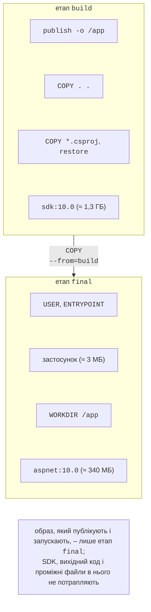
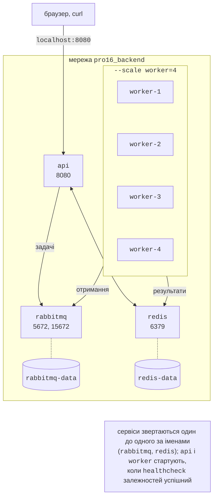

# Образи .NET і Docker Compose

## Образи .NET

### Багатоетапний Dockerfile

Образ описують текстовим файлом `Dockerfile` (<https://docs.docker.com/reference/dockerfile/>). Для .NET застосовують **багатоетапне збирання** (*multi-stage build*, <https://docs.docker.com/build/building/multi-stage/>): перший етап компілює застосунок в образі з повним SDK, другий копіює лише результат публікації в невеликий образ середовища виконання (рис. 17.3). Microsoft публікує образи .NET у реєстрі `mcr.microsoft.com/dotnet/` (<https://learn.microsoft.com/dotnet/core/docker/container-images>): `sdk` (збирання), `aspnet` (вебзастосунки), `runtime` (консольні застосунки й служби), `runtime-deps` (автономні застосунки й Native AOT).

```dockerfile
# Базовий образ фінального етапу можна змінити:
# docker build --build-arg BASE=aspnet:10.0-noble-chiseled ...
ARG BASE=aspnet:10.0

# Етап 1: збирання в образі з повним SDK.
FROM mcr.microsoft.com/dotnet/sdk:10.0 AS build
WORKDIR /src
COPY Primes.Api.csproj .
RUN dotnet restore
COPY . .
RUN dotnet publish -c Release -o /app --no-restore

# Етап 2: лише середовище виконання й опублікований застосунок.
FROM mcr.microsoft.com/dotnet/${BASE} AS final
ARG VERSION=1.0
ENV APP_VERSION=$VERSION
WORKDIR /app
COPY --from=build /app .
USER $APP_UID
EXPOSE 8080
ENTRYPOINT ["dotnet", "Primes.Api.dll"]
```



Рис. 17.3. Багатоетапне збирання образу .NET {.caption}

Пояснення інструкцій:

- `FROM образ AS ім’я` – початок етапу; `ARG` до першого `FROM` задає параметр, доступний у рядках `FROM` (тут – базовий образ фінального етапу), `ARG` усередині етапу – параметр збирання цього етапу (версія, яку `ENV` перетворює на змінну середовища `APP_VERSION`);
- `COPY Primes.Api.csproj .` і `RUN dotnet restore` **до** копіювання решти коду: шар із відновленими пакетами NuGet залежить лише від `.csproj`, тому після зміни коду він береться з кешу;
- `COPY --from=build /app .` – копіювання з попереднього етапу; SDK, вихідний код і проміжні файли у фінальний образ не потрапляють;
- `USER $APP_UID` – запуск від непривілейованого користувача `app` (UID 1654), якого містять офіційні образи .NET 8 і новіших; процес у контейнері не повинен мати прав root;
- `EXPOSE 8080` – документує порт: з .NET 8 ASP.NET Core у контейнері слухає 8080 (`ASPNETCORE_HTTP_PORTS=8080`), а не 80;
- `ENTRYPOINT` – команда запуску у формі масиву JSON: процес `dotnet` отримує PID 1 і сам приймає сигнал `SIGTERM`.

Файл `.dockerignore` поруч із `Dockerfile` виключає з **контексту збирання** зайве, зокрема теки `bin/` і `obj/` з Windows, які інакше потрапили б в образ і зламали б `dotnet publish`:

```
bin/
obj/
*.user
Dockerfile*
.dockerignore
```

Збирання й перевірка (<https://learn.microsoft.com/dotnet/core/docker/build-container>):

```powershell
docker build -t pro16/api:1.0 .
docker run -d --name pro16-api -p 8080:8080 pro16/api:1.0
curl.exe http://localhost:8080/health/live
```

Фрагмент виводу `docker build --progress=plain` (рис. 17.4):

```
#10 [build 3/6] COPY Primes.Api.csproj .
#11 [build 4/6] RUN dotnet restore
#11 DONE 3.8s
#12 [build 5/6] COPY . .
#13 [build 6/6] RUN dotnet publish -c Release -o /app --no-restore
#13 DONE 3.1s
#14 [final 3/3] COPY --from=build /app .
#15 naming to docker.io/pro16/api:1.0 done
```

Перше збирання (базові образи вже завантажено) тривало ≈ 10,6 с. Після зміни лише `Program.cs` кроки `COPY Primes.Api.csproj` і `RUN dotnet restore` позначено `CACHED`, і збирання тривало 4,9 с. Правило: інструкції, що змінюються рідко, розміщують вище, а ті, що змінюються часто, нижче.

::: info Знімок екрана
Windows Terminal: `docker build -t pro16/api:1.0 .` in the Primes.Api folder (stages [build 1/6]…[final 3/3], restore step CACHED on the second build), then `docker images pro16/api` with DISK USAGE and CONTENT SIZE
:::

Рис. 17.4. Збирання образу .NET {.caption}

### Розмір образу і вибір базового образу

Той самий застосунок зібрано на різних фінальних образах (параметр `--build-arg BASE=…`) і для порівняння одноетапним `Dockerfile` на `sdk:10.0`. Docker Desktop 4.91 з вбудованим сховищем образів containerd показує дві величини: **DISK USAGE** – розмір розпакованих шарів на диску і **CONTENT SIZE** – стиснений розмір, який передається реєстром (табл. 17.1).

Таблиця 17.1. Розміри образів застосунку Primes {.caption}

| **Фінальний образ** | **На диску** | **Стиснений** |
| --- | --- | --- |
| одноетапний на `sdk:10.0` | 1,36 ГБ | 372 МБ |
| `aspnet:10.0` (Ubuntu 24.04) | 344 МБ | 97,1 МБ |
| `aspnet:10.0-noble-chiseled` | 184 МБ | 56,4 МБ |
| `aspnet:10.0-alpine` | 181 МБ | 55,5 МБ |
| `runtime:10.0-noble-chiseled` (робітник) | 147 МБ | 44,3 МБ |

- Одноетапний образ у чотири рази більший і містить компілятор, SDK і вихідний код – так робити не слід.
- Типові образи `10.0` базуються на Ubuntu 24.04 і мають оболонку та менеджер пакетів (зручно для налагодження, але більше вразливостей для оновлення).
- **Chiseled**-образи (Ubuntu «Chiselled») містять лише файли, потрібні .NET: без оболонки, без менеджера пакетів і з користувачем `app` за замовчуванням. Команда `docker exec pro16-worker-1 sh` для них завершується помилкою `exec: "sh": executable file not found in $PATH`, тому налагоджують такі контейнери журналами й метриками. Варіант `-extra` додає бібліотеки ICU і часові пояси для глобалізації.
- **Alpine** – дистрибутив на бібліотеці musl, образ такий самий малий, але з оболонкою.

Опублікований застосунок займає лише 3 МБ (`docker image history` показує шар `COPY /app .` розміром 3,01 МБ), решту становить середовище виконання .NET. Ще менші образи дають автономна публікація з обрізанням (*trimming*) і Native AOT на `runtime-deps`, але вони потребують перевірки сумісності бібліотек.

### Публікація контейнера без Dockerfile

.NET SDK вміє збирати образи без `Dockerfile` і навіть без Docker (<https://learn.microsoft.com/dotnet/core/containers/sdk-publish>):

```powershell
dotnet publish --os linux --arch x64 /t:PublishContainer `
    -p ContainerRepository=pro16/api -p ContainerImageTag=1.0-sdk
```

```
Building image 'pro16/api' with tags '1.0-sdk' on top of base image
'mcr.microsoft.com/dotnet/aspnet:10.0'.
Pushed image 'pro16/api:1.0-sdk' to local registry via 'docker'.
```

SDK сам вибрав базовий образ `aspnet:10.0` (проєкт `Microsoft.NET.Sdk.Web`), користувача `APP_UID=1654`, порт 8080 і точку входу `dotnet /app/Primes.Api.dll`; розмір збігся з образом з `Dockerfile` (344 МБ). Властивість `ContainerFamily=noble-chiseled` дала образ на `aspnet:10.0-noble-chiseled-extra` (241 МБ): SDK додав `-extra`, бо в проєкті не ввімкнено інваріантну глобалізацію. Інші властивості (`ContainerRegistry`, `ContainerBaseImage`, `ContainerImageTags`, `ContainerPort`, `ContainerEnvironmentVariable`) описано на сторінці <https://learn.microsoft.com/dotnet/core/containers/publish-configuration>. Параметр `ContainerArchiveOutputPath` зберігає образ в архів `.tar.gz`, а `ContainerRegistry` – надсилає його одразу в реєстр без Docker. Aspire (розділ «Розгортання з Aspire») збирає образи проєктів саме так.

## Docker Compose

Запускати п’ять контейнерів окремими командами `docker run` незручно. **Docker Compose** (<https://docs.docker.com/compose/>) описує весь стенд у файлі `compose.yaml`: сервіси, їхні образи або `Dockerfile`, порти, змінні середовища, томи, мережі й залежності (рис. 17.5). Файл лежить у теці рішення поруч із теками проєктів:

```yaml
name: pro16                  # префікс імен контейнерів і мереж

services:
  rabbitmq:
    image: rabbitmq:4-management
    environment:             # guest працює лише з localhost
      RABBITMQ_DEFAULT_USER: primes
      RABBITMQ_DEFAULT_PASS: ${RABBIT_PASSWORD:-change-me}
    ports: ["15672:15672"]   # вебконсоль керування
    volumes: [rabbitmq-data:/var/lib/rabbitmq]
    networks: [backend]
    healthcheck:
      test: ["CMD", "rabbitmq-diagnostics", "-q", "ping"]
      interval: 5s
      timeout: 5s
      retries: 12

  redis:
    image: redis:8.8
    command: ["redis-server", "--appendonly", "yes"]
    volumes: [redis-data:/data]
    networks: [backend]
    healthcheck:
      test: ["CMD", "redis-cli", "ping"]
      interval: 5s
      retries: 12

  api:
    build: ./Primes.Api
    image: pro16/api:1.0
    ports: ["8080:8080"]
    environment: &connections
      ConnectionStrings__rabbitmq: >-
        amqp://primes:${RABBIT_PASSWORD:-change-me}@rabbitmq:5672
      ConnectionStrings__redis: redis:6379
    depends_on:
      rabbitmq: { condition: service_healthy }
      redis: { condition: service_healthy }
    networks: [backend]

  worker:
    build: ./Primes.Worker
    image: pro16/worker:1.0
    environment: *connections
    depends_on:
      rabbitmq: { condition: service_healthy }
      redis: { condition: service_healthy }
    networks: [backend]
    stop_grace_period: 30s   # час на завершення після SIGTERM

networks:
  backend: {}

volumes:
  rabbitmq-data: {}
  redis-data: {}
```



Рис. 17.5. Compose-стенд застосунку Primes {.caption}

Ключові елементи (<https://docs.docker.com/reference/compose-file/services/>):

- `build` – тека з `Dockerfile`; `image` – ім’я зібраного образу (або готового, якщо `build` немає). `Dockerfile` робітника відрізняється лише фінальним образом `runtime:10.0-noble-chiseled`;
- `environment` – змінні середовища; `${RABBIT_PASSWORD:-change-me}` підставляє змінну з оболонки чи файла `.env`, а без неї – значення за замовчуванням; якір YAML `&connections` і посилання `*connections` дають робітникові ті самі рядки підключення;
- у мережі `backend` сервіси знаходять один одного **за іменами сервісів** (`rabbitmq`, `redis`): команда `getent hosts rabbitmq` у контейнері API повернула `172.18.0.2`;
- порти публікуються лише для API і вебконсолі; Redis і AMQP-порт брокера ззовні недоступні;
- `healthcheck` періодично виконує команду в контейнері, а `depends_on` з умовою `service_healthy` запускає API й робітників лише після того, як брокер і Redis стали `healthy` (<https://docs.docker.com/compose/how-tos/startup-order/>). Без умови Compose чекав би лише запуску контейнера, а RabbitMQ після запуску готується ще кілька секунд;
- користувач `guest` у RabbitMQ може підключатися тільки з `localhost`, тому для інших контейнерів створено користувача `primes`.

Команди Compose виконують у теці з `compose.yaml`:

```powershell
docker compose up -d --build   # зібрати образи й запустити
docker compose up -d --scale worker=4   # чотири робітники
docker compose ps              # стан сервісів
docker compose logs -f worker  # журнали всіх робітників
docker compose down        # зупинити й видалити (томи лишаються)
docker compose down -v         # разом із томами
```

Результат масштабування (рис. 17.6):

```
NAME               IMAGE                   STATUS
pro16-api-1        pro16/api:1.0           Up Less than a second
pro16-rabbitmq-1   rabbitmq:4-management   Up 7 seconds (healthy)
pro16-redis-1      redis:8.8               Up 7 seconds (healthy)
pro16-worker-1     pro16/worker:1.0        Up Less than a second
pro16-worker-2     pro16/worker:1.0        Up Less than a second
pro16-worker-3     pro16/worker:1.0        Up Less than a second
pro16-worker-4     pro16/worker:1.0        Up Less than a second
```

Стовпець `PORTS` (тут не показано) містить `0.0.0.0:8080->8080/tcp` для API і `0.0.0.0:15672->15672/tcp` для брокера.

::: info Знімок екрана
Windows Terminal in the solution folder: `docker compose up -d --scale worker=4` output (Healthy lines, worker-1…4 Started), then `docker compose ps` with rabbitmq and redis (healthy) and four workers
:::

Рис. 17.6. Масштабування сервісу в Compose {.caption}

Завдання подають через API, наприклад у PowerShell:

```powershell
$job = Invoke-RestMethod -Method Post `
    "http://localhost:8080/jobs?to=20000000&chunks=40"
Invoke-RestMethod "http://localhost:8080/jobs/$($job.id)"
```

```
id       : bbea7a38
to       : 20000000
chunks   : 40
done     : 40
primes   : 1270607
seconds  : 4,9
```

Кількість простих чисел до $2 \cdot 10^{7}$ дорівнює 1 270 607, що збігається з відомим значенням $\pi (2 \cdot 10^{7})$. Після `docker compose down` і повторного `up` той самий запит повернув той самий результат: хеші завдань зберігаються в томі `redis-data`.

### Масштабування робітників

Час обчислення для $N = 5 \cdot 10^{7}$ (100 частин, 3 001 134 простих числа) виміряно для різної кількості робітників: після прогрівального завдання – медіана п’яти завдань (табл. 17.2; у стовпці Kubernetes – той самий застосунок у кластері kind, робітник обмежений одним ядром).

Таблиця 17.2. Час підрахунку простих чисел до $5 \cdot 10^{7}$ залежно від кількості робітників {.caption}

| **Робітників** | **Compose, с** | **Прискорення** | **kind, с** | **Прискорення** |
| --- | --- | --- | --- | --- |
| 1 | 17,48 | 1,00 | 18,07 | 1,00 |
| 2 | 9,19 | 1,90 | 9,52 | 1,90 |
| 4 | 5,15 | 3,39 | 5,48 | 3,30 |
| 8 | 3,42 | 5,11 | 3,43 | 5,27 |
| 16 | 2,42 | 7,22 | – | – |

Синхронний запит `GET /primes?to=50000000` в одному контейнері тривав 17,3 с, тобто брокер і Redis майже не додають накладних витрат. Прискорення до 8 робітників близьке до кількості фізичних ядер (8), а 16 робітників на 16 логічних процесорах дають лише 7,2 (гіперпотоковість, тема 1). Кластер kind на тому самому ПК працює майже так само швидко, як Compose: контейнери обох запускає той самий рушій у ВМ WSL 2.
