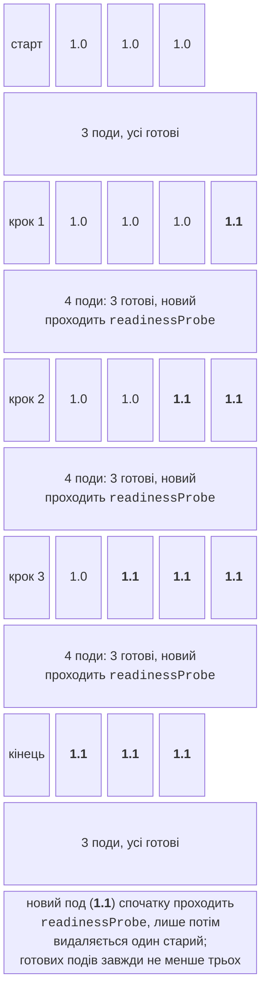
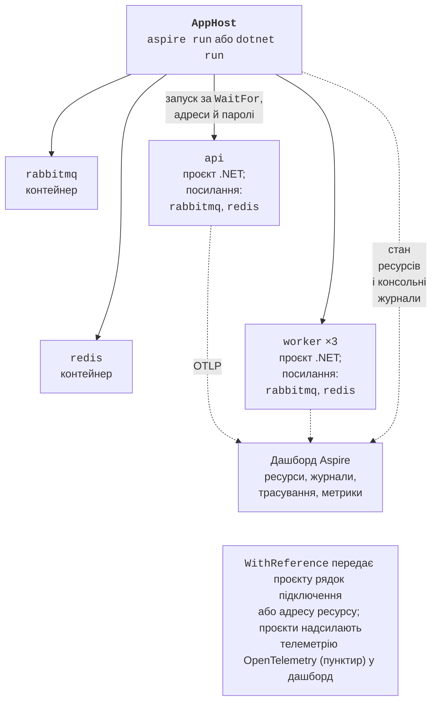

# Масштабування та .NET Aspire

## Масштабування, оновлення й відмовостійкість

### Масштабування й самовідновлення

Кількість реплік змінюють у маніфесті (і повторюють `kubectl apply`) або командою `kubectl -n pro16 scale deploy/worker --replicas=8`. Вимірювання з табл. 17.2 показують, що 8 подів робітника прискорюють обчислення в 5,3 раза.

Контролер ReplicaSet постійно порівнює кількість подів із заданою. Після `kubectl -n pro16 delete pod -l app=worker` через секунду вже працювали два нові поди, а старі завершувалися:

```
NAME                      READY   STATUS      RESTARTS   AGE
worker-7787d686df-mrjgl   1/1     Running     0          1s
worker-7787d686df-pjlxw   0/1     Completed   0          52s
worker-7787d686df-vpz5c   0/1     Completed   0          53s
worker-7787d686df-vqrml   1/1     Running     0          1s
```

Стан `Completed` (а не `Error`) означає, що робітники коректно обробили `SIGTERM` і завершилися з кодом 0.

### Поступове оновлення і відкат

Зміна шаблону пода (образу, змінних, ресурсів) запускає **поступове оновлення** (*rolling update*, рис. 17.11): Deployment створює новий ReplicaSet і переносить на нього поди по одному. Параметри стратегії: `maxSurge` – скільки подів можна створити понад `replicas`, `maxUnavailable` – скільки може бути недоступно. З `maxSurge: 1` і `maxUnavailable: 0` старий под видаляється лише після того, як новий пройшов `readinessProbe`.



Рис. 17.11. Поступове оновлення з maxSurge 1 і maxUnavailable 0 {.caption}

Версію 1.1 зібрано з параметром `--build-arg VERSION=1.1` і надіслано в реєстр. Оновлення:

```powershell
kubectl -n pro16 set image deploy/api `
    api=localhost:5001/primes-api:1.1
kubectl -n pro16 rollout status deploy/api   # дочекатися завершення
kubectl -n pro16 rollout history deploy/api  # ревізії
kubectl -n pro16 rollout undo deploy/api     # повернути попередню
```

Під час оновлення програма-клієнт кожні 50 мс запитувала `GET /` і рахувала відповіді кожної версії. Оновлення тривало 9 с; спочатку відповідала лише версія 1.0, потім обидві впереміж, далі лише 1.1. **Без** `preStop` один прогін дав 10 помилок з 960 запитів (розірвані з’єднання й таймаути): под отримав `SIGTERM` і закрив порт раніше, ніж усі вузли прибрали його зі списку служби. Затримка `preStop: sleep: { seconds: 5 }` (<https://kubernetes.io/docs/concepts/containers/container-lifecycle-hooks/>) дає службі час виключити под, і три наступні оновлення пройшли без жодної помилки (`{'1.0': 98, '1.1': 462}` тощо).

Помилкове оновлення безпечне: після `set image … primes-api:9.9` (такого тегу немає) новий под мав стан `ErrImagePull`, `rollout status` не завершувався, а три старі поди продовжували обслуговувати запити, бо `maxUnavailable: 0`. Команда `rollout undo` повернула робочу версію (рис. 17.12).

::: info Знімок екрана
Windows Terminal: `kubectl apply -f k8s/`, `kubectl -n pro16 get deploy,pods,svc`, then `kubectl -n pro16 set image deploy/api api=localhost:5001/primes-api:1.1` and `kubectl -n pro16 rollout status deploy/api` with the «1 out of 3 new replicas…» lines and «successfully rolled out»
:::

Рис. 17.12. Розгортання та оновлення в Kubernetes {.caption}

::: tip Теги образів
Kubernetes типово не завантажує образ повторно, якщо тег, відмінний від `latest`, уже є на вузлі (`imagePullPolicy: IfNotPresent`). Тому кожну збірку позначають новим тегом (версія, номер збірки, хеш коміту) і ніколи не перезаписують `1.0` іншим вмістом.
:::

### Проби й ресурси

**Проби** (*probes*, <https://kubernetes.io/docs/tasks/configure-pod-container/configure-liveness-readiness-startup-probes/>) `kubelet` виконує періодично (табл. 17.3). Способи перевірки: `httpGet` (успіх – код 200–399), `tcpSocket` (порт приймає з’єднання), `exec` (команда в контейнері завершилася з кодом 0), `grpc`.

Таблиця 17.3. Проби Kubernetes {.caption}

| **Проба** | **Питання** | **Наслідок невдачі** |
| --- | --- | --- |
| `startupProbe` | чи завершився повільний старт? | інші проби не виконуються; після ліміту контейнер перезапускається |
| `readinessProbe` | чи готовий под приймати запити (залежності доступні)? | под виключається зі служби, але не перезапускається |
| `livenessProbe` | чи процес не завис? | контейнер перезапускається |

Правила: `livenessProbe` не повинна перевіряти залежності (інакше збій Redis перезапустить усі поди API, що не допоможе), а `readinessProbe` – повинна. Тому API має два різні ендпоінти.

Під час налаштування кластера RabbitMQ перезапускався в циклі (`CrashLoopBackOff`) з помилкою `Error when reading /var/lib/rabbitmq/.erlang.cookie: eacces`. Причина – проба `exec: rabbitmq-diagnostics -q ping`: вона виконується від root і на першому запуску створила файл cookie Erlang з правами root раніше за сервер, який працює від користувача `rabbitmq`. Проба `tcpSocket` на порт 5672 розв’язала проблему. Проби не повинні змінювати стан контейнера.

**Ресурси**: `requests` – скільки ресурсів гарантовано поду (за ними планувальник вибирає вузол і від них рахує відсотки HPA), `limits` – межа: при перевищенні процесора контейнер пригальмовується (*throttling*), при перевищенні пам’яті – завершується з причиною `OOMKilled`. Одиниці: `100m` – 0,1 ядра, `128Mi` – 128 МіБ. Серверний збирач сміття .NET враховує обмеження пам’яті та процесора контейнера.

### Автомасштабування і пакетні завдання

**HorizontalPodAutoscaler** (HPA, <https://kubernetes.io/docs/tasks/run-application/horizontal-pod-autoscale/>) змінює кількість реплік Deployment за метриками. Для метрик процесора потрібен компонент metrics-server (<https://github.com/kubernetes-sigs/metrics-server>); у kind його встановлюють з офіційного маніфесту й додають параметр `--kubelet-insecure-tls`, бо сертифікати kubelet у kind самопідписані. Ціль, наприклад, `averageUtilization: 60` – середнє завантаження процесора 60 % від `requests`. У перевірці навантажувальний клієнт з 8 задачами за 50 с збільшив кількість подів обчислювального сервісу з 1 до 8, а пропускна здатність зросла з 30 до ≈ 175 запитів за секунду (повний приклад – лабораторна робота 17, приклад 2).

**Job** (<https://kubernetes.io/docs/concepts/workloads/controllers/job/>) виконує поди до успішного завершення, а не підтримує їх постійно: `completions` – скільки успішних завершень потрібно, `parallelism` – скільки подів одночасно, `completionMode: Indexed` – кожен под отримує номер частини у змінній `JOB_COMPLETION_INDEX`. Так розподіляють обчислювальні задачі без брокера: 8 частин обчислення $\pi$ методом Монте-Карло з `parallelism: 8` виконалися за 9,9 с проти 65 с послідовно (лабораторна робота 17, приклад 1). `CronJob` запускає Job за розкладом.

## .NET Aspire

Compose і Kubernetes описують розгортання, але під час розробки зручніше запускати проєкти просто з IDE з налагодженням. **Aspire** (<https://aspire.dev/>) – інструмент Microsoft для опису, запуску й спостереження за розподіленим застосунком. До версії 13 продукт називався **.NET Aspire**; з версії 13.0 він має назву Aspire і сайт aspire.dev, бо підтримує також застосунки JavaScript, Python та інших мов. Поточна версія – **Aspire 13.5.4**, вона потребує .NET SDK 10.

Складові:

- **AppHost** – проєкт (або однофайлова програма `apphost.cs`), у якому кодом C# описано **модель застосунку**: ресурси (проєкти, контейнери, виконувані файли, хмарні служби) і зв’язки між ними (<https://aspire.dev/get-started/app-host/>, рис. 17.13);
- **ServiceDefaults** – спільна бібліотека з методом `AddServiceDefaults`, який підключає до кожного сервісу OpenTelemetry, перевірки стану, виявлення сервісів і стійкість HTTP-клієнтів (<https://aspire.dev/fundamentals/service-defaults/>);
- **інтеграції** – пакети NuGet: **хостингові** (`Aspire.Hosting.RabbitMQ`, `Aspire.Hosting.Redis`, PostgreSQL, Kafka, Orleans…) додають ресурси в AppHost, **клієнтські** (`Aspire.RabbitMQ.Client`, `Aspire.StackExchange.Redis`…) реєструють клієнти в сервісах разом із перевірками стану й телеметрією;
- **дашборд** – вебзастосунок з ресурсами, журналами, трасуваннями й метриками (<https://aspire.dev/dashboard/overview/>);
- **CLI** `aspire` – створення, запуск, перегляд телеметрії й розгортання.



Рис. 17.13. Модель застосунку Aspire {.caption}

Встановлення CLI (<https://aspire.dev/get-started/install-cli/>) одним зі способів: `irm https://aspire.dev/install.ps1 | iex`, `winget install Microsoft.Aspire` або `dotnet tool install -g Aspire.Cli`; перевірка – `aspire --version`. Для контейнерних ресурсів потрібен Docker Desktop або Podman. Нове рішення створює `aspire new aspire-starter` (API, вебфронтенд, AppHost і ServiceDefaults) або `aspire new aspire-empty` (лише AppHost); у наявне рішення Aspire додає `aspire init`, інтеграцію – `aspire add rabbitmq`.

### AppHost застосунку Primes

У рішення `Primes` додано проєкти `Primes.AppHost` (SDK `Aspire.AppHost.Sdk/13.5.4`, пакети `Aspire.Hosting.RabbitMQ` і `Aspire.Hosting.Redis`, посилання на проєкти API й робітника) і `Primes.ServiceDefaults`:

```cs
// Модель розподіленого застосунку: ресурси та зв’язки між ними.
IDistributedApplicationBuilder builder =
    DistributedApplication.CreateBuilder(args);

// Контейнери інфраструктури (Aspire запускає їх у Docker).
var rabbitmq = builder.AddRabbitMQ("rabbitmq")
    .WithManagementPlugin()                  // вебконсоль
    .WithContainerName("pro16-rabbitmq");
var redis = builder.AddRedis("redis")
    .WithContainerName("pro16-redis");

// Проєкти .NET: рядки підключення передає WithReference.
var api = builder.AddProject<Projects.Primes_Api>("api")
    .WithReference(rabbitmq).WaitFor(rabbitmq)
    .WithReference(redis).WaitFor(redis)
    .WithHttpHealthCheck("/health/ready", endpointName: "http")
    .WithExternalHttpEndpoints();

builder.AddProject<Projects.Primes_Worker>("worker")
    .WithReference(rabbitmq).WaitFor(rabbitmq)
    .WithReference(redis).WaitFor(redis)
    .WithReplicas(3);                        // три процеси

builder.Build().Run();
```

- `AddRabbitMQ`, `AddRedis` – ресурси-контейнери; пароль генерується автоматично й зберігається в секретах користувача AppHost; `WithContainerName` задає постійне ім’я контейнера (необов’язково);
- `AddProject<Projects.Primes_Api>` – проєкт .NET; клас `Projects.Primes_Api` генерується з посилання на проєкт;
- `WithReference(rabbitmq)` – передати проєкту рядок підключення: у середовищі API з’являються `ConnectionStrings__rabbitmq=amqp://guest:…@localhost:59551` і `ConnectionStrings__redis=localhost:59550,password=…`, тобто ті самі ключі, які код уже читає;
- `WaitFor` – запускати проєкт лише після того, як ресурс став здоровим (як `service_healthy` у Compose); `WithHttpHealthCheck` – перевіряти стан самого API;
- `WithReplicas(3)` – запустити три екземпляри робітника.

У проєкти API й робітника додано посилання на `Primes.ServiceDefaults` і по одному-два рядки:

```cs
builder.AddServiceDefaults();   // OpenTelemetry, перевірки стану
// …
app.MapDefaultEndpoints();   // /health, /alive (у Development)
```

У `ConfigureOpenTelemetry` бібліотеки ServiceDefaults додано джерело активностей клієнта RabbitMQ: `tracing.AddSource(builder.Environment.ApplicationName).AddSource("RabbitMQ.Client.*")`. Решта коду не змінилася: той самий застосунок працює в Compose, Kubernetes і під керуванням Aspire.

Запуск: `aspire run` (інтерактивно) або `aspire start` (у фоні) у теці рішення, чи просто запуск проєкту AppHost у Rider або Visual Studio. Результат `aspire start` і `aspire describe`:

```
     AppHost:  Primes.AppHost\Primes.AppHost.csproj
   Dashboard:  http://localhost:15261/login?t=9850dbc991ce98c9…
✅ AppHost started successfully.

Name             Type       State    Health   URLs
api              Project    Running  Healthy  http://localhost:5043
rabbitmq         Container  Running  Healthy  http://localhost:59552
redis            Container  Running  Healthy  redis://localhost:59550
worker-euvtpmpg  Project    Running  Healthy  -
worker-nqzwxwga  Project    Running  Healthy  -
worker-ugmdxbyv  Project    Running  Healthy  -
```

Aspire запустив контейнери `pro16-rabbitmq` (образ `rabbitmq:4.3-management`) і `pro16-redis` (`redis:8.6`), дочекався їхньої готовності, а потім запустив API і три процеси робітника. Посилання з токеном відкриває дашборд (рис. 17.14): таблиця ресурсів, їхні адреси, змінні середовища, консольні журнали кожного процесу. Команди `aspire logs worker-euvtpmpg`, `aspire describe` і `aspire stop` роблять те саме з термінала.

::: info Знімок екрана
Browser, Aspire dashboard → Resources: table with api, rabbitmq, redis and three worker replicas, all Running / Healthy, source column and URLs; light theme
:::

Рис. 17.14. Ресурси в дашборді Aspire {.caption}

### Виявлення сервісів

Для HTTP-залежностей `WithReference(calc)` передає адресу іншого проєкту змінними `services__calc__http__0=http://localhost:5090`, а бібліотека `Microsoft.Extensions.ServiceDiscovery` (її підключає `AddServiceDefaults`) дозволяє писати в коді логічне ім’я (<https://aspire.dev/fundamentals/service-discovery/>):

```cs
builder.Services.AddHttpClient("calc",
    c => c.BaseAddress = new Uri("https+http://calc"));
```

Схема `https+http` означає «HTTPS, якщо є, інакше HTTP». Після розгортання в Kubernetes те саме ім’я `calc` розв’язує DNS кластера. Повний приклад з кешем Redis – лабораторна робота 17, приклад 3.

::: tip Сертифікат розробника
Профіль `https` AppHost і проєктів потребує довіреного сертифіката розробника ASP.NET Core. Якщо його не довірено, AppHost показує API як `Unhealthy`, а `aspire otel` не може підключитися до дашборду. Розв’язання: один раз виконати `aspire certs trust` (або `dotnet dev-certs https --trust`) і підтвердити встановлення сертифіката або використовувати профіль запуску `http`, як у прикладах лекції.
:::
