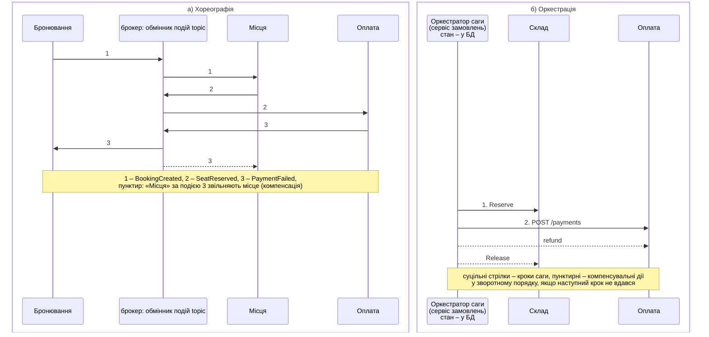
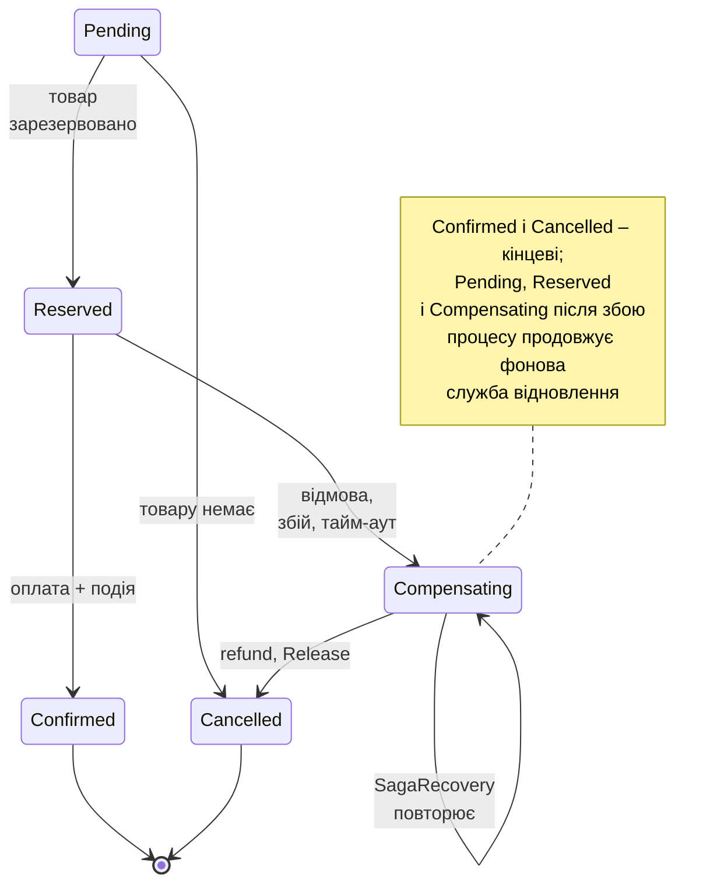

# Дані та патерн Saga

## Дані в мікросервісах

**База даних на сервіс** (*database per service*): кожен сервіс володіє своїми даними, і лише він читає й змінює їх; інші отримують дані через API або події (<https://learn.microsoft.com/dotnet/architecture/microservices/architect-microservice-container-applications/distributed-data-management>). Спільна база даних для кількох сервісів – найпоширеніша помилка: зміна схеми однієї таблиці ламає чужі сервіси, а сервіси неможливо розгорнути незалежно. Кожен сервіс може вибрати зручне сховище: реляційну БД, документну, Redis, пошуковий рушій (*polyglot persistence*).

Сервіс каталогу з EF Core і PostgreSQL:

```cs
using Microsoft.EntityFrameworkCore;

// Сервіс каталогу: власна база catalogdb, лише читання товарів.
WebApplicationBuilder builder = WebApplication.CreateBuilder(args);
builder.AddServiceDefaults();
builder.AddNpgsqlDbContext<CatalogDb>("catalogdb");
WebApplication app = builder.Build();
app.MapDefaultEndpoints();

await using (AsyncServiceScope scope =
    app.Services.CreateAsyncScope())
{
    CatalogDb db = scope.ServiceProvider
        .GetRequiredService<CatalogDb>();
    if (await db.Database.EnsureCreatedAsync())   // перший запуск
    {
        db.Products.AddRange(
            new Product { Id = 1, Name = "Ноутбук", Price = 32000m },
            new Product { Id = 2, Name = "Миша", Price = 650m },
            new Product { Id = 3, Name = "Кабель USB-C",
                Price = 250m });
        await db.SaveChangesAsync();
    }
}

app.MapGet("/products", (CatalogDb db) =>
    db.Products.AsNoTracking().OrderBy(p => p.Id).ToListAsync());
app.MapGet("/products/{id:int}", async (int id, CatalogDb db) =>
    await db.Products.FindAsync(id) is Product p
        ? Results.Ok(p) : Results.NotFound());

app.Run();

public class Product
{
    public int Id { get; set; }
    public required string Name { get; set; }
    public decimal Price { get; set; }
}

public class CatalogDb(DbContextOptions<CatalogDb> options)
    : DbContext(options)
{
    public DbSet<Product> Products => Set<Product>();
}
```

`AddNpgsqlDbContext<CatalogDb>("catalogdb")` з клієнтської інтеграції Aspire реєструє контекст EF Core з рядком підключення `catalogdb`, перевіркою стану, трасуванням запитів до бази і **повторами після тимчасових помилок з’єднання** (стратегія виконання `NpgsqlRetryingExecutionStrategy`, <https://learn.microsoft.com/ef/core/miscellaneous/connection-resiliency>). Для навчального прикладу схема створюється `EnsureCreatedAsync()`; у справжньому проєкті використовують міграції EF Core.

Повтори EF Core несумісні з власною транзакцією: перший варіант сервісу складу з `BeginTransactionAsync()` завершувався винятком `The configured execution strategy 'NpgsqlRetryingExecutionStrategy' does not support user-initiated transactions`. Правильний спосіб – виконати весь блок транзакції через стратегію, щоб у разі збою з’єднання повторився **увесь** блок (`Shop.Stock/Services/InventoryService.cs`):

```cs
using Grpc.Core;
using Microsoft.EntityFrameworkCore;

namespace Shop.Stock;

public class InventoryService(StockDb db,
    ILogger<InventoryService> log) : Inventory.InventoryBase
{
    public override async Task<ReserveReply> Reserve(
        ReserveRequest request, ServerCallContext context)
    {
        Guid order = Guid.Parse(request.OrderId);
        // Ідемпотентність: повторний виклик для того самого
        // замовлення не резервує товар удруге.
        if (await db.Reservations.AnyAsync(r => r.OrderId == order))
            return new ReserveReply { Ok = true };
        // Aspire вмикає повтори EF Core після збоїв з’єднання, тому
        // власна транзакція виконується через стратегію виконання.
        return await db.Database.CreateExecutionStrategy()
            .ExecuteAsync(() => ReserveAsync(order, request.Lines));
    }

    async Task<ReserveReply> ReserveAsync(Guid order,
        IEnumerable<Line> lines)
    {
        db.ChangeTracker.Clear();
        await using var tx =
            await db.Database.BeginTransactionAsync();
        foreach (Line line in lines)
        {
            // Атомарно: UPDATE … SET available = available - q
            // WHERE available >= q.
            int updated = await db.Items
                .Where(i => i.ProductId == line.ProductId
                    && i.Available >= line.Quantity)
                .ExecuteUpdateAsync(s => s.SetProperty(
                    i => i.Available,
                    i => i.Available - line.Quantity));
            if (updated == 0)
            {
                await tx.RollbackAsync();
                log.LogInformation(
                    "Замовлення {Order}: товару {Id} недостатньо",
                    order, line.ProductId);
                return new ReserveReply { Ok = false,
                    Reason = $"товару {line.ProductId} недостатньо" };
            }
            db.Reservations.Add(new Reservation { OrderId = order,
                ProductId = line.ProductId,
                Quantity = line.Quantity });
        }
        await db.SaveChangesAsync();
        await tx.CommitAsync();
        log.LogInformation("Замовлення {Order}: товар зарезервовано",
            order);
        return new ReserveReply { Ok = true };
    }

    // Компенсація: повернути зарезервований товар (ідемпотентно).
    public override Task<ReleaseReply> Release(
        ReleaseRequest request, ServerCallContext context) =>
        db.Database.CreateExecutionStrategy().ExecuteAsync(
            () => ReleaseAsync(Guid.Parse(request.OrderId)));

    async Task<ReleaseReply> ReleaseAsync(Guid order)
    {
        db.ChangeTracker.Clear();
        await using var tx =
            await db.Database.BeginTransactionAsync();
        List<Reservation> list = await db.Reservations
            .Where(r => r.OrderId == order && !r.Released)
            .ToListAsync();
        foreach (Reservation r in list)
        {
            await db.Items.Where(i => i.ProductId == r.ProductId)
                .ExecuteUpdateAsync(s => s.SetProperty(
                    i => i.Available, i => i.Available + r.Quantity));
            r.Released = true;
        }
        await db.SaveChangesAsync();
        await tx.CommitAsync();
        log.LogInformation(
            "Замовлення {Order}: резерв знято ({Count})", order,
            list.Count);
        return new ReleaseReply { Released = list.Count };
    }
}
```

Резервування **атомарне**: `ExecuteUpdateAsync` виконує один оператор `UPDATE … SET "Available" = "Available" - q WHERE "Available" >= q`, тому два одночасні замовлення не продадуть останню одиницю двічі (порівняйте з гонитвою в темі 3). Обидві операції **ідемпотентні**: повторний `Reserve` для того самого замовлення нічого не змінює, а `Release` повертає лише ще не повернений резерв.

**Узгодженість в кінцевому підсумку** (*eventual consistency*): коли дані різних сервісів пов’язані, вони стають узгодженими не миттєво, а через деякий час після обробки подій. Наприклад, відправлення в `shipping` з’являється через ≈ 0,5 с після підтвердження замовлення. Інтерфейс користувача має це враховувати (статус «обробляється»).

**Дублювання даних** – нормальна практика: `orders` зберігає ціну на момент замовлення, а не посилання на ціну в каталозі (вона може змінитися). Сервіс може тримати **локальну копію** чужих даних (наприклад, назви товарів), яку оновлюють події – тоді він не залежить від доступності власника даних.

**CQRS** (*Command Query Responsibility Segregation*, <https://learn.microsoft.com/azure/architecture/patterns/cqrs>) – розділення моделей запису (команди, що змінюють стан) і читання (запити). Модель читання – **проєкція** (*projection*), яку будують з подій кількох сервісів і оптимізують під конкретний екран (наприклад, «мої замовлення з назвами товарів і статусом доставки»). Разом з CQRS часто згадують **event sourcing** (<https://learn.microsoft.com/azure/architecture/patterns/event-sourcing>): стан сутності зберігається як послідовність подій, а не як поточний рядок таблиці. Обидва патерни додають складності й потрібні далеко не кожному сервісу.

## Розподілені транзакції: патерн Saga

Оформлення замовлення змінює дані трьох сервісів: резерв на складі, платіж, статус замовлення. У моноліті це одна транзакція ACID. Між сервісами з окремими базами такої транзакції немає.

**Двофазна фіксація** (*two-phase commit*, 2PC): координатор питає всіх учасників «чи готові ви?», а потім наказує всім зафіксувати або всім відкотити. Для мікросервісів 2PC непридатна: учасники блокують дані до рішення координатора, відмова координатора залишає їх у невизначеному стані, а брокери повідомлень і багато сховищ (RabbitMQ, Redis, більшість NoSQL) у ній не беруть участі. Теорема CAP (тема 16) нагадує: під час розділення мережі доводиться вибирати між узгодженістю й доступністю, і мікросервіси зазвичай вибирають доступність.

**Сага** (*saga*, <https://learn.microsoft.com/azure/architecture/patterns/saga>) – послідовність **локальних транзакцій** у різних сервісах. Кожен крок фіксує зміни у своїй базі й запускає наступний. Якщо крок не вдався, виконуються **компенсувальні дії** (*compensating transactions*, <https://learn.microsoft.com/azure/architecture/patterns/compensating-transaction>) для вже виконаних кроків у зворотному порядку: зняти резерв, повернути кошти. Компенсація – це не відкат, а нова бізнес-операція, результат якої видно (клієнт може побачити повернення коштів).

Два стилі (рис. 18.7):

- **хореографія**: сервіси реагують на події один одного. Немає центральної точки відмови, але процес «розмазаний» по сервісах, його важко простежити, а циклічні залежності подій легко створити непомітно. Підходить для 2–4 кроків (приклад – лабораторна робота 18, приклад 1);
- **оркестрація**: оркестратор зберігає стан саги, надсилає команди й вирішує, що далі. Процес видно в одному місці, його легко змінювати й тестувати; оркестратор не повинен перетворитися на «божественний сервіс» з чужою логікою.



Рис. 18.7. Сага: хореографія та оркестрація {.caption}

Особливості саг, які треба враховувати:

- **немає ізоляції** (буква I в ACID): інші запити бачать проміжний стан («товар зарезервовано, але не оплачено»). Застосовують **семантичні блокування** (статуси `Pending`, `Reserved`), упорядкування кроків (спочатку крок, який найчастіше відмовляє) і повторне читання перед зміною;
- кроки й компенсації мають бути **ідемпотентними**: через тайм-аути й повтори кожна команда може прийти двічі;
- **невизначений результат**: після тайм-ауту не відомо, чи виконав сервіс операцію. Тому компенсація після збою оплати викликає `refund` навіть тоді, коли платіж, можливо, і не пройшов;
- **стан саги зберігається**: після перезапуску оркестратора сагу продовжують з останнього кроку.

### Оркестрована сага в Shop

Модель сервісу замовлень і вихідна скринька (`Shop.Orders/OrdersDb.cs`):

```cs
using System.Diagnostics;
using System.Text.Json;
using Microsoft.EntityFrameworkCore;
using Shop.Contracts;

namespace Shop.Orders;

public enum OrderStatus { Pending, Reserved, Confirmed, Compensating,
    Cancelled }

public class Order
{
    public Guid Id { get; set; }
    public string? IdempotencyKey { get; set; }
    public required string Customer { get; set; }
    public List<OrderLine> Lines { get; set; } = [];
    public decimal Total { get; set; }
    public OrderStatus Status { get; set; }
    public string? Reason { get; set; }
    public DateTime UpdatedAt { get; set; }
}

// Рядок вихідної скриньки: подія, яку ще треба опублікувати.
public class OutboxMessage
{
    public Guid Id { get; set; } = Guid.CreateVersion7();
    public required string Type { get; set; }   // routing key
    public required string Payload { get; set; } // JSON події
    public string? TraceParent { get; set; }    // W3C traceparent
    public DateTime CreatedAt { get; set; } = DateTime.UtcNow;
    public DateTime? SentAt { get; set; }

    public static OutboxMessage From<T>(string type, T message) =>
        new()
    {
        Type = type,
        Payload = JsonSerializer.Serialize(message),
        TraceParent = Activity.Current?.Id,
    };
}

public class OrdersDb(DbContextOptions<OrdersDb> options)
    : DbContext(options)
{
    public DbSet<Order> Orders => Set<Order>();
    public DbSet<OutboxMessage> Outbox => Set<OutboxMessage>();

    protected override void OnModelCreating(ModelBuilder b)
    {
        b.Entity<Order>().Property(o => o.Status)
            .HasConversion<string>();
        b.Entity<Order>().HasIndex(o => o.IdempotencyKey).IsUnique();
        b.Entity<Order>().ComplexCollection(o => o.Lines,
            l => l.ToJson());                       // стовпець jsonb
        b.Entity<OutboxMessage>().HasIndex(m => m.SentAt);
    }
}
```

Рядки замовлення зберігаються в стовпці `jsonb` (*complex collection* EF Core 10, метод `ComplexCollection(…).ToJson()`), статус – рядком, ключ ідемпотентності має унікальний індекс. Оркестратор (`Shop.Orders/OrderSaga.cs`):

```cs
using System.Diagnostics;
using System.Net;
using Shop.Contracts;
using Shop.Stock;

namespace Shop.Orders;

// Оркестратор саги оформлення замовлення:
// резерв товару (gRPC) → оплата (HTTP) → підтвердження.
// Стан саги – статус замовлення в базі, тому сагу можна
// продовжити після збою процесу (SagaRecovery).
public class OrderSaga(OrdersDb db, Inventory.InventoryClient stock,
    IHttpClientFactory http, OrderMetrics metrics,
    ILogger<OrderSaga> log)
{
    static readonly ActivitySource Source = new("Shop.Orders");

    public async Task RunAsync(Order order)
    {
        using Activity? saga = Source.StartActivity("order saga");
        saga?.SetTag("order.id", order.Id);
        long start = Stopwatch.GetTimestamp();
        if (order.Status == OrderStatus.Compensating)  // відновлення
            await CompensateAsync(order, order.Reason!, refund: true);
        try
        {
            if (order.Status == OrderStatus.Pending)
            {
                ReserveRequest req = new()
                    { OrderId = order.Id.ToString() };
                req.Lines.AddRange(order.Lines.Select(l => new Line
                {
                    ProductId = l.ProductId, Quantity = l.Quantity,
                }));
                ReserveReply r = await stock.ReserveAsync(req);
                if (r.Ok)
                    await SetStatusAsync(order, OrderStatus.Reserved);
                else
                    await CancelAsync(order, $"склад: {r.Reason}");
            }
            if (order.Status == OrderStatus.Reserved)
            {
                HttpResponseMessage pay = await http
                    .CreateClient("payments").PostAsJsonAsync(
                        "/payments", new { orderId = order.Id,
                            order.Customer, amount = order.Total });
                if (pay.StatusCode == HttpStatusCode.PaymentRequired)
                    await CompensateAsync(order, "оплату відхилено",
                        refund: false);
                else
                    await ConfirmAsync(order, pay);
            }
        }
        catch (Exception ex) when (order.Status is OrderStatus.Pending
            or OrderStatus.Reserved)
        {
            // Склад чи оплата недоступні або результат невідомий:
            // відкотити все, що могло бути зроблено.
            log.LogWarning("Замовлення {Id}: {Error}", order.Id,
                ex.Message);
            await CompensateAsync(order,
                $"сервіс недоступний: {ex.GetType().Name}",
                refund: order.Status == OrderStatus.Reserved);
        }
        metrics.Finished(order.Status,
            Stopwatch.GetElapsedTime(start).TotalMilliseconds);
    }

    // Компенсувальні дії у зворотному порядку: повернути кошти,
    // зняти резерв. Обидві операції ідемпотентні.
    async Task CompensateAsync(Order order, string reason,
        bool refund)
    {
        order.Reason = reason;
        await SetStatusAsync(order, OrderStatus.Compensating);
        try
        {
            if (refund)
                (await http.CreateClient("payments").PostAsync(
                    $"/payments/{order.Id}/refund", null))
                    .EnsureSuccessStatusCode();
            await stock.ReleaseAsync(new ReleaseRequest
                { OrderId = order.Id.ToString() });
            await CancelAsync(order, reason);
        }
        catch (Exception ex)
        {
            // Лишається Compensating: SagaRecovery повторить пізніше.
            log.LogWarning("Компенсація {Id} відкладена: {Error}",
                order.Id, ex.Message);
        }
    }

    async Task ConfirmAsync(Order order, HttpResponseMessage pay)
    {
        pay.EnsureSuccessStatusCode();  // 5xx після повторів: виняток
        // Підтвердження і подія – в одній транзакції БД.
        order.Status = OrderStatus.Confirmed;
        order.UpdatedAt = DateTime.UtcNow;
        db.Outbox.Add(OutboxMessage.From(Events.Confirmed,
            new OrderConfirmed(order.Id, order.Customer, order.Total,
                [.. order.Lines])));
        await db.SaveChangesAsync();
        log.LogInformation("Замовлення {Id} підтверджено", order.Id);
    }

    async Task CancelAsync(Order order, string reason)
    {
        order.Status = OrderStatus.Cancelled;
        order.Reason = reason;
        order.UpdatedAt = DateTime.UtcNow;
        db.Outbox.Add(OutboxMessage.From(Events.Cancelled,
            new OrderCancelled(order.Id, reason)));
        await db.SaveChangesAsync();
        log.LogInformation("Замовлення {Id} скасовано: {Reason}",
            order.Id, reason);
    }

    async Task SetStatusAsync(Order order, OrderStatus status)
    {
        order.Status = status;
        order.UpdatedAt = DateTime.UtcNow;
        await db.SaveChangesAsync();
    }
}
```

Стани замовлення утворюють скінченний автомат (рис. 18.8). Кожен перехід зберігається в базі **до** наступного кроку, тому після аварії процесу видно, на якому кроці сага зупинилася:

- `Pending` → резерв товару (gRPC `Reserve`) → `Reserved` або `Cancelled`, якщо товару немає (компенсувати нічого);
- `Reserved` → оплата (`POST /payments`) → `Confirmed` разом із подією `order.confirmed`; відповідь `402 Payment Required` (відмова банку) → компенсація без повернення коштів;
- виняток (сервіс недоступний, тайм-аут, відкритий запобіжник) → компенсація: повернення коштів (якщо оплата могла пройти) і зняття резерву; якщо компенсація теж не вдалася, замовлення лишається в стані `Compensating`.



Рис. 18.8. Стани замовлення в сазі {.caption}

«Застряглі» саги продовжує фонова служба (`Shop.Orders/SagaRecovery.cs`):

```cs
using Microsoft.EntityFrameworkCore;

namespace Shop.Orders;

// Продовжує саги, що «застрягли» (процес упав посеред саги або
// компенсацію не вдалося виконати через недоступний сервіс).
public class SagaRecovery(IServiceScopeFactory scopes,
    ILogger<SagaRecovery> log) : BackgroundService
{
    protected override async Task ExecuteAsync(CancellationToken stop)
    {
        while (!stop.IsCancellationRequested)
        {
            await Task.Delay(TimeSpan.FromSeconds(10), stop);
            try
            {
                await using var scope = scopes.CreateAsyncScope();
                var sp = scope.ServiceProvider;
                var db = sp.GetRequiredService<OrdersDb>();
                var saga = sp.GetRequiredService<OrderSaga>();
                DateTime old = DateTime.UtcNow.AddSeconds(-30);
                List<Order> stuck = await db.Orders
                    .Where(o => o.UpdatedAt < old &&
                        (o.Status == OrderStatus.Pending ||
                         o.Status == OrderStatus.Reserved ||
                         o.Status == OrderStatus.Compensating))
                    .ToListAsync(stop);
                foreach (Order o in stuck)
                {
                    log.LogInformation(
                        "Відновлення саги {Id} ({Status})", o.Id,
                        o.Status);
                    await saga.RunAsync(o);
                }
            }
            catch (Exception ex) when (!stop.IsCancellationRequested)
            {
                log.LogWarning("Відновлення: {Error}", ex.Message);
            }
        }
    }
}
```

Кроки безпечно повторювати, бо платіжний сервіс і склад ідемпотентні за номером замовлення. Платіжний сервіс (`Shop.Payments/Program.cs`):

```cs
using Microsoft.EntityFrameworkCore;

// Платіжний сервіс: власна база paymentsdb; операції ідемпотентні
// за номером замовлення (первинний ключ OrderId).
WebApplicationBuilder builder = WebApplication.CreateBuilder(args);
builder.AddServiceDefaults();
builder.AddNpgsqlDbContext<PaymentsDb>("paymentsdb");
WebApplication app = builder.Build();
app.MapDefaultEndpoints();
decimal limit = app.Configuration.GetValue("Payments:Limit", 50000m);
double failureRate =
    app.Configuration.GetValue("Payments:FailureRate", 0.0);

await using (AsyncServiceScope scope =
    app.Services.CreateAsyncScope())
    await scope.ServiceProvider.GetRequiredService<PaymentsDb>()
        .Database.EnsureCreatedAsync();

app.MapPost("/payments", async (PaymentRequest req, PaymentsDb db,
    ILogger<Program> log) =>
{
    // Імітація збою інфраструктури (для перевірки повторів).
    if (Random.Shared.NextDouble() < failureRate)
        return Results.StatusCode(503);
    // Повторний запит повертає збережений результат.
    Payment? p = await db.Payments.FindAsync(req.OrderId);
    if (p is null)
    {
        p = new Payment { OrderId = req.OrderId, Amount = req.Amount,
            Status = req.Amount <= limit ? "Charged" : "Declined" };
        db.Payments.Add(p);
        await db.SaveChangesAsync();
        log.LogInformation("Платіж {Order}: {Amount} грн, {Status}",
            p.OrderId, p.Amount, p.Status);
    }
    return p.Status == "Declined"
        ? Results.Json(p, statusCode: 402)   // Payment Required
        : Results.Ok(p);
});

// Компенсація: повернути кошти (ідемпотентно).
app.MapPost("/payments/{orderId:guid}/refund", async (Guid orderId,
    PaymentsDb db, ILogger<Program> log) =>
{
    Payment? p = await db.Payments.FindAsync(orderId);
    if (p is { Status: "Charged" })
    {
        p.Status = "Refunded";
        await db.SaveChangesAsync();
        log.LogInformation("Платіж {Order}: повернуто", orderId);
    }
    return Results.Ok(new { orderId, status = p?.Status ?? "None" });
});

app.Run();

public record PaymentRequest(Guid OrderId, string Customer,
    decimal Amount);

public class Payment
{
    public Guid OrderId { get; set; }
    public decimal Amount { get; set; }
    public required string Status { get; set; }
}

public class PaymentsDb(DbContextOptions<PaymentsDb> options)
    : DbContext(options)
{
    public DbSet<Payment> Payments => Set<Payment>();

    protected override void OnModelCreating(ModelBuilder b) =>
        b.Entity<Payment>().HasKey(p => p.OrderId);
}
```

Параметр `Payments:FailureRate` імітує збої інфраструктури (відповідь 503) для перевірки повторів. Одночасні дубльовані запити можуть обидва не знайти платіж і спробувати вставити рядок; другий отримає помилку первинного ключа (відповідь 500) і після повтору поверне вже збережений результат.

Сервіс замовлень (`Shop.Orders/Program.cs`) реєструє клієнти залежностей, сагу, метрики й фонові служби:

```cs
using System.Text.Json.Serialization;
using Microsoft.EntityFrameworkCore;
using Shop.Contracts;
using Shop.Orders;
using Shop.Stock;

WebApplicationBuilder builder = WebApplication.CreateBuilder(args);
builder.AddServiceDefaults();
builder.AddNpgsqlDbContext<OrdersDb>("ordersdb");
builder.AddRabbitMQClient("rabbitmq");        // IConnection

// Синхронні залежності: адреси розв’язує виявлення сервісів.
builder.Services.AddHttpClient("catalog",
    c => c.BaseAddress = new Uri("http://catalog"));
builder.Services.AddGrpcClient<Inventory.InventoryClient>(
    o => o.Address = new Uri("http://stock"));
// Для платежів – власні параметри стійкості замість типових.
#pragma warning disable EXTEXP0001  // API поки експериментальне
builder.Services.AddHttpClient("payments",
        c => c.BaseAddress = new Uri("http://payments"))
    .RemoveAllResilienceHandlers()
    .AddStandardResilienceHandler(PaymentsPolicy.Configure);
#pragma warning restore EXTEXP0001

builder.Services.ConfigureHttpJsonOptions(o => o.SerializerOptions
    .Converters.Add(new JsonStringEnumConverter())); // "Confirmed"
builder.Services.AddScoped<OrderSaga>();
builder.Services.AddSingleton<OrderMetrics>();
builder.Services.AddOpenTelemetry()
    .WithMetrics(m => m.AddMeter(OrderMetrics.Name));
builder.Services.AddHostedService<OutboxRelay>();
builder.Services.AddHostedService<SagaRecovery>();
WebApplication app = builder.Build();
app.MapDefaultEndpoints();

await using (AsyncServiceScope scope =
    app.Services.CreateAsyncScope())
    await scope.ServiceProvider.GetRequiredService<OrdersDb>()
        .Database.EnsureCreatedAsync();

app.MapPost("/orders", async (NewOrder req, HttpRequest http,
    OrdersDb db, OrderSaga saga, IHttpClientFactory clients) =>
{
    if (req.Lines is not { Length: > 0 }
        || req.Lines.Any(l => l.Quantity <= 0))
        return Results.BadRequest("потрібні рядки з кількістю > 0");
    // Ключ ідемпотентності: повтор запиту не створює дубліката.
    string? key = http.Headers["Idempotency-Key"];
    if (key is not null && await db.Orders.AsNoTracking()
            .FirstOrDefaultAsync(o => o.IdempotencyKey == key)
        is Order existing)
        return Results.Ok(existing);

    // Ціни – із сервісу каталогу (синхронний виклик).
    HttpClient catalog = clients.CreateClient("catalog");
    decimal total = 0;
    foreach (OrderLine line in req.Lines)
    {
        Product? p = await catalog.GetFromJsonAsync<Product>(
            $"/products/{line.ProductId}");
        total += p!.Price * line.Quantity;
    }
    Order order = new()
    {
        Id = Guid.CreateVersion7(), IdempotencyKey = key,
        Customer = req.Customer, Lines = [.. req.Lines],
        Total = total,
        Status = OrderStatus.Pending, UpdatedAt = DateTime.UtcNow,
    };
    db.Orders.Add(order);
    await db.SaveChangesAsync();
    await saga.RunAsync(order);                // оркестрація саги
    return Results.Created($"/orders/{order.Id}", order);
});

app.MapGet("/orders/{id:guid}", async (Guid id, OrdersDb db) =>
    await db.Orders.FindAsync(id) is Order o
        ? Results.Ok(o) : Results.NotFound());

app.MapGet("/orders", (OrdersDb db) => db.Orders.AsNoTracking()
    .GroupBy(o => o.Status)
    .Select(g => new { status = g.Key.ToString(), count = g.Count() })
    .ToListAsync());

app.Run();

record NewOrder(string Customer, OrderLine[] Lines);
record Product(int Id, string Name, decimal Price);
```

**Ключ ідемпотентності** (*idempotency key*): клієнт, який не отримав відповіді (тайм-аут, обрив з’єднання), повторює запит з тим самим заголовком `Idempotency-Key`, і сервіс повертає вже створене замовлення замість нового. Перевірка: два однакові запити з ключем `7f3c-olena-001` повернули те саме замовлення (коди 201 і 200), а в `paymentsdb` з’явився один платіж.

Результати перевірки саги наведено вище (`orders.ps1`); вміст баз після неї: у `stockdb` залишок ноутбуків 9 і мишей 3, у таблиці резервів три рядки, з них резерв відхиленого замовлення `petro` позначено `Released = true`; у `paymentsdb` платіж `olena` має статус `Charged`, платіж `petro` – `Declined`.

::: tip Бібліотеки для саг
У .NET саги, Outbox та Inbox реалізують бібліотеки MassTransit (з версії 9 має комерційну ліцензію), NServiceBus (комерційна), Wolverine, Rebus, а також «довготривалі» оркестратори Dapr Workflow, Temporal, Azure Durable Functions. Вони зберігають стан саги, повторюють кроки й дедуплікують повідомлення. У лекції все реалізовано вручну, щоб було видно механізм.
:::
