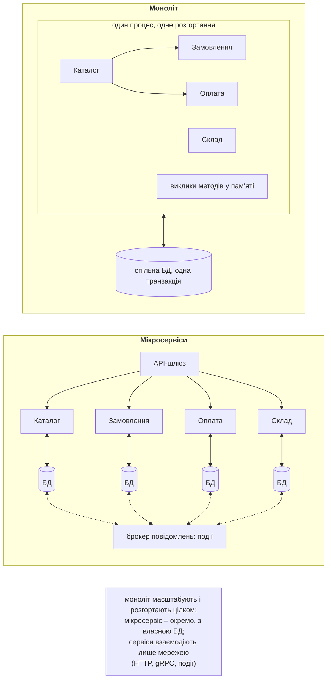
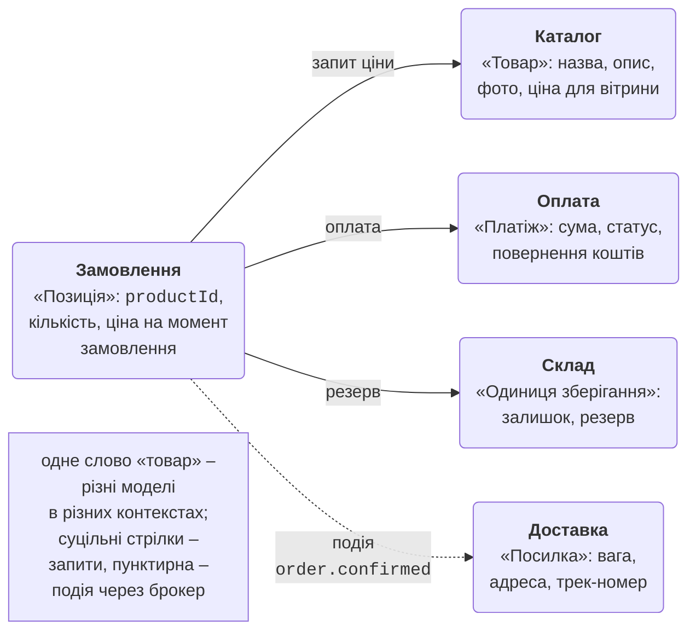
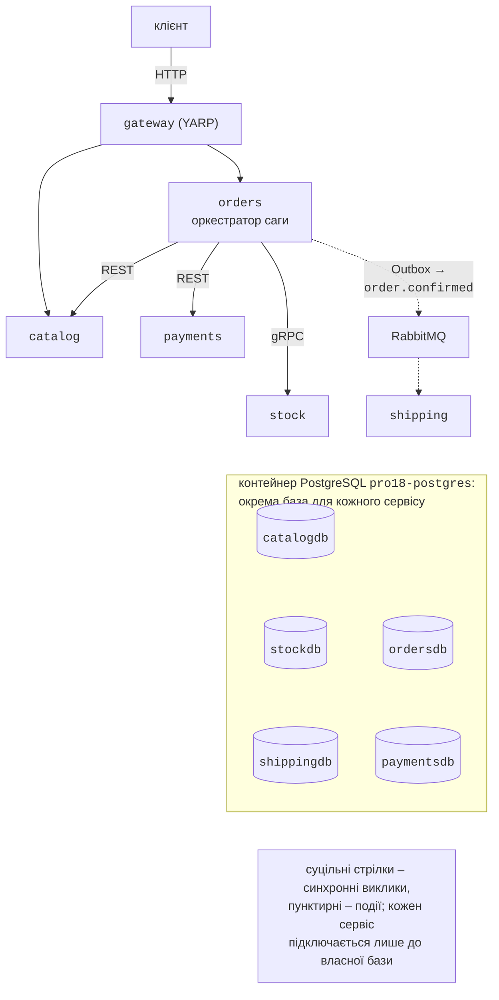

# Моноліт і декомпозиція на сервіси

## Моноліт, модульний моноліт і мікросервіси

У темах 14–17 розглянуто окремі «цеглинки» розподілених систем: віддалені виклики (gRPC), обмін повідомленнями (RabbitMQ), актори й відмовостійкість (Orleans, повтори, запобіжник), контейнери й оркестрацію (Docker, Kubernetes, Aspire). Ця тема поєднує їх в **архітектуру** застосунку з кількох незалежних сервісів і розглядає проблеми, яких немає в одному процесі: узгодженість даних між сервісами, часткові відмови та пошук причини помилки в ланцюжку викликів.

**Моноліт** (*monolith*) – застосунок, який збирається й розгортається як одне ціле: один процес (або кілька однакових копій), одна кодова база, зазвичай одна база даних (рис. 18.1). Модулі викликають один одного звичайними методами, а зміни в кількох таблицях захищає одна транзакція. Моноліт простий у розробці, налагодженні, тестуванні й розгортанні, тому більшість систем починають саме з нього.

Проблеми великого моноліту:

- будь-яка зміна потребує збирання й розгортання всього застосунку, а помилка в одному модулі може зупинити всі;
- масштабувати можна лише весь застосунок, навіть якщо навантаження створює одна функція;
- межі між модулями з часом розмиваються (будь-який код може звернутися до будь-якої таблиці), і великі команди заважають одна одній;
- уся система прив’язана до однієї технології та однієї версії платформи.

**Модульний моноліт** (*modular monolith*) – проміжний варіант: один процес і одне розгортання, але код поділено на модулі з явними межами (окремі проєкти, внутрішні класи, власні схеми бази даних, взаємодія лише через публічні інтерфейси модулів). Він дає більшість переваг чітких меж без ціни розподіленості і полегшує подальше виділення модулів в окремі сервіси.

**Мікросервіси** (*microservices*) – архітектурний стиль, у якому застосунок складається з невеликих автономних сервісів (<https://learn.microsoft.com/azure/architecture/guide/architecture-styles/microservices>):

- кожен сервіс реалізує одну бізнес-можливість і має власні дані, до яких інші сервіси напряму не звертаються;
- сервіси взаємодіють лише через мережу: синхронними викликами (REST, gRPC) або подіями через брокер повідомлень;
- кожен сервіс збирається, тестується, розгортається й масштабується незалежно, а його команда може вибрати власну технологію.



Рис. 18.1. Моноліт і мікросервіси {.caption}

табл. 18.1 порівнює три підходи.

Таблиця 18.1. Моноліт, модульний моноліт і мікросервіси {.caption}

| **Властивість** | **Моноліт** | **Модульний моноліт** | **Мікросервіси** |
| --- | --- | --- | --- |
| розгортання | усе разом | усе разом | кожен сервіс окремо |
| масштабування | увесь застосунок | увесь застосунок | окремі сервіси |
| дані | спільна БД | спільна БД, окремі схеми | база даних на сервіс |
| узгодженість | ACID-транзакції | ACID-транзакції | в кінцевому підсумку, саги |
| виклики | методи в пам’яті | інтерфейси модулів | мережа: затримки, відмови |
| налагодження | один процес | один процес | розподілене трасування |
| інфраструктура | мінімальна | мінімальна | шлюз, брокер, оркестратор, телеметрія |

**Ціна розподіленості.** Кожен виклик між сервісами може тривати довше, завершитися помилкою або тайм-аутом з невідомим результатом; дані різних сервісів неможливо змінити однією транзакцією; потрібні шлюз, брокер, виявлення сервісів, централізовані журнали й трасування, автоматичне розгортання. Хибні припущення розподілених обчислень (тема 14) – «мережа надійна», «затримка нульова» – у мікросервісах перестають бути теорією.

::: tip Коли мікросервіси не потрібні
Невеликій команді (до 5–10 розробників), новому продукту з нестабільними вимогами або системі без окремих навантажених частин мікросервіси зазвичай приносять більше витрат, ніж користі. Типова рекомендація – почати з добре структурованого модульного моноліту і виділяти сервіси тоді, коли з’являється конкретна причина: окрема команда, різні вимоги до масштабування чи надійності, інша технологія. Для поступового виділення використовують патерн **strangler fig** («фікус-душитель», <https://learn.microsoft.com/azure/architecture/patterns/strangler-fig>): шлюз перед монолітом переводить маршрути один за одним на нові сервіси.
:::

## Декомпозиція системи на сервіси

Найскладніше рішення в мікросервісній архітектурі – **де провести межі** сервісів. Погані межі дають сервіси, які не можуть працювати один без одного, змінюються завжди разом і постійно обмінюються дрібними синхронними викликами.

**Декомпозиція за бізнес-можливостями** (*business capabilities*): сервіс відповідає тому, що бізнес **робить** – веде каталог, приймає замовлення, приймає оплату, зберігає товар на складі, доставляє. Технічний поділ («сервіс бази даних», «сервіс валідації», «сервіс звітів для всіх») майже завжди дає сильно зв’язані сервіси.

**Обмежений контекст** (*bounded context*) – поняття предметно-орієнтованого проєктування (DDD, *Domain-Driven Design*): частина предметної області, у межах якої терміни мають одне точне значення і одну модель (<https://learn.microsoft.com/azure/architecture/microservices/model/domain-analysis>). Одне й те саме слово в різних контекстах означає різне (рис. 18.2): «товар» у каталозі – це назва, опис і фото, у замовленні – рядок з кількістю й ціною на момент покупки, на складі – одиниця зберігання із залишком і резервом, у доставці – посилка з вагою. Спроба зробити одну «універсальну» модель товару для всіх сервісів знову створює моноліт, лише розподілений. Добра відправна точка: **один обмежений контекст – один або кілька сервісів**, але не навпаки (<https://learn.microsoft.com/azure/architecture/microservices/model/microservice-boundaries>).



Рис. 18.2. Обмежені контексти інтернет-магазину {.caption}

Ознаки вдалих меж:

- сервіс можна змінити й розгорнути, не змінюючи інших (зміни в межах однієї бізнес-функції зачіпають один сервіс);
- більшість запитів сервіс обробляє власними даними; залежності від інших сервісів нечисленні й переважно асинхронні;
- сервіс має зрозумілого власника – одну команду.

**Розмір сервісу** визначають не рядки коду, а відповідальність: сервіс має бути достатньо малим, щоб його підтримувала одна команда й можна було переписати за кілька тижнів, і достатньо великим, щоб не вимагати розподілених транзакцій для кожної операції. Надто дрібні сервіси (*nanoservices*) множать мережеві виклики й саги.

**Закон Конвея**: організація створює системи, структура яких повторює структуру комунікацій в організації. Тому межі сервісів узгоджують зі структурою команд, а іноді змінюють структуру команд під бажану архітектуру («зворотний маневр Конвея»).

Для зв’язку з чужою або застарілою моделлю (наприклад, з монолітом) використовують **антикорупційний шар** (*anti-corruption layer*, <https://learn.microsoft.com/azure/architecture/patterns/anti-corruption-layer>): адаптер перекладає чужі поняття у власну модель контексту, щоб вона не «протікала» в новий сервіс.

## Застосунок-приклад: інтернет-магазин Shop

Приклади лекції використовують один мікросервісний застосунок `Shop` (рис. 18.3):

- `gateway` – API-шлюз на YARP, єдина точка входу для клієнтів;
- `catalog` – каталог товарів (REST), база `catalogdb`;
- `stock` – склад: резервування товару для замовлення (gRPC, тема 14), база `stockdb`;
- `payments` – оплата й повернення коштів (REST), база `paymentsdb`; платежі понад ліміт картки (50 000 грн) відхиляються;
- `orders` – замовлення (REST), база `ordersdb`; **оркестратор саги** оформлення замовлення і джерело подій `order.confirmed`/`order.cancelled`;
- `shipping` – доставка: служба без HTTP, яка отримує події `order.confirmed` через RabbitMQ (тема 15) і створює відправлення в базі `shippingdb`.



Рис. 18.3. Архітектура застосунку Shop {.caption}

Рішення складається з проєктів `Shop.AppHost` і `Shop.ServiceDefaults` (Aspire, тема 17), шести сервісів, бібліотеки контрактів `Shop.Contracts` і тестового проєкту `Shop.Tests` (рис. 18.4). Інфраструктуру (PostgreSQL і RabbitMQ у контейнерах Docker) і всі проєкти запускає AppHost:

```cs
// Модель мікросервісного застосунку Shop.
IDistributedApplicationBuilder builder =
    DistributedApplication.CreateBuilder(args);

// Один контейнер PostgreSQL, але окрема база для кожного сервісу.
var postgres = builder.AddPostgres("postgres")
    .WithContainerName("pro18-postgres");
var catalogDb = postgres.AddDatabase("catalogdb");
var stockDb = postgres.AddDatabase("stockdb");
var paymentsDb = postgres.AddDatabase("paymentsdb");
var ordersDb = postgres.AddDatabase("ordersdb");
var shippingDb = postgres.AddDatabase("shippingdb");
var rabbitmq = builder.AddRabbitMQ("rabbitmq")
    .WithManagementPlugin()
    .WithContainerName("pro18-rabbitmq");

var catalog = builder.AddProject<Projects.Shop_Catalog>("catalog")
    .WithReference(catalogDb).WaitFor(catalogDb);
var stock = builder.AddProject<Projects.Shop_Stock>("stock")
    .WithReference(stockDb).WaitFor(stockDb);
var payments = builder.AddProject<Projects.Shop_Payments>("payments")
    .WithReference(paymentsDb).WaitFor(paymentsDb)
    .WithEnvironment("Payments__Limit", "50000");

var orders = builder.AddProject<Projects.Shop_Orders>("orders")
    .WithReference(ordersDb).WaitFor(ordersDb)
    .WithReference(rabbitmq).WaitFor(rabbitmq)
    .WithReference(catalog).WithReference(stock)
    .WithReference(payments);

builder.AddProject<Projects.Shop_Shipping>("shipping")
    .WithReference(shippingDb).WaitFor(shippingDb)
    .WithReference(rabbitmq).WaitFor(rabbitmq);

builder.AddProject<Projects.Shop_Gateway>("gateway")
    .WithReference(catalog).WithReference(orders)
    .WithExternalHttpEndpoints();

builder.Build().Run();
```

- `AddPostgres` запускає **один** контейнер PostgreSQL (образ `postgres:18.3`), а `AddDatabase` створює в ньому окрему базу для кожного сервісу (<https://aspire.dev/integrations/databases/postgres/postgres-get-started/>). Це компроміс для розробки: логічно бази незалежні (сервіс отримує рядок підключення лише до своєї), а в експлуатації їх можна розмістити на різних серверах без змін коду;
- `WithReference(catalog)` передає сервісу `orders` адресу каталогу для виявлення сервісів;
- `WithEnvironment` задає параметр конфігурації (`Payments:Limit`);
- `WithContainerName` дає контейнерам постійні імена `pro18-postgres` і `pro18-rabbitmq`, щоб звертатися до них командами `docker` під час експериментів.

У кожен сервіс додано посилання на `Shop.ServiceDefaults` і виклик `builder.AddServiceDefaults()` (OpenTelemetry, перевірки стану, виявлення сервісів, стійкість HTTP-клієнтів), а у файлах `launchSettings.json` залишено лише профіль `http` з фіксованими портами 5100–5104 (як у темі 17, профіль `https` потребує довіреного сертифіката розробника). Пакети: `Yarp.ReverseProxy` 2.3.0 і `Microsoft.Extensions.ServiceDiscovery.Yarp` 10.10.0 (шлюз), `Aspire.Npgsql.EntityFrameworkCore.PostgreSQL` 13.5.4 (EF Core 10 для PostgreSQL), `Aspire.RabbitMQ.Client` 13.5.4 (`RabbitMQ.Client` 7), `Grpc.AspNetCore` 2.83.0 і `Grpc.Net.ClientFactory` 2.83.0.

::: info Знімок екрана
Rider → Solution Explorer: Shop.AppHost, Shop.ServiceDefaults, Shop.Contracts, Shop.Gateway, Shop.Catalog, Shop.Stock, Shop.Payments, Shop.Orders, Shop.Shipping, Shop.Tests; AppHost.cs open in the editor
:::

Рис. 18.4. Рішення Shop у JetBrains Rider {.caption}

Запуск `aspire start` (або проєкту `Shop.AppHost` з IDE) у теці рішення і перевірка `aspire describe` (фрагмент; посилання на дашборд вилучено, адреси `http://localhost` скорочено):

```
Name       Type                      State    Health   URLs
catalog    Project                   Running  Healthy  :5101
catalogdb  PostgresDatabaseResource  Running  Healthy  -
gateway    Project                   Running  Healthy  :5100
orders     Project                   Running  Healthy  :5104
ordersdb   PostgresDatabaseResource  Running  Healthy  -
payments   Project                   Running  Healthy  :5103
postgres   Container                 Running  Healthy  tcp://…:55766
rabbitmq   Container                 Running  Healthy  http://…:55765
shipping   Project                   Running  Healthy  -
stock      Project                   Running  Healthy  :5102
…
```

Від `aspire start` до готовності шлюзу минає 15–25 с (образи вже завантажено): Aspire спочатку чекає, доки PostgreSQL і RabbitMQ стануть здоровими (`WaitFor`), потім запускає проєкти. Ресурси, їхні стани, журнали й змінні середовища видно в дашборді (рис. 18.5).

::: info Знімок екрана
Browser, Aspire dashboard → Resources (table view, light theme): gateway, catalog, stock, payments, orders, shipping (Project), postgres, rabbitmq (Container) and the five databases, all Running / Healthy, with URLs 5100–5104
:::

Рис. 18.5. Ресурси застосунку Shop у дашборді Aspire {.caption}

Перевірка трьома замовленнями через шлюз (сценарій `orders.ps1`):

```powershell
# Три замовлення через шлюз: успішне, відмова оплати, нестача товару.
$gw = "http://localhost:5100/api/orders"
$orders = @(
    @{ customer = "olena"
       lines = @(@{ productId = 1; quantity = 1 },
                 @{ productId = 2; quantity = 2 }) },
    @{ customer = "petro"
       lines = @(@{ productId = 1; quantity = 2 }) },
    @{ customer = "ivan"
       lines = @(@{ productId = 2; quantity = 50 }) }
)
foreach ($o in $orders) {
    $r = Invoke-RestMethod -Method Post $gw `
        -ContentType "application/json" `
        -Body ($o | ConvertTo-Json -Depth 3)
    "{0,-6} {1,7} грн  {2,-9} {3}" -f $r.customer, $r.total,
        $r.status, $r.reason
}
```

```
olena    33300 грн  Confirmed
petro    64000 грн  Cancelled оплату відхилено
ivan     32500 грн  Cancelled склад: товару 2 недостатньо
```

Перше замовлення пройшло всі кроки, друге перевищило ліміт картки (платіж відхилено, резерв товару знято), третє зупинилося вже на складі (мишей лише 5). Як саме сервіси домовилися про цей результат без спільної транзакції, розглянуто в розділах про сагу й Outbox.
