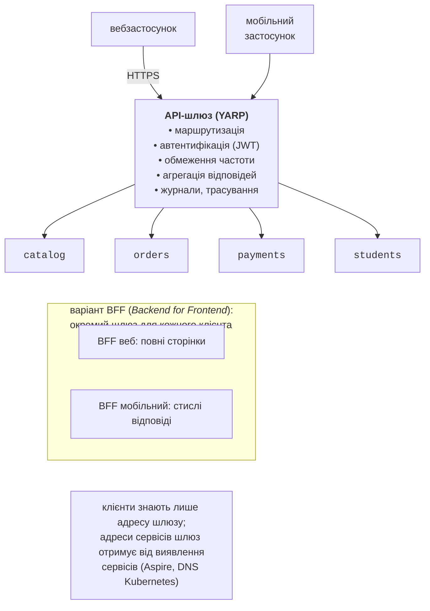

# Взаємодія сервісів і API-шлюз

## Взаємодія сервісів

**Синхронна взаємодія** (*request–response*): клієнт надсилає запит і чекає відповіді – REST (HTTP + JSON) або gRPC (HTTP/2 + Protocol Buffers, тема 14). Вона проста й зрозуміла, відповідь приходить одразу, але клієнт залежить від доступності й швидкості сервера. У Shop синхронно `orders` отримує ціни з каталогу, резервує товар у `stock` і проводить оплату.

**Асинхронна взаємодія** (*event-driven*): сервіс публікує **подію** (*event*) – факт, що вже відбувся («замовлення підтверджено»), – у брокер, а зацікавлені сервіси обробляють її, коли зможуть (тема 15). Видавець не знає своїх споживачів і не чекає на них; споживач може бути тимчасово недоступним. Ціна – **узгодженість в кінцевому підсумку** і складніше налагодження. Розрізняють **події** («сталося X», один видавець, багато споживачів) і **команди** («зроби Y», один конкретний отримувач).

**Доступність ланцюжка синхронних викликів.** Якщо запит проходить через $n$ сервісів, кожен з яких доступний з імовірністю $p$, то весь запит успішний з імовірністю $p^{n}$. Для $p = 0 , 99$ і $n = 5$ маємо $0 , 99^{5} \approx 0 , 95$: п’ять «надійних» сервісів дають 5 % невдалих запитів. Затримки теж складаються. Тому довгі ланцюжки синхронних викликів – ознака поганої декомпозиції; те, що не потрібно клієнтові негайно, передають подіями.

**Хореографія та оркестрація** – два способи координувати процес з кількох кроків у різних сервісах (докладно в розділі про саги):

- **хореографія** (*choreography*): кожен сервіс реагує на події інших і публікує власні; центрального керівника немає;
- **оркестрація** (*orchestration*): окремий компонент (оркестратор) надсилає команди сервісам і вирішує, що робити далі.

**Контракти.** Сервіси домовляються про формат запитів і подій, а не про внутрішні класи. У Shop спільна бібліотека `Shop.Contracts` містить **лише** записи подій і константи ключів маршрутизації:

```cs
namespace Shop.Contracts;

// Контракти подій, якими обмінюються сервіси через RabbitMQ.
// Спільна бібліотека містить лише контракти, без логіки.
public record OrderLine(int ProductId, int Quantity);

public record OrderConfirmed(Guid OrderId, string Customer,
    decimal Total, OrderLine[] Lines);

public record OrderCancelled(Guid OrderId, string Reason);

public static class Events
{
    public const string Exchange = "shop.events";     // topic
    public const string Confirmed = "order.confirmed"; // ключі
    public const string Cancelled = "order.cancelled";
}
```

Спільні бібліотеки з бізнес-логікою чи сутностями бази даних створюють жорсткий зв’язок: зміна в бібліотеці вимагає одночасного оновлення всіх сервісів. Альтернатива спільній бібліотеці – опис контрактів (`.proto`, OpenAPI, JSON Schema), з якого кожен сервіс генерує власні класи. Так зроблено для gRPC: файл `stock.proto` лежить у проєкті `Shop.Stock`, а `Shop.Orders` підключає його з атрибутом `GrpcServices="Client"`:

```proto
syntax = "proto3";
option csharp_namespace = "Shop.Stock";
package stock;

// Резервування товарів на складі (ідемпотентне за order_id).
service Inventory {
  rpc Reserve (ReserveRequest) returns (ReserveReply);
  rpc Release (ReleaseRequest) returns (ReleaseReply);
}

message Line {
  int32 product_id = 1;
  int32 quantity = 2;
}
message ReserveRequest {
  string order_id = 1;
  repeated Line lines = 2;
}
message ReserveReply {
  bool ok = 1;
  string reason = 2;
}
message ReleaseRequest {
  string order_id = 1;
}
message ReleaseReply {
  int32 released = 1;
}
```

## API-шлюз і BFF

Якщо клієнти (веб, мобільний застосунок, інші системи) звертаються до сервісів напряму, вони мусять знати адреси всіх сервісів, кожен сервіс сам перевіряє автентифікацію й обмежує частоту запитів, а будь-яка зміна меж сервісів ламає клієнтів. **API-шлюз** (*API gateway*) – єдина точка входу, яка приймає всі зовнішні запити й передає їх сервісам (<https://learn.microsoft.com/azure/architecture/microservices/design/gateway>, рис. 18.6). Типові функції шлюзу:

- **маршрутизація** (*gateway routing*): `/api/orders/…` → сервіс `orders`, `/api/products/…` → `catalog`;
- **автентифікація й авторизація**: перевірка токена JWT один раз на вході;
- **обмеження частоти** (*rate limiting*) і квоти;
- **агрегація** (*gateway aggregation*): один запит клієнта → кілька запитів до сервісів → одна відповідь;
- **вивантаження** спільних задач: TLS, стиснення, кешування, журнали, трасування.



Рис. 18.6. API-шлюз і варіант BFF {.caption}

**BFF** (*Backend for Frontend*, <https://learn.microsoft.com/azure/architecture/patterns/backends-for-frontends>): окремий шлюз для кожного типу клієнта. Мобільному застосунку потрібні стислі відповіді й мало запитів, вебзастосунку – повні дані сторінки; один універсальний шлюз швидко стає «новим монолітом» з логікою всіх клієнтів.

### YARP

**YARP** (*Yet Another Reverse Proxy*, <https://learn.microsoft.com/aspnet/core/fundamentals/servers/yarp/yarp-overview>) – бібліотека зворотного проксі від Microsoft на основі ASP.NET Core (пакет `Yarp.ReverseProxy`, версія 2.3.0). Шлюз – звичайний вебзастосунок, тому в ньому доступні весь конвеєр ASP.NET Core (автентифікація, обмеження частоти, власний код) і налагодження в IDE. Шлюз Shop (`Program.cs`):

```cs
using System.Threading.RateLimiting;

// API-шлюз: єдина точка входу для клієнтів.
WebApplicationBuilder builder = WebApplication.CreateBuilder(args);
builder.AddServiceDefaults();
builder.Services.AddReverseProxy()
    .LoadFromConfig(builder.Configuration.GetSection("ReverseProxy"))
    .AddServiceDiscoveryDestinationResolver(); // http://orders

// Обмеження частоти: 10 запитів за секунду з однієї IP-адреси.
builder.Services.AddRateLimiter(o =>
{
    o.RejectionStatusCode = StatusCodes.Status429TooManyRequests;
    o.AddPolicy("per-ip", ctx => RateLimitPartition
        .GetFixedWindowLimiter(
        ctx.Connection.RemoteIpAddress?.ToString() ?? "unknown",
        _ => new FixedWindowRateLimiterOptions
        {
            PermitLimit = 10,
            Window = TimeSpan.FromSeconds(1),
        }));
});

WebApplication app = builder.Build();
app.MapDefaultEndpoints();
app.UseRateLimiter();
app.MapReverseProxy();
app.Run();
```

Маршрути й кластери описано в `appsettings.json` (<https://learn.microsoft.com/aspnet/core/fundamentals/servers/yarp/config-files>):

```json
{
  "Logging": {
    "LogLevel": {
      "Default": "Information",
      "Microsoft.AspNetCore": "Warning",
      "Yarp": "Warning",
      "Microsoft.EntityFrameworkCore": "Warning"
    }
  },
  "AllowedHosts": "*",
  "ReverseProxy": {
    "Routes": {
      "catalog": {
        "ClusterId": "catalog",
        "Match": {
          "Path": "/api/products/{**rest}"
        },
        "Transforms": [
          {
            "PathPattern": "/products/{**rest}"
          }
        ]
      },
      "orders": {
        "ClusterId": "orders",
        "RateLimiterPolicy": "per-ip",
        "Match": {
          "Path": "/api/orders/{**rest}"
        },
        "Transforms": [
          {
            "PathPattern": "/orders/{**rest}"
          }
        ]
      }
    },
    "Clusters": {
      "catalog": {
        "Destinations": {
          "d1": {
            "Address": "http://catalog"
          }
        }
      },
      "orders": {
        "Destinations": {
          "d1": {
            "Address": "http://orders"
          }
        }
      }
    }
  }
}
```

- **маршрут** (*route*) визначає, які запити обробляти (`Match.Path`), куди їх передати (`ClusterId`) і як змінити (`Transforms`): `PathPattern` перетворює `/api/orders/…` на `/orders/…`; також задає політики `AuthorizationPolicy` і `RateLimiterPolicy`;
- **кластер** (*cluster*) – група адрес призначення (*destinations*) одного сервісу; якщо адрес кілька, YARP балансує між ними й може перевіряти їхній стан;
- адреса `http://orders` – логічне ім’я: `AddServiceDiscoveryDestinationResolver()` з пакета `Microsoft.Extensions.ServiceDiscovery.Yarp` перетворює його на реальну адресу зі змінної `services__orders__http__0=http://localhost:5104`, яку передав AppHost.

Перевірка обмеження частоти: 60 замовлень вісьмома паралельними задачами (програма `OrderLoad`, яка надсилає POST-запити і групує відповіді):

```
Результат            к-сть  сер., мс макс., мс
Confirmed               10       201       271
HTTP 429                50         0         2
Усього 60 за 0,3 с
```

Шлюз пропустив 10 запитів за вікно в 1 с, а решту відхилив за частки мілісекунди кодом `429 Too Many Requests`, не навантажуючи сервіс замовлень. Під час перевірки з паузою 120 мс між запитами (≈ 8 запитів за секунду) відхилень не було. Ключ розділу (*partition key*) тут – IP-адреса; для автентифікованих клієнтів його беруть з токена (лабораторна робота 18, приклад 2).

Скільки коштує додатковий «стрибок» через шлюз? 300 запитів `GET /products/2` через шлюз і напряму до `catalog`, три серії: медіана 3,4–3,8 мс через шлюз проти 3,2–3,5 мс напряму, тобто YARP додав ≈ 0,3 мс. Для замовлення (≈ 28 мс усієї саги) різниці не видно.

::: tip YARP в Aspire
Aspire має і хостингову інтеграцію YARP (`aspire add yarp`, <https://aspire.dev/integrations/reverse-proxies/yarp/>): `builder.AddYarp("gateway")` запускає готовий контейнер YARP, а маршрути задаються кодом C# в AppHost (`.WithConfiguration(y => y.AddRoute("/api/{**catch-all}", orders))`). Це зручно, коли шлюзу потрібна лише маршрутизація. Власний проєкт на `Yarp.ReverseProxy`, як у Shop, потрібен для автентифікації, обмеження частоти, агрегації та іншого коду.
:::

Шлюз не повинен повторювати POST-запити замість клієнта: YARP використовує власний `HttpMessageInvoker`, а не `IHttpClientFactory`, тому конвеєр стійкості з ServiceDefaults до проксованих запитів не застосовується (тайм-аути YARP задають у маршрутах, <https://learn.microsoft.com/aspnet/core/fundamentals/servers/yarp/timeouts>).

## Виявлення сервісів і конфігурація

Сервіси запускаються й зупиняються динамічно, тому їхні адреси не прописують у коді. **Виявлення сервісів** (*service discovery*) перетворює логічне ім’я (`catalog`) на адресу (<https://learn.microsoft.com/dotnet/core/extensions/service-discovery>):

- **Aspire** під час розробки передає адреси змінними середовища. Для `orders` це `services__catalog__http__0=http://localhost:5101`, `services__stock__http__0=…`, `services__payments__http__0=…`, а також рядки підключення `ConnectionStrings__ordersdb` і `ConnectionStrings__rabbitmq` (<https://aspire.dev/fundamentals/service-discovery/>);
- бібліотека `Microsoft.Extensions.ServiceDiscovery` (її підключає `AddServiceDefaults`) читає ці значення з конфігурації, тому в коді досить `new Uri("http://catalog")`; клієнт gRPC працює так само;
- у **Kubernetes** (тема 17) ім’я `catalog` розв’язує DNS кластера: Service `catalog` у тому самому просторі імен. Код сервісу не змінюється.

**Конфігурація** сервісу складається з файлів `appsettings.json`, змінних середовища (у контейнерах – ConfigMap і Secret) і секретів користувача під час розробки; змінні середовища мають вищий пріоритет, а подвійне підкреслення замінює двокрапку (`Payments__Limit` → `Payments:Limit`). Паролі баз даних і брокера AppHost генерує сам і зберігає в секретах користувача, тому їх немає в коді й у репозиторії. Кожен сервіс має також **перевірки стану** (*health checks*): `AddServiceDefaults` додає `/health` і `/alive` (у середовищі `Development`), а клієнтські інтеграції Aspire – перевірки PostgreSQL і RabbitMQ (<https://aspire.dev/fundamentals/health-checks/>). Стан `Healthy` у таблиці `aspire describe` отримано саме з них.
