# Спостережуваність, версіонування та розгортання

## Спостережуваність

У монолітній системі помилку шукають у журналі одного процесу. У мікросервісах запит проходить через шлюз, кілька сервісів, базу даних і брокер, і лише **спостережуваність** (*observability*) дозволяє відповісти, що відбулося і де. Три сигнали OpenTelemetry (тема 17, <https://opentelemetry.io/docs/languages/dotnet/>):

- **журнали** – структуровані записи `ILogger` з ідентифікатором трасування (*trace id*) в кожному записі, тому журнали всіх сервісів для одного запиту фільтруються разом;
- **метрики** – кількісні показники: запити за секунду, затримки, помилки (модель RED: *rate, errors, duration*), власні бізнес-метрики;
- **розподілене трасування** (*distributed tracing*, <https://learn.microsoft.com/dotnet/core/diagnostics/distributed-tracing>) – дерево спанів одного запиту через усі сервіси.

**Кореляція запитів.** Контекст трасування передається між процесами (<https://opentelemetry.io/docs/concepts/context-propagation/>): HTTP-заголовком `traceparent` за стандартом W3C Trace Context (<https://www.w3.org/TR/trace-context/>) (`00-2ff068e1840b42399cec561d7108b3e2-6fe610d0a3150b72-01`: версія, ідентифікатор трасування, ідентифікатор батьківського спану, прапорці), метаданими gRPC (це теж заголовки HTTP/2) і заголовками повідомлень RabbitMQ. Інструментування ASP.NET Core, `HttpClient`, Npgsql і `RabbitMQ.Client` додають і читають ці заголовки самі.

Складність виникає там, де між запитом і повідомленням є «розрив», як в Outbox: подію публікує фонова служба через півсекунди, і без додаткових дій вона почала б **нове** трасування. Тому `OutboxMessage.From` зберігає `Activity.Current?.Id` (значення `traceparent`) у стовпці `TraceParent`, а ретранслятор створює спан `outbox relay` з цим батьківським контекстом. Публікація й обробка події стають частиною того самого трасування.

Трасування одного замовлення (прогрітий застосунок, дані `aspire otel traces gateway --format Json`, час від початку запиту):

```
   0,0 мс  41 мс gateway   POST /api/orders/{**rest}
   0,8 мс  40 мс orders    POST /orders
   6,7 мс   3 мс orders    GET (клієнт catalog)
   7,1 мс   2 мс catalog   GET /products/{id:int}
   7,5 мс   1 мс catalog   postgresql
  16,5 мс  25 мс orders    order saga
  16,6 мс  10 мс orders    POST (клієнт gRPC)
  17,1 мс   9 мс stock     POST /stock.Inventory/Reserve
  30,9 мс   5 мс payments  POST /payments
  37,2 мс   1 мс orders    postgresql (статус + Outbox)
 490,4 мс  11 мс orders    outbox relay
 490,4 мс   0 мс orders    publish order.confirmed
 497,2 мс   8 мс shipping  deliver order.confirmed
 499,6 мс   1 мс shipping  postgresql (Inbox + Shipments)
…
```

Одне трасування містить **31 спан** у шести сервісах: HTTP-запити, gRPC-виклик, 16 SQL-запитів у п’яти базах, публікацію в RabbitMQ і обробку події (рис. 18.13). Видно, що клієнт отримав відповідь через 41 мс, сама сага тривала 25 мс, а подія дійшла до доставки через ≈ 0,5 с – це інтервал опитування таблиці `Outbox`. На сторінці *Traces* дашборду Aspire те саме подано діаграмою Ганта (рис. 18.14), а трасування відхиленого замовлення позначене як помилкове (спан клієнта отримав відповідь 402).

```mermaid
gantt
  title trace id 2ff068e1… – спільний для всіх спанів. Час від початку запиту, мс. HTTP-відповідь готова через 41 мс, подію опубліковано через ≈ 0,5 с (інтервал опитування Outbox)
  dateFormat x
  axisFormat %-L
  tickInterval 50millisecond
  section синхронна частина
    gateway – POST /api/orders : 0, 41
    ↳ orders – POST /orders : 1, 41
    ↳↳ catalog – GET ×2 : 7, 12
    ↳↳ orders – order saga : 16, 41
    ↳↳↳ stock – Reserve (gRPC) : 17, 26
    ↳↳↳ payments – POST /payments : 31, 36
  section асинхронна частина
    ↳ orders – outbox relay : 490, 501
    ↳↳ orders – publish : 490, 491
    ↳↳ shipping – deliver : 497, 505
```



Рис. 18.13. Розподілене трасування оформлення замовлення {.caption}

::: info Знімок екрана
Aspire dashboard → Traces → trace `gateway: POST /api/orders/{**rest}` (31 spans) opened: waterfall with gateway, orders (order saga, outbox relay, publish order.confirmed), catalog, stock (POST /stock.Inventory/Reserve), payments and shipping (deliver order.confirmed) spans; resource colours legend visible
:::

Рис. 18.14. Трасування саги оформлення замовлення в дашборді Aspire {.caption}

**Власні метрики.** Клас `OrderMetrics` публікує лічильник завершених саг `shop.sagas` з міткою `status`, гістограму тривалості `shop.saga.duration` і датчик `shop.outbox.pending` (кількість неопублікованих подій – корисний сигнал тривоги: якщо він росте, ретранслятор не встигає або брокер недоступний):

```cs
using System.Diagnostics.Metrics;

namespace Shop.Orders;

// Власні метрики сервісу замовлень (лічильник Shop.Orders).
public class OrderMetrics
{
    public const string Name = "Shop.Orders";
    readonly Counter<long> sagas;
    readonly Histogram<double> duration;
    public int OutboxPending;          // оновлює OutboxRelay

    public OrderMetrics(IMeterFactory factory)
    {
        Meter meter = factory.Create(Name);
        sagas = meter.CreateCounter<long>("shop.sagas",
            description: "Завершені саги за результатом");
        duration = meter.CreateHistogram<double>("shop.saga.duration",
            unit: "ms", description: "Тривалість саги");
        meter.CreateObservableGauge("shop.outbox.pending",
            () => OutboxPending, description: "Неопубліковані події");
    }

    public void Finished(OrderStatus status, double ms)
    {
        KeyValuePair<string, object?> tag = new("status",
            status.ToString());
        sagas.Add(1, tag);
        duration.Record(ms, tag);
    }
}
```

Метрики видно на сторінці *Metrics* дашборду або утилітою `dotnet-counters` (<https://learn.microsoft.com/dotnet/core/diagnostics/dotnet-counters>): `dotnet-counters collect -n Shop.Orders --counters Shop.Orders --format csv`. За 20 с (31 підтверджене і 2 скасовані замовлення) отримано:

```
shop.sagas (Count / 5 sec)[status=Confirmed]              23
shop.sagas (Count / 5 sec)[status=Cancelled]               2
shop.saga.duration (ms)[status=Confirmed;Percentile=50]   21,1
shop.saga.duration (ms)[status=Confirmed;Percentile=95]   28,5
shop.outbox.pending                                        0
```

**Практики спостережуваності:** єдиний ідентифікатор трасування в журналах і відповідях про помилки; структуровані журнали без персональних даних; метрики RED для кожного сервісу й черги; сигнали тривоги за ознаками для користувача (частка помилок, затримка), а не за кожним винятком; перевірки стану, які відрізняють «живий» від «готовий» (тема 17). У виробничому середовищі телеметрію надсилають не в дашборд Aspire, а в систему спостереження (Azure Monitor, Grafana з Prometheus, Loki й Tempo, Jaeger, Elastic).

## Версіонування API й тестування

### Версіонування API і контрактів

Сервіси розгортаються незалежно, тому старі й нові версії працюють одночасно. Правила **зворотної сумісності** (<https://learn.microsoft.com/azure/architecture/best-practices/api-design>):

- додавати поля можна (старі клієнти їх ігнорують), видаляти, перейменовувати й змінювати тип – не можна без нової версії;
- нові обов’язкові поля в запитах ламають старих клієнтів; нові поля мають типові значення;
- несумісні зміни оформлюють **новою версією** API: у шляху (`/api/v2/orders`), у заголовку чи параметрі запиту (бібліотека `Asp.Versioning`, <https://github.com/dotnet/aspnet-api-versioning>); стару версію підтримують, доки нею користуються клієнти;
- у Protocol Buffers не змінюють номери полів і не використовують повторно номери видалених полів (`reserved`).

Для **подій** правила ще суворіші: повідомлення можуть лежати в черзі годинами, а події, збережені в Outbox чи журналі, читатимуть і через рік. Споживач має бути **толерантним** (*tolerant reader*): ігнорувати невідомі поля й мати типові значення для відсутніх. Несумісну зміну публікують як новий тип події (`order.confirmed.v2`), і деякий час видавець надсилає обидві версії.

### Контрактні й інтеграційні тести

- **Модульні тести** перевіряють логіку сервісу без мережі (наприклад, переходи станів саги з фіктивними клієнтами).
- **Контрактні тести** (*consumer-driven contracts*) перевіряють, що постачальник API задовольняє очікування кожного споживача: споживач записує очікувані запити й відповіді в **контракт**, а конвеєр збирання постачальника перевіряє себе на всіх контрактах. Найвідоміший інструмент – Pact (<https://docs.pact.io/>), для .NET – PactNet. Так несумісну зміну виявляють до розгортання, без запуску всієї системи.
- **Інтеграційні тести** запускають справжні сервіси з реальними залежностями. Пакет `Aspire.Hosting.Testing` (<https://aspire.dev/testing/overview/>) запускає весь AppHost разом із контейнерами PostgreSQL і RabbitMQ з тестового проєкту (шаблон `aspire-xunit`, посилання на проєкт AppHost).

Тести Shop (xUnit, `Shop.Tests`; пакет `Npgsql` для перевірки бази доставки):

```cs
using Aspire.Hosting;

namespace Shop.Tests;

// Один запуск застосунку (контейнери й сервіси) на клас тестів.
public class ShopFixture : IAsyncLifetime
{
    public DistributedApplication App { get; private set; } = null!;

    public async Task InitializeAsync()
    {
        var host = await DistributedApplicationTestingBuilder
            .CreateAsync<Projects.Shop_AppHost>();
        App = await host.BuildAsync();
        await App.StartAsync();
        using CancellationTokenSource cts =
            new(TimeSpan.FromMinutes(3));
        string[] resources = ["gateway", "orders", "shipping"];
        foreach (string r in resources)
            await App.ResourceNotifications
                .WaitForResourceHealthyAsync(r, cts.Token);
    }

    public async Task DisposeAsync() => await App.DisposeAsync();
}
```

```cs
using System.Net.Http.Json;
using System.Text.Json;
using Npgsql;

namespace Shop.Tests;

public class OrderTests(ShopFixture shop) : IClassFixture<ShopFixture>
{
    [Fact]
    public async Task ConfirmedOrderCreatesShipment()
    {
        HttpClient gateway = shop.App.CreateHttpClient("gateway");
        var resp = await gateway.PostAsJsonAsync("/api/orders", new
        {
            customer = "test",
            lines = new[] { new { productId = 2, quantity = 1 } },
        });
        Assert.Equal(HttpStatusCode.Created, resp.StatusCode);
        JsonElement order = await resp.Content
            .ReadFromJsonAsync<JsonElement>();
        Assert.Equal("Confirmed",
            order.GetProperty("status").GetString());

        // Подія йде через Outbox і RabbitMQ: чекаємо до 15 с.
        string? cs =
            await shop.App.GetConnectionStringAsync("shippingdb");
        await using var db = new NpgsqlConnection(cs);
        await db.OpenAsync();
        await using var cmd = new NpgsqlCommand(
            """
            select count(*) from "Shipments" where "OrderId" = @id
            """,
            db);
        cmd.Parameters.AddWithValue("id",
            order.GetProperty("id").GetGuid());
        long count = 0;
        for (int i = 0; i < 30 && count == 0; i++)
        {
            await Task.Delay(500);
            count = (long)(await cmd.ExecuteScalarAsync())!;
        }
        Assert.Equal(1, count);
    }

    [Fact]
    public async Task DeclinedPaymentCancelsOrder()
    {
        HttpClient gateway = shop.App.CreateHttpClient("gateway");
        var resp = await gateway.PostAsJsonAsync("/api/orders", new
        {
            customer = "test",       // 2 × 32 000 грн > ліміту 50 000
            lines = new[] { new { productId = 1, quantity = 2 } },
        });
        JsonElement order = await resp.Content
            .ReadFromJsonAsync<JsonElement>();
        Assert.Equal("Cancelled",
            order.GetProperty("status").GetString());
        Assert.Equal("оплату відхилено",
            order.GetProperty("reason").GetString());
    }
}
```

- `DistributedApplicationTestingBuilder.CreateAsync<Projects.Shop_AppHost>()` будує ту саму модель застосунку, що й `aspire start`; фікстура запускає її один раз для класу тестів;
- `CreateHttpClient("gateway")` дає клієнта з адресою ресурсу, `GetConnectionStringAsync` – рядок підключення до бази з тестовим паролем;
- асинхронний результат (відправлення через Outbox і RabbitMQ) перевіряють опитуванням з обмеженим часом, а не фіксованою паузою.

Запуск `dotnet test`:

```
Passed!  - Failed:     0, Passed:     2, Skipped:     0, Total:     2,
Duration: 4 s - Shop.Tests.dll (net10.0)
```

Разом із запуском контейнерів і сервісів тести тривали 22 с (образи вже завантажено). Під час запуску в журналі видно тимчасові помилки `connection.start was never received` від клієнтів RabbitMQ: брокер ще приймав з’єднання, а автоматичні повтори інтеграції Aspire їх подолали.

## Розгортання мікросервісів

Кожен сервіс – окремий образ контейнера зі своїм циклом збирання й тестування (тема 17): `dotnet publish /t:PublishContainer` або `Dockerfile`, реєстр образів, Deployment і Service у Kubernetes для кожного сервісу, ConfigMap і Secret для конфігурації, проби готовності й життєздатності, HPA для навантажених сервісів. Брокер і бази даних в експлуатації зазвичай беруть керовані (хмарні служби) або розгортають окремо зі стійкими томами. AppHost Shop можна опублікувати тими самими командами, що й у темі 17: `aspire publish` у файли Docker Compose чи діаграму Helm (<https://aspire.dev/deployment/docker-compose/>).

Незалежне розгортання вимагає стратегій, за яких нова версія сервісу не зупиняє систему:

- **поступове оновлення** (*rolling update*): поди нової версії замінюють старі по одному (тема 17);
- **blue–green**: нова версія («зелена») розгортається поруч зі старою («синьою») і отримує трафік лише після перевірки; перемикання й відкат – миттєва зміна маршруту в шлюзі чи Service;
- **canary** («канарка»): нова версія спочатку отримує невелику частку трафіку (1–5 %); якщо метрики помилок і затримок у нормі, частку збільшують. Розподіл трафіку виконують шлюз (YARP підтримує маршрутизацію за заголовками й вагами, <https://learn.microsoft.com/aspnet/core/fundamentals/servers/yarp/ab-testing>), service mesh або контролер вхідного трафіку;
- **прапорці функцій** (*feature flags*): код нової функції розгортається вимкненим і вмикається конфігурацією.

Для всіх стратегій потрібні сумісні контракти (попередній розділ) і міграції бази даних, сумісні з обома версіями коду (спочатку додати стовпець, потім перейти на нього, лише потім видалити старий).

## Типові помилки

Таблиця 18.3. Типові помилки мікросервісної архітектури {.caption}

| **Проблема** | **Причина та виправлення** |
| --- | --- |
| **розподілений моноліт**: сервіси розгортаються лише разом | межі за технічними шарами, спільні бібліотеки з логікою, синхронні ланцюжки; межі за бізнес-можливостями, події, контракти замість спільного коду |
| **спільна база даних** кількох сервісів | зміна схеми ламає чужі сервіси; база на сервіс, дані інших – через API або події |
| довгий ланцюжок синхронних викликів: повільно й часто падає | доступність $p^{n}$; асинхронні події, локальні копії даних, агрегація в шлюзі |
| подія втрачається або публікується для невідбутої зміни | подвійний запис у БД і брокер; Transactional Outbox |
| дублікати обробки (дві доставки, два платежі) | доставка «щонайменше один раз»; Inbox, ключі ідемпотентності, унікальні індекси |
| сага «зависла» після аварії процесу | стан саги лише в пам’яті; зберігати статус після кожного кроку, служба відновлення |
| компенсація не спрацювала, бо сервіс недоступний | повторювати компенсації до успіху (`Compensating` + `SagaRecovery`), ідемпотентні кроки |
| `does not support user-initiated transactions` | повтори EF Core з Aspire; власну транзакцію виконувати через `CreateExecutionStrategy()` |
| ретранслятор Outbox «застряг» з `312 NO_ROUTE` | `mandatory: true` для події без підписників; публікувати з `mandatory: false` |
| запит «висить» десятки секунд, коли сервіс зупинено | немає тайм-аутів або типові 30 с; тайм-аути спроби й виклику, запобіжник |
| налаштування `…-standard` не впливають на клієнт | типовий конвеєр з ServiceDefaults має спільне ім’я; `RemoveAllResilienceHandlers()` і власний конвеєр для клієнта |
| після `RemoveAllResilienceHandlers()` клієнт чекає нескінченно | стандартний обробник вимикає `HttpClient.Timeout`; явно задати `Timeout` (лабораторна робота 18, приклад 3) |
| ланцюжок подій в Outbox починає нове трасування | зберігати `traceparent` у рядку Outbox і відновлювати батьківський контекст |
| сотні трасувань з одним SQL-запитом опитування | фонове опитування таблиці; `SuppressInstrumentationScope` або менша частота |
| нова версія сервісу ламає споживачів | несумісна зміна контракту; лише додавати поля, версіонувати API й події, контрактні тести |
