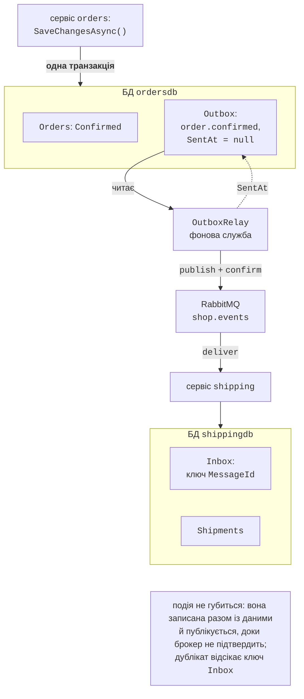
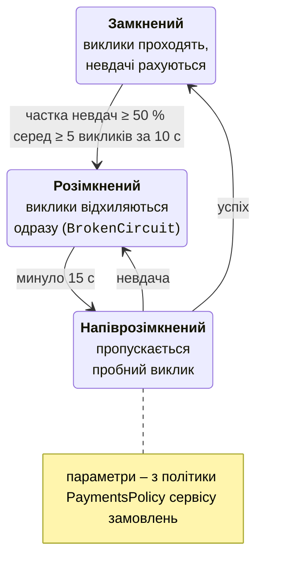

# Outbox, Inbox і стійкість

## Transactional Outbox та Inbox

Після підтвердження замовлення сервіс має зробити дві речі: змінити статус у своїй базі і опублікувати подію в RabbitMQ. Це **подвійний запис** (*dual write*): жодна транзакція не охоплює і базу, і брокер. Якщо спочатку записати в базу, а процес впаде до публікації – подію втрачено і доставка ніколи не почнеться. Якщо спочатку опублікувати, а запис у базу не вдасться – подія описує те, чого не сталося.

**Transactional Outbox** (вихідна скринька, <https://learn.microsoft.com/azure/architecture/best-practices/transactional-outbox-cosmos>) розв’язує задачу так (рис. 18.9):

1. подія записується в таблицю `Outbox` **тієї самої бази** і **в тій самій транзакції**, що й зміна даних (у `OrderSaga.ConfirmAsync` один `SaveChangesAsync()` зберігає і статус, і рядок `Outbox`);
2. окремий процес-**ретранслятор** (*relay*) читає неопубліковані рядки, публікує їх у брокер і позначає як надіслані лише після підтвердження брокера (publisher confirms, тема 15).



Рис. 18.9. Патерн Transactional Outbox та Inbox {.caption}

Ретранслятор (`Shop.Orders/OutboxRelay.cs`):

```cs
using System.Diagnostics;
using System.Text;
using Microsoft.EntityFrameworkCore;
using OpenTelemetry;
using RabbitMQ.Client;
using Shop.Contracts;

namespace Shop.Orders;

// Ретранслятор вихідної скриньки: читає неопубліковані події з
// таблиці Outbox, публікує їх у RabbitMQ з підтвердженням
// брокера і лише після цього позначає як надіслані.
public class OutboxRelay(IServiceScopeFactory scopes,
    IConnection rabbit, OrderMetrics metrics, IConfiguration config,
    ILogger<OutboxRelay> log) : BackgroundService
{
    static readonly ActivitySource Source = new("Shop.Orders");
    bool failOnce = config.GetValue("Outbox:FailAfterPublish", false);

    protected override async Task ExecuteAsync(CancellationToken stop)
    {
        IChannel? ch = null;
        while (!stop.IsCancellationRequested)
        {
            try
            {
                ch ??= await OpenChannelAsync(stop);
                if (await PublishBatchAsync(ch, stop) == 0)
                    await Task.Delay(500, stop); // нових подій немає
            }
            catch (Exception ex) when (!stop.IsCancellationRequested)
            {
                // Брокер недоступний: події лишаються в таблиці.
                log.LogWarning("Outbox: {Error}", ex.Message);
                ch?.Dispose();
                ch = null;
                await Task.Delay(2000, stop);
            }
        }
    }

    async Task<IChannel> OpenChannelAsync(CancellationToken stop)
    {
        IChannel ch = await rabbit.CreateChannelAsync(
            new CreateChannelOptions(
                publisherConfirmationsEnabled: true,
                publisherConfirmationTrackingEnabled: true),
            stop);
        await ch.ExchangeDeclareAsync(Events.Exchange,
            ExchangeType.Topic, durable: true,
            cancellationToken: stop);
        return ch;
    }

    async Task<int> PublishBatchAsync(IChannel ch,
        CancellationToken stop)
    {
        await using var scope = scopes.CreateAsyncScope();
        var db = scope.ServiceProvider.GetRequiredService<OrdersDb>();
        List<OutboxMessage> batch;
        // Опитування не трасуємо: інакше 2 трасування за секунду.
        using (SuppressInstrumentationScope.Begin())
            batch = await db.Outbox.Where(m => m.SentAt == null)
                .OrderBy(m => m.CreatedAt).Take(50).ToListAsync(stop);
        metrics.OutboxPending = batch.Count;
        foreach (OutboxMessage m in batch)
        {
            // Продовжити трасування запиту, що створив подію.
            ActivityContext.TryParse(m.TraceParent, null,
                out ActivityContext parent);
            using Activity? a = Source.StartActivity("outbox relay",
                ActivityKind.Internal, parent);
            BasicProperties props = new()
            {
                MessageId = m.Id.ToString(),   // для Inbox споживача
                Type = m.Type,
                ContentType = "application/json",
                Persistent = true,
            };
            // У 7.x await завершується після підтвердження брокера.
            await ch.BasicPublishAsync(Events.Exchange, m.Type, false,
                props, Encoding.UTF8.GetBytes(m.Payload), stop);
            if (failOnce)
            {
                // Імітація збою між публікацією і позначкою SentAt.
                failOnce = false;
                throw new InvalidOperationException(
                    "збій після публікації");
            }
            m.SentAt = DateTime.UtcNow;
            await db.SaveChangesAsync(stop);
            log.LogInformation("Outbox: {Type} {Id} опубліковано",
                m.Type, m.Id);
        }
        return batch.Count;
    }
}
```

- у `RabbitMQ.Client` 7 канал із `publisherConfirmationTrackingEnabled` робить так, що `BasicPublishAsync` завершується лише після підтвердження брокера; якщо брокер недоступний, виникає виняток, і рядок лишається неопублікованим;
- ретранслятор гарантує доставку **щонайменше один раз**: якщо процес впаде між публікацією і записом `SentAt`, подію буде опубліковано вдруге. Параметр `Outbox:FailAfterPublish` імітує саме такий збій;
- `MessageId` повідомлення – ідентифікатор рядка `Outbox`; за ним споживач відсікає дублікати;
- кілька екземплярів сервісу з ретрансляторами публікували б ті самі рядки; тоді рядки блокують запитом `SELECT … FOR UPDATE SKIP LOCKED` або доручають ретрансляцію одному екземпляру; альтернатива опитуванню – читання журналу змін бази (*change data capture*, Debezium);
- `SuppressInstrumentationScope` вимикає трасування запиту опитування: без нього кожні 0,5 с у дашборді з’являлося нове трасування з одним SQL-запитом.

Перша версія ретранслятора публікувала з `mandatory: true` і «застрягла» на першій події `order.cancelled`: на цей ключ не підписана жодна черга, брокер повертав повідомлення з помилкою `312 NO_ROUTE`, `RabbitMQ.Client` 7 перетворював це на виняток, і ретранслятор щоразу повторював ту саму подію. Подія, яку поки ніхто не слухає, – нормальна ситуація для публікації–підписки, тому `mandatory: false`.

**Inbox** (вхідна скринька) – дзеркальний патерн на стороні споживача: ідентифікатори оброблених повідомлень зберігаються в таблиці `Inbox` **в тій самій транзакції**, що й результат обробки. Повторна доставка знаходить свій ідентифікатор і лише підтверджується. Це **ідемпотентний споживач** з теми 15, але зі стійким сховищем. Споживач сервісу доставки (`Shop.Shipping/OrderConfirmedConsumer.cs`):

```cs
using System.Text.Json;
using Microsoft.EntityFrameworkCore;
using RabbitMQ.Client;
using RabbitMQ.Client.Events;
using Shop.Contracts;

namespace Shop.Shipping;

// Ідемпотентний споживач подій order.confirmed з Inbox.
public class OrderConfirmedConsumer(IConnection rabbit,
    IServiceScopeFactory scopes,
    ILogger<OrderConfirmedConsumer> log) : BackgroundService
{
    const string Queue = "shipping.order-confirmed";

    protected override async Task ExecuteAsync(CancellationToken stop)
    {
        IChannel ch = await rabbit.CreateChannelAsync(
            cancellationToken: stop);
        await ch.ExchangeDeclareAsync(Events.Exchange,
            ExchangeType.Topic, durable: true,
            cancellationToken: stop);
        await ch.QueueDeclareAsync(Queue, durable: true,
            exclusive: false, autoDelete: false,
            arguments: new Dictionary<string, object?>
                { ["x-queue-type"] = "quorum" },
            cancellationToken: stop);
        await ch.QueueBindAsync(Queue, Events.Exchange,
            Events.Confirmed, cancellationToken: stop);
        await ch.BasicQosAsync(0, 10, false, stop);

        AsyncEventingBasicConsumer consumer = new(ch);
        consumer.ReceivedAsync += async (_, ea) =>
        {
            try
            {
                await HandleAsync(ea, stop);
                await ch.BasicAckAsync(ea.DeliveryTag, false, stop);
            }
            catch (Exception ex) when (!stop.IsCancellationRequested)
            {
                // Помилка БД тощо: повернути повідомлення в чергу.
                log.LogWarning("Помилка: {Error}", ex.Message);
                await Task.Delay(1000, stop);
                await ch.BasicNackAsync(ea.DeliveryTag, false, true,
                    stop);
            }
        };
        await ch.BasicConsumeAsync(Queue, autoAck: false, consumer,
            stop);
        await Task.Delay(Timeout.Infinite, stop);
    }

    async Task HandleAsync(BasicDeliverEventArgs ea,
        CancellationToken stop)
    {
        Guid id = Guid.Parse(ea.BasicProperties.MessageId!);
        var e = JsonSerializer.Deserialize<OrderConfirmed>(
            ea.Body.Span)!;
        await using var scope = scopes.CreateAsyncScope();
        var db = scope.ServiceProvider
            .GetRequiredService<ShippingDb>();
        if (await db.Inbox.AnyAsync(m => m.MessageId == id, stop))
        {
            log.LogWarning("Дублікат {Id} пропущено", id);
            return;
        }
        // Запис в Inbox і дія – в одній транзакції (SaveChanges).
        db.Inbox.Add(new InboxMessage { MessageId = id,
            ProcessedAt = DateTime.UtcNow });
        db.Shipments.Add(new Shipment { OrderId = e.OrderId,
            Customer = e.Customer, CreatedAt = DateTime.UtcNow });
        await db.SaveChangesAsync(stop);
        log.LogInformation("Доставку {Order} створено", e.OrderId);
    }
}
```

Таблиця `Inbox` має первинний ключ `MessageId`, тому навіть два одночасні обробники того самого повідомлення не створять двох відправлень: другий `SaveChangesAsync` завершиться помилкою ключа, а повідомлення повернеться в чергу й буде розпізнане як дублікат.

### Перевірка: відмова брокера і дублікати

**Відмова брокера.** Контейнер RabbitMQ зупинено командою `docker stop pro18-rabbitmq`, після чого через шлюз оформлено 5 замовлень:

```
02:14:14 outbox:  0 |  40 | shipping:  40 |  40
02:14:17 broker stopped
Confirmed    5 замовлень, сер. 133 мс
02:14:19 outbox:  5 |  45 | shipping:  40 |  40
02:14:35 outbox:  5 |  45 | shipping:  40 |  40
02:14:36 broker started
02:14:39 outbox:  5 |  45 | shipping:  40 |  40
02:14:43 outbox:  0 |  45 | shipping:  45 |  45
```

(стовпці: неопубліковані й усі рядки `Outbox`; відправлення й рядки `Inbox`). Замовлення підтверджувалися й без брокера: події чекали в таблиці, а ретранслятор кожні 2 с повідомляв `Outbox: Already closed: … AMQP close-reason … code=320`. Після `docker start` брокер стартував за кілька секунд, `RabbitMQ.Client` автоматично відновив з’єднання, і всі 5 подій було доставлено протягом 7 с: 45 підтверджених замовлень – 45 відправлень, без втрат і без дублікатів. Стійка кворумна черга `shipping.order-confirmed` пережила перезапуск контейнера разом із прив’язкою до обмінника.

**Дублікати.** Сервіс замовлень запущено з `Outbox__FailAfterPublish=true` (перша подія публікується, але `SentAt` не записується). Журнали сервісів:

```
[orders]   Outbox: збій після публікації
…
[shipping] Дублікат 01a0b6cc-3159-7666-863d-e03753fde685 пропущено
```

Ту саму подію отримано двічі, але після 40 замовлень у `shippingdb` 40 відправлень і 40 рядків `Inbox`. Без Inbox одне замовлення отримало б дві доставки.

рис. 18.10 показує черги й обмінник застосунку у вебконсолі RabbitMQ (посилання `rabbitmq` у дашборді Aspire; ім’я користувача й пароль – у параметрах ресурсу `rabbitmq`).

::: info Знімок екрана
RabbitMQ management (link of the rabbitmq resource in the Aspire dashboard) → Queues and Streams: quorum queue shipping.order-confirmed with 1 consumer and message rates while OrderLoad sends orders; optionally Exchanges → shop.events (topic) with the binding order.confirmed
:::

Рис. 18.10. Черга подій сервісу доставки у RabbitMQ {.caption}

## Стійкість взаємодії сервісів

Будь-який синхронний виклик іншого сервісу може зависнути, завершитися помилкою або тимчасово відмовляти. Стратегії **стійкості** (*resilience*, тема 16):

- **тайм-аут** (*timeout*): обмеження часу однієї спроби і всього виклику з повторами. Без нього потік чекає відповіді від «мовчазного» сервісу хвилинами, і відмова однієї залежності розповзається ланцюжком викликів (*cascading failure*);
- **повтор** (*retry*, <https://learn.microsoft.com/azure/architecture/patterns/retry>) лише тимчасових помилок (5xx, 408, 429, обрив з’єднання, тайм-аут) з експоненційною затримкою й джитером; повторювати можна лише ідемпотентні операції;
- **запобіжник** (*circuit breaker*, <https://learn.microsoft.com/azure/architecture/patterns/circuit-breaker>, рис. 18.11): після серії невдач виклики одразу відхиляються, не навантажуючи хворий сервіс; через заданий час пробний виклик перевіряє, чи сервіс відновився;
- **ізоляція ресурсів** (*bulkhead*, «перегородки», <https://learn.microsoft.com/azure/architecture/patterns/bulkhead>): окремі обмеження паралельних викликів для кожної залежності, щоб повільний сервіс не зайняв усі потоки чи з’єднання (у стандартному конвеєрі – обмежувач паралельності);
- **деградація функцій** (*graceful degradation*, *fallback*): замість помилки – запасна відповідь: дані з кешу, спрощений результат, вимкнена необов’язкова функція (лабораторна робота 18, приклад 3).



Рис. 18.11. Стани запобіжника {.caption}

Пакет `Microsoft.Extensions.Http.Resilience` (10.10.0, на основі Polly 8, <https://learn.microsoft.com/dotnet/core/resilience/http-resilience>) додає **стандартний обробник стійкості** `AddStandardResilienceHandler()`. `AddServiceDefaults` вмикає його для всіх клієнтів `IHttpClientFactory` (і для клієнтів gRPC). Стратегії виконуються ззовні всередину (табл. 18.2).

Таблиця 18.2. Стандартний обробник стійкості HTTP-клієнта {.caption}

| **№** | **Стратегія** | **Типові параметри** | **Платежі в Shop** |
| --- | --- | --- | --- |
| 1 | обмежувач паралельності | 1000 запитів, без черги | типово |
| 2 | тайм-аут усього виклику | 30 с | 5 с |
| 3 | повтори | 3, експоненційно від 2 с, джитер | 2, від 200 мс |
| 4 | запобіжник | 10 % невдач серед ≥ 100 викликів за 30 с; розмикання на 5 с | 50 % серед ≥ 5 за 10 с; 15 с |
| 5 | тайм-аут однієї спроби | 10 с | 1 с |

Типові параметри розраховано на навантажені сервіси: запобіжник не спрацює, доки за 30 с не буде 100 викликів. Для платежів Shop їх змінено (`Shop.Orders/PaymentsPolicy.cs`):

```cs
using Microsoft.Extensions.Http.Resilience;

namespace Shop.Orders;

// Стандартний конвеєр: обмеження частоти → тайм-аут усього виклику
// → повтори → запобіжник → тайм-аут однієї спроби.
public static class PaymentsPolicy
{
    public static void Configure(HttpStandardResilienceOptions o)
    {
        o.TotalRequestTimeout.Timeout = TimeSpan.FromSeconds(5);
        o.Retry.MaxRetryAttempts = 2;              // 3 спроби разом
        o.Retry.Delay = TimeSpan.FromMilliseconds(200);
        o.CircuitBreaker.FailureRatio = 0.5;     // половина невдалих
        o.CircuitBreaker.MinimumThroughput = 5;  // серед ≥ 5 викликів
        o.CircuitBreaker.SamplingDuration = TimeSpan.FromSeconds(10);
        o.CircuitBreaker.BreakDuration = TimeSpan.FromSeconds(15);
        o.AttemptTimeout.Timeout = TimeSpan.FromSeconds(1);
    }
}
```

Щоб налаштування діяли, типовий обробник з ServiceDefaults для клієнта `payments` спочатку видаляють `RemoveAllResilienceHandlers()` (див. `Program.cs` сервісу замовлень), інакше два конвеєри виконувалися б один в одному. Перша спроба – налаштувати іменовані параметри `Configure<HttpStandardResilienceOptions>("payments-standard", …)` – не спрацювала: журнал Polly показав `Source: '-standard//Standard-TotalRequestTimeout'` і тайм-аут 30 с, тобто типовий конвеєр з `ConfigureHttpClientDefaults` має спільне ім’я `-standard`, а не ім’я клієнта. Метод `RemoveAllResilienceHandlers` поки позначено як експериментальний (попередження `EXTEXP0001`).

::: tip Повтори й неідемпотентні запити
Стандартний обробник повторює **усі** методи, зокрема POST. Для операцій, які не є ідемпотентними, повтори вимикають (`options.Retry.DisableForUnsafeHttpMethods()`) або роблять операції ідемпотентними ключем, як `POST /payments` у Shop.
:::

### Перевірка: збої та зупинений сервіс

**Тимчасові збої.** Платіжний сервіс запущено з `Payments__FailureRate=0.3` (30 % відповідей – 503). Результат 40 замовлень, по одному з паузою 100 мс, у двох запусках (стовпець максимуму вилучено):

```
Результат                                   к-сть  сер., мс
Confirmed                                      40       152
---
Cancelled сервіс недоступний: HttpRequest…      1       656
Confirmed                                      39       132
```

Повтори виконувалися 19 і 17 разів (події Polly з `Handled: 'True'` у журналі), тобто кожен третій виклик оплати, але клієнти майже не помітили збоїв. Один раз (ймовірність $0 , 3^{3} \approx 2 , 7$ %) усі три спроби отримали 503, і сага скасувала замовлення з поверненням коштів і зняттям резерву.

**Зупинений сервіс.** Команда `aspire resource payments stop` зупинила платіжний сервіс, після чого відправлено 20 замовлень з паузою 200 мс (рис. 18.12; назви винятків у виводі скорочено):

```
Результат                                        к-сть  сер., мс
Compensating сервіс недоступний: BrokenCircuit…     19        23
Compensating сервіс недоступний: TimeoutRejec…       1      6193
Усього 20 за 10,8 с
```

- Перше замовлення чекало 6,2 с: під’єднання до зупиненого сервісу через проксі Aspire не завершувалося помилкою, а «висіло», тому спрацювали тайм-аути спроб (1 с) і тайм-аут усього виклику (5 с). Без тайм-аутів запит чекав би відповіді 100 с (типовий `HttpClient.Timeout`) або й довше;
- після п’яти невдалих спроб запобіжник розімкнувся, і решта 19 замовлень отримали відмову за 23 мс, не навантажуючи мережу й не займаючи потоки;
- компенсація теж потребує платіжного сервісу (`refund`), тому всі 20 замовлень лишилися в стані `Compensating` з зарезервованим товаром.

Після `aspire resource payments start` служба `SagaRecovery` протягом 30–40 с завершила компенсацію всіх 20 саг:

```
02:12:30 [Compensating: 20, Confirmed: 42, Cancelled: 4]
02:12:56 [Compensating: 8, Confirmed: 42, Cancelled: 16]
02:13:06 [Confirmed: 42, Cancelled: 24]
```

Залишок товару 3 на складі став 99 960: $100 \, 000$ мінус 40 підтверджених замовлень; резерви 20 скасованих повернуто.

::: info Знімок екрана
Windows Terminal, two panes: left – `aspire resource payments stop`, then `dotnet run -c Release -- http://localhost:5100/api/orders 20 1 200` (OrderLoad) with the table «Compensating … BrokenCircuitException 19 / TimeoutRejectedException 1»; right – `aspire logs orders` with Polly «Circuit breaker opened» and «Компенсація … відкладена» lines, then after `aspire resource payments start` the «Відновлення саги …» lines
:::

Рис. 18.12. Перевірка стійкості під час зупинки платіжного сервісу {.caption}
