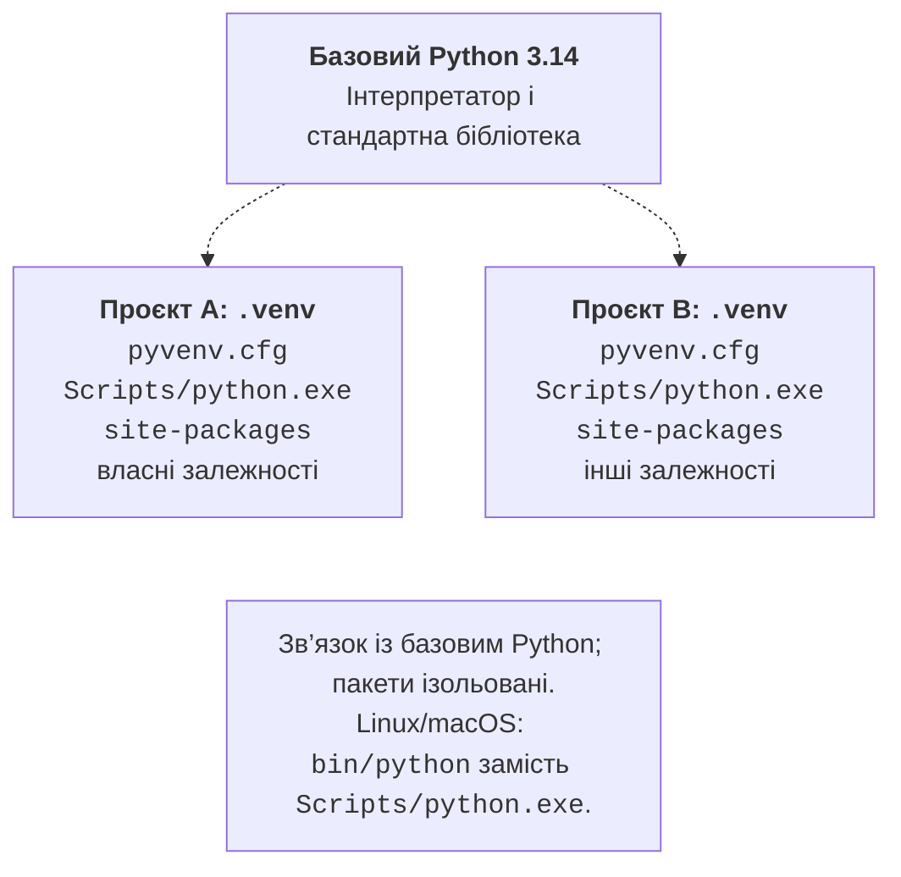
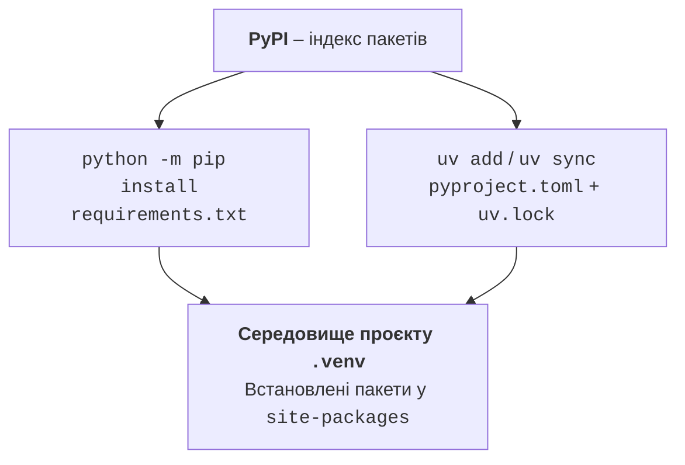

# Віртуальні середовища та пакети

## Віртуальні середовища

**Віртуальне середовище** – окремий набір інтерпретатора/посилань на нього та встановлених пакетів для проєкту. Це не віртуальна машина і не контейнер: воно не ізолює програму від файлів користувача або мережі. Мета – уникнути конфліктів залежностей між проєктами (рис. 1.12).

PyCharm може створити середовище засобами virtualenv. У терміналі той самий навчальний принцип демонструє стандартний модуль `venv`: <https://docs.python.org/3.14/library/venv.html>. Не створюйте друге середовище поверх того, що вже підготувала IDE.

::: info Знімок екрана
Settings &gt; Python &gt; Interpreter: .venv Python 3.14 and packages
:::

Рис. 1.11. Вибір інтерпретатора проєкту {.caption}



Рис. 1.12. Базовий інтерпретатор і незалежні середовища {.caption}

У новому каталозі проєкту Windows виконайте:

```powershell
py -V:3.14 -m venv .venv
.\.venv\Scripts\python.exe --version
.\.venv\Scripts\Activate.ps1
python -m pip --version
```

Активація додає каталог середовища на початок `PATH` поточної оболонки. Вона зручна, але необов’язкова: можна завжди викликати `.\.venv\Scripts\python.exe main.py`. Це також надійний спосіб роботи, якщо PowerShell забороняє виконання `Activate.ps1` політикою організації. Не потрібно послаблювати політику виконання заради запуску Python.

У cmd активація має вигляд `.venv\Scripts\activate.bat`, у bash – `source .venv/bin/activate`. Команда `deactivate` завершує активацію, але не видаляє середовище. Вибір Python у PyCharm і активація в терміналі – різні налаштування; перевіряти потрібно обидва.

### Приклад: відомості про середовище

```py
"""Діагностика вибраного інтерпретатора."""
import platform
import sys

print("Python:", platform.python_version())
print("Система:", platform.system())
print("Інтерпретатор:", sys.executable)
print("Середовище:", sys.prefix != sys.base_prefix)
```

Збережіть як `environment.py` і запустіть у проєкті. Останній рядок має бути `Середовище: True`. Версія та абсолютний шлях залежать від комп’ютера. `sys.prefix` указує на поточне середовище, `sys.base_prefix` – на базову інсталяцію. Не визначайте середовище лише за написом `(.venv)` у запрошенні.

Після перенесення проєкту на інший комп’ютер створіть `.venv` заново. Абсолютні шляхи всередині середовища можуть зробити його копію непрацездатною. У Git зберігайте опис залежностей, а не сам каталог установлених пакетів.

## Пакети, pip і requirements.txt

**Стандартна бібліотека** постачається з Python: наприклад, `sys`, `math`, `datetime`, `platform`. Сторонні пакети встановлюють окремо. **PyPI** – індекс таких пакетів: <https://pypi.org/>. Назва пакета для встановлення може відрізнятися від імені модуля для імпорту; її перевіряють у документації.

`pip` керує встановленими дистрибутивами. Форма `python -m pip` зменшує ризик встановити пакет не в той Python. Перед установленням перевірте шлях командою `python -m pip --version`. Наступні команди виконуються в активованому середовищі:

```powershell
python -m pip install rich
python -m pip list
python -m pip show rich
python -m pip freeze > requirements.txt
```

::: info Знімок екрана
PowerShell: venv; activation; python -m pip install rich; freeze
:::

Рис. 1.13. Встановлення пакета у середовище проєкту {.caption}

`requirements.txt` містить специфікації пакетів; `freeze` зазвичай записує встановлені версії, включно з транзитивними залежностями. Це знімок конкретного середовища, а не повний опис операційної системи чи універсальний lock-файл. У чистому середовищі пакети відновлюють так:

```powershell
python -m pip install -r requirements.txt
python -m pip check
```

Не генеруйте файл зі спільного середовища, у якому встановлено десятки непов’язаних бібліотек. Якщо пакет більше не потрібний, команда `python -m pip uninstall rich` видаляє саме його; перегляньте й оновіть список залежностей. Документація: <https://pip.pypa.io/en/stable/user_guide/>.



Рис. 1.14. Два способи керування залежностями проєкту {.caption}

### Приклад: таблиця з Rich

Після встановлення `rich` збережіть програму як `table_demo.py`. Зовнішній пакет потрібний тут для оформлення таблиці, а не для самих обчислень.

```py
"""Таблиця квадратів чисел."""
from rich import box
from rich.console import Console
from rich.table import Table

table = Table(box=box.ASCII)
table.add_column("n", justify="right")
table.add_column("n^2", justify="right")
for number in (2, 3, 4):
    table.add_row(str(number), str(number ** 2))
Console(color_system=None).print(table)
```

Результат:

```
+---------+
| n | n^2 |
|---+-----|
| 2 |   4 |
| 3 |   9 |
| 4 |  16 |
+---------+
```

`Table` створює об’єкт таблиці, `add_column` описує стовпці, `add_row` додає рядок. Цикл повторює однакову дію для трьох значень; докладно цикли вивчатимуться в наступній темі. Вимкнені кольори та ASCII-рамка роблять результат зручним для друку. API: <https://rich.readthedocs.io/en/stable/tables.html>.

## uv: наступний крок у керуванні проєктом

**uv** об’єднує роботу з версіями Python, середовищами та залежностями. У цій роботі це додатковий шлях після `venv` і `pip`; не змішуйте способи керування одним середовищем без чіткої потреби. Встановлення: <https://docs.astral.sh/uv/getting-started/installation/>. Для Windows доступна команда `winget install --id=astral-sh.uv -e`. Після встановлення відкрийте новий термінал і перевірте `uv --version`.

```powershell
uv init --python 3.14 weather
cd weather
uv add rich
uv run main.py
uv sync --locked
```

::: info Знімок екрана
uv init –python 3.14 weather; uv add rich; uv run main.py
:::

Рис. 1.15. Створення проєкту uv {.caption}

`pyproject.toml` описує проєкт і прямі залежності; `uv.lock` фіксує результат їх узгодження. Обидва файли зберігайте в Git. `.python-version` задає вибрану версію Python. `uv run` готує середовище й запускає команду, тому ручна активація не потрібна. `uv sync --locked` перевіряє узгодженість lock-файла з описом проєкту замість непомітного оновлення блокування.

Наприклад, фрагмент `pyproject.toml` може мати вигляд:

```toml
[project]
name = "weather"
version = "0.1.0"
requires-python = ">=3.14"
dependencies = ["rich"]
```

Це спрощений фрагмент для пояснення; `uv add` може записати обмеження версії. Залежності розробника додають через `uv add --dev pytest`, а доступні Python переглядають через `uv python list`. Тести стануть обов’язковими пізніше. Посібник: <https://docs.astral.sh/uv/guides/projects/>.

У PyCharm можна вибрати середовище *uv* або відкрити готовий каталог проєкту та вказати його `.venv`. Для звичайного проєкту з pip вікно *Python Packages* дозволяє шукати пакет, читати опис та встановлювати його у вибране середовище. Перед натисканням *Install* ще раз перевірте інтерпретатор.

::: info Знімок екрана
View &gt; Tool Windows &gt; Python Packages; rich; package details
:::

Рис. 1.16. Пакети вибраного інтерпретатора у PyCharm {.caption}
