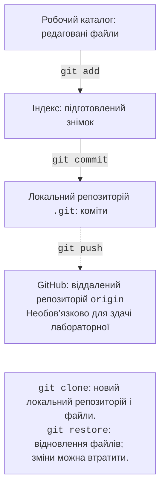

# Контроль версій Git

## Контроль версій Git

**Git** зберігає історію знімків проєкту. **GitHub** – сервіс розміщення репозиторіїв; Git працює і без нього, і без мережі. Завантаження Git: <https://git-scm.com/downloads>. Перевірка: `git --version`. Для цієї лабораторної достатньо локального репозиторію.

Розрізняйте робочий каталог, індекс і репозиторій (рис. 1.17). Після редагування зміни ще не потрапили до індексу. `git add` готує поточний стан файла, а `git commit` зберігає підготовлений знімок. Якщо після `add` знову редагувати файл, нові зміни потрібно додати повторно.



Рис. 1.17. Області Git та передавання змін {.caption}

У каталозі проєкту створіть `.gitignore`:

```
.venv/
__pycache__/
*.py[cod]
.idea/
.env
```

Для першої роботи не передаємо індивідуальні налаштування IDE. У командних проєктах частину `.idea` іноді зберігають за домовленістю. Файл `.gitignore` не приховує вже відстежувані файли й не вилучає секрети з історії. Сам файл `.gitignore`, вихідний код, README та опис залежностей потрібно комітити.

```powershell
git init -b main
git config user.name "Student Name"
git config user.email "student@example.org"
git status
git add main.py .gitignore
git commit -m "Add first Python program"
git log --oneline
```

Замініть навчальне ім’я й адресу власними даними. Без `--global` налаштування стосуються поточного репозиторію, що зручно на спільному навчальному комп’ютері. На особистому пристрої можна задати їх глобально. Для майбутніх репозиторіїв доступне `git config --global init.defaultBranch main`; наведений `init -b main` вже явно задає назву гілки для цього проєкту.

::: info Знімок екрана
git init; status; add; commit; log –oneline; no .venv tracked
:::

Рис. 1.18. Перший локальний коміт {.caption}

`git diff` показує зміни між робочими файлами й індексом, а `git diff --staged` – підготовлені зміни відносно останнього коміту. Команда `git status` пояснює стан. Перш ніж відновлювати файл командою `git restore`, збережіть потрібні правки: непідтверджені зміни можуть бути втрачені. Початківцю корисніше спочатку навчитися читати різницю, ніж запам’ятовувати команди скасування.

Зробіть три змістовні коміти: робочий скрипт; залежності та їх опис; інструкція запуску й перевірки. Не створюйте порожні коміти лише заради кількості. Посібник: <https://git-scm.com/book/en/v2>.

### Git у PyCharm та необов’язкова публікація

Якщо репозиторію ще немає, використайте *VCS → Create Git Repository* або команду увімкнення контролю версій, доступну у вашому інтерфейсі. Вікно *Commit* показує файли й різницю; повідомлення має пояснювати зміну. У стандартній розкладці **Alt+0** відкриває *Commit*, **Alt+9** – *Git*. Вкладка *Log* показує історію (рис. 1.20).

::: info Знімок екрана
Commit: selected files, message, diff; no credentials
:::

Рис. 1.19. Підготовка коміту в PyCharm {.caption}

::: info Знімок екрана
Git &gt; Log: main branch, three meaningful commits
:::

Рис. 1.20. Історія змін проєкту {.caption}

GitHub є додатковим способом передати роботу. Спершу перевірте, що в репозиторії немає паролів, токенів і персональних файлів. Команда *Share Project on GitHub* створює віддалений репозиторій; `push` надсилає коміти, а `clone` створює локальну копію історії та робочих файлів. Публічний репозиторій доступний іншим користувачам. Локальна здача не вимагає облікового запису GitHub.

## Відтворення проєкту та типові проблеми

Проєкт вважаємо відтворюваним для цієї роботи, якщо інший студент може створити нове середовище, встановити залежності за описом і отримати очікуваний результат. README має містити версію Python, спосіб створення середовища, команду запуску, приклад аргументів та контрольний результат. Скріншот доводить лише один запуск і не замінює вихідний код.

Таблиця 1.3. Діагностика середовища розробки {.caption}

| **Симптом** | **Перевірка і дія** |
| --- | --- |
| `python` не знайдено | Новий термінал; `where.exe python`; менеджер Python |
| Не запускається активація | Викликати `.venv/Scripts/python.exe` напряму |
| Пакет «не знайдено» | `sys.executable`; `python -m pip --version` |
| IDE і термінал дають різні результати | Порівняти інтерпретатори й робочі каталоги |
| Помилка кодування в старій консолі | UTF-8; за потреби `python -X utf8 main.py` |
| Git показує `.venv` | Перевірити `.gitignore` до першого `git add` |

У Python 3.14 не слід припускати однакове кодування кожного перенаправленого потоку в усіх ОС. Зберігайте код у UTF-8 та перевіряйте режим термінала. `PYTHONUTF8=1` або `-X utf8` вмикає UTF-8 mode для процесу, але не виправляє відсутні гліфи шрифту. Не замінюйте українські рядки спотвореним текстом, щоб приховати проблему відображення.

::: tip Порада
Початкова мета – вміти пояснити, який Python виконує файл, звідки він отримує пакети та які файли потрапили до коміту. Швидкість натискання кнопок не замінює розуміння цих трьох зв’язків.
:::
